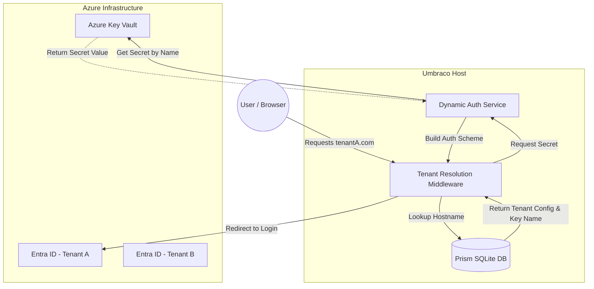
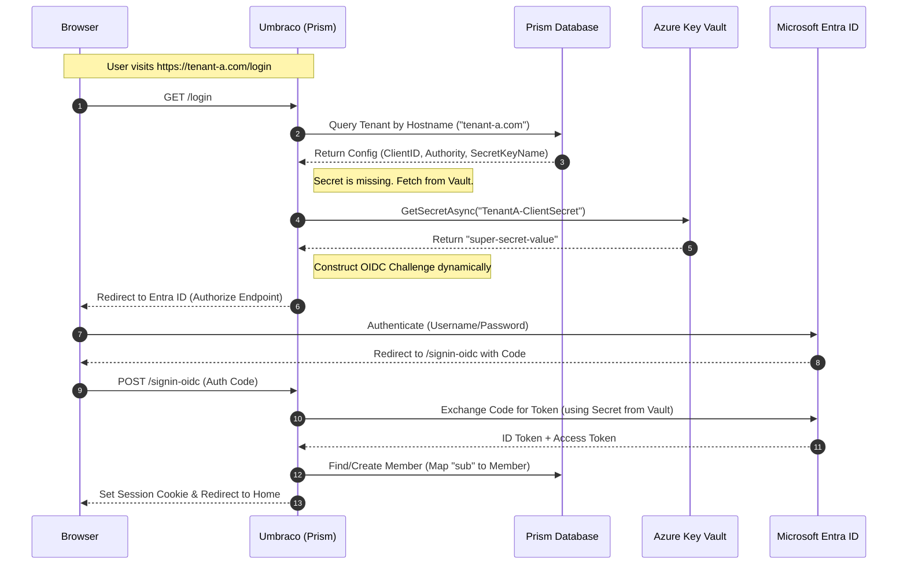
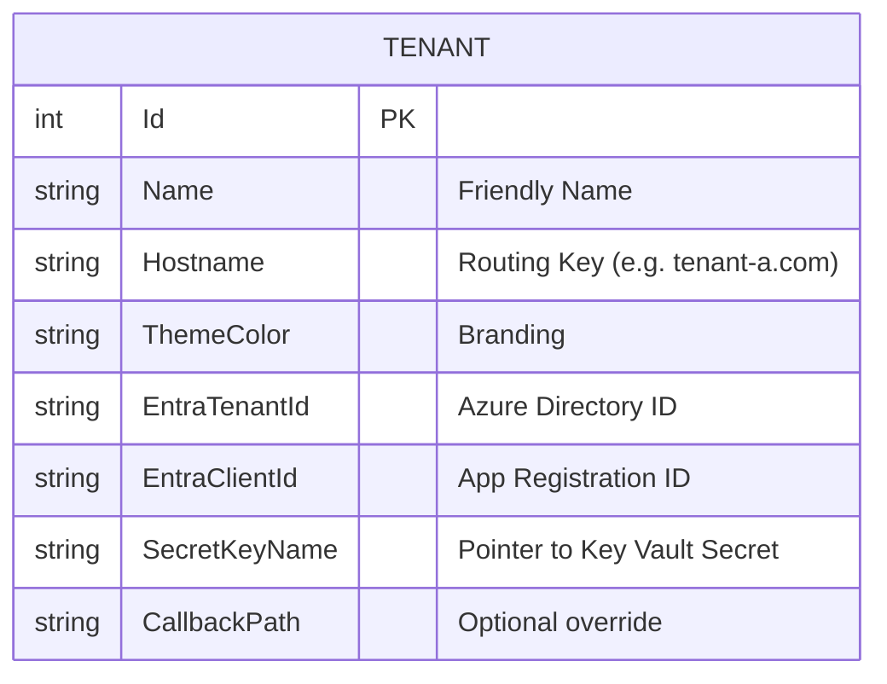

Here is the comprehensive design document for your repository. This outlines the architecture we discussed: a secure, vault-backed, multi-tenant identity system.

You can copy the block below directly into a `IDENTITY_ARCHITECTURE.md` file in your repo.

---

# Multi-Tenant Identity Architecture (Vaulted Pattern)

## Overview

This document outlines the architectural pattern for handling multi-tenant identity within the `Umbraco.Prism` project. The system allows a single Umbraco instance to serve multiple member websites (Tenants), each with distinct branding and identity configurations using Microsoft Entra ID (formerly Azure AD).

### Core Principles

1. **Isolation:** Identity providers (Entra ID) are configured per-tenant to ensure data and branding separation.
2. **Zero-Knowledge Database:** Sensitive secrets (Client Secrets) are **never** stored in the application database. They are referenced by name and retrieved securely from Azure Key Vault at runtime.
3. **Dynamic Resolution:** Authentication schemes are not hardcoded in `Startup.cs` but are constructed dynamically based on the incoming request hostname.

---

## 1. System Architecture

The following diagram illustrates the relationship between the Consumer (Browser), the Prism Backoffice (Control Plane), and the Azure Infrastructure.

---

## 2. Authentication Sequence Flow

This sequence diagram details the precise "handshake" that occurs when a user clicks "Log In" on a specific tenant's site.

---

## 3. Data Schema Extensions

To support this logic, the `Tenant` entity in the Umbraco database requires specific configuration fields.

---

## 4. Security & Vault Integration

Instead of storing the actual connection string or secret, we use the **Managed Identity** of the hosting environment.

| Component | Responsibility | Access Method |
| --- | --- | --- |
| **Prism DB** | Stores the *Name* of the secret (e.g., `Prism-Secret-TenantA`) | SQLite Connection |
| **Umbraco App** | Requests the secret value using its Identity | `DefaultAzureCredential` |
| **Key Vault** | Validates the App Identity and returns the secret | Azure RBAC |

---
