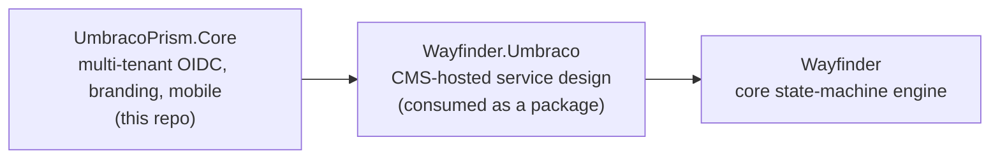

<!-- Generated from README.md by scripts/generate-marketplace-readme.mjs. Do not edit manually. -->


### One source. A spectrum of brands.

# Umbraco Prism

```bash
dotnet add package UmbracoPrism
```

One Umbraco instance. Multiple branded portals, each with its own OIDC identity and runtime
branding. Add a native mobile app with one click.

---

## How it fits together



`UmbracoPrism.Core` carries no service-design opinion of its own — it's tenancy, branding, and
mobile, full stop. `UmbracoPrism.TestSite` (the reference site in this repo) installs
[`Wayfinder.Umbraco`](https://github.com/jonnymuir/Wayfinder.Umbraco) directly for its own
citizen-journey and caseworker-queue pages, exactly the way any other Prism-hosted site would.

## Try it Now: No Install Required

[](https://codespaces.new/jonnymuir/Umbraco.Prism)

Click the button to spin up the full stack in a browser — no local setup, no Docker, no .NET
install. First boot takes ~3 minutes; watch the terminal for the ready banner and URLs.

| What | Username | Password |
|------|----------|----------|
| TestSite, plain member (Keycloak SSO) | `demo@prism.local` | `password` |
| TestSite, NJF caseworker (Keycloak SSO) | `njf-caseworker@prism.local` | `password` |
| Umbraco backoffice (`/umbraco`) | `admin@prism.local` | `PrismLocal!12345` |
| Keycloak admin console | `admin` | `admin` |

Once it's up, follow the **[Bulk Data Review walkthrough](https://github.com/jonnymuir/Umbraco.Prism/blob/main/docs/walkthroughs/bulk-data-review.md)**
to see a real service-design journey end to end — a caseworker queue backed by a real downstream
validation service, waiting states, in-place correction, all composed from
[`Wayfinder.Umbraco`](https://github.com/jonnymuir/Wayfinder.Umbraco)'s own Block Grid blocks
with no hand-coded route.

> **When you're done:** stop or delete the Codespace at [github.com/codespaces](https://github.com/codespaces) to free quota.

## Quick Start (local)

```bash
git clone https://github.com/jonnymuir/Umbraco.Prism.git && cd Umbraco.Prism
cd src/UmbracoPrism.Client && npm install && cd ../..
dotnet run --project src/UmbracoPrism.AppHost
```

Needs .NET 10 SDK, Docker Desktop running, and Node 20+. Open the Aspire dashboard
(`https://localhost:17214`), click through to TestSite, and sign in with either demo persona
above. See [docs/development.md](https://github.com/jonnymuir/Umbraco.Prism/blob/main/docs/development.md) for the full prerequisites list and
troubleshooting, and [docs/ASPIRE_DEV.md](https://github.com/jonnymuir/Umbraco.Prism/blob/main/docs/ASPIRE_DEV.md) for what the Aspire stack wires up.

**Installing the published package into your own site?** See [Full Setup Guide](https://github.com/jonnymuir/Umbraco.Prism/blob/main/docs/umbraco-setup.md) —
`dotnet add package UmbracoPrism`, add a `Prism:VaultUri` (or use the local Keycloak demo
exception — see [Secret Management](https://github.com/jonnymuir/Umbraco.Prism/blob/main/docs/secret-management.md)), then add your first tenant from
**Settings → Prism Dashboard**.


## What you get

- **Multi-tenant web**: domain-based tenant resolution, one content tree serving every branded
  portal, live branding editor (CSS custom properties become a labelled, type-aware settings
  form — see [Branding Design System](https://github.com/jonnymuir/Umbraco.Prism/blob/main/docs/branding-design-system.md)).
- **Stateless OIDC identity**: any OIDC-compliant provider (Entra ID, Keycloak, ...) per tenant,
  zero local Members, tenant isolation enforced by authorization policy, downstream identity
  propagation to your own APIs.
- **Produce Mobile**: turn tenant settings into an iOS/Android app — biometric login, push
  notifications, offline-ready layouts, tenant branding at runtime. See [Mobile Setup](https://github.com/jonnymuir/Umbraco.Prism/blob/main/docs/PUSH_SETUP.md) /
  [Biometric Auth](https://github.com/jonnymuir/Umbraco.Prism/blob/main/docs/biometric-setup.md).
- **Notification infrastructure**: a generic, extensible notification service
  (`IPrismNotificationService`), config-driven publish-event handling, subscription persistence,
  and rate limiting — your app adds business-specific handlers on top. See
  [Notifications Architecture](https://github.com/jonnymuir/Umbraco.Prism/blob/main/docs/design/notifications-architecture.md).
- **Secure-by-default secrets**: production tenants resolve confidential-client secrets through
  Key Vault; nothing raw ever appears in a management API response. See
  [Secret Management](https://github.com/jonnymuir/Umbraco.Prism/blob/main/docs/secret-management.md).

## Documentation

**[Full documentation index →](https://github.com/jonnymuir/Umbraco.Prism/blob/main/docs/README.md)** — setup, branding, mobile, notifications, and
design docs.

- **[Development Guide](https://github.com/jonnymuir/Umbraco.Prism/blob/main/docs/development.md)** — prerequisites, architecture, testing
  (Storybook/Playwright/xUnit), packaging, the local-auth walkthrough, and the Cloudflare tunnel
  setup for phone testing. Start here if you're contributing to this repo.
- **[Bulk Data Review Walkthrough](https://github.com/jonnymuir/Umbraco.Prism/blob/main/docs/walkthroughs/bulk-data-review.md)** and
  **[Home Entry Walkthrough](https://github.com/jonnymuir/Umbraco.Prism/blob/main/docs/walkthroughs/home-entry.md)** — guided tours of the reference site.
- **Service design itself** (the engine, the calculation language, the visual editor) lives in
  [`jonnymuir/Wayfinder`](https://github.com/jonnymuir/Wayfinder) and
  [`jonnymuir/Wayfinder.Umbraco`](https://github.com/jonnymuir/Wayfinder.Umbraco) — see their own
  READMEs, not this one.

## Stack

.NET 10 · Umbraco 17+ · Stateless OIDC (any compliant provider) · Azure Key Vault · Capacitor/TypeScript/Storybook for mobile.

## License

See [LICENSE](https://github.com/jonnymuir/Umbraco.Prism/blob/main/LICENSE).
