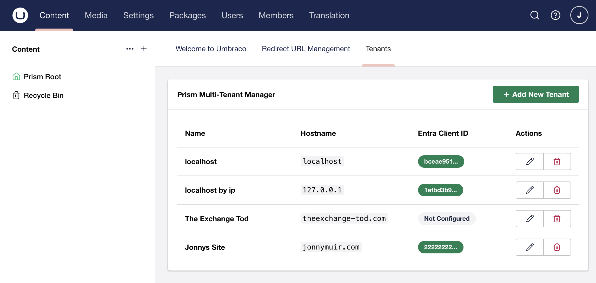
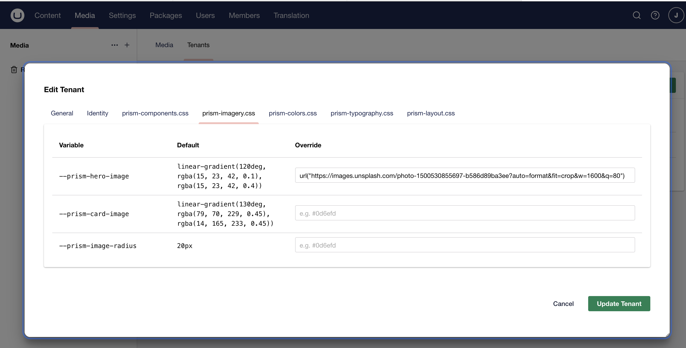
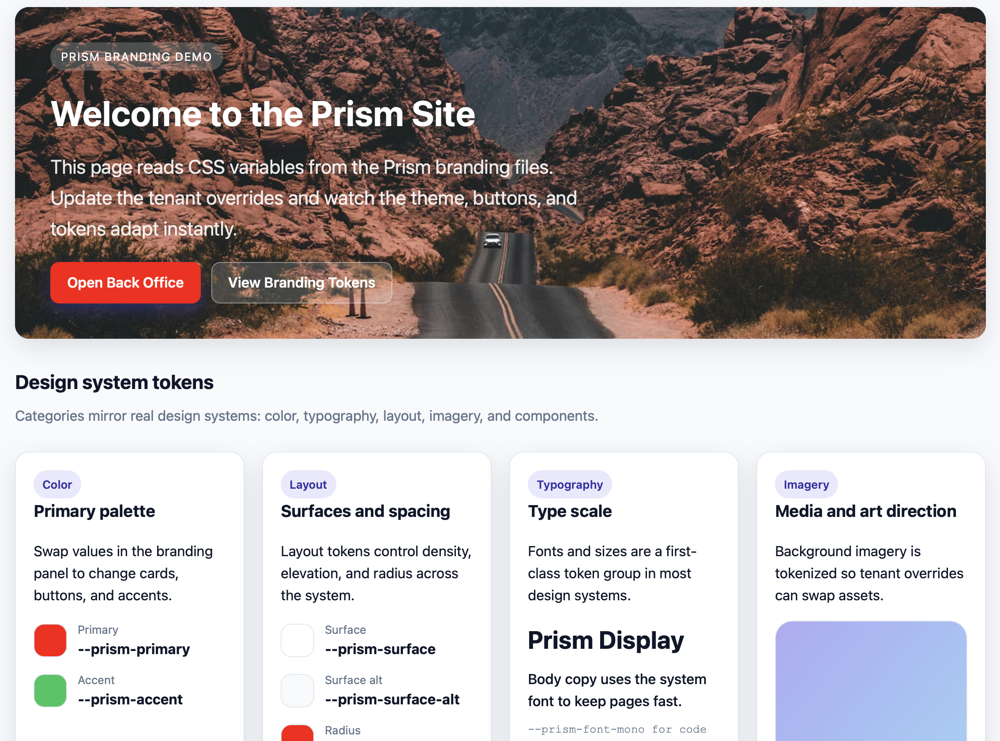
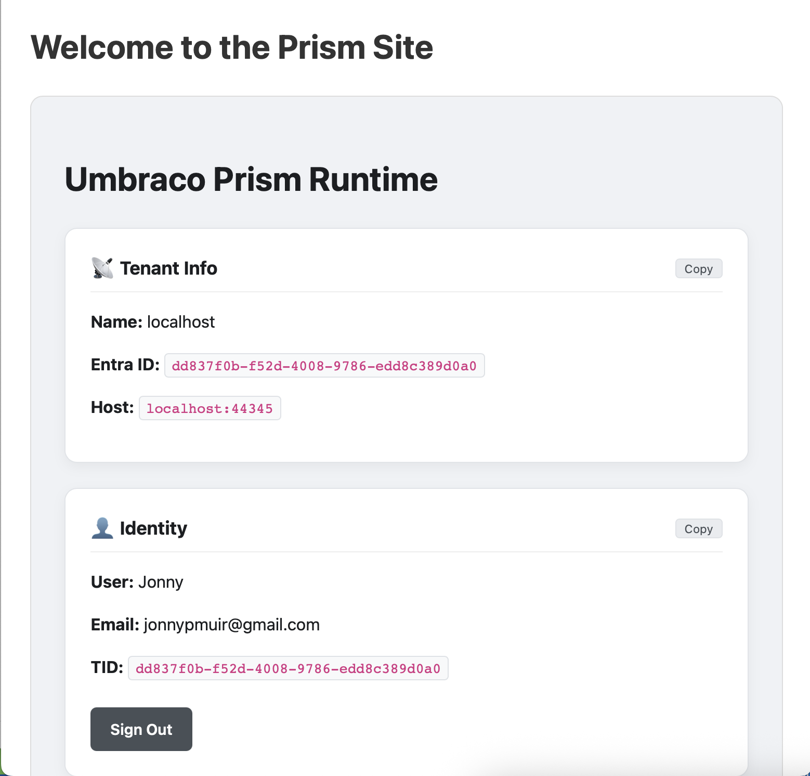
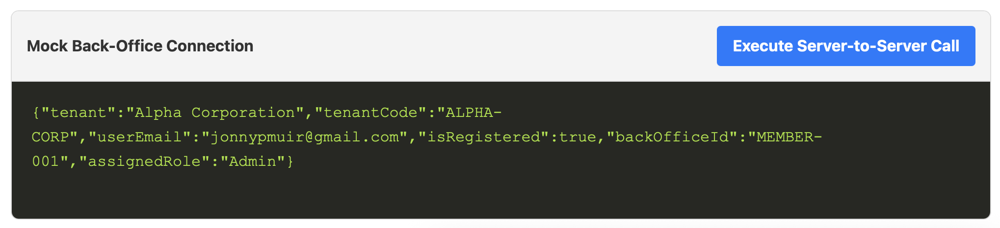

<div align="center">

<h3>One source. A spectrum of brands.</h3>
</div>

# Umbraco Prism

## Overview
Umbraco Prism is a multi-tenancy extension for Umbraco (v17+) designed to allow a single Umbraco instance to serve hundreds of distinct client portals. It resolves branding, identity, and content context at runtime based on the incoming domain name.

## What problem does it solve
You are a service provider offering a portal with consistent functionality across different organizations. You want each organization to appear as its own branded web portal, but without the overhead of managing multiple root nodes or a bloated local Member database.

## Core Objectives
1. **Single Tree, Multiple Brands:** Maintain one content tree; apply branding layers dynamically.
2. **Configuration-Driven Auth:** Authentication is activated globally by providing a Vault URI; tenants are then managed via the Backoffice.
3. **Strict Isolation:** Ensure data and branding never leak between tenants.
4. **Stateless Identity:** No local Member records. Identity is deferred to Entra ID (CIAM), keeping the database clean and scalable.
5. **Vaulted Security:** Sensitive OIDC Secrets are pulled securely from Azure Key Vault at runtime.

## Overview screenshots

### Easy backoffice setup

Create and edit tenants in the back office.



An editable realtime design system using css variables.



See changes in real time on your site without any recompilation.



Compared to without overrides.


### Simple to debug



### Flow down to your down stream services



---

## Architecture

### 1. The Runtime (Middleware)
* **PrismTenantMiddleware:** Intercepts requests and resolves the hostname against the Tenant Cache.
* **IPrismContext:** A scoped service containing the current `Tenant` and `Theme` data.

### 2. The Identity Engine (Stateless OIDC)
* **Dynamic Configuration:** Prism controls the OIDC pipeline per request, swapping `ClientId`, `Authority`, and `Issuer` keys based on the resolved tenant.
* **IPrismUserContext:** High-performance access to the current user's claims and their associated Prism Tenant details.
* **SecretVaultService:** Uses `Azure.Identity` to fetch Client Secrets from Azure Key Vault, utilizing Managed Identity in production and CLI login during development.
* **Downstream Identity Flow:** Prism supports secure token propagation to internal APIs or Back Office systems. It validates and resolves the tenant identity on the receiving end without requiring complex shared-state logic.

---

## Integration & Usage

### 1. Enabling Authentication
Authentication is active by default once a Vault URI is detected in your configuration. In your `appsettings.json`, simply provide your Azure Key Vault address:

```json
{
  "Prism": { 
    "VaultUri": "[https://your-vault.vault.azure.net/](https://your-vault.vault.azure.net/)" 
  }
}
```

### 2. Diagnostic & Debugging (Tag Helper)

To quickly visualize the active tenant, user identity, and system health, use the built-in diagnostic Tag Helper.

First, register the Tag Helper in your `_ViewImports.cshtml`:

```cshtml
@addTagHelper *, UmbracoPrism.Core
```

Then, drop the tag into any Razor view (e.g., your Master Template or Home Page):

```html
<prism-debug />
```

### 3. Accessing User Data

Since Prism is stateless, you do not use `MemberManager`. Instead, inject `IPrismUserContext` to access details:

```cshtml
@inject IPrismUserContext PrismUser

@if (PrismUser.IsAuthenticated)
{
    <h1>Welcome back, @PrismUser.Name</h1>
    <p>You are logged into the @PrismUser.CurrentTenant?.Name portal.</p>
}
```

---

## Setup & Development

### Storybook Tests (UmbracoPrism.Client)

Storybook is used for component-driven tests with the Storybook test runner + Playwright.

**Local usage:**

```bash
cd src/UmbracoPrism.Client
npm install
npm run storybook
```

In a second terminal:

```bash
cd src/UmbracoPrism.Client
npm run test-storybook
```

**VS Code:**

Install the Playwright Test extension to run Playwright tests in the Testing view. Tests are in [src/UmbracoPrism.Client/tests](src/UmbracoPrism.Client/tests). You can also run `npm run test:playwright:ui` for the interactive runner.

**Headless multi-browser + WCAG checks (recommended):**

```bash
cd src/UmbracoPrism.Client
npm run test-storybook:all
```

**CI usage (GitHub Actions):**

The workflow in [.github/workflows/ci-tests.yml](.github/workflows/ci-tests.yml) runs the following:

```bash
cd src/UmbracoPrism.Client
npm ci
npx playwright install --with-deps
npm run test-storybook:ci:all
```

### Core Tests (UmbracoPrism.Core)

```bash
dotnet test UmbracoPrism.sln -c Release --filter FullyQualifiedName~UmbracoPrism.Core.Tests
```

**VS Code:**

Install the .NET Test Explorer extension to run the Core tests in the Testing view.

### Packaging & Marketplace

**Build the backoffice assets:**

```bash
cd src/UmbracoPrism.Client
npm install
npm run build
```

**Pack the NuGet package:**

```bash
dotnet pack src/UmbracoPrism.Core/UmbracoPrism.Core.csproj -c Release -o artifacts
```

**Marketplace metadata:**

See [umbraco-marketplace.json](umbraco-marketplace.json) for the listing metadata (icon, screenshots, tags, description).

**Accessibility (WCAG) checks:**

Storybook test runner runs axe checks (WCAG 2.0/2.1 A/AA) via
[src/UmbracoPrism.Client/.storybook/test-runner.ts](src/UmbracoPrism.Client/.storybook/test-runner.ts).
To opt out for a specific story, set `parameters: { a11y: { disable: true } }`.

### Local Authentication Walkthrough

#### Phase 1: Azure Setup

1. **Entra ID:** Create an **App Registration** (CIAM recommended). Set the Redirect URI to `https://localhost:[PORT]/signin-oidc`.
2. **Key Vault:** Create an Azure Key Vault and add a secret (e.g., `tenant-b-secret`) containing the Client Secret.
3. **Permissions:** Ensure your identity (or App Service) has the **Key Vault Secrets User** role.

#### Phase 2: Local Auth

Run `az login` in your terminal to allow the `SecretVaultService` to access Azure during local development.

#### Phase 3: Tenant Onboarding

1. Navigate to the **Prism Dashboard** in the Umbraco Backoffice.
2. Create a Tenant with the following Identity mapping:
* **Hostname:** `localhost:[PORT]`
* **Entra Tenant ID:** Your Directory (tenant) ID.
* **Entra Client ID:** Your App Registration ID.
* **Secret Key Name:** `tenant-a-secret`.


#### Phase 4: Downstream API Authentication

If your Prism frontend needs to call a secure backend (e.g., a "Member Dashboard" API), Prism can flow the current tenant’s identity and access token to that downstream system.

#### 1. Backend API: Enabling Prism Auth

In your downstream ASP.NET Core API, register the Prism authentication handler. This allows the API to accept multi-tenant tokens from any CIAM tenant registered in your system.

```csharp
// In your API's Program.cs
builder.Services.AddPrismAuthentication(builder.Configuration);

```

#### 2. Backend API: Resolving the Tenant

Use the Prism identity extensions to resolve which brand the user belongs to. This ensures data isolation at the API level.

```csharp
app.MapGet("/api/backoffice/me", (IConfiguration config, ClaimsPrincipal user) =>
{
    // Resolves the tenant from config (default) or a custom resolver
    var tenant = user.GetPrismTenant(PrismResolvers.FromConfig(config));

    if (tenant == null) return Results.Unauthorized();

    return Results.Ok(new { 
        Brand = tenant.DisplayName,
        Code = tenant.Code 
    });
}).RequireAuthorization();

```

#### 3. Frontend: Calling the API

From your Umbraco site, use `IPrismContext` to automatically generate the correct Authorization header containing the user's `access_token`.

```csharp
public async Task<string> GetMemberDataAsync()
{
    using var client = new HttpClient();
    // Automatically handles token extraction and refresh logic
    client.DefaultRequestHeaders.Authorization = await PrismContext.GetAuthorizationHeaderAsync();

    return await client.GetStringAsync("https://your-api.com/api/backoffice/me");
}

```

---

### Sample Projects

To see a full end-to-end implementation of the multi-tenant identity flow, refer to the following projects in this repository:

* **`UmbracoPrism.TestSite`**: A reference Umbraco v17 implementation showing how to configure the OIDC pipeline and call secure downstream services.
* **`UmbracoPrism.MockBackOffice`**: A standalone minimal API project that demonstrates the use of `AddPrismAuthentication` and the `PrismTenantResolver` to isolate data across hundreds of tenants.

---

## Technical Stack

* **Umbraco:** v17.0+
* **Framework:** .NET 10.0
* **Security:** Azure Key Vault, Managed Identity, Stateless OIDC (CIAM), **Multi-tenant JWT Bearer validation**