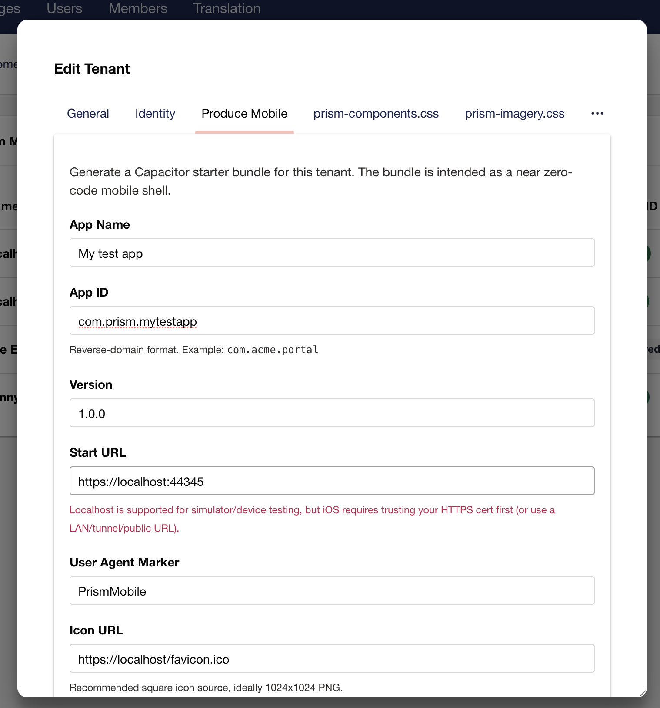
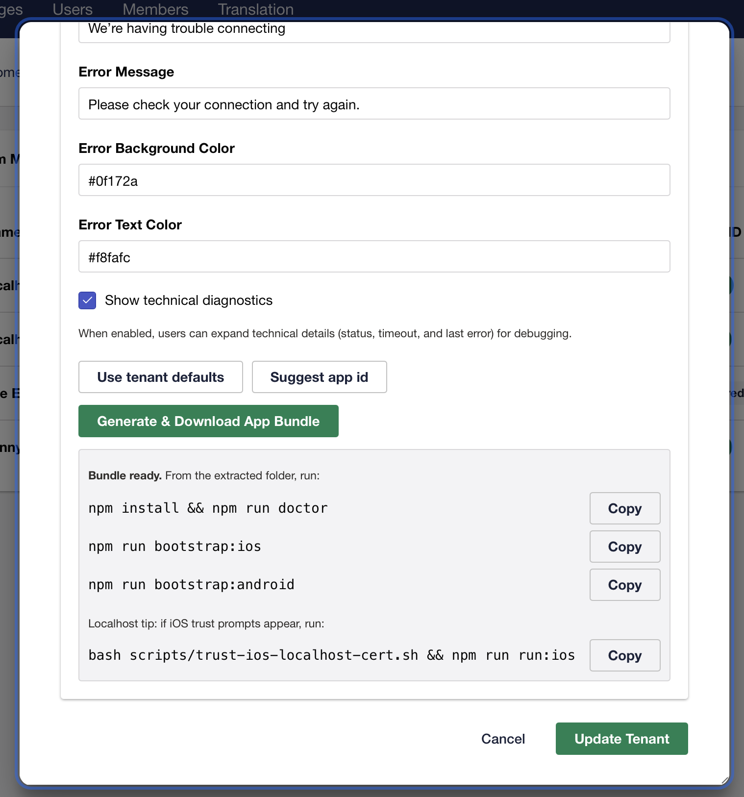
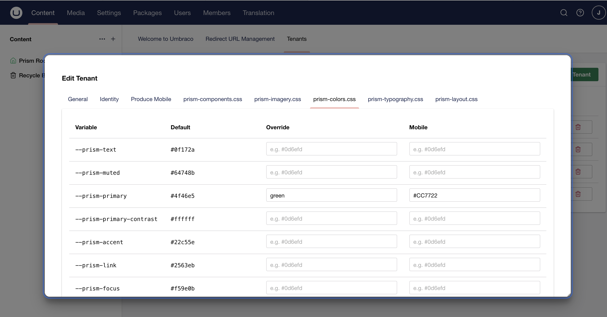
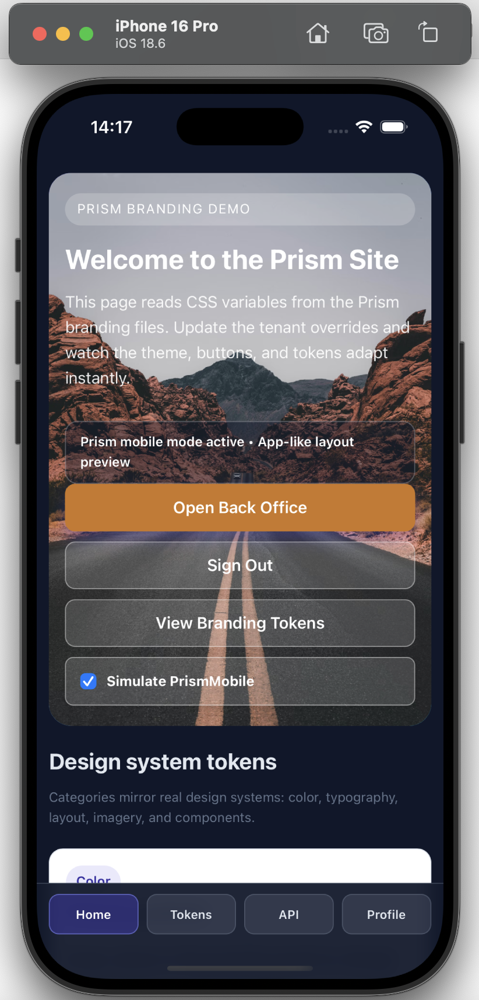

<div align="center">

<h3>One source. A spectrum of brands.</h3>
</div>

# Umbraco Prism

As easy as 

```bash
dotnet add package UmbracoPrism
```

One site, multiple web and mobile distributions.

## Prerequisites

Before you begin, ensure you have the following installed:

- **.NET 10.0** ([Download](https://dotnet.microsoft.com/download))
- **Node.js 20+** ([Download](https://nodejs.org/))
- **Azure Key Vault account** (for production; local development can use a local config)
- **Entra ID (Azure AD) account** (for authentication setup)

> **Important:** Before building, install dependencies for the Client project:
> ```bash
> cd src/UmbracoPrism.Client
> npm install
> ```
> This must be run once before your first build.

## Overview
Umbraco Prism is a multi-tenancy web and mobile app package for Umbraco (v17+) designed to allow a single Umbraco instance to serve hundreds of distinct client portals. It resolves branding, identity, and content context at runtime based on the incoming domain name.

The standout capability is **Produce Mobile**: generate a native-shell app starter (iOS/Android) directly from Backoffice tenant settings, keep tenant branding/auth context, and run in emulator quickly without building a full native app from scratch.

## What problem does it solve
You are a service provider offering a portal with consistent functionality across different organizations. You want each organization to appear as its own branded web portal, but without the overhead of managing multiple root nodes or a bloated local Member database.

## Core Objectives
1. **Single Tree, Multiple Brands:** Maintain one content tree; apply branding layers dynamically.
2. **Configuration-Driven Auth:** Authentication is activated globally by providing a Vault URI; tenants are then managed via the Backoffice.
3. **Strict Isolation:** Ensure data and branding never leak between tenants.
4. **Stateless Identity:** No local Member records. Identity is deferred to Entra ID (CIAM), keeping the database clean and scalable.
5. **Vaulted Security:** Sensitive OIDC Secrets are pulled securely from Azure Key Vault at runtime.

## Killer Feature: Produce Mobile

Prism turns tenant settings into an app-ready mobile shell:

- **Backoffice-driven app generation** (name, app id, start URL, icon/splash, startup diagnostics).
- **Direct top-level WebView startup** with `?prismMobile=1` to activate server-side mobile behavior.
- **In-WebView navigation guardrails** for app-like flow (`target="_blank"` / `window.open` handling in mobile mode).
- **Mobile-safe layout defaults** (safe-area insets + full-width mobile container patterns).
- **One-command bootstrap scripts** for iOS/Android and environment doctor checks.
- **Entra auth mode clarity** so teams choose strict in-WebView vs compliance/system-browser intentionally.

Example mobile settings:


Example create mobile bundles:


Example mobile overrides:


Example IOS APP With overrides showing:



### Easy backoffice setup

Create and edit tenants in the back office.


An editable realtime design system using css variables.


See changes in real time on your site without any recompilation.


Compared to without overrides.


### Simple to debug

Just add <prism-debug /> to get all the info you need to debug

### Flow down to your down stream services


---

## Architecture

### 1. The Runtime (Middleware)
* **PrismTenantMiddleware:** Intercepts requests and resolves the hostname against the Tenant Cache.
* **IPrismContext:** A scoped service containing the current `Tenant` and `Theme` data.

### 2. The Identity Engine (Stateless OIDC)
* **Dynamic Configuration:** Prism controls the OIDC pipeline per request, swapping `ClientId`, `Authority`, and `Issuer` keys based on the resolved tenant.
* **IPrismUserContext:** High-performance access to the current user's claims and their associated Prism Tenant details.
* **SecretVaultService:** Uses `Azure.Identity` to fetch Client Secrets from Azure Key Vault, utilizing Managed Identity in production and CLI login during development.
* **Downstream Identity Flow:** Prism supports secure token propagation to internal APIs or Back Office systems. It validates and resolves the tenant identity on the receiving end without requiring complex shared-state logic.

---

## Umbraco Setup

Getting Prism running is straightforward: install the package, register services, and Prism handles document type creation automatically.

- **Install:** `dotnet add package UmbracoPrism` → register `AddPrism()` in `Program.cs`
- **Document types:** Auto-created on startup (`homePage`, `memberDashboard`) — no manual schema work
- **Content tree:** Expected structure is Home page → Dashboard child page (Prism doesn't touch existing content)
- **For new sites:** Set `"Prism:SeedStarterContent": true` in `appsettings.json` to auto-seed Home + Dashboard pages and a Content Blueprint
- **Configure tenant:** Create your first tenant in Backoffice → Settings → Prism Dashboard, assign hostname and auth settings
- **Verify:** Visit homepage (see Sign In CTA), log in, visit `/dashboard` (see authenticated portal)

**MockBackOffice demo:** Run `dotnet run --project src/UmbracoPrism.MockBackOffice` alongside your site to see downstream credential flow. Visit `/dashboard?callApi=true` once logged in.

→ **Full guide:** See [docs/umbraco-setup.md](docs/umbraco-setup.md) for detailed step-by-step instructions.

---

## Integration & Usage

### 1. Enabling Authentication
Authentication is active by default once a Vault URI is detected in your configuration. In your `appsettings.json`, simply provide your Azure Key Vault address:

```json
{
  "Prism": { 
    "VaultUri": "[https://your-vault.vault.azure.net/](https://your-vault.vault.azure.net/)" 
  }
}
```

### 2. Diagnostic & Debugging (Tag Helper)

To quickly visualize the active tenant, user identity, and system health, use the built-in diagnostic Tag Helper.

First, register the Tag Helper in your `_ViewImports.cshtml`:

```cshtml
@addTagHelper *, UmbracoPrism.Core
```

Then, drop the tag into any Razor view (e.g., your Master Template or Home Page):

```html
<prism-debug />
```

### 3. Mobile Workflow (Backoffice → Emulator)

Prism includes a first-pass **Produce Mobile** workflow in the tenant editor to generate a Capacitor starter app with minimal manual setup.

#### A) Configure in Backoffice

Open a tenant, then use the **Produce Mobile** tab and provide:

- App Name
- App ID (reverse-domain format, e.g. `com.example.portal`)
- Version (e.g. `1.0.0`)
- Start URL (absolute URL)
- User Agent Marker (default: `PrismMobile`)
- Icon URL (recommended 1024x1024)
- Splash URL (optional)
- Startup Error Title / Message
- Startup Error Background / Text colors
- Show technical diagnostics toggle

Built-in helpers include app-id suggestion, tenant-based defaults, inline validation, and icon/splash previews.

Click **Generate & Download App Bundle**.

#### B) What the bundle contains

- `capacitor.config.ts` with your tenant values
- `package.json` with Capacitor scripts/dependencies
- `www/index.html` local fallback startup page (optional when using direct server URL mode)
- `www/mobile-overrides.css` as a mobile styling starter
- `scripts/doctor-mobile.sh` environment diagnostics
- `scripts/bootstrap-ios.sh` / `scripts/bootstrap-android.sh` one-command emulator bootstrap
- `AGENT_PROMPT.md` handoff instructions for coding agents
- `resources/mobile-assets.json` with icon/splash values
- Generated `README.md` with commands

Management API endpoint used by the Backoffice tab:

- `POST /umbraco/management/api/v1/prism/tenants/{id}/produce-mobile`

#### C) Run on emulators

From the extracted bundle:

```bash
npm install
npm run doctor
```

#### Prerequisites (required once per machine)

- Node.js 20+ and npm
- Xcode (for iOS)
- CocoaPods (for iOS)
- Android Studio + Android SDK (for Android)

On macOS, install CocoaPods if needed:

```bash
brew install cocoapods
```

Verify:

```bash
pod --version
```

**iOS (macOS required):**

One-command bootstrap:

```bash
npm run bootstrap:ios
```

Or manually add platform, sync and open:

```bash
npx cap add ios
npx cap sync ios
npx cap open ios
```

Then in Xcode:

1. Select a simulator (or device).
2. Set Team/Bundle Signing.
3. Press Run.

**Android:**

One-command bootstrap:

```bash
npm run bootstrap:android
```

Or manually add platform, sync and open:

```bash
npx cap add android
npx cap sync android
npx cap open android
```

Then in Android Studio:

1. Create/select emulator (AVD).
2. Sync Gradle.
3. Press Run.

#### Common setup errors

- `[error] CocoaPods is not installed.`
  - Install with `brew install cocoapods`, then rerun `npx cap add ios`.
- `[error] ios platform has not been added yet.`
  - Run `npx cap add ios` before `npx cap sync ios` / `npx cap open ios`.
- `[error] android platform has not been added yet.`
  - Run `npx cap add android` before `npx cap sync android` / `npx cap open android`.

#### iOS localhost HTTPS cert trust (`NSURLErrorDomain -1202`)

If your Start URL is `https://localhost:<port>`, iOS simulator can show a blank screen until the cert is trusted.

The generated app bundle includes a helper script:

```bash
bash scripts/trust-ios-localhost-cert.sh
npx cap run ios
```

Notes:

- Keep your local HTTPS site running while executing the script.
- Ensure a simulator is booted first.
- For physical devices, prefer LAN/tunnel/public HTTPS, or install/trust your local CA profile on-device.

### 4. Mobile Runtime Behavior & Styling

Prism applies mobile behavior with these rules:

1. Base tenant overrides are injected first.
2. Mobile overrides are injected second (so mobile values can intentionally win).
3. Mobile request detection supports user-agent marker, query flag, cookie, and platform header.
4. Produced mobile bundles use top-level WebView start URL with `?prismMobile=1` for reliable server-side mobile detection.
5. Prism persists this marker as a cookie, so mobile mode continues across subsequent navigation in the same session.
6. In mobile mode, Prism can force `target="_blank"` / `window.open` navigation to stay inside the same WebView.

The generated bundle still includes a local fallback startup page if you later decide to switch away from direct server URL mode.

When using mobile mode on notched devices, apply safe-area aware layout rules (for example with `env(safe-area-inset-*)`) and avoid desktop `max-width` constraints unless intentionally retained.

For local/demo simulation, use:

```html
<prism-mobile-user-agent-demo />
```

Optional query flags:

- `?prismMobile=1` enable mobile simulation
- `?prismMobile=0` disable mobile simulation

To style app-like UI, add a runtime class when mobile UA is detected:

```html
<script>
  (function() {
    if (navigator.userAgent.includes('PrismMobile')) {
      document.documentElement.classList.add('prism-mobile');
    }
  })();
</script>
```

Example CSS:

```css
.prism-mobile .desktop-nav { display: none; }
.prism-mobile .app-shell-footer { display: flex; }
```

### 5. Entra Authentication Mode Decision

For Entra sign-in in mobile shells, choose one mode explicitly:

- **Strict in-WebView mode:** keep auth inside the same WebView; this may conflict with Conditional Access / modern Entra policies in some tenants.
- **Compliance mode (recommended):** use system-browser auth sessions; this is more policy-compatible but can visibly leave the WebView during sign-in.

Treat this as a product/security decision per tenant profile and validate early in emulator/device testing.

### 6. Store Readiness (App Store / Play Store)

Prism can generate the starter shell, but store submission still needs platform-specific release work:

**Required for both stores**

- Production app icon/splash asset set
- Signed release build configuration
- Privacy policy URL and support details
- App metadata (name, description, screenshots)
- Functional test pass on real devices

**Apple App Store (iOS)**

- Apple Developer account
- Unique bundle id + provisioning profiles
- Archive and upload via Xcode
- App Store Connect listing + review submission

**Google Play (Android)**

- Google Play Console account
- Unique application id + signed AAB
- Store listing + content rating + data safety form
- Internal/closed testing, then production rollout

### 7. Accessing User Data

Since Prism is stateless, you do not use `MemberManager`. Instead, inject `IPrismUserContext` to access details:

```cshtml
@inject IPrismUserContext PrismUser

@if (PrismUser.IsAuthenticated)
{
    <h1>Welcome back, @PrismUser.Name</h1>
    <p>You are logged into the @PrismUser.CurrentTenant?.Name portal.</p>
}
```

### 8. Prism Admins Policy (Backoffice Safety)

Tenant management is powerful (it can change domains, secrets, and branding), so Prism restricts these endpoints to a dedicated admin policy. By default, only users in the **admin** group can create, update, or delete tenants.

**Why:** ensures only trusted backoffice users can manage tenant identity and branding settings.

**How:** configure which backoffice user groups are allowed by setting group aliases in `appsettings.json`:

```json
{
  "Prism": {
    "AdminGroups": {
      "GroupAliases": ["admin", "prism-admins"]
    }
  }
}
```

Use Umbraco's User Groups to grant access (Settings -> Users -> Groups). Anyone not in these groups can still access the backoffice, but cannot modify tenants via the Prism management API.

---

### 9. Biometric Authentication (Mobile)

Prism supports fingerprint and face recognition login for mobile apps, allowing returning users to skip the full OIDC flow on subsequent visits.

#### How It Works

After a user completes their first OIDC login in the mobile app, they can enroll a biometric credential on their device. On the next app launch, the native layer prompts for biometric verification, exchanges the stored token for a session cookie, and opens an authenticated WebView — no OIDC redirect needed.

The architecture stores a Prism-issued device token on the device's secure platform keystore (iOS Keychain / Android Keystore), never storing Entra credentials locally. If biometric is unavailable, blocked, or fails, the app automatically falls back to full OIDC authentication.

#### Enabling Biometric Auth

1. In the Umbraco backoffice, open a tenant.
2. Locate the **Mobile Settings** or **Produce Mobile** section.
3. Set **"Biometric Auth Enabled"** to `true`.
4. The generated mobile app bundle will automatically include the required Capacitor biometric plugins.
5. On first login after enabling, users are prompted to enroll biometric after successful OIDC completion.

#### Security Features

- **Per-token rate limiting:** Locks a token after 3 failed exchange attempts within a 10-minute window.
- **Per-IP rate limiting:** Maximum of 20 exchange requests per IP per minute, preventing brute-force attacks.
- **Biometric enrollment change detection:** If a user adds or removes a fingerprint on their device, stored credentials are automatically wiped on the next app launch, forcing re-authentication.
- **Multi-tenant isolation:** Biometric tokens are scoped to a single tenant and cannot be used across different tenant domains.
- **Automatic token rotation:** Underlying Entra refresh tokens are rotated on each successful exchange, limiting exposure if a device is compromised.
- **Audit logging:** All exchange attempts (success, failure, token ID, IP, timestamp) are logged server-side for compliance and debugging.

#### Configuration Options

Configure in `appsettings.json` under `"Prism": { "Biometric": { ... } }`:

| Option | Default | Description |
|---|---|---|
| `SigningKey` | (required) | HMAC-SHA256 key for signing biometric tokens. At least 32 characters; inject via environment variable or Azure Key Vault in production. |
| `EncryptionKey` | (required) | Base64-encoded 32-byte AES-256 key for encrypting stored Entra refresh tokens. Generate via: `Convert.ToBase64String(RandomNumberGenerator.GetBytes(32))` |
| `TokenLifetimeDays` | 30 | How long biometric tokens remain valid (range: 7–90 days). Users must re-authenticate via OIDC if a token expires. |
| `MaxFailedAttempts` | 3 | Consecutive failed exchange attempts before a token is locked out. |
| `FailureWindowMinutes` | 10 | Sliding window for counting failed attempts. |
| `PerIpRequestsPerMinute` | 20 | Maximum exchange requests per IP address per minute. |

#### Revocation and Enrollment Management

- **User-initiated:** Users can remove biometric login from in-app account settings. The stored credential is deleted from their device and marked as revoked server-side.
- **Admin revocation:** When a tenant admin or Entra admin blocks a user, their biometric tokens are automatically revoked. The next biometric exchange attempt returns a 401 error, forcing the app to fall back to OIDC.
- **Enrollment tracking:** Each biometric enrollment is tracked server-side with device metadata, registration date, and last-used timestamp for auditing.

#### Testing with the Test Site

The **UmbracoPrism.TestSite** is a reference implementation that demonstrates biometric authentication in a working member portal scenario. It includes:

- A tenant pre-configured with biometric auth enabled.
- A member login/registration flow that enrolls biometric credentials.
- A dashboard showing when biometric is available and enrollment status.
- Full fallback paths to OIDC if biometric is unavailable.

To test locally: configure your test site tenant with biometric enabled, generate a mobile app bundle from the backoffice, run it on an emulator or device, and follow the enrollment prompts after OIDC login.

---

## Setup & Development

### Local Dev Tunnel Automation (trycloudflare + Entra + Prism DB)

Use `scripts/dev/start-trycloudflare.sh` to automate local development setup when your local Umbraco site needs a public HTTPS callback.

Purpose:

- Start a Cloudflare quick tunnel for `https://localhost:<port>`
- Update your Entra app redirect URI to `<tunnel-url>/signin-oidc` (Prism auth callback path)
- Remove stale `*.trycloudflare.com/signin-oidc` redirect URIs before adding the current tunnel callback URI
- Update the selected Prism tenant hostname in SQLite (`prismTenants.hostname`)

Security notes:

- Development use only. Do not run this script for production or shared environments.
- The script changes Entra redirect URI configuration for the selected Entra Application (Client) ID. Use a dedicated dev Entra app registration.
- The script writes a new hostname into your local Prism tenant record. Point it at a local/test database only.
- Treat `.prism_tunnel.conf` as sensitive operational metadata and do not commit it.
- Use least-privilege Azure access: identity running `az` should only manage the intended app registration.

Prerequisites:

- `cloudflared`
- `az` (Azure CLI) with an authenticated session (`az login --allow-no-subscriptions` recommended when your dev Entra tenant has no active Azure subscription)
- `sqlite3`
- `grep` and `sed` (available by default on macOS)

Run:

```bash
bash scripts/dev/start-trycloudflare.sh
```

On first run, you will be prompted for:

- `LOCAL_PORT` (default `44345`)
- `ENTRA_APP_CLIENT_ID` (Entra Application (Client) ID GUID)
- `TENANT_SELECTOR` (tenant name or numeric id; numeric id is the internal DB `prismTenants.id`)
- `DB_PATH` (default `src/UmbracoPrism.TestSite/umbraco/Data/Umbraco.sqlite.db`)

Tenant selector behavior:

- If you provide a tenant name, the script resolves it to the canonical `TENANT_ID` before updating the database.
- If no row matches that name, the script fails with a helpful message.
- If multiple rows share that name, the script fails and prints matching ids so you can retry with a numeric id.
- Summary output shows both tenant id and tenant name so you can confirm the updated record.

Redirect URI rotation behavior:

- Non-trycloudflare redirect URIs are preserved as-is.
- Stale `*.trycloudflare.com/signin-oidc` entries are pruned. This prevents redirect URI sprawl accumulating in Entra over repeated dev sessions.
- The current tunnel callback URI is ensured exactly once.
- Script output includes a concise prune summary with the number of stale trycloudflare callback entries removed.

Config storage:

- Saved in `.prism_tunnel.conf` at repo root
- Starter template is committed at `.prism_tunnel.conf.example`
- Script enforces permissions `600` (owner read/write only)
- Backward compatible: if legacy `ENTRA_APP_OBJECT_ID` exists and `ENTRA_APP_CLIENT_ID` is missing, the script reads the legacy value once and then saves only `ENTRA_APP_CLIENT_ID` going forward.

Stop and cleanup:

- Press `Ctrl+C`
- Script creates tunnel temp logs by trying writable directories in order:
  `artifacts/logs/trycloudflared`, `${TMPDIR:-/tmp}/prism-trycloudflared-logs`, `/tmp/prism-trycloudflared-logs`, then `$HOME/.cache/prism-trycloudflared-logs` (when `HOME` is set)
- The script stops `cloudflared` and removes its temporary log file automatically

### Storybook Tests (UmbracoPrism.Client)

Storybook is used for component-driven tests with the Storybook test runner + Playwright.

**Local usage:**

```bash
cd src/UmbracoPrism.Client
npm install
npm run storybook
```

In a second terminal:

```bash
cd src/UmbracoPrism.Client
npm run test-storybook
```

**VS Code (Optional):**

Optionally, install the **Playwright Test extension** for a convenient Testing view UI to run Playwright tests. Tests are in [src/UmbracoPrism.Client/tests](src/UmbracoPrism.Client/tests). You can also run `npm run test:playwright:ui` for the interactive runner without the extension.

**Headless multi-browser + WCAG checks (recommended):**

```bash
cd src/UmbracoPrism.Client
npm run test-storybook:all
```

**CI usage (GitHub Actions):**

The workflow in [.github/workflows/ci-tests.yml](.github/workflows/ci-tests.yml) runs the following:

```bash
cd src/UmbracoPrism.Client
npm ci
npx playwright install --with-deps
npm run test-storybook:ci:all
```

### Core Tests (UmbracoPrism.Core)

```bash
dotnet test UmbracoPrism.sln -c Release --filter FullyQualifiedName~UmbracoPrism.Core.Tests
```

### Dependency Vulnerability Check

Run a transitive package vulnerability scan for the Core project:

```bash
dotnet list src/UmbracoPrism.Core/UmbracoPrism.Core.csproj package --vulnerable --include-transitive
```

If vulnerabilities are reported, prefer upgrading the direct package first. For transitive-only issues, add a top-level package reference in the relevant `.csproj` to force a patched version.

**VS Code (Optional):**

Optionally, install the **.NET Test Explorer extension** for a convenient Testing view UI to run the Core tests. Tests can also be run from the command line using `dotnet test`.

### Packaging & Marketplace

**Build the backoffice assets:**

```bash
cd src/UmbracoPrism.Client
npm install
npm run build
```

**Pack the NuGet package:**

```bash
dotnet pack src/UmbracoPrism.Core/UmbracoPrism.Core.csproj -c Release -o artifacts
```

**Marketplace metadata:**

See [umbraco-marketplace.json](umbraco-marketplace.json) for the listing metadata (icon, screenshots, tags, description).

**Accessibility (WCAG) checks:**

Storybook test runner runs axe checks (WCAG 2.0/2.1 A/AA) via
[src/UmbracoPrism.Client/.storybook/test-runner.ts](src/UmbracoPrism.Client/.storybook/test-runner.ts).

To opt out for a specific story, set `parameters: { a11y: { disable: true } }` in your `.stories.ts` file:

```typescript
export const MyStory = {
  render: (args) => <MyComponent {...args} />,
  parameters: {
    a11y: { disable: true }  // Disables WCAG checks for this story
  }
};
```

### Local Authentication Walkthrough

#### Phase 1: Azure Setup

1. **Entra ID:** Create an **App Registration** (CIAM recommended). Set the Redirect URI to `https://localhost:[PORT]/signin-oidc`.
2. **Key Vault:** Create an Azure Key Vault and add a secret (e.g., `tenant-b-secret`) containing the Client Secret.
3. **Permissions:** Ensure your identity (or App Service) has the **Key Vault Secrets User** role.

#### Phase 2: Local Auth

Run `az login --allow-no-subscriptions` in your terminal to allow the `SecretVaultService` to access Azure during local development, especially when you need to select the correct Entra tenant but do not have an active Azure subscription in that directory.

#### Phase 3: Tenant Onboarding

1. Navigate to the **Prism Dashboard** in the Umbraco Backoffice.
2. Create a Tenant with the following Identity mapping:
* **Hostname:** `localhost:[PORT]`
* **Entra Tenant ID:** Your Directory (tenant) ID.
* **Entra Client ID:** Your App Registration ID.
* **Secret Key Name:** `tenant-a-secret`.


#### Phase 4: Downstream API Authentication

If your Prism frontend needs to call a secure backend (e.g., a "Member Dashboard" API), Prism can flow the current tenant’s identity and access token to that downstream system.

#### 1. Backend API: Enabling Prism Auth

In your downstream ASP.NET Core API, register the Prism authentication handler. This allows the API to accept multi-tenant tokens from any CIAM tenant registered in your system.

```csharp
// In your API's Program.cs
builder.Services.AddPrismAuthentication(builder.Configuration);

```

#### 2. Backend API: Resolving the Tenant

Use the Prism identity extensions to resolve which brand the user belongs to. This ensures data isolation at the API level.

```csharp
app.MapGet("/api/backoffice/me", (IConfiguration config, ClaimsPrincipal user) =>
{
    // Resolves the tenant from config (default) or a custom resolver
    var tenant = user.GetPrismTenant(PrismResolvers.FromConfig(config));

    if (tenant == null) return Results.Unauthorized();

    return Results.Ok(new { 
        Brand = tenant.DisplayName,
        Code = tenant.Code 
    });
}).RequireAuthorization();

```

#### 3. Frontend: Calling the API

From your Umbraco site, use `IPrismContext` to automatically generate the correct Authorization header containing the user's `access_token`.

```csharp
public async Task<string> GetMemberDataAsync()
{
    using var client = new HttpClient();
    // Automatically handles token extraction and refresh logic
    client.DefaultRequestHeaders.Authorization = await PrismContext.GetAuthorizationHeaderAsync();

    return await client.GetStringAsync("https://your-api.com/api/backoffice/me");
}

```

---

### Sample Projects

The repository includes two reference projects that demonstrate end-to-end multi-tenant authentication and configuration:

* **`UmbracoPrism.TestSite`**: A reference Umbraco v17 implementation showing how to configure the OIDC pipeline with Prism, set up tenant-specific branding, and call secure downstream services. Use this when setting up local Entra authentication — it includes pre-configured tenant definitions.
* **`UmbracoPrism.MockBackOffice`**: A standalone minimal API project that demonstrates how to use `AddPrismAuthentication` and the `PrismTenantResolver` to isolate data across hundreds of tenants on the backend.

These projects ship pre-configured OIDC settings and are referenced in the "[Local Authentication Walkthrough](#local-authentication-walkthrough)" section below.

---

## Technical Stack

* **Umbraco:** v17.0+
* **Framework:** .NET 10.0
* **Security:** Azure Key Vault, Managed Identity, Stateless OIDC (CIAM), **Multi-tenant JWT Bearer validation**

---

## Quick Start: Phone Auth via Cloudflare Tunnel (No LAN IP Dependency)

If you need Entra sign-in on a phone, avoid using `http://192.168.x.x` redirect URIs.
Entra requires redirect URIs to be `https://...` (or `http://localhost` only), so a tunnel is the easiest dev-safe approach.

### Do I need a domain?

No. You can start with a temporary Cloudflare URL (`*.trycloudflare.com`) and no custom domain.

- **No domain yet (fastest):** use `cloudflared tunnel --url https://localhost:44345`.
- **Have a domain later (stable):** create a named tunnel + DNS record for a fixed hostname.

### Option A — No domain (temporary URL)

1. Install cloudflared:

```bash
brew install cloudflared
```

2. Start your local app on HTTPS localhost:

```bash
https://localhost:44345
```

3. Start temporary tunnel:

```bash
cloudflared tunnel --url https://localhost:44345
```

Or use the helper script (prints the exact Entra redirect URI):

```bash
bash scripts/dev/start-trycloudflare.sh
```

4. Copy the generated `https://<random>.trycloudflare.com` URL.

5. In Entra App Registration, add redirect URI:

```text
https://<random>.trycloudflare.com/signin-oidc
```

6. Use the same tunnel URL as your mobile Start URL.

> Note: This URL changes each run. If you use `scripts/dev/start-trycloudflare.sh`, the script rotates trycloudflare `/signin-oidc` redirect URIs automatically and keeps only the current callback entry plus non-trycloudflare entries.

### Option B — Stable hostname (custom domain)

If you have a domain in Cloudflare, set up a named tunnel once and keep a fixed URL.

1. Authenticate cloudflared:

```bash
cloudflared tunnel login
```

2. Create tunnel:

```bash
cloudflared tunnel create prism-dev
```

3. Route DNS hostname:

```bash
cloudflared tunnel route dns prism-dev prism-dev.<your-domain>
```

4. Create `~/.cloudflared/config.yml`:

```yml
tunnel: <tunnel-id>
credentials-file: /Users/<you>/.cloudflared/<tunnel-id>.json

ingress:
  - hostname: prism-dev.<your-domain>
    service: https://localhost:44345
    originRequest:
      noTLSVerify: true
      httpHostHeader: localhost:44345
  - service: http_status:404
```

5. Run tunnel:

```bash
cloudflared tunnel run prism-dev
```

6. In Entra, use:

```text
https://prism-dev.<your-domain>/signin-oidc
```