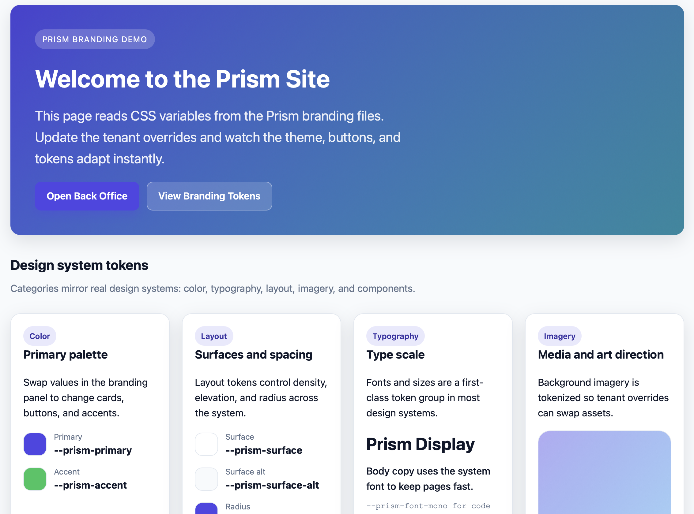
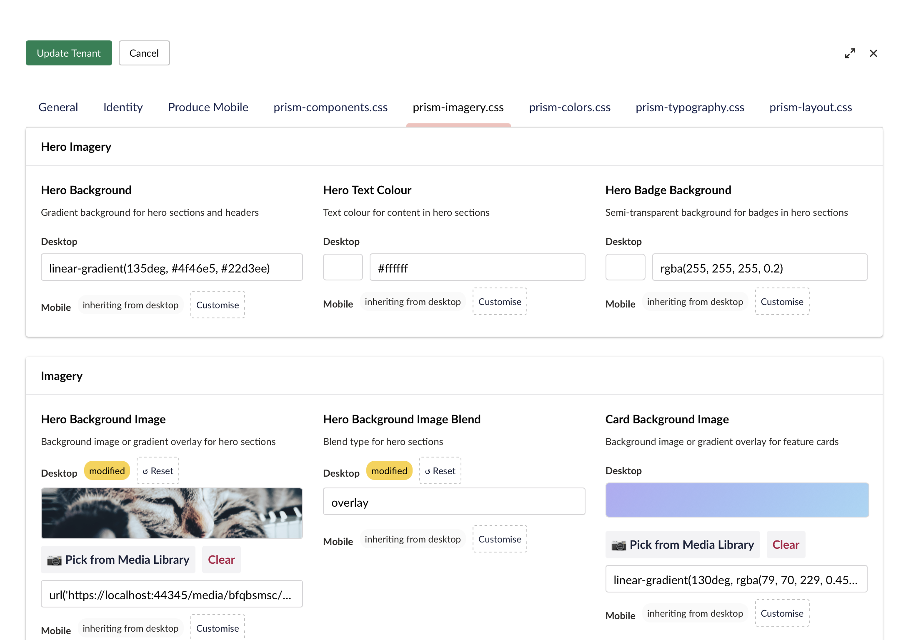
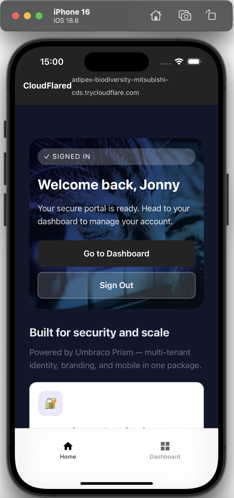

<div align="center">

<h3>One source. A spectrum of brands.</h3>
</div>

# Umbraco Prism

```bash
dotnet add package UmbracoPrism
```

One Umbraco instance. Multiple branded portals. Native mobile app included.

Multi-tenant website branding and identity at runtime. Add a mobile app with one click.

---

## Try it Now — No Install Required

[](https://codespaces.new/jonnymuir/Umbraco.Prism)

Click the button to spin up the full Umbraco Prism stack in a browser — no local setup, no Docker, no .NET install. GitHub handles everything. The Codespace is completely throwaway when you're done.

**The stack starts automatically** — watch the terminal at the bottom of your screen. It polls until Keycloak, the Aspire Dashboard, and the TestSite are all ready (first boot: ~3 minutes), then prints the URLs and credentials. When the Aspire Dashboard port is detected VS Code opens it in your browser automatically.

1. Wait for the terminal to print **🎉 Umbraco Prism is ready!**
2. Click the TestSite URL → log in with `demo@prism.local` / `password` (Keycloak SSO)
3. Browse **My Service Requests** to see the demo service blueprint in action

**Credentials at a glance:**

| What | Username | Password |
|------|----------|----------|
| TestSite (Keycloak SSO) | `demo@prism.local` | `password` |
| Umbraco backoffice (`/umbraco`) | `admin@prism.local` | `PrismLocal!12345` |
| Keycloak admin console | `admin` | `admin` |

> **When you're done:** go to [github.com/codespaces](https://github.com/codespaces), find your Codespace, and click **Stop** (or **Delete** to free quota immediately). Stopping halts billing; the Codespace resumes from where you left off.

---

## 🚀 Interactive Walkthrough — "Payment Demo Service Blueprint"

Once your stack is running, follow the step-by-step guide to see the demo service blueprint in action — with explanations of what Umbraco.Prism and the Umbraco backoffice are doing at each stage.

→ **[Full walkthrough: docs/walkthroughs/payment-demo.md](docs/walkthroughs/payment-demo.md)**

The walkthrough covers:
- Logging in via Keycloak SSO and submitting a payment form
- **Waiting states** — the form pauses and persists while a reviewer processes it (Prism's core pattern)
- Watching the service request hub show real-time status updates
- Switching to the reviewer role and advancing the service request from the admin panel
- The member page **auto-updates without a refresh** when the reviewer completes their action
- Behind the scenes: service blueprint definitions, state machines, the Prism process manager engine, and how persistence and real-time updates work
- Exploring further: editing service blueprint definitions, monitoring engine logs in Aspire, testing async patterns

**Alternative:** [Planning Application walkthrough](docs/walkthroughs/planning-service-blueprint-complete.md) for a complete end-to-end journey covering authoring, public submission, member continuation, and back-stage review.

---

## Try the Demo — Local Setup

Get from clone to running in five minutes. No Azure account needed.

**One-time setup:**
- `.NET 10 SDK` ([Download](https://dotnet.microsoft.com/download/dotnet/10.0))
- **Trust the .NET dev certificate** — run `dotnet dev-certs https --trust`
- Docker Desktop running ([Download](https://www.docker.com/products/docker-desktop/))
- `Node.js 20+` ([Download](https://nodejs.org/))
- Frontend dependencies: `cd src/UmbracoPrism.Client && npm install`

> VS Code tip: the **C#: Aspire (Full Stack)** launch now validates the .NET 10 SDK and Docker first. This repo uses the Aspire AppHost SDK and NuGet packages, so you do **not** need `dotnet workload install aspire`.

**Start the full stack:**
```bash
dotnet run --project src/UmbracoPrism.AppHost
```

Then:
1. Open the Aspire dashboard at `https://localhost:17214`
2. Click the TestSite URL → log in with `demo@prism.local` / `password`
3. Browse **My Service Requests** to see the demo service blueprint in action
4. The MockBusinessApp runs alongside at `https://localhost:7245` — it accepts the same demo credentials and powers the service blueprint engine

**Optional:** Explore Keycloak admin at `https://localhost:8443/admin` (`admin` / `admin`).

**Why this matters for local dev:**
- The local Keycloak uses standard OIDC code-flow scopes — no offline tokens needed for a fresh clone.
- Prism preserves the `id_token` in the session, enabling logout callbacks to Keycloak with the required `id_token_hint`.
- MockBusinessApp trusts the browser-facing Keycloak authority (`https://localhost:8443`), so the service request flow validates bearer tokens against the public issuer, not the internal container URL (`http://localhost:8080`).
- Aspire runtime state lives under `artifacts/aspire/testsite-runtime/` — the demo and Playwright suite never mutate the standalone TestSite database at `src/UmbracoPrism.TestSite/umbraco/Data/`.

> For detailed setup, troubleshooting, and architecture: See [ASPIRE_DEV.md](ASPIRE_DEV.md).

---

## What You Get

Prism is a **NuGet package** providing enterprise-ready multi-tenancy and extensibility for Umbraco. Below is what the **Core library** provides. The **TestSite** is a reference implementation showing how to extend Prism for a business domain (vinyl records).

### Multi-Tenant Web — One Instance, Hundreds of Brands (🔵 Core)

Serve distinct branded portals from one Umbraco instance. Runtime branding, domain resolution, tenant isolation.

<div align="center">


</div>

**Web features:**
- Domain-based tenant resolution — each client gets their own hostname
- Live branding editor — CSS variables update without deploy
- **Branding as a Design System** — annotated CSS variables become labeled form fields, grouped into sections (Colors, Typography, Components), with type-aware editors (color pickers, sliders, text inputs)
  
  ```css
  @property --prism-primary {
    syntax: '<color>';
    inherits: true;
    initial-value: #4f46e5;
  }
  
  :root {
    /* @prism section: Brand Colours | label: Primary Brand Colour | description: Main brand colour used for buttons and links */
    --prism-primary: #4f46e5;
  }
  ```
  
  → [Branding Design System →](docs/branding-design-system.md)

- Per-tenant OIDC — any OIDC-compliant provider (Entra ID, Keycloak, etc.), zero local Members
- Downstream auth — propagate tenant identity to internal APIs
- Tenant isolation — authorization policies enforce data boundaries

→ [Umbraco Setup Guide](docs/umbraco-setup.md)

### Produce Mobile — Generate Apps from Backoffice (🔵 Core)

Turn tenant settings into iOS/Android apps. No complex native coding, just click **Produce Mobile**.

<div align="center">

</div>

**Mobile features:**
- Biometric login (Face ID, fingerprint) — skip OIDC on return
- Push notifications (FCM/APNs) — content or API triggered
- Offline-ready layouts with safe-area handling
- Tenant branding at runtime (colors, logo, splash)

Run in simulator:

```bash
npm run bootstrap:ios
```

→ [Mobile Setup](docs/PUSH_SETUP.md) | [Biometric Auth](docs/biometric-setup.md)

### Notification Infrastructure — Extend for Your Business Logic (🔵 Core)

Prism provides a foundation for sending notifications. The Core library includes:
- **Generic notification service** (`IPrismNotificationService`) — Send to members, genre subscribers, or broadcast
- **Config-driven event handling** — `PrismContentPublishedHandler` automatically triggers notifications when content is published
- **Subscription persistence** — Built-in database schema and queries for tracking member notification preferences
- **Rate limiting** — Prevent notification spam with automatic throttling

Your app extends this with **business-specific handlers** and **domain models**. For example, the TestSite demo includes a `PrismVinylNotificationController` that triggers "back-in-stock" alerts when a vinyl record is republished.

**Why this design matters for enterprise:** You get the extensibility platform out of the box. Add your business logic without rebuilding the notification infrastructure.

→ [Notifications Architecture](docs/design/notifications-architecture.md) | [Notifications API Reference](docs/notifications-design.md)

---

## Quick Start

### 1. Install

```bash
dotnet add package UmbracoPrism
```

Prism registers automatically via `PrismComposer` — no manual service registration needed.

### 2. Configure

Add to `appsettings.json`:

```json
{
  "Prism": {
    "VaultUri": "https://your-keyvault.vault.azure.net/"
  }
}
```

For local dev without Azure Key Vault, see [Local Authentication Walkthrough](#local-authentication-walkthrough).

### 3. Run

```bash
dotnet run
```

Prism auto-creates document types (`homePage`, `memberDashboard`) on first startup.

### 4. Add Your First Tenant

In backoffice:
1. **Settings → Prism Dashboard**
2. Add tenant (hostname, identity settings, branding)
   - **OIDC tenants (Entra ID, Keycloak, etc.):** enter OIDC authority and client ID, then provide the Key Vault secret name as the `OidcClientSecretReference` with provider `azure-key-vault`; the localhost Keycloak demo is the only inline-secret exception
3. Visit the hostname — see branded portal

→ [Full Setup Guide](docs/umbraco-setup.md)

---

## How It Works

**Multi-tenancy at runtime:** Middleware resolves hostname to tenant. One content tree serves hundreds of portals.

**Stateless auth:** No local Members. Identity deferred to OIDC providers (any OIDC-compliant system: Entra ID, Keycloak, etc.). Confidential client secrets resolve through Key Vault or the repo-owned localhost demo exception.

**Secure-by-default secrets:** Production tenants use vault-backed secret references, never raw values in management responses. The localhost Keycloak demo is the only inline-secret path, and runtime rejects inline generic OIDC secrets anywhere else.

**Mobile generation:** Tenant settings → iOS/Android app. Run in simulator immediately.

**Downstream auth:** Pass tenant identity to internal APIs without shared state.

---

## Features

**Prism Core provides:**
- Multi-tenant web domain resolution and branding
- Per-tenant OIDC integration (any provider: Entra ID, Keycloak, etc.)
- Tenant isolation policies and secure secret management
- Notification infrastructure (event-triggered, subscription-based, rate-limited)
- iOS/Android app generation from backoffice settings
- Biometric login for mobile (Face ID, fingerprint)
- Push notifications (FCM/APNs) from Umbraco events or custom triggers
- Offline-ready layouts for mobile

**Your app extends with:**
- Service blueprint definitions and state machines
- Custom business logic and validation
- Application-specific notification handlers
- Domain models and business processes

→ [Full Documentation](docs/)

---

## Documentation

| Guide | Description |
|---|---|
| **Service Blueprint Editor** | |
| [Embedding the Service Blueprint Editor](docs/guides/embedding-the-service-blueprint-editor.md) | **Primary integrator recipe.** Build a business app on top of Prism. Implement `ServiceBlueprintSource`, wire the editor, extend the action catalog. |
| [AI-Ready Service Blueprint Authoring](docs/guides/ai-service-blueprint-authoring.md) | Let an AI agent (Claude Code or any MCP client) list, read, validate, simulate, and save your service blueprints — `MapPrismServiceBlueprintAuthoringApi()` / `MapPrismServiceBlueprintAuthoringMcp()`. |
| [Gateway-First Authoring](docs/walkthroughs/gateway-first-authoring.md) | How the gateway-and-route model works. Every move from one stage to another happens through a gateway. Worked example: the Leave Request 5-gateway fan-in pattern. |
| **Walkthroughs** | |
| [Service Blueprint Walkthrough — Payment Demo](docs/walkthroughs/payment-demo.md) | Step-by-step demo of the payment service blueprint — shows Prism's core "submit now, finish later" pattern with waiting states, real-time updates, and reviewer actions |
| [Alternative Walkthrough — Planning Application Complete](docs/walkthroughs/planning-service-blueprint-complete.md) | Full end-to-end service blueprint covering editor authoring, public submission, member continuation, and back-stage review — demonstrates the complete service blueprint lifecycle |
| **Setup & Configuration** | |
| [Secret Management](docs/secret-management.md) | Configure OIDC client secrets for production tenants, understand local dev demo |
| [Umbraco Setup](docs/umbraco-setup.md) | Install Prism, configure tenants, seed content |
| [Biometric Setup](docs/biometric-setup.md) | Generate signing/encryption keys for mobile biometric auth |
| [Push Notifications](docs/PUSH_SETUP.md) | Configure FCM (Android) and APNs (iOS) for push |
| [Notifications Design](docs/notifications-design.md) | Push notification architecture and API reference |
| **Design Docs** | |
| [Notifications Architecture](docs/design/notifications-architecture.md) | Internal design: notification system layers |
| [Notifications Backend](docs/design/notifications-backend.md) | Internal design: backend API and service layer |
| [Notifications Mobile](docs/design/notifications-mobile.md) | Internal design: Capacitor plugin integration |
| [Notifications Umbraco](docs/design/notifications-umbraco-demo.md) | Internal design: Umbraco content hooks and demo site |

→ [Full Documentation Index](docs/)

---

## Architecture

**Prism Core provides:**

**Runtime layer:**
* `PrismTenantMiddleware` — resolves hostname to tenant
* `IPrismContext` — scoped service with tenant/theme data

**Identity layer:**
* Dynamic OIDC — swaps `ClientId`, `Authority`, `Issuer` per tenant
* `IPrismUserContext` — current user claims and tenant
* `SecretVaultService` — Azure Key Vault (Managed Identity in prod, Azure CLI local)
* Downstream flow — propagate tenant identity to APIs

**Notification layer:**
* `IPrismNotificationService` — Generic notifications API (send to members, subscribers, or broadcast)
* `PrismContentPublishedHandler` — Config-driven event handler for Umbraco publish events
* Subscription persistence — Database schema for managing notification preferences
* Rate limiting — Automatic throttling to prevent spam

**Secret Management:**
* **Entra ID tenants (production):** Secrets stored in Azure Key Vault, referenced by `SecretKeyName`
* **Generic OIDC tenants (production):** Secrets stored in Azure Key Vault, referenced by `OidcClientSecretProvider = "azure-key-vault"` plus `OidcClientSecretReference`
* **Local dev demo (Keycloak):** Repo-owned secret uses `OidcClientSecretProvider = "inline"` only for the seeded `localhost` tenant path
* **Management API/UI:** Responses expose `HasOidcClientSecret` and `OidcClientSecretProvider`, never the raw secret or reference value
* All confidential-client flows fail closed if a secret cannot be resolved at runtime

**Your application extends Prism with:**
* Business-specific notification handlers (see `PrismVinylNotificationController` in TestSite)
* Service blueprint endpoints and state machines
* Domain models and validation logic
* Custom API routes for your business processes

→ [Secret Management Guide](docs/secret-management.md) | [Architecture Docs](docs/)

---

## Prerequisites

- **.NET 10.0** ([Download](https://dotnet.microsoft.com/download))
- **Node.js 20+** ([Download](https://nodejs.org/))
- **Docker Desktop** — for local demo with Aspire ([Download](https://www.docker.com/products/docker-desktop/))
- **Azure Key Vault** (production) or local dev without vault (see setup guide)
- **OIDC Provider** — any OIDC-compliant system (Keycloak included for local dev; Entra ID or others for production)

> **Client dependencies:** Run before first build:
> ```bash
> cd src/UmbracoPrism.Client && npm install
> ```

---

## Setup & Development

### Local Dev Tunnel (Mobile Testing)

For testing OIDC sign-in on mobile devices with an external OIDC provider, use `scripts/dev/start-trycloudflare.sh`:

```bash
bash scripts/dev/start-trycloudflare.sh
```

Automates:
- Cloudflare tunnel for `https://localhost:<port>`
- OIDC redirect URI update (for your provider)
- Prism tenant hostname sync
- Cleanup on exit

**Security:** Dev use only. Mutates your OIDC provider app config and local database.

→ [Full tunnel docs in README section below](#quick-start-phone-auth-via-cloudflare-tunnel-no-lan-ip-dependency)

### Storybook Tests (UmbracoPrism.Client)

Storybook is used for component-driven tests with the Storybook test runner + Playwright.

**Local usage:**

```bash
cd src/UmbracoPrism.Client
npm install
npm run storybook
```

In a second terminal:

```bash
cd src/UmbracoPrism.Client
npm run test-storybook
```

**VS Code (Optional):**

Optionally, install the **Playwright Test extension** for a convenient Testing view UI to run Playwright tests. Tests are in [src/UmbracoPrism.Client/tests](src/UmbracoPrism.Client/tests). You can also run `npm run test:playwright:ui` for the interactive runner without the extension.

**Headless multi-browser + WCAG checks (recommended):**

```bash
cd src/UmbracoPrism.Client
npm run test-storybook:all
```

**CI usage (GitHub Actions):**

The workflow in [.github/workflows/ci-tests.yml](.github/workflows/ci-tests.yml) runs the following:

```bash
cd src/UmbracoPrism.Client
npm ci
npx playwright install --with-deps
npm run test-storybook:ci:all
```

### Localhost auth/session Playwright regressions

These behavioural-contract tests run against the real Aspire stack rather than Storybook. The suite validates Aspire prerequisites, boots its own `UmbracoPrism.AppHost` session, waits for the dashboard plus seeded app resources to be ready, then signs into the seeded Keycloak demo user and restarts the whole localhost stack mid-run to verify session continuity.

**Before running:**

- Docker Desktop must be running
- `dotnet dev-certs https --trust` must already be done
- The default Aspire ports (`17214`, `44345`, `7245`, `8443`) must be free because the suite owns the stack lifecycle and will not attach to an existing or partial stack

```bash
cd src/UmbracoPrism.Client
npm run test:playwright:localhost-auth
```

The suite uses the seeded demo identity from `keycloak/realm-export.json`: `demo@prism.local` / `password`.

**Stable seeded content contract:** on a clean TestSite database, Development startup deterministically repairs the Umbraco nodes the localhost auth/service request flows use — `Home` (`/`), `Dashboard` (`/dashboard`), `Get in Touch` (`/get-in-touch`, service blueprint key `community-enquiry`), `My Service Requests` (`/my-service-requests`), plus the `Settings` node mobile nav entries for Home/Dashboard/My Service Requests. The Razor views resolve those destinations from published content, so route lookup does not depend on root-node ordering.

### Core Tests (UmbracoPrism.Core)

```bash
dotnet test UmbracoPrism.sln -c Release --filter FullyQualifiedName~UmbracoPrism.Core.Tests
```

### Dependency Vulnerability Check

Run a transitive package vulnerability scan for the Core project:

```bash
dotnet list src/UmbracoPrism.Core/UmbracoPrism.Core.csproj package --vulnerable --include-transitive
```

If vulnerabilities are reported, prefer upgrading the direct package first. For transitive-only issues, add a top-level package reference in the relevant `.csproj` to force a patched version.

**VS Code (Optional):**

Optionally, install the **.NET Test Explorer extension** for a convenient Testing view UI to run the Core tests. Tests can also be run from the command line using `dotnet test`.

### Packaging & Marketplace

**Build the backoffice assets:**

```bash
cd src/UmbracoPrism.Client
npm install
npm run build
```

**Pack the NuGet package:**

```bash
dotnet pack src/UmbracoPrism.Core/UmbracoPrism.Core.csproj -c Release -o artifacts
```

**Marketplace metadata:**

See [umbraco-marketplace.json](umbraco-marketplace.json) for the listing metadata (icon, screenshots, tags, description).

**Accessibility (WCAG) checks:**

Storybook test runner runs axe checks (WCAG 2.0/2.1 A/AA) via
[src/UmbracoPrism.Client/.storybook/test-runner.ts](src/UmbracoPrism.Client/.storybook/test-runner.ts).

To opt out for a specific story, set `parameters: { a11y: { disable: true } }` in your `.stories.ts` file:

```typescript
export const MyStory = {
  render: (args) => <MyComponent {...args} />,
  parameters: {
    a11y: { disable: true }  // Disables WCAG checks for this story
  }
};
```

### Local Authentication Walkthrough

#### 1. Choose Your OIDC Provider

**Option A: Quick Start with Keycloak (Included)**
- No setup needed; the local Keycloak is already running on `https://localhost:8443` with the seeded demo realm
- Use for immediate testing without external OIDC provider configuration
- User: `demo@prism.local` / password: `password`

**Option B: Production-Style Setup (Entra ID, Generic OIDC, etc.)**
- Create App Registration in your OIDC provider
- Redirect URI: `https://localhost:[PORT]/signin-oidc`
- Note the **Client ID** and **Authority URL** from your provider

#### 2. Local Auth (Azure Key Vault)

If using an external OIDC provider and storing secrets in Key Vault:

```bash
az login --allow-no-subscriptions
```

Allows `SecretVaultService` to access Key Vault in local dev.

**Key Vault Setup:**
- Add secret (e.g., `tenant-a-secret`) with your OIDC Client Secret
- Grant **Key Vault Secrets User** to your identity

#### 3. Tenant Setup

In **Prism Dashboard** (backoffice):

**For Keycloak (local dev):**
- **Hostname:** `localhost:[PORT]`
- **OIDC Authority:** `https://localhost:8443/realms/prism-dev`
- **OIDC Client ID:** `prism-client`
- **Secret Provider:** `inline` (only for demo; leave as is)

**For External OIDC Provider (Entra ID, generic OIDC, etc.):**
- **Hostname:** `localhost:[PORT]` (or your domain)
- **OIDC Authority:** Authority URL from your provider
- **OIDC Client ID:** Client ID from your provider
- **Secret Provider:** `azure-key-vault`
- **Secret Reference:** `tenant-a-secret` (or your vault secret name)

The dashboard does not round-trip raw OIDC client secrets through edit responses; production updates are reference-based, and only the seeded localhost Keycloak demo exposes an inline replace field.

#### 4. Downstream API Auth

If your Prism frontend needs to call a secure backend (e.g., a "Member Dashboard" API), Prism can flow the current tenant’s identity and access token to that downstream system.

#### 1. Backend API: Enabling Prism Auth

In your downstream ASP.NET Core API, register the Prism authentication handler. This allows the API to accept multi-tenant tokens from any CIAM tenant registered in your system.

```csharp
// In your API's Program.cs
builder.Services.AddPrismAuthentication(builder.Configuration);

```

#### 2. Backend API: Resolving the Tenant

Use the Prism identity extensions to resolve which brand the user belongs to. This ensures data isolation at the API level.

```csharp
app.MapGet("/api/backoffice/me", (IConfiguration config, ClaimsPrincipal user) =>
{
    // Resolves the tenant from config (default) or a custom resolver
    var tenant = user.GetPrismTenant(PrismResolvers.FromConfig(config));

    if (tenant == null) return Results.Unauthorized();

    return Results.Ok(new { 
        Brand = tenant.DisplayName,
        Code = tenant.Code 
    });
}).RequireAuthorization();

```

#### 3. Frontend: Calling the API

From your Umbraco site, use `IPrismContext` to automatically generate the correct Authorization header containing the user's `access_token`.

```csharp
public async Task<string> GetMemberDataAsync()
{
    using var client = new HttpClient();
    // Automatically handles token extraction and refresh logic
    client.DefaultRequestHeaders.Authorization = await PrismContext.GetAuthorizationHeaderAsync();

    return await client.GetStringAsync("https://your-api.com/api/backoffice/me");
}

```

---

### Sample Projects

**`UmbracoPrism.TestSite`** — Reference Umbraco v17 application. Shows a complete example of extending Prism for a business domain (vinyl record store). Includes:
- OIDC setup and tenant branding
- Custom notification handler for "back-in-stock" alerts
- Service blueprint demonstration (member submission → staff review)
- Pre-configured tenant definitions for local development

Use this as a template for building your own application on top of Prism Core.

**`UmbracoPrism.MockBusinessApp`** — Minimal service blueprint API. Shows how to implement the notification and service blueprint endpoints that Prism calls. Demonstrates `AddPrismAuthentication` and multi-tenant data isolation for backend services.

→ See [Local Authentication Walkthrough](#local-authentication-walkthrough)

---

## Stack

* **Umbraco:** v17.0+
* **.NET:** 10.0
* **Auth:** Stateless OIDC (any OIDC-compliant provider), Azure Key Vault, Managed Identity
* **Mobile:** Capacitor, TypeScript, Storybook

---

## Phone Auth via Cloudflare Tunnel

For OIDC sign-in on mobile devices with an external provider, use HTTPS tunnel (most OIDC providers require `https://` or `http://localhost` only).

### No Domain (Temporary URL)

```bash
brew install cloudflared
cloudflared tunnel --url https://localhost:44345
```

Or use helper:

```bash
bash scripts/dev/start-trycloudflare.sh
```

Add redirect URI in your OIDC provider:
```
https://<random>.trycloudflare.com/signin-oidc
```

Helper script auto-rotates stale trycloudflare URIs.

### Stable Hostname (Custom Domain)

```bash
cloudflared tunnel login
cloudflared tunnel create prism-dev
cloudflared tunnel route dns prism-dev prism-dev.<your-domain>
```

Create `~/.cloudflared/config.yml`:

```yml
tunnel: <tunnel-id>
credentials-file: /Users/<you>/.cloudflared/<tunnel-id>.json

ingress:
  - hostname: prism-dev.<your-domain>
    service: https://localhost:44345
    originRequest:
      noTLSVerify: true
      httpHostHeader: localhost:44345
  - service: http_status:404
```

Run:

```bash
cloudflared tunnel run prism-dev
```

Redirect URI:
```
https://prism-dev.<your-domain>/signin-oidc
```
