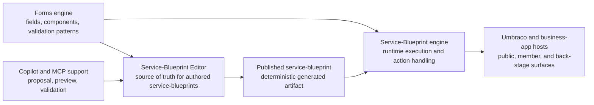

# Service Blueprint Editor: First Iteration Design (V1)

> **Status: Partly historical (2026-05-30 scope reset).** The agentic/AI surfaces (04-agentic-surfaces.md) and Umbraco backoffice mount (03-umbraco-integration.md) were retired. The editor now ships as web components consumed by a separate business app; it is **not** mounted in the Umbraco backoffice. See `docs/walkthroughs/authoring-a-service-blueprint.md` for the current integration recipe. These design docs are kept for reference.

- **Status:** Partly historical (see banner above)
- **Date:** 2026-05-16
- **Authors (Squad):**
  - Tom Nook, Lead (architecture, scope, handoffs)
  - Isabelle, UX (authoring experience)
  - Blathers, Runtime (projection, compatibility)
  - Brewster, Umbraco integration (content and backoffice topology), *historical*
  - Tangy, Agentic surfaces (proposal-first AI loop), *historical*

Keep it simple: this design has three main parts, a **service blueprint editor**, a **service blueprint engine**, and a **forms engine**. V1 focuses on getting the service blueprint editor right. The service blueprint engine and forms engine matter because the editor must publish something they can use, but they are supporting context for this iteration rather than the headline story.

Projection, Umbraco hosting, validation, and future Copilot or MCP service blueprints still matter. In this design set they are treated as supporting seams behind the editor, not as extra top-level products.

> **Multi-lane note:** This V1 set is now partial on concurrent lane behaviour. For the canonical design covering lane ownership, independent cursors, split gateways, join gateways, deterministic convergence, and history semantics, use [`../service-blueprint-multi-lane-engine.md`](../service-blueprint-multi-lane-engine.md).

---

## 1. Simple framing

### Service Blueprint Editor

The service blueprint editor is the authoring product. It is where a designer or developer defines the service blueprint itself:

- service blueprint metadata and identity
- stage creation, naming, ordering, and grouping
- transitions and routing rules
- actions attached to stages or handoffs
- action parameter editing
- validation, preview, history, and diff
- editor ergonomics such as undo, redo, copy, paste, and help

The service blueprint editor owns the authored definition. It does not own runtime execution.

### Service Blueprint engine

The service blueprint engine runs a published service blueprint:

- creates and advances instances
- enforces transitions, roles, and runtime policies
- executes named action handlers
- keeps runtime state, assignment, deadlines, and operational truth

The service blueprint engine consumes what the editor publishes. It should stay pluggable and boring.

### Forms engine

The forms engine supplies the reusable field and component system used inside service blueprint stages and actions:

- form fields and layouts
- validation primitives
- check answers and review patterns
- waiting, confirmation, and status components

The editor configures these building blocks. The service blueprint engine renders and processes them.

---

## 2. What V1 needs to nail

V1 is successful if the service blueprint editor can fully describe a service blueprint without making authors think in raw runtime JSON.

That means the editor must make the following clear and testable:

1. **What the service blueprint is**: stages, actors, transitions, and actions.
2. **What each step captures or shows**: using the forms engine's components.
3. **What happens when a service blueprint runs**: enough structure for the service blueprint engine to execute it safely.
4. **What changed**: validation, preview, diff, and publish confidence.

### V1 is

- an editor-first design for authored service blueprints
- a clear contract between authored service blueprint data and the published runtime definition
- a simple action model with a design-time catalog and runtime handlers
- a planning-application reference flow that proves the design end to end
- a place for Copilot and MCP-assisted changes, but only as a secondary service blueprint around the editor

### V1 is not

- a live-instance editing tool
- a replacement for the existing JSON-first developer view
- a collaborative real-time editor
- a full versioning and lifecycle product
- a bespoke general-purpose AI platform

---

## 3. How the three parts fit together

The important rule is simple:

- the **service blueprint editor** is the design-time source of truth
- the **service blueprint engine** is the runtime executor
- the **forms engine** is the reusable component toolkit

Everything else supports that relationship.

---

## 4. Service Blueprint Editor design

### 4.1 Authoring model

Authors work with a service blueprint model that talks in service blueprint language: stages, actors, handoffs, actions, and views. The editor should not force authors to design directly in `ServiceBlueprint` terms.

**Stage assignment and lane grouping:** Each stage has an assigned actor (e.g. "applicant", "reviewer") and optional role gates (e.g. "admin-approval"). The editor derives visual lane grouping automatically: stages with public-facing actors (applicant, resident, member) appear in the front-stage lane; stages with reviewer/officer/system actors or role gates appear in the back-stage lane. Authors do not manage a separate surface field; the lanes are determined by the assignment data.

The published runtime definition is still important, but it is a generated artifact and an advanced debug surface, not the primary mental model.

### 4.2 Action model

Actions need one simple split:

- **Design-time action catalog**: what actions exist, what parameters they need, how they are described in the editor, and whether the current host can run them.
- **Runtime action handlers**: named implementations resolved by the service blueprint engine at execution time.

In the reference business app, prefer a DI-registered handler registry over ad-hoc lambda wiring so authored actions stay testable, inspectable, and portable.

### 4.3 Editor review and publish loop

The editor should support the same core loop for both human and AI-assisted changes:

1. edit the authored service blueprint
2. validate it
3. preview the result
4. review the diff
5. publish a generated runtime definition

Future Copilot and MCP support should plug into this same loop. They do not get a separate authority path.

---

## 5. Service Blueprint engine responsibilities

The service blueprint engine remains responsible for runtime concerns that the editor must respect but not absorb:

- state progression and transition enforcement
- runtime role checks and policy evaluation
- action execution through named handlers
- case and instance persistence
- deadlines, assignments, evidence, and operational data
- rendering the published service blueprint through existing Prism-compatible shells

V1 keeps the runtime contract stable. The editor publishes into it; the engine keeps running it.

---

## 6. Forms engine responsibilities

The forms engine stays a reusable subsystem, not a second editor.

It provides the components and validation patterns the service blueprint editor composes into stages, for example:

- input fields and grouped fieldsets
- summaries and check-answers views
- confirmation and notification patterns
- waiting and status displays
- conditional and review-oriented form layouts

This lets the service blueprint editor focus on flow design while reusing a consistent component library.

---

## 7. Supporting seams

These matter, but they are secondary to the editor-first story.

### Deterministic publish step

The editor needs a deterministic publish step that turns the authored service blueprint into the Prism-compatible runtime definition consumed by the service blueprint engine. This keeps the authored model flexible while preserving existing runtime contracts.

Detailed rules live in [`02-runtime-projection.md`](./02-runtime-projection.md).

### Umbraco integration

Umbraco remains the public and member-facing host, with the business app handling back-stage operations. The service blueprint editor is a separate authoring surface hosted through a thin backoffice integration rather than re-implemented as content editing.

Detailed hosting and topology rules live in [`03-umbraco-integration.md`](./03-umbraco-integration.md).

### Copilot and MCP support

Copilot, MCP tools, and proposal artifacts are useful because they can help draft, validate, preview, and explain changes. They stay behind the same editor review and publish loop used for human edits.

Detailed supporting contracts live in [`04-agentic-surfaces.md`](./04-agentic-surfaces.md).

---

## 8. Reference demo

The planning application remains the V1 reference service blueprint because it exercises the full editor story without widening scope too early:

- public start in Umbraco
- member continuation and save or resume
- rich front-stage form capture
- back-stage review in the business app
- waiting and status states
- a concrete insertion scenario such as external identity verification

This gives the editor, service blueprint engine, and forms engine a single shared walkthrough to prove against.

---

## 9. Read this design set in order

| Order | File | Why it comes here |
| --- | --- | --- |
| 1 | [`README.md`](./README.md) | The simple product framing: service blueprint editor first, with service blueprint engine and forms engine as supporting context. |
| 2 | [`01-authoring-ux.md`](./01-authoring-ux.md) | The editor experience: library, canvas, inspector, validation, and publish flow. |
| 3 | [`02-runtime-projection.md`](./02-runtime-projection.md) | How the editor publishes a stable runtime definition without making runtime JSON the authoring model. |
| 4 | [`03-umbraco-integration.md`](./03-umbraco-integration.md) | How the editor plugs into Umbraco and the business-app hosts cleanly. |
| 5 | [`04-agentic-surfaces.md`](./04-agentic-surfaces.md) | Optional but important support for proposal-first Copilot and MCP service blueprints. |

---

## 10. Delivery slices after the editor design

1. Lock the authored service blueprint schema and core editor model.
2. Define the action catalog contract and parameter-schema format.
3. Build the runtime action-handler registry in the reference business app.
4. Implement the first forms-backed action and stage set.
5. Add editor interaction features such as copy, paste, undo, redo, help, and keyboard support.
6. Add validation, preview, and focused executable specs around the planning service blueprint.
7. Layer in Copilot and MCP proposal flows on top of the same editor review and publish loop.

---

## 11. Scope guardrails

- Do not introduce more top-level product nouns for V1.
- Do not make runtime JSON the primary editing experience.
- Do not let Copilot or MCP service blueprints bypass editor review, validation, or publish controls.
- Do not move runtime operational truth into authored service blueprint files.
- Do not let Umbraco hosting concerns dominate the editor design.

---

*This V1 design is editor-first by choice: nail the service blueprint editor, keep the service blueprint engine stable, and reuse the forms engine rather than redesigning it.*: Tom Nook
