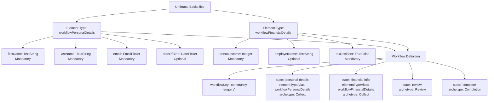

> **Archived, frozen terminology**: this is a historical snapshot from before the [Service Design vocabulary rename](../../CLAUDE.md), it uses the original "Workflow" terminology throughout, left as-written rather than updated to match current vocabulary.

# Prism Workflow Forms Engine: Redesign: Element Types as Step Definitions

**Author:** Tom Nook (Lead)  
**Requested by:** Jonny Muir  
**Status:** Architecture Proposal  
**Date:** 2025-07-16  
**Supersedes:** `workflow-forms-engine.md` (field-group model sections)

---

## 1. Executive Summary

This document describes a **significant simplification** to the Workflow Forms Engine: replacing custom `PrismFieldGroupDefinition` tables and JSON schema with **Umbraco Element Types** as the source of truth for workflow step form definitions.

### The Core Insight

Instead of reinventing field definitions, we leverage what Umbraco already does brilliantly:
- Each workflow step maps to an **Umbraco Element Type** (the same construct used by Block List, Block Grid)
- The Element Type's **properties** ARE the form fields
- Umbraco's **property editors** (TextString, DateTime, DropDown, TrueFalse, etc.) determine input rendering
- Umbraco's **property validation** (mandatory, regex) works out of the box
- Labels, descriptions, and hints come from Umbraco's property metadata

This makes workflow step authoring a **native Umbraco experience**: no custom schema designer, no bespoke JSON format, no duplication of validation logic.

---

## 2. What Changes vs. What Stays

### 2.1 What Stays the Same ✅

| Component | Location | Status |
|-----------|----------|--------|
| **Workflow state machine** | `prismWorkflowDefinitions`, `prismWorkflowInstances`, `prismWorkflowTasks` | Unchanged |
| **Response envelope model** | `responseState: ask_now \| wait \| complete \| error` | Unchanged |
| **WorkflowController REST endpoints** | `POST /instances`, `GET /instances/{id}`, `POST /instances/{id}/advance`, etc. | Modified (see §6) |
| **Client orchestrator** | `workflow-orchestrator.ts`, `workflow-api-client.ts` | Unchanged |
| **MockBackOffice** | Standalone downstream app with Prism auth | Refined (see §8) |
| **Optimistic concurrency** | `stateVersion` enforcement on all mutating endpoints | Unchanged |
| **Tenant isolation** | All tables scoped by `TenantId` | Unchanged |

### 2.2 What Gets Replaced ❌

| Component | Current | New |
|-----------|---------|-----|
| **Field group schema** | `PrismFieldGroupDefinitionSchema` custom table with `FieldsJson` | Umbraco Element Types via `IContentTypeService` |
| **Field definitions** | Custom JSON format: `{ fieldKey, fieldType, label, hint, required, options }` | Umbraco property definitions with standard property editors |
| **Workflow builder** | `.AddFieldGroup("personal-details", builder => { ... })` | `.AddStep("personal-details", elementTypeAlias: "workflowPersonalDetails")` |
| **Custom Lit components** | `prism-workflow-shell.ts`, `prism-workflow-collect.ts`, `prism-workflow-completion.ts` | Dynamic form renderer driven by payload (see §7) |
| **Mobile entry point** | `workflow-index.ts` | Simplified orchestrator-driven entry |

### 2.3 What Gets Deleted 🗑️

- `src/UmbracoPrism.Core/Persistence/PrismFieldGroupDefinitionSchema.cs`
- `src/UmbracoPrism.Core/Migrations/CreatePrismFieldGroupDefinitionsTable.cs` (if it exists)
- `src/UmbracoPrism.Client/src/mobile/prism-workflow-shell.ts`
- `src/UmbracoPrism.Client/src/mobile/prism-workflow-collect.ts`
- `src/UmbracoPrism.Client/src/mobile/prism-workflow-completion.ts`
- `src/UmbracoPrism.Client/src/mobile/workflow-index.ts`
- Associated Storybook stories (`*.stories.ts`)

---

## 3. The New Architecture

### 3.1 Element Types as Step Definitions

In Umbraco, an **Element Type** is a content type that cannot exist independently, it's designed to be embedded (e.g., in Block List items). This maps perfectly to workflow steps: a step's form fields are defined once in the Umbraco backoffice, then referenced by alias in workflow definitions.



### 3.2 Why This is Better

1. **Native Umbraco experience**: Content editors define steps using familiar Document Type UI
2. **Property editors for free**: TextString, DateTime, DropDown, TrueFalse, MediaPicker, etc.
3. **Validation for free**: Mandatory, regex patterns from Umbraco's standard validation
4. **Labels and descriptions for free**: Property name, description, and placeholder come from Umbraco
5. **No schema migration headaches**: Element Types are versioned by Umbraco
6. **Consistent with Block List/Grid**: Same pattern used by Umbraco's own block editors

---

## 4. New Step Definition Pattern

### 4.1 Defining a Workflow with Element Type Steps

The workflow builder becomes dramatically simpler. Instead of defining fields inline, each step references an Element Type alias:

```csharp
public static class RetirementQuoteWorkflow
{
    public const string Key = "community-enquiry";

    public static WorkflowDefinition Build()
    {
        return new WorkflowDefinitionBuilder(Key)
            .WithTitle("Retirement Quote Request")
            .WithDescription("Collect information for a retirement pension quote")
            
            // Each step references an Umbraco Element Type by alias
            .AddStep("personal-details", step => step
                .WithElementType("workflowPersonalDetails")
                .WithArchetype(Archetype.Collect)
                .WithDisplayName("Your Details"))
            
            .AddStep("financial-info", step => step
                .WithElementType("workflowFinancialDetails")
                .WithArchetype(Archetype.Collect)
                .WithDisplayName("Financial Information"))
            
            .AddStep("review", step => step
                .WithArchetype(Archetype.Review)
                .WithDisplayName("Review Your Answers"))
            
            .AddStep("complete", step => step
                .WithArchetype(Archetype.Completion)
                .WithDisplayName("Quote Submitted")
                .IsTerminal())
            
            // Transitions
            .AddTransition("personal-details", "continue", "financial-info")
            .AddTransition("financial-info", "continue", "review")
            .AddTransition("review", "submit", "complete")
            .AddTransition("review", "back", "financial-info")
            
            .Build();
    }
}
```

### 4.2 Creating Element Types in Umbraco

Element Types are created via the standard Umbraco Document Types UI:

1. Navigate to **Settings → Document Types**
2. Create a new Document Type
3. Check **"Is an Element Type"** checkbox
4. Add properties using standard property editors
5. Set validation (mandatory, regex) per property

**Example: workflowPersonalDetails Element Type**

| Property Alias | Property Editor | Label | Description | Mandatory |
|----------------|-----------------|-------|-------------|-----------|
| `firstName` | Umbraco.TextString | First name | Your legal first name | ✅ |
| `lastName` | Umbraco.TextString | Last name | Your legal surname | ✅ |
| `email` | Umbraco.EmailAddress | Email address | We'll send your quote here | ✅ |
| `dateOfBirth` | Umbraco.DateTime | Date of birth | Used to calculate your retirement age | ❌ |
| `employmentStatus` | Umbraco.DropDown.Flexible | Employment status | - | ✅ |

**Example: workflowFinancialDetails Element Type**

| Property Alias | Property Editor | Label | Description | Mandatory |
|----------------|-----------------|-------|-------------|-----------|
| `annualIncome` | Umbraco.Integer | Annual income (£) | Your gross annual salary | ✅ |
| `currentPensionValue` | Umbraco.Integer | Current pension value (£) | Total value across all pensions | ❌ |
| `employerName` | Umbraco.TextString | Employer name | Your current employer | ❌ |
| `taxResident` | Umbraco.TrueFalse | UK tax resident | Are you a UK tax resident? | ✅ |

---

## 5. Property Editor → Render Hint Mapping

WorkflowController introspects Element Type properties and maps Umbraco property editor aliases to render hints that clients can interpret.

### 5.1 Standard Mappings

| Umbraco Property Editor | Render Type | Notes |
|-------------------------|-------------|-------|
| `Umbraco.TextString` | `text` | Single-line text input |
| `Umbraco.TextArea` | `textarea` | Multi-line text input |
| `Umbraco.Integer` | `number` | Numeric input, integer only |
| `Umbraco.Decimal` | `number` | Numeric input with decimals |
| `Umbraco.DateTime` | `datetime` | Date and time picker |
| `Umbraco.DatePicker` | `date` | Date only picker |
| `Umbraco.TrueFalse` | `boolean` | Checkbox or toggle |
| `Umbraco.DropDown.Flexible` | `select` | Dropdown with options from data type config |
| `Umbraco.RadioButtonList` | `radio` | Radio group with options |
| `Umbraco.CheckBoxList` | `checkboxList` | Multiple checkboxes |
| `Umbraco.EmailAddress` | `email` | Email input with browser validation |
| `Umbraco.ColorPicker` | `color` | Color picker (if needed) |
| `Umbraco.Slider` | `slider` | Range slider (if needed) |
| `Umbraco.Tags` | `tags` | Tag input (if needed) |
| (Unknown) | `text` | Fallback to text input |

### 5.2 Render Payload Structure

The render payload returned by `GET /umbraco/prism/workflow/instances/{id}` now includes introspected Element Type metadata:

```json
{
  "instanceId": "wf_abc123",
  "responseState": "ask_now",
  "stateVersion": 3,
  "correlationId": "user-session-xyz",
  "serverTimeUtc": "2025-07-16T10:30:00Z",
  "pollAfterMs": null,
  "render": {
    "archetype": "Collect",
    "stateDisplayName": "Your Details",
    "stepKey": "personal-details",
    "elementTypeAlias": "workflowPersonalDetails",
    "fields": [
      {
        "alias": "firstName",
        "label": "First name",
        "description": "Your legal first name",
        "type": "text",
        "mandatory": true,
        "validation": {
          "pattern": null,
          "patternMessage": null
        },
        "value": null,
        "config": {}
      },
      {
        "alias": "lastName",
        "label": "Last name",
        "description": "Your legal surname",
        "type": "text",
        "mandatory": true,
        "validation": {
          "pattern": null,
          "patternMessage": null
        },
        "value": "Smith",
        "config": {}
      },
      {
        "alias": "email",
        "label": "Email address",
        "description": "We'll send your quote here",
        "type": "email",
        "mandatory": true,
        "validation": {
          "pattern": null,
          "patternMessage": null
        },
        "value": null,
        "config": {}
      },
      {
        "alias": "employmentStatus",
        "label": "Employment status",
        "description": null,
        "type": "select",
        "mandatory": true,
        "validation": {},
        "value": null,
        "config": {
          "options": [
            "Employed",
            "Self-employed",
            "Retired",
            "Not currently working"
          ]
        }
      }
    ],
    "availableActions": [
      {
        "actionKey": "continue",
        "label": "Continue",
        "style": "primary"
      }
    ]
  },
  "problems": []
}
```

### 5.3 Field Config for Complex Types

For property editors with configuration (dropdowns, radios, etc.), the `config` object carries renderer-relevant data:

```json
// Dropdown with options
{
  "alias": "employmentStatus",
  "type": "select",
  "config": {
    "options": ["Employed", "Self-employed", "Retired", "Not currently working"],
    "multiple": false
  }
}

// Slider with range
{
  "alias": "retirementAge",
  "type": "slider",
  "config": {
    "min": 55,
    "max": 75,
    "step": 1,
    "initialValue": 65
  }
}

// Checkbox list
{
  "alias": "preferredContact",
  "type": "checkboxList",
  "config": {
    "options": ["Email", "Phone", "Post"]
  }
}
```

---

## 6. WorkflowController Changes

### 6.1 New Dependency: IContentTypeService

The controller now uses Umbraco's `IContentTypeService` to introspect Element Types:

```csharp
[Route("umbraco/prism/workflow")]
[Authorize(AuthenticationSchemes = "PrismMemberCookie")]
public class WorkflowController(
    IWorkflowInstanceService workflowInstanceService,
    IWorkflowDefinitionRepository definitionRepository,
    IContentTypeService contentTypeService,  // NEW
    IPrismContext prismContext,
    ILogger<WorkflowController> logger) : Controller
{
    // ...
}
```

### 6.2 Render Payload Generation

When `GetInstanceAsync` or `AdvanceAsync` returns an `ask_now` response, the service layer:

1. Looks up the current state's `elementTypeAlias`
2. Calls `IContentTypeService.Get(alias)` to get the Element Type definition
3. Iterates over `PropertyTypes` to build the fields array
4. Maps each property's `PropertyEditorAlias` to a render type
5. Extracts validation settings (mandatory, regex) from property configuration
6. Merges any previously-submitted values from the workflow instance state

```csharp
public class WorkflowRenderService(
    IContentTypeService contentTypeService,
    IDataTypeService dataTypeService)
{
    public WorkflowRenderPayload BuildRenderPayload(
        WorkflowDefinition definition,
        WorkflowInstance instance,
        WorkflowStateDefinition currentState)
    {
        var fields = new List<FieldRenderPayload>();
        
        if (!string.IsNullOrEmpty(currentState.ElementTypeAlias))
        {
            var elementType = contentTypeService.Get(currentState.ElementTypeAlias);
            if (elementType != null)
            {
                foreach (var property in elementType.PropertyTypes)
                {
                    var dataType = dataTypeService.GetDataType(property.DataTypeId);
                    
                    fields.Add(new FieldRenderPayload
                    {
                        Alias = property.Alias,
                        Label = property.Name,
                        Description = property.Description,
                        Type = MapPropertyEditorToRenderType(dataType.EditorAlias),
                        Mandatory = property.Mandatory,
                        Validation = ExtractValidation(property),
                        Value = GetSubmittedValue(instance, property.Alias),
                        Config = ExtractEditorConfig(dataType)
                    });
                }
            }
        }
        
        return new WorkflowRenderPayload
        {
            Archetype = currentState.Archetype.ToString(),
            StateDisplayName = currentState.DisplayName,
            StepKey = currentState.Key,
            ElementTypeAlias = currentState.ElementTypeAlias,
            Fields = fields,
            AvailableActions = GetAvailableActions(definition, currentState)
        };
    }
    
    private string MapPropertyEditorToRenderType(string editorAlias) => editorAlias switch
    {
        "Umbraco.TextString" => "text",
        "Umbraco.TextArea" => "textarea",
        "Umbraco.Integer" => "number",
        "Umbraco.Decimal" => "number",
        "Umbraco.DateTime" => "datetime",
        "Umbraco.DatePicker" => "date",
        "Umbraco.TrueFalse" => "boolean",
        "Umbraco.DropDown.Flexible" => "select",
        "Umbraco.RadioButtonList" => "radio",
        "Umbraco.CheckBoxList" => "checkboxList",
        "Umbraco.EmailAddress" => "email",
        "Umbraco.Slider" => "slider",
        _ => "text"  // Fallback
    };
}
```

### 6.3 Validation on Submit

When `AdvanceAsync` receives field values, validation uses the same Element Type introspection:

```csharp
public async Task<List<WorkflowProblem>> ValidateSubmission(
    string elementTypeAlias,
    Dictionary<string, object?> fieldValues)
{
    var problems = new List<WorkflowProblem>();
    var elementType = _contentTypeService.Get(elementTypeAlias);
    
    if (elementType == null)
        return problems; // No element type = no validation
    
    foreach (var property in elementType.PropertyTypes)
    {
        var submitted = fieldValues.TryGetValue(property.Alias, out var value) ? value : null;
        
        // Mandatory check
        if (property.Mandatory && (submitted == null || string.IsNullOrWhiteSpace(submitted.ToString())))
        {
            problems.Add(new WorkflowProblem
            {
                FieldKey = property.Alias,
                Message = $"Enter your {property.Name.ToLower()}",
                Code = "REQUIRED"
            });
            continue;
        }
        
        // Regex validation
        if (!string.IsNullOrEmpty(property.ValidationRegExp) && submitted != null)
        {
            if (!Regex.IsMatch(submitted.ToString()!, property.ValidationRegExp))
            {
                problems.Add(new WorkflowProblem
                {
                    FieldKey = property.Alias,
                    Message = property.ValidationRegExpMessage ?? $"Enter a valid {property.Name.ToLower()}",
                    Code = "PATTERN"
                });
            }
        }
    }
    
    return problems;
}
```

---

## 7. Mobile/Web Channel Rendering

### 7.1 Design Principle: Payload-Driven Forms

The bespoke Lit components (`prism-workflow-collect.ts`, etc.) are replaced by a **dynamic form renderer** that:

1. Receives the render payload from WorkflowController
2. Iterates over `fields` array
3. Renders appropriate inputs based on `type`
4. Collects values and submits via orchestrator

The orchestrator (`workflow-orchestrator.ts`) and API client (`workflow-api-client.ts`) remain unchanged, they're already payload-agnostic.

### 7.2 Simplified Entry Point

Instead of the shell component managing state, a simpler entry renders whatever the payload describes:

```typescript
// workflow-renderer.ts (replaces workflow-index.ts, prism-workflow-shell.ts)

import { WorkflowApiClient } from './workflow-api-client';
import { WorkflowOrchestrator } from './workflow-orchestrator';

export class WorkflowRenderer {
  private orchestrator: WorkflowOrchestrator;
  private container: HTMLElement;
  
  constructor(container: HTMLElement, apiBaseUrl?: string) {
    this.container = container;
    const client = new WorkflowApiClient(apiBaseUrl);
    this.orchestrator = new WorkflowOrchestrator(client);
    
    this.orchestrator.addEventListener('state-change', () => this.render());
  }
  
  async start(definitionKey: string, correlationId?: string): Promise<void> {
    await this.orchestrator.start(definitionKey, correlationId);
  }
  
  private render(): void {
    const envelope = this.orchestrator.currentEnvelope;
    if (!envelope?.render) {
      this.container.innerHTML = '<div class="loading">Loading...</div>';
      return;
    }
    
    const { archetype, fields, availableActions, stateDisplayName } = envelope.render;
    
    switch (archetype) {
      case 'Collect':
        this.renderCollectForm(stateDisplayName, fields, availableActions);
        break;
      case 'Review':
        this.renderReview(stateDisplayName, fields, availableActions);
        break;
      case 'Completion':
        this.renderCompletion(stateDisplayName, availableActions);
        break;
      default:
        this.container.innerHTML = `<p>Unknown archetype: ${archetype}</p>`;
    }
  }
  
  private renderCollectForm(
    title: string,
    fields: FieldRenderPayload[],
    actions: WorkflowAction[]
  ): void {
    const form = document.createElement('form');
    form.innerHTML = `<h1>${title}</h1>`;
    
    for (const field of fields) {
      form.appendChild(this.renderField(field));
    }
    
    // Action buttons
    const buttonGroup = document.createElement('div');
    buttonGroup.className = 'button-group';
    for (const action of actions) {
      const button = document.createElement('button');
      button.type = 'submit';
      button.textContent = action.label;
      button.dataset.action = action.actionKey;
      button.className = `button button--${action.style}`;
      buttonGroup.appendChild(button);
    }
    form.appendChild(buttonGroup);
    
    form.addEventListener('submit', (e) => this.handleSubmit(e, fields));
    
    this.container.innerHTML = '';
    this.container.appendChild(form);
  }
  
  private renderField(field: FieldRenderPayload): HTMLElement {
    const wrapper = document.createElement('div');
    wrapper.className = 'form-group';
    
    const label = document.createElement('label');
    label.textContent = field.label + (field.mandatory ? ' *' : '');
    label.htmlFor = `field-${field.alias}`;
    wrapper.appendChild(label);
    
    if (field.description) {
      const hint = document.createElement('div');
      hint.className = 'hint';
      hint.textContent = field.description;
      wrapper.appendChild(hint);
    }
    
    // Create input based on type
    let input: HTMLElement;
    switch (field.type) {
      case 'textarea':
        input = document.createElement('textarea');
        break;
      case 'select':
        input = this.createSelect(field);
        break;
      case 'radio':
        input = this.createRadioGroup(field);
        break;
      case 'boolean':
        input = this.createCheckbox(field);
        break;
      default:
        input = this.createInput(field);
    }
    
    wrapper.appendChild(input);
    return wrapper;
  }
  
  private createInput(field: FieldRenderPayload): HTMLInputElement {
    const input = document.createElement('input');
    input.id = `field-${field.alias}`;
    input.name = field.alias;
    input.type = field.type === 'number' ? 'number' 
               : field.type === 'email' ? 'email'
               : field.type === 'date' ? 'date'
               : field.type === 'datetime' ? 'datetime-local'
               : 'text';
    input.required = field.mandatory;
    if (field.value != null) input.value = String(field.value);
    if (field.validation?.pattern) input.pattern = field.validation.pattern;
    return input;
  }
  
  private createSelect(field: FieldRenderPayload): HTMLSelectElement {
    const select = document.createElement('select');
    select.id = `field-${field.alias}`;
    select.name = field.alias;
    select.required = field.mandatory;
    
    const placeholder = document.createElement('option');
    placeholder.value = '';
    placeholder.textContent = 'Select an option';
    select.appendChild(placeholder);
    
    for (const option of field.config?.options || []) {
      const opt = document.createElement('option');
      opt.value = option;
      opt.textContent = option;
      if (field.value === option) opt.selected = true;
      select.appendChild(opt);
    }
    
    return select;
  }
  
  // ... additional helpers for radio, checkbox, etc.
  
  private async handleSubmit(e: Event, fields: FieldRenderPayload[]): Promise<void> {
    e.preventDefault();
    const form = e.target as HTMLFormElement;
    const formData = new FormData(form);
    const submitter = (e as SubmitEvent).submitter as HTMLButtonElement;
    
    const fieldValues: Record<string, unknown> = {};
    for (const field of fields) {
      const value = formData.get(field.alias);
      fieldValues[field.alias] = field.type === 'boolean' 
        ? value === 'on' 
        : value;
    }
    
    await this.orchestrator.advance(submitter.dataset.action!, fieldValues);
  }
}
```

### 7.3 Mobile Considerations

The render payload includes everything a mobile app needs to generate native inputs:

- `type` maps to native input types (UITextField, UIDatePicker, UISwitch, etc.)
- `mandatory` drives validation
- `config.options` provides picker/dropdown data
- `description` provides accessibility hints

No mobile-specific components are needed in this repository, native mobile apps consume the JSON payload directly.

---

## 8. MockBackOffice Design

### 8.1 Purpose

MockBackOffice is a **pretend downstream application**: it simulates what a real downstream system (retirement quote engine, permit processor, claims handler) would do:

1. Receive authenticated requests via Prism JWT
2. Process workflow outcomes
3. Return results to the user

It is NOT an Umbraco backoffice extension.

### 8.2 Assembly Isolation Fix (Already Applied)

The issue: MockBackOffice references `UmbracoPrism.Core` which transitively pulls Umbraco management API controllers, causing `AddControllers()` to crash.

**Solution (already in Program.cs):**

```csharp
builder.Services.AddControllers()
    .ConfigureApplicationPartManager(manager =>
    {
        // Only scan this assembly for controllers
        manager.ApplicationParts.Clear();
        manager.ApplicationParts.Add(new AssemblyPart(typeof(Program).Assembly));
    });
```

### 8.3 What MockBackOffice Keeps

- `AddPrismAuthentication()` for JWT validation
- `/api/backoffice/me` endpoint for user info
- Seeded member data for demo purposes

### 8.4 What MockBackOffice Does NOT Do

- Does NOT scan Umbraco controllers
- Does NOT have access to `IContentTypeService` (Element Types are Umbraco-only)
- Does NOT render workflow forms, it processes completed workflows

---

## 9. Migration Path

### 9.1 Phase 1: Schema Cleanup

**Delete:**
- `PrismFieldGroupDefinitionSchema.cs`
- Related migration files
- `FieldGroupDefinition` domain models

**Keep:**
- `PrismWorkflowDefinitionSchema` (add `ElementTypeAlias` to states JSON)
- `PrismWorkflowInstanceSchema` (unchanged)
- `PrismWorkflowTaskSchema` (unchanged)

### 9.2 Phase 2: Update Workflow Definitions

**Modify `StatesJson` structure:**

Before:
```json
[
  {
    "key": "personal-details",
    "archetype": "Collect",
    "fieldGroups": ["personal-details-v1"]
  }
]
```

After:
```json
[
  {
    "key": "personal-details",
    "archetype": "Collect",
    "elementTypeAlias": "workflowPersonalDetails"
  }
]
```

### 9.3 Phase 3: Create Element Types

For each field group being replaced, create an Umbraco Element Type:

1. Create Element Type with matching alias (e.g., `workflowPersonalDetails`)
2. Add properties matching the old field definitions
3. Configure validation (mandatory, regex)
4. Test in Umbraco backoffice

### 9.4 Phase 4: Update WorkflowController

1. Inject `IContentTypeService` and `IDataTypeService`
2. Create `WorkflowRenderService` for payload generation
3. Update `GetInstanceAsync` and `AdvanceAsync` to use new render logic
4. Update validation to use Element Type introspection

### 9.5 Phase 5: Update Client

1. Delete bespoke Lit components
2. Create simplified `WorkflowRenderer` class
3. Update entry points to use new renderer
4. Test all archetypes with payload-driven rendering

### 9.6 Phase 6: MockBackOffice Verification

1. Verify assembly isolation fix is committed
2. Test MockBackOffice starts without Umbraco controller errors
3. Confirm Prism auth still works

---

## 10. Open Questions for Review

1. **Element Type naming convention**: Should we prefix with `workflow` (e.g., `workflowPersonalDetails`) or use a folder convention?

2. **Property editor support scope**: Which property editors do we support in v1? Proposal: Core text/number/date/boolean/select types only; defer MediaPicker, BlockList, etc.

3. **Multi-language**: Should we support Umbraco's culture-variant properties for multi-language workflow forms?

4. **Review archetype**: How does Review render? Does it re-introspect all previous steps' Element Types, or do we store submitted values in a flat structure?

5. **TestSite seeding**: How do we seed Element Types for the demo? Package migration, or expect manual creation?

---

## 11. Summary

This redesign:

✅ **Simplifies**: No custom field schema; use Umbraco Element Types  
✅ **Leverages Umbraco**: Property editors, validation, labels all native  
✅ **Reduces code**: Delete 6+ client components, 1 schema table  
✅ **Keeps core intact**: State machine, response envelope, orchestrator unchanged  
✅ **Fixes MockBackOffice**: Standalone downstream app with assembly isolation  

The implementation effort is significant but bounded: primarily server-side render payload generation and client-side dynamic form rendering. The payoff is a much more "Umbraco-native" workflow experience.

---

**Next steps:**
1. Review this proposal with Jonny
2. Create prototype Element Types in TestSite
3. Implement `WorkflowRenderService` with property mapping
4. Replace client components with dynamic renderer
5. Update demo workflow definitions
