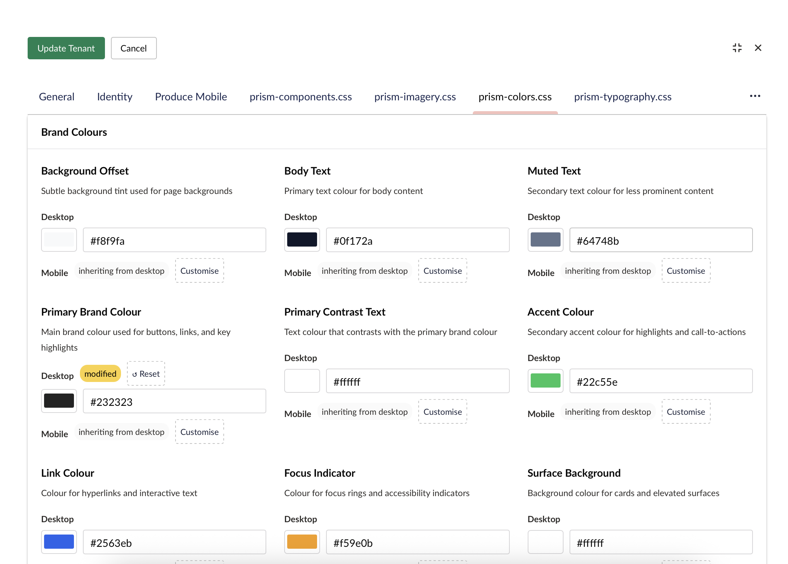
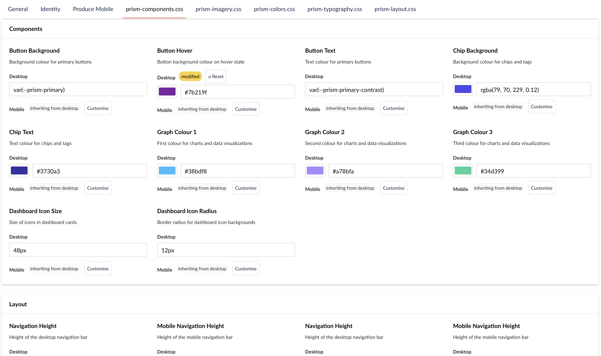
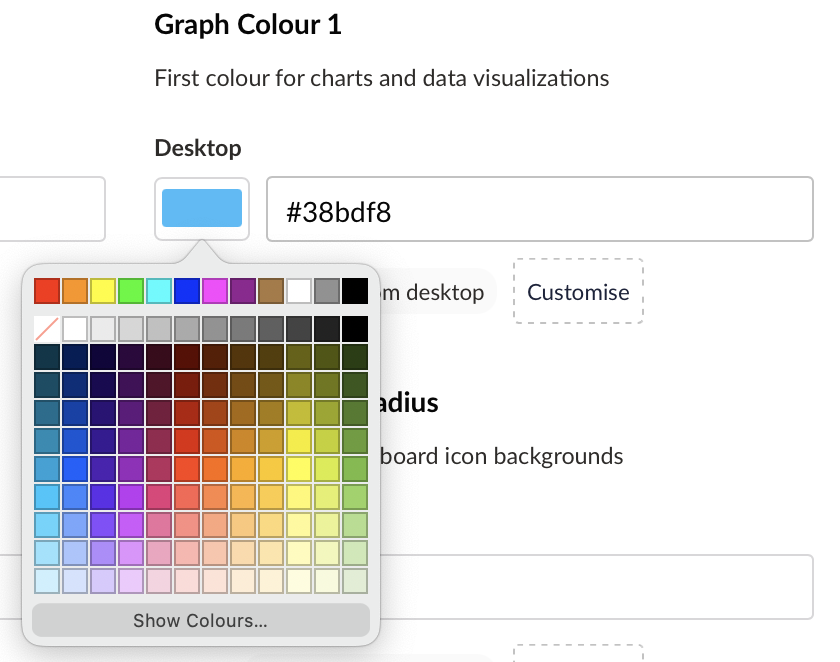

# Prism Branding Design System

## Overview

Prism transforms multi-tenant branding from hardcoded colors to a **living design system**. Every CSS variable you annotate becomes an editable form field in the tenant editor—no code changes, no deploys. The editor displays colors as color pickers, fonts as dropdowns, lengths as sliders, all grouped into meaningful sections. This is design-system management at scale.

The system uses a hybrid approach:
- **CSS Custom Properties (`@property`)** — Native CSS type declarations that ensure browser validation and enable type inference
- **`@prism` Comments** — Structured annotations that drive the tenant editor UI (labels, descriptions, grouping)

Together, they create a seamless bridge between CSS design and the backoffice branding editor.

<div align="center">

<p><em>The Prism tenant editor — CSS variables become typed, labelled form fields organised into design system sections</em></p>
</div>

---

## Why This Matters

Traditional multi-tenant branding requires:
- Hardcoding colors in CSS or config
- Rebuilding/redeploying for each brand change
- Manual form field creation for each variable

Prism's branding design system provides:
- **Live editing** — Changes propagate to the tenant site without deploy
- **Type safety** — Color pickers for colors, font selectors for fonts, validated inputs
- **Organized UI** — Automatic grouping into sections (Brand Colours, Typography, Components)
- **Discoverable** — Labels and descriptions make the editor self-documenting
- **Zero overhead** — One source of truth (CSS files), no sync needed

---

## The Annotation Format

### Structure: `@property` + `@prism` Comments

Each tenant-editable variable has two parts:

**1. `@property` declaration** (browser CSS validation):
```css
@property --prism-primary {
  syntax: '<color>';
  inherits: true;
  initial-value: #4f46e5;
}
```

**2. `@prism` annotation comment** (editor metadata):
```css
/* @prism section: Brand Colours | label: Primary Brand Colour | description: Main brand colour used for buttons and links */
--prism-primary: #4f46e5;
```

### `@prism` Syntax

The annotation is a pipe-separated list of key-value pairs:

```
@prism section: <name> | label: <text> | description: <text> | type: <type>
```

| Key | Purpose | Example |
|-----|---------|---------|
| `section` | Groups variables in the editor UI | `section: Brand Colours` |
| `label` | Short, friendly name for the form field | `label: Primary Brand Colour` |
| `description` | Help text shown in the editor | `description: Main brand colour used for buttons and links` |
| `type` | Explicit type override (rarely needed) | `type: color` |

### Type System

Types are inferred from `@property` syntax, but can be overridden with `type:` in the annotation.

| Syntax | Inferred Type | Editor Widget | Example |
|--------|---------------|---------------|---------|
| `<color>` | `color` | Color picker | `--prism-primary: #4f46e5` |
| `<url>` | `url` | URL input | `--logo-url: url(...)` |
| `<image>` | `image` | Image upload | `--hero-image: url(...)` |
| `<length>` | `length` | Slider or number input | `--button-size: 16px` |
| `<number>` | `text` | Text input | `--font-weight: 700` |
| `<string>` | `text` | Text input | `--font-family: "Inter"` |
| `*` (any) | `text` | Text input | `--gradient: linear-gradient(...)` |

---

## File Structure (test client example)

Branding is organized across five (or how ever many you choose) focused CSS files, aggregated by a single entry point:

### **`prism-branding.css`** (Aggregator)

The single import point. Other modules import from here.

```css
@import url("/branding/prism-colors.css");
@import url("/branding/prism-typography.css");
@import url("/branding/prism-layout.css");
@import url("/branding/prism-imagery.css");
@import url("/branding/prism-components.css");
```

### **`prism-colors.css`** (Brand Identity)

Primary palette: text colors, UI states, hero sections.

```css
@property --prism-primary { syntax: '<color>'; inherits: true; initial-value: #4f46e5; }
@property --prism-primary-contrast { syntax: '<color>'; inherits: true; initial-value: #ffffff; }
@property --prism-accent { syntax: '<color>'; inherits: true; initial-value: #22c55e; }
@property --prism-success { syntax: '<color>'; inherits: true; initial-value: #16a34a; }
@property --prism-danger { syntax: '<color>'; inherits: true; initial-value: #ef4444; }

:root {
    /* @prism section: Brand Colours | label: Primary Brand Colour | description: Main brand colour used for buttons, links, and key highlights */
    --prism-primary: #4f46e5;
    
    /* @prism section: Brand Colours | label: Primary Contrast Text | description: Text colour that contrasts with the primary brand colour */
    --prism-primary-contrast: #ffffff;
    
    /* @prism section: Brand Colours | label: Accent Colour | description: Secondary accent colour for highlights and call-to-actions */
    --prism-accent: #22c55e;
    
    /* @prism section: Brand Colours | label: Success Colour | description: Colour indicating successful actions or positive states */
    --prism-success: #16a34a;
    
    /* @prism section: Brand Colours | label: Danger Colour | description: Colour indicating errors or destructive actions */
    --prism-danger: #ef4444;
}
```

### **`prism-typography.css`** (Text Styling)

Font families, weights, sizes. Mix of `font` and `length` types.

```css
@property --prism-font-body { syntax: '<string>'; inherits: true; initial-value: "Inter", sans-serif; }
@property --prism-font-display { syntax: '<string>'; inherits: true; initial-value: "Space Grotesk", sans-serif; }
@property --prism-text-size-lg { syntax: '<length>'; inherits: true; initial-value: 22px; }

:root {
    /* @prism section: Typography | label: Body Font Family | description: Primary font family for body text and UI elements | type: font */
    --prism-font-body: "Inter", sans-serif;
    
    /* @prism section: Typography | label: Display Font Family | description: Font family for headings and prominent text | type: font */
    --prism-font-display: "Space Grotesk", sans-serif;
    
    /* @prism section: Typography | label: Large Text Size | description: Text size for subheadings and section titles | type: length */
    --prism-text-size-lg: 22px;
}
```

### **`prism-imagery.css`** (Visual Elements)

Gradients, backgrounds, image border radiuses. Uses `image` type.

```css
@property --prism-hero-image { syntax: '*'; inherits: true; initial-value: linear-gradient(...); }
@property --prism-image-radius { syntax: '<length>'; inherits: true; initial-value: 20px; }

:root {
    /* @prism section: Imagery | label: Hero Background Image | description: Background image or gradient overlay for hero sections | type: image */
    --prism-hero-image: linear-gradient(120deg, rgba(15, 23, 42, 0.1), rgba(15, 23, 42, 0.4));
    
    /* @prism section: Imagery | label: Image Border Radius | description: Corner rounding for images and media elements | type: length */
    --prism-image-radius: 20px;
}
```

### **`prism-components.css`** (Component-Specific)

Buttons, chips, navigation, dashboards. Higher specificity.

```css
@property --prism-button-bg { syntax: '*'; inherits: true; initial-value: var(--prism-primary); }
@property --prism-nav-height { syntax: '<length>'; inherits: true; initial-value: 56px; }

:root {
    /* @prism section: Components | label: Button Background | description: Background colour for primary buttons */
    --prism-button-bg: var(--prism-primary);
    
    /* @prism section: Components | label: Navigation Height | description: Height of the desktop navigation bar | type: length */
    --prism-nav-height: 56px;
}
```

### **`prism-layout.css`** (Spacing & Sizing)

Page dimensions, gutters, gaps, shadows. Mostly `length` type.

```css
@property --prism-page-max { syntax: '<length>'; inherits: true; initial-value: 1100px; }
@property --prism-page-gutter { syntax: '<length>'; inherits: true; initial-value: 24px; }
@property --prism-radius { syntax: '<length>'; inherits: true; initial-value: 16px; }

:root {
    /* @prism section: Layout | label: Page Maximum Width | description: Maximum width for page content containers | type: length */
    --prism-page-max: 1100px;
    
    /* @prism section: Layout | label: Page Gutter | description: Horizontal padding for page edges and margins | type: length */
    --prism-page-gutter: 24px;
    
    /* @prism section: Layout | label: Border Radius | description: Corner rounding for cards and UI elements | type: length */
    --prism-radius: 16px;
}
```

---

## How It Works: The Backend

The `PrismBrandingMetadataService` parses all CSS files and builds metadata for the tenant editor.

### Parsing Pipeline

1. **Scan** — Read all CSS files in `wwwroot/branding/` (except `prism-branding.css`)
2. **Extract** — Find all `/* @prism ... */` comments and variable declarations
3. **Infer** — Extract `@property` syntax to infer types
4. **Group** — Organize by section name from `@prism section:`
5. **Cache** — Store in memory (1-hour sliding expiration)

### API Response: `GET /umbraco/api/prism/branding/metadata`

```json
[
  {
    "name": "Brand Colours",
    "variables": [
      {
        "variable": "--prism-primary",
        "label": "Primary Brand Colour",
        "description": "Main brand colour used for buttons and links",
        "type": "color",
        "syntax": "<color>",
        "currentValue": "#4f46e5"
      },
      {
        "variable": "--prism-primary-contrast",
        "label": "Primary Contrast Text",
        "description": "Text colour that contrasts with the primary brand colour",
        "type": "color",
        "syntax": "<color>",
        "currentValue": "#ffffff"
      }
    ]
  },
  {
    "name": "Typography",
    "variables": [
      {
        "variable": "--prism-font-body",
        "label": "Body Font Family",
        "description": "Primary font family for body text",
        "type": "text",
        "syntax": "<string>",
        "currentValue": "\"Inter\", sans-serif"
      }
    ]
  }
]
```

---

## The Tenant Editor

The backoffice editor uses the metadata to render a design-system-style form.

### Form Structure

- **Sections** — Each `section:` value becomes a collapsible tab (Brand Colours, Typography, Layout, etc.)
- **Fields** — Each variable becomes a labeled form field
- **Types** — The `type` determines the widget (color picker, text input, slider)
- **Descriptions** — Help text below each field

<div align="center">

<p><em>Sections derived from the <code>section:</code> annotation — each tab groups related variables</em></p>
</div>

<div align="center">

<p><em>Color variables render as native color pickers — no manual hex entry needed</em></p>
</div>

### Example: Editing Primary Brand Colour

1. Open **Prism Dashboard → Branding Editor**
2. Click **Brand Colours** section
3. Find **Primary Brand Colour** field (from `label:`)
4. See help text below (from `description:`)
5. Click color picker
6. Select new color
7. Changes live-update the tenant site

No rebuild. No deploy.

---

## Adding a New Tenant-Editable Variable

Let's walk through adding a new variable from scratch.

### Scenario

The design team wants to let each tenant customize the card corner radius independently from the global border radius.

### Step 1: Choose the File

`prism-components.css` — this is component-specific styling.

### Step 2: Add the `@property` Declaration

Top of the file, with the other `@property` blocks:

```css
@property --prism-card-radius {
  syntax: '<length>';
  inherits: true;
  initial-value: 16px;
}
```

This declares:
- Name: `--prism-card-radius`
- Type: `<length>` (CSS validator will accept pixel/em values)
- Inheritance: enabled (inherits through DOM)
- Default: 16px

### Step 3: Add the CSS Variable Assignment

In the `:root` rule:

```css
/* @prism section: Components | label: Card Border Radius | description: Corner rounding for feature cards and panels | type: length */
--prism-card-radius: 16px;
```

### Step 4: Use It in Your Styles

```css
.card {
  border-radius: var(--prism-card-radius);
  background: white;
  padding: 1.5rem;
}
```

### Step 5: See It in the Editor

On next page load (or after cache expires), the tenant editor will show:

- **Section:** Components
- **Label:** Card Border Radius
- **Description:** Corner rounding for feature cards and panels
- **Type:** length (renders as text input accepting `px`, `em`, `rem`)
- **Current Value:** 16px

Tenant updates the value → CSS variable updates → styles rerender instantly.

---

## Best Practices

### Naming

- Use `--prism-` prefix for all variables
- Use kebab-case: `--prism-card-radius`, not `--prism-cardRadius`
- Be specific: `--prism-button-hover`, not `--prism-hover`

### Grouping

- **Brand Colours** — Primary palette, contrast, status (success, danger, warning)
- **Typography** — Fonts, sizes, weights
- **Imagery** — Gradients, overlays, border radiuses for images
- **Components** — Button styles, chip colors, nav heights
- **Layout** — Page widths, gutters, gaps, card shadows

If a variable doesn't fit, consider creating a new section name.

### Labels and Descriptions

**Good:**
```
label: Primary Brand Colour
description: Main colour used for buttons, links, and key highlights
```

**Poor:**
```
label: Color 1
description: Used in UI
```

Descriptions should:
- Explain *what* the variable controls
- Hint at *where* it's used
- Stay under 100 characters
- Avoid technical jargon

### Type Selection

**Explicit `type:` is rarely needed.** The service infers from `@property syntax:`:
- If syntax is `<color>` → auto-inferred as `color` type
- If syntax is `<length>` → auto-inferred as `length` type

**Override only when:**
- The variable is a special case (e.g., a shadow with no explicit `@property` syntax)
- You want custom editor behavior

Example where `type:` is useful:
```css
/* @prism section: Layout | label: Card Shadow | description: Box shadow for elevated cards | type: text */
--prism-card-shadow: 0 10px 30px rgba(15, 23, 42, 0.12);
```

Here, `@property syntax: '*'` (unrestricted), but we force `type: text` to get a text input instead of a generic fallback.

### Caching

The service caches metadata for 1 hour. After a branding CSS file changes:
1. Cache expires automatically (sliding 1 hour)
2. Or restart the application to clear immediately

This is safe for production — CSS file changes are rare and typically go through code review.

---

## Real-World Examples

### Example 1: Dark Mode Brand Colors

Create a new section for dark variants:

```css
:root {
    /* @prism section: Dark Mode | label: Dark Background | description: Main background colour for dark mode | type: color */
    --prism-dark-bg: #0f172a;
    
    /* @prism section: Dark Mode | label: Dark Text | description: Text colour for dark mode backgrounds | type: color */
    --prism-dark-text: #ffffff;
}
```

In CSS:
```css
@media (prefers-color-scheme: dark) {
  :root {
    --prism-text: var(--prism-dark-text);
    --prism-surface: var(--prism-dark-bg);
  }
}
```

Now tenants can independently theme dark mode colors.

### Example 2: Mobile Navigation Styling

Component-specific variables that drive the mobile nav widget:

```css
prism-mobile-nav {
  /* @prism section: Mobile Navigation | label: Mobile Nav Background | description: Background colour for mobile navigation bar | type: color */
  --prism-mobile-nav-bg: rgba(255, 255, 255, 0.95);
  
  /* @prism section: Mobile Navigation | label: Mobile Nav Blur | description: Backdrop blur amount for mobile navigation | type: length */
  --prism-mobile-nav-blur: 20px;
}
```

This is scoped to the `prism-mobile-nav` web component, so it doesn't pollute global styles.

### Example 3: Hero Section Gradients

Use `syntax: '*'` for complex values:

```css
@property --prism-hero-bg {
  syntax: '*';
  inherits: true;
  initial-value: linear-gradient(135deg, #4f46e5, #22d3ee);
}

:root {
    /* @prism section: Hero Section | label: Hero Background | description: Gradient background for hero sections and headers | type: text */
    --prism-hero-bg: linear-gradient(135deg, #4f46e5, #22d3ee);
}
```

The editor will show this as a text input. Advanced tenants can paste custom gradients.

---

## Troubleshooting

### Variable Not Appearing in Editor

**Checklist:**
1. ✅ File is in `wwwroot/branding/` and ends with `.css`
2. ✅ File is NOT named `prism-branding.css`
3. ✅ Variable has a `/* @prism ... */` comment immediately before the declaration
4. ✅ Comment follows the format: `section: X | label: Y | description: Z`
5. ✅ Variable declaration: `--prism-name: value;` (with semicolon)
6. ✅ Wait 1 hour for cache to expire, or restart the app

### Type Inference Not Working

If the editor shows `type: text` when you expected `color`:

1. Check that `@property` declares the correct syntax: `syntax: '<color>'`
2. If the variable has no `@property`, add one
3. Or explicitly set `type: color` in the `@prism` annotation

### CSS Variables Not Updating on Tenant Site

1. Open browser DevTools → Inspect
2. Check `:root` CSS — are the new values present?
3. If not, check the backoffice — was the change saved?
4. If yes, reload the page (no deploy needed)
5. If still not working, restart the app to clear cache

---

## API Reference

### Getting Metadata

```
GET /umbraco/api/prism/branding/metadata
```

Returns all branding sections and variables as JSON. Cached for 1 hour.

**Response:**
```json
[
  {
    "name": "Brand Colours",
    "variables": [...]
  }
]
```

### Variable Structure

```json
{
  "variable": "--prism-primary",
  "label": "Primary Brand Colour",
  "description": "Main brand colour used for buttons and links",
  "type": "color",
  "syntax": "<color>",
  "currentValue": "#4f46e5"
}
```

| Field | Type | Source |
|-------|------|--------|
| `variable` | string | CSS variable name |
| `label` | string | `label:` from `@prism` annotation |
| `description` | string | `description:` from `@prism` annotation |
| `type` | string | `type:` from annotation, or inferred from `@property syntax:` |
| `syntax` | string | `@property syntax:` value |
| `currentValue` | string | Current CSS value |

---

## Summary

The Prism branding design system bridges CSS and the backoffice editor through a simple, powerful annotation format:

1. **`@property`** declares types for browser validation
2. **`@prism` comment** provides UI metadata (section, label, description)
3. **Service** parses both, builds an editor form
4. **Tenants** edit live without deploy

Start with the test site's CSS files (`prism-colors.css`, `prism-typography.css`, etc.) as your template. Add new variables by following the pattern. Let your design system shine.
