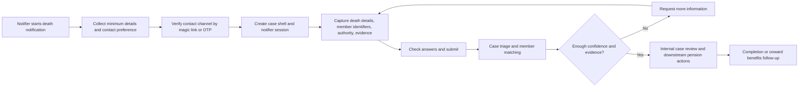

# PASA death-process workflow design

> **Internal design document:** This document is for contributors and maintainers. It proposes a product-shaped bereavement workflow example that Prism can later implement.

## Product goal

Show that Prism can handle a complex pension-administration case where:

- the person starting the journey is usually **not** the member,
- identity and authority are **progressively** established,
- the case may pause for review, matching, and evidence,
- the notifier needs to save, resume, and understand progress without creating a full portal account first.

This example should feel realistic for pension administration while still fitting Prism's workflow patterns.

---

## Source hierarchy and standards

| Source | What it gives us | How this design uses it |
| --- | --- | --- |
| [PASA Identity Management Working Group](https://www.pasa-uk.com/identity-management-working-group-idwg/) | Risk-based identity verification, clear member identity, frictionless experience where proportionate, explicit recognition that schemes need to understand life events including when members pass away | Baseline for notifier proofing, member linking, and step-up checks |
| [PASA data-management guidance hub](https://www.pasa-uk.com/data-management-plans-guidance-march-2021/) and [guidance index](https://www.pasa-uk.com/guidance-2/) | Data quality, governance, matching discipline, and “right benefit to the right person at the right time” posture | Supports auditability, data minimisation, and server-side matching |
| [GOV.UK Tell Us Once](https://www.gov.uk/after-a-death/organisations-you-need-to-contact-and-tell-us-once) | Bereavement front-door pattern, unique reference, permission/authority prompts, NI number helps matching but is not always required | Shapes notifier initiation, matching data, and acknowledgement pattern |
| [Death Notification Service](https://www.deathnotificationservice.co.uk/) | No-account submission, optional account creation later, duplicate detection, validation before onward routing, 10-working-day response expectation | Shapes save/resume, case reference, and progress visibility |
| [GOV.UK Service Standard: solve a whole problem](https://www.gov.uk/service-manual/service-standard/point-2-solve-a-whole-problem), [join up across channels](https://www.gov.uk/service-manual/service-standard/point-3-join-up-across-channels), [make the service simple to use](https://www.gov.uk/service-manual/service-standard/point-4-make-the-service-simple-to-use), [assisted digital support](https://www.gov.uk/service-manual/helping-people-to-use-your-service/assisted-digital-support-introduction) | Whole-journey design, inclusive channels, assisted digital support, and low-friction service design | Shapes phone/post fallback, notifier support, and plain-language progress updates |

### What is PASA-specific and what is broader practice

- **PASA-specific:** risk-based identity management, strong member identity hygiene, proportionate checks, and fraud-aware administration.
- **Broader UK best practice:** digital bereavement front-door patterns, unique case references, optional accounts, assisted digital support, and joined-up channel design.
- **Known gap:** PASA public guidance does **not** appear to prescribe a detailed digital death-notification UX, save/resume mechanism, or exact notifier-authentication pattern. Those parts of this proposal come from broader UK bereavement and service-design practice.

---

## Current repo fit

The strongest fit is a blend of existing workflow examples and package patterns:

| Existing pattern | Reuse in PASA death process | Why it matters |
| --- | --- | --- |
| `planning-notification` | Multi-step capture and check-answers | The notifier needs a structured journey, not a single form |
| `information-request` | `save-draft` plus reviewer `request-changes` loop | Bereavement cases often need follow-up evidence or clarification |
| `payment-demo` | Waiting state and system/reviewer completion | The notifier submits once, then operations and downstream systems take over |
| Workflow hub and prompt policy | Resume active cases safely | The notifier may need to come back with documents or more information |
| Workflow security model | Nonce validation and authoritative business-app state | Sensitive matching and evidence decisions must stay server-side |

The important stretch is identity: current Prism workflow examples assume an authenticated member and forward that member token to the business app. This example should introduce a **case-scoped notifier actor** while keeping the deceased member as the **linked subject**, not the authenticated workflow user.

---

## Service design principles

1. **Bereavement-sensitive first.** Keep the journey short, calm, and plain-spoken.
2. **Proportionate proofing.** Lightweight proof to start a case; stronger proof only when risk rises.
3. **Actor and subject are separate.** The notifier is the workflow actor. The deceased member is the record being matched.
4. **Match server-side.** Never trust a browser-submitted member identifier as proof.
5. **Save/resume without forced registration.** One-off bereavement reporting should not require permanent account creation.
6. **Progress without oversharing.** Show what happens next without exposing sensitive member or benefit detail too early.
7. **Joined-up channels.** Phone, post, and staff support must remain valid routes for vulnerable or digitally excluded users.

---

## Access model options and recommendation

### Options

| Option | Pros | Cons | Verdict |
| --- | --- | --- | --- |
| Mandatory registration | Strong persistent identity, simple portal mental model | High friction, poor fit for bereaved users, overkill for one-off reporting | Not recommended for v1 |
| Passwordless resume only | Low friction, familiar email/SMS journey, easy to explain | Lost-link recovery needed, weaker on its own for sensitive disclosure | Good default, but not enough alone |
| Case reference plus claimant checks only | Inclusive for offline and phone support, easy fallback | Clunky digital UX, repeated data entry, higher support burden | Keep as fallback, not the main web journey |
| **Hybrid: passwordless resume plus case reference fallback plus step-up checks** | Low friction, recoverable, supports online and offline channels, proportionate assurance | Slightly more design work | **Recommended** |

### Recommendation

Use a **hybrid model**:

1. **No mandatory registration** to start.
2. Verify control of a contact channel with **magic link or OTP**.
3. Create a **case-scoped notifier session** and case reference.
4. Allow save/resume through the verified session.
5. Support **case-reference recovery** through claimant checks and staff support.
6. Trigger **step-up verification** only before exposing sensitive member-specific detail or progressing to benefit/beneficiary actions.

This is the best balance between PASA's risk-based identity posture and broader bereavement best practice that avoids avoidable friction.

---

## End-to-end service design



### 1. Notifier initiation

The front door should:

- explain who can report a death,
- explain that the notifier is reporting **about** a member,
- list what information helps the scheme match the record faster,
- explain alternative channels for urgent or complex cases,
- avoid demanding documents or account creation before the user understands the journey.

Recommended first-screen capture:

- notifier name,
- notifier relationship to the deceased,
- contact method,
- deceased name,
- date of death if known,
- whether the death has been registered or is with a coroner.

### 2. Identity assurance and member linking

Identity should be layered:

| Level | What is being proved | Typical mechanism | When it is enough |
| --- | --- | --- | --- |
| L0 | Contactability | Email magic link or SMS OTP | Enough to create and resume the case |
| L1 | Claimed relationship/authority | Relationship declaration, permission statement, executor/administrator details where relevant | Enough to accept a notification submission |
| L2 | Member linkage confidence | Matching on NI number, DOB, name, postcode, employer/scheme references, registrar details | Enough to move into case review |
| L3 | Sensitive disclosure or payment-affecting action | Extra document review, manual handler check, stronger identity proof where needed | Required before sharing protected case details or progressing benefit outcomes |

Step-up triggers should include:

- multiple possible member matches,
- conflicting death details,
- request to see sensitive account or beneficiary information,
- high-value or fraud-sensitive follow-up actions,
- change of payee or representative.

### 3. Data and evidence requirements

| Category | Submit at first pass | Optional but helpful | Follow-up only when needed |
| --- | --- | --- | --- |
| Notifier | Name, relationship, contact details, contact preference, declaration | Postal address | Proof of authority where the case becomes contested or payment-affecting |
| Deceased member | Full name, date of birth or approximate DOB, date of death | NI number, postcode, employer, scheme reference, address | Additional identifiers if matching is weak |
| Death event | Registered/coroner status, place of death if operationally needed | Registrar or Tell Us Once reference | Interim certificate detail where an inquest is underway |
| Evidence | None mandatory at the entry screen | Death certificate upload if readily available | Death certificate, interim certificate, probate, letters of administration, other supporting evidence depending on case type |

Design intent:

- do **not** make NI number mandatory if the notifier does not have it;
- do treat it as a strong accelerator for matching when available;
- do **not** require probate at notification stage unless the next action genuinely depends on it.

### 4. Save/resume strategy

The save/resume design should be **case-based**, not page-based.

Recommended behaviour:

1. Verify a contact channel early.
2. Create the `DeathCase` and `WorkflowInstance` immediately after that verification.
3. Enable `save-draft` on all capture states.
4. Resume via the verified notifier session.
5. Recover via case reference plus claimant checks if the user loses the link or changes device.
6. Keep uploaded evidence in a document store with metadata references in the case aggregate.

This gives the repo a realistic pattern without forcing permanent registration just to avoid draft loss.

### 5. Progress visibility

Progress should be visible, but sensitive data should stay gated.

Recommended public/notifier statuses:

| Status | Notifier sees | Sensitive detail exposure |
| --- | --- | --- |
| `draft` | Your notification has not been submitted yet | None |
| `submitted` | We have received your notification | None |
| `matching-member` | We are checking the member details | None |
| `more-information-needed` | We need more information from you | Only the requested task list |
| `in-review` | The case is with our bereavement team | Minimal |
| `completed` | We have recorded the death notification and explained next steps | No hidden internal notes |
| `unable-to-progress` | We cannot continue until we can safely match the record or receive more information | No candidate-member detail |

Operational expectations should be plain language:

- acknowledgement immediately after submission,
- realistic response window,
- clear “what happens next” text,
- explicit alternative channel for urgent estate-release scenarios.

---

## Proposed case states

```mermaid
stateDiagram-v2
    direction LR
    [*] --> notifier-details
    notifier-details --> deceased-details : continue
    deceased-details --> death-details : continue
    death-details --> authority-and-evidence : continue
    authority-and-evidence --> check-answers : continue
    notifier-details --> notifier-details : save-draft
    deceased-details --> deceased-details : save-draft
    death-details --> death-details : save-draft
    authority-and-evidence --> authority-and-evidence : save-draft
    check-answers --> submitted-awaiting-triage : submit
    submitted-awaiting-triage --> more-information-needed : request-changes 🔒
    more-information-needed --> authority-and-evidence : provide-update
    submitted-awaiting-triage --> in-case-review : confirm-match 🔒
    submitted-awaiting-triage --> unable-to-progress : reject-match 🔒
    in-case-review --> complete : complete-case 🔒
    unable-to-progress --> [*]
    complete --> [*]
```

| State | Primary actor | Purpose |
| --- | --- | --- |
| `notifier-details` | Notifier | Capture who is reporting and how PASA can contact them |
| `deceased-details` | Notifier | Capture identifiers needed to match the member |
| `death-details` | Notifier | Capture the death event details |
| `authority-and-evidence` | Notifier | Capture relationship basis and any available evidence |
| `check-answers` | Notifier | Review before formal submission |
| `submitted-awaiting-triage` | System and reviewer | Waiting state while matching and validation run |
| `more-information-needed` | Notifier | Follow-up loop for missing or corrected details |
| `in-case-review` | Reviewer and downstream services | Internal processing once the record is matched |
| `complete` | System and reviewer | Terminal state with next-step guidance |
| `unable-to-progress` | Reviewer | Terminal state when PASA cannot safely continue |

---

## Persistence model

Use a domain aggregate such as `DeathCase` alongside the Prism workflow instance.

| Data group | Persisted in | Notes |
| --- | --- | --- |
| Workflow position, action set, optimistic concurrency | `WorkflowInstance` | Prism-facing journey state |
| Case reference, notifier party id, linked member id, status, timestamps | `DeathCase` | Operational source of truth |
| Contact-proof status | `NotifierSession` or equivalent | Verified email or SMS, expiry, lockout, last proofed time |
| Matching candidates and confidence outcome | `DeathCaseMatch` | Server-side only |
| Evidence metadata | `DeathCaseEvidence` | Blob ids, document type, upload time, review result |
| Reviewer notes and decisions | Case-domain tables | Staff-only data; do not store in generic workflow fields |
| Outbound communications | Outbox or event log | Email, SMS, letter, and reminder audit |

---

## Integration boundaries

| Boundary | Responsibility |
| --- | --- |
| Prism | Render states, validate nonce-bound fields, host resume and status views |
| Business-app workflow API | Resolve notifier session, enforce transitions, return authoritative envelopes |
| Death-case domain service | Persist case state, member-link results, evidence metadata, and communications |
| Matching services | Search for and confirm the correct member record |
| Evidence service | Upload, virus-scan, retain, and permission documents |
| Reviewer operations | Confirm match, request more information, or close the case |

---

## Product sign-off decisions

These points need explicit sign-off before implementation starts:

| Decision | Recommendation | Why sign-off matters |
| --- | --- | --- |
| Entry auth model | Hybrid passwordless plus case-reference fallback | Sets the service posture and support model |
| Minimum matching data | NI number helpful, not mandatory; DOB plus name plus scheme/employer data where possible | Affects abandonment, fraud risk, and match quality |
| Mandatory evidence at submission | No mandatory upload at the front door unless legally required for a specific scheme | Avoids blocking users who are notifying, not yet claiming |
| Who can use the service | Family, executor/administrator, nominated representative, and staff-assisted callers | Changes copy, declarations, and operational routing |
| Progress detail level | High-level customer-safe statuses only until stronger proof is complete | Protects sensitive member data |
| Assisted digital offer | Always provide phone/post escalation path and urgent-case wording | Required for inclusive service design |
| Duplicate handling | Detect likely duplicates and route to staffed recovery rather than exposing prior-case detail | Fraud and privacy control |
| When to step up verification | Before sensitive disclosure or payment-affecting actions, not before basic death reporting | Aligns with PASA's risk-based posture |

---

## Concrete authoring pack for Celeste

Celeste should treat this as a small design set, not just a single narrative page.

### Primary document

`docs/design/pasa-death-process.md`

Recommended section order:

1. Product goal
2. Source hierarchy and standards
3. Current Prism fit and gaps
4. Service principles
5. Access model options and recommendation
6. End-to-end service design
7. Data and evidence requirements
8. Save/resume and progress model
9. Case states and transitions
10. Persistence and integration boundaries
11. Product sign-off decisions
12. Implementation sketch and out-of-scope items
13. References

### Supporting artifacts to include in the same document

- one service-flow diagram,
- one state-machine diagram,
- one access-model trade-off table,
- one evidence/data requirement table,
- one sign-off decision table.

### Follow-on deliverables once the team agrees the design

| Deliverable | Owner shape | Purpose |
| --- | --- | --- |
| Mock workflow seed outline | Backend/design | Maps the case states into a Prism-friendly definition |
| Walkthrough brief | Docs/product | Explains the demo story in human terms |
| Reviewer-operating notes | Ops/security | Clarifies manual review and escalation boundaries |
| Implementation checklist | Lead/backend | Turns the design into phased work |

---

## Recommended first implementation shape

If this becomes a repo example later, model it as:

- a new workflow definition such as `pasa-death-notification`,
- a pre-workflow notifier-verification entry point,
- a hub-friendly resumable journey with `save-draft`,
- reviewer transitions using the same role-gated pattern as `information-request`,
- a waiting-state handoff like `payment-demo`,
- a case aggregate that stays separate from raw workflow answers.

This gives Prism a realistic example of a **third-party initiated, proofed, member-linked, resumable workflow** without pretending the workflow engine itself is a bereavement case-management platform.

---

## References

- PASA Identity Management Working Group: https://www.pasa-uk.com/identity-management-working-group-idwg/
- PASA data-management guidance: https://www.pasa-uk.com/data-management-plans-guidance-march-2021/
- PASA guidance hub: https://www.pasa-uk.com/guidance-2/
- GOV.UK Tell Us Once: https://www.gov.uk/after-a-death/organisations-you-need-to-contact-and-tell-us-once
- Death Notification Service: https://www.deathnotificationservice.co.uk/
- GOV.UK Service Standard, solve a whole problem: https://www.gov.uk/service-manual/service-standard/point-2-solve-a-whole-problem
- GOV.UK Service Standard, join up across channels: https://www.gov.uk/service-manual/service-standard/point-3-join-up-across-channels
- GOV.UK Service Standard, make the service simple to use: https://www.gov.uk/service-manual/service-standard/point-4-make-the-service-simple-to-use
- GOV.UK assisted digital support: https://www.gov.uk/service-manual/helping-people-to-use-your-service/assisted-digital-support-introduction
