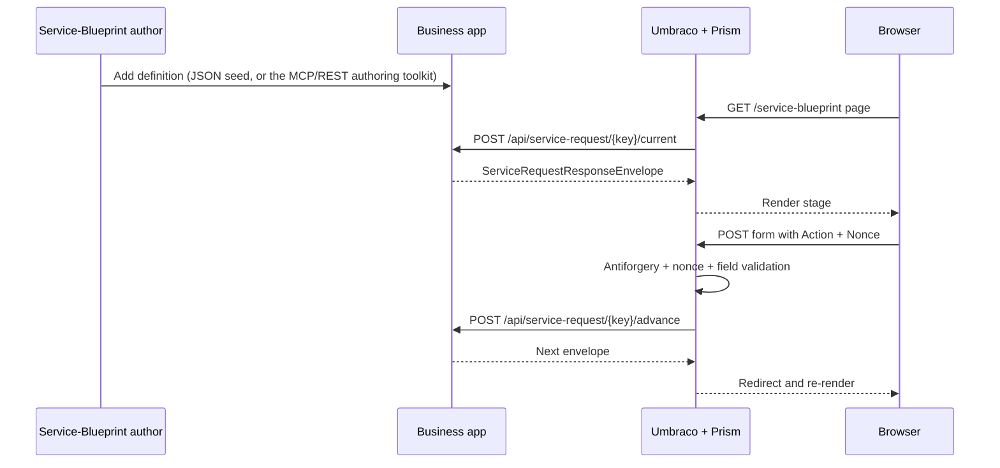

# Building a service blueprint with Umbraco.Prism

This guide tells the shortest complete story for implementing your own service blueprint: define it, expose it from a business app, wire Prism into Umbraco, and let the package handle rendering and validation.

## The happy path

## 1. Start with a real definition

A service blueprint is `queues` (who's involved), `stages` (each owning its own `routes`), and `gateways` (first-class Split/Join routing nodes — a stage's routes must always target a gateway, never another stage directly). See the
[Reference Service Blueprint Contract](../guides/reference-service-blueprint-contract.md) for the full authoring schema; this guide doesn't repeat it.

Good example seeds live in `src/UmbracoPrism.MockBusinessApp/service-blueprints/`:

- `community-enquiry.json` — two-queue applicant/reviewer flow with an approval loop
- `information-request.json` — two-queue, SLA-driven review flow
- `payment-demo.json` — two-queue, Split **and** Join gateways, a payment flow
- `planning-notification.json` — a planning variant
- `money-modeller.json` — the fullest example: declarative calculations, live components

If you prefer authoring through a toolkit rather than hand-writing JSON, see [AI-Ready Service Blueprint Authoring](../guides/ai-service-blueprint-authoring.md) — the same MCP/REST toolkit a human editor or an AI agent both use.

## 2. Decide what belongs in Prism and what belongs in your business app

| Concern | Owned by |
| --- | --- |
| Service blueprint stages, routes, gateways, reviewer logic, domain rules | Your business app |
| Rendering GOV.UK form shells and components | Prism |
| Authenticating the Umbraco member and forwarding bearer tokens | Prism |
| Field structure validation and tamper-proofing | Prism |
| Sanitizing authored HTML content before render | Prism |

Prism is intentionally not your case-management engine. It is the web package that hosts and protects the journey.

## 3. Expose the three business-app endpoints

The demo app maps these in `src/UmbracoPrism.MockBusinessApp/Program.cs`:

- `POST /api/service-request/{blueprintKey}/current`
- `POST /api/service-request/{blueprintKey}/advance`
- `GET /api/service-request/instances`

The contract is deliberately small:

- **Current** returns the user's current instance or creates one according to `requestPolicy`.
- **Advance** validates action + state version and returns the next envelope.
- **Instances** powers the service request hub and prompt-mode resume experience.

If you're hosting `Wayfinder.Engine` yourself (as `MockBusinessApp` does), you get this contract for free — implement it directly only if you're integrating an existing system without adopting the engine.

## 4. Register Prism in Umbraco

In Umbraco, call `builder.AddPrismProcessManager()` (`UmbracoPrism.Core.Extensions.ServiceDesignBuilderExtensions`) so Prism can register:

- `IBusinessAppProcessManagerClient`
- `IStageNonceService`
- `IServiceRequestFieldValidator`
- `IServiceContentSanitizer`
- `PrismServiceDesignOptions`

Then configure the business-app base URL via `PrismBusinessApp:ApiBaseUrl`.

## 5. Create a service blueprint page

Prism seeds a `stagePage` document type with a `blueprintKey` property. A page instance only needs to point at the service blueprint key you authored.

On GET, the package controller:

1. reads `blueprintKey` from the current page,
2. requests the current envelope from the business app,
3. optionally pre-populates fields,
4. caches authoritative field definitions behind a nonce,
5. renders the matching shell.

`src/UmbracoPrism.TestSite/Controllers/StagePageController.cs` shows the common extension point: overriding `PrePopulateFields()` to set `DefaultValue` and `ReadOnly` from authenticated member claims.

## 6. Let the package handle the POST round-trip

The important thing to understand is that Prism does not trust the browser submission.

Before advancing, Prism validates:

- antiforgery token,
- safe return URL,
- nonce existence and expiry,
- field whitelist,
- required fields,
- option membership,
- length / range / regex / date constraints,
- conditional visibility rules.

After that, your business app can apply domain-specific rules. The mock business app demonstrates this with a technical-support message rule that can return `validation_error` and a `ServiceRequestProblem` without advancing the instance.

## 7. Add the service request hub when your journey can be resumed

`serviceRequestHub` is the companion page for resumable service blueprints. It lists active and completed instances and resolves the correct `stagePage` URL for each instance by matching `blueprintKey`.

This matters most when you use:

- `requestPolicy = "multiple"` — users can have several live requests.
- `requestPolicy = "prompt"` — Prism shows an instance picker before starting a new request.
- waiting Join gateways / review stages — users need somewhere obvious to come back to later.

## Recommended reading after this

- [Backend authoring and contracts](./service-request-forms-engine-backend.md)
- [Umbraco integration](./service-request-forms-engine-umbraco.md)
- [Service Request Hub and conditional fields](./service-request-hub-and-conditional-fields.md)
