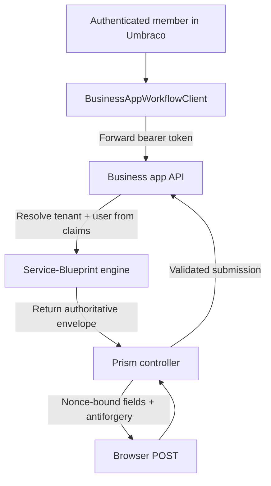

# Service Blueprint security and tenant isolation

Prism service blueprints are designed so Umbraco can host the journey without becoming the source of truth for identity, state transitions, or trusted field definitions.

## Security model in one view

## Core guarantees

### 1. Identity is forwarded, not copied

`BusinessAppWorkflowClient` forwards the authenticated member's bearer token. The business app then resolves tenant and user from claims, rather than trusting tenant/user identifiers in the request body.

Sources:

- `src/UmbracoPrism.Core/Services/BusinessAppWorkflowClient.cs`
- `src/UmbracoPrism.MockBusinessApp/Program.cs`

### 2. Instance ownership is re-checked server-side

`BusinessAppProcessManager` compares the requested instance's tenant and user against the current caller before returning or advancing it.

This is what protects resumed service blueprints, hub links, and prompt-mode instance picking from cross-user leakage.

### 3. Form structure is protected with a nonce

Prism never trusts the browser to describe the form it rendered. It stores authoritative field definitions in distributed cache and validates POSTs against them.

Sources:

- `src/UmbracoPrism.Core/Services/ServiceDesign/TouchpointNonceService.cs`
- `src/UmbracoPrism.Core/Services/ServiceDesign/ServiceRequestFieldValidator.cs`

### 4. State transitions use optimistic concurrency

`StateVersion` is echoed in the form and must match the business app's current instance version before a transition succeeds.

That reduces lost updates and stale-tab problems.

### 5. Authored HTML is sanitized before render

Content components such as `body`, `details`, `inset-text`, and `notification-banner` must be sanitized before they reach `@Html.Raw`.

The default sanitizer allowlists a small GOV.UK-friendly subset of tags and safe URL schemes.

Source: `src/UmbracoPrism.Core/Services/Sanitization/WorkflowContentSanitizer.cs`

### 6. Service Desk endpoints stay a development tool

The mock business app includes development-only admin/test endpoints. They are useful for demos and tests, but they should not become your production operating model.

Keep any reviewer or admin surface behind your real authorization model.

## Production checklist

- Use a shared distributed cache for nonces.
- Keep business-app authorization claim-driven.
- Sanitize authored content before rendering it.
- Preserve `StateVersion` checks when reimplementing the engine.
- Keep service request hub URLs local and instance-scoped.
- Do not expose development reset/admin endpoints outside development.

## Security-relevant extension points

| Area | Safe customisation guidance |
| --- | --- |
| Pre-population | Only add server-known values; do it before nonce creation |
| Business app endpoints | Resolve tenant/user from token claims, not form data |
| Content rendering | Use the registered sanitizer for authored HTML |
| Multi-server hosting | Replace memory cache with a shared cache |
| Service Request Hub | Keep resume links local and tied to service blueprint ownership |

## Related docs

- [Validation](./service-blueprint-validation.md)
- [Umbraco integration](./service-request-forms-engine-umbraco.md)
- [Service Request Hub and conditional fields](./service-request-hub-and-conditional-fields.md)
