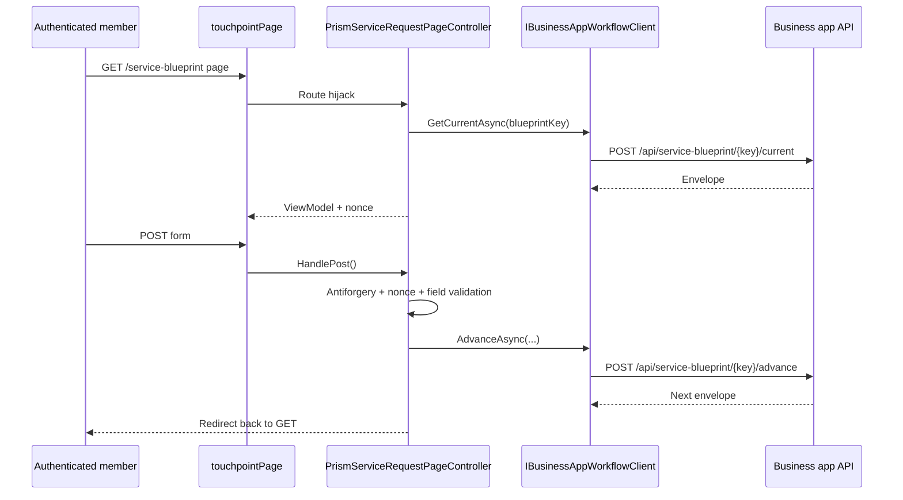

# Service Blueprint package integration in Umbraco

This guide covers the Umbraco-facing side of Prism service blueprints: service registration, seeded document types, route hijacking controllers, page setup, and the service request hub.

## Register the package services

`src/UmbracoPrism.Core/Extensions/WorkflowBuilderExtensions.cs` exposes `AddPrismWorkflowEngine()`.

That call registers:

- `IBusinessAppWorkflowClient`
- `ITouchpointNonceService`
- `IServiceRequestFieldValidator`
- `IServiceContentSanitizer`
- `PrismServiceDesignOptions`
- `IDistributedCache` (memory-backed by default)

### Configuration

| Setting | Purpose |
| --- | --- |
| `PrismBusinessApp:WorkflowApiBaseUrl` | Browser-facing service blueprint API base URL for the business app |
| `Prism:Service-Blueprint:NonceExpiry` | How long the nonce cache should keep field definitions |

For production, replace the default in-memory distributed cache with a shared backing store such as Redis or SQL Server.

## Seeded document types

`src/UmbracoPrism.Core/PrismContentTypeSeeder.cs` creates the document types Prism needs:

| Document type | Purpose |
| --- | --- |
| `touchpointPage` | Hosts a single service blueprint journey |
| `serviceRequestHub` | Lists active and completed service requests |

`touchpointPage` also gets a `blueprintKey` property. That key is the bridge between an Umbraco content node and a service blueprint in the business app.

## Route hijacking controller

`PrismServiceRequestPageController<TViewModel>` is the core integration point.

Responsibilities on GET:

1. read `blueprintKey` from the current content node,
2. call `GetCurrentAsync()`,
3. support prompt-mode `instance_picker`,
4. allow optional field pre-population,
5. generate the nonce bound to the rendered field definitions,
6. populate `PrismPrismServiceRequestViewModel`.

Responsibilities on POST:

1. validate antiforgery,
2. resolve and validate nonce-backed fields,
3. coerce posted values (including GOV.UK date inputs),
4. call `AdvanceAsync()`,
5. redirect back to GET.

## Common extension point: pre-populating from member claims

The TestSite controller is a good model because it is small and realistic:

```csharp
protected override ServiceRequestResponseEnvelope PrePopulateFields(ServiceRequestResponseEnvelope envelope)
{
    // Read authenticated claims and set DefaultValue / ReadOnly before nonce generation.
    return envelope;
}
```

See `src/UmbracoPrism.TestSite/Controllers/TouchpointPageController.cs` for the real implementation.

## Service Blueprint form tag helper

`prism-service-blueprint-form` is the form wrapper Prism expects. `PrismTouchpointFormTagHelper` writes:

- the antiforgery token,
- `InstanceId`,
- `StateVersion`,
- `BlueprintKey`,
- `ReturnUrl`,
- `Nonce`.

That means partial views can focus on fields and actions instead of rebuilding hidden plumbing on every step.

## Service Request Hub

`ServiceRequestHubController` powers the `serviceRequestHub` page. It:

- calls `GetInstancesAsync()`,
- splits active vs completed instances,
- resolves the matching `touchpointPage` by `blueprintKey`,
- appends `instanceId` for resumable journeys.

This is the piece that makes `multiple` and `prompt` instance policies user-friendly rather than purely technical.

## Request lifecycle in Umbraco



## What you usually customise

- Your service blueprint page content and information architecture in Umbraco
- A derived service blueprint view model with extra page data
- A derived service blueprint controller with claim/API-driven pre-population
- Optional view overrides for Prism partials when your site needs a different presentation

## What you usually should not customise first

- the nonce service,
- the field validator,
- the BusinessApp service blueprint client contract,
- the seeded document type aliases.

Start with the package defaults. They already encode the security and rendering rules the rest of the docs assume.
