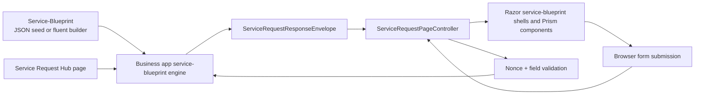

# Service Blueprint forms engine overview

Umbraco.Prism gives you a service blueprint rendering package for Umbraco sites that delegate state, transitions, and business rules to a separate business application. Prism owns the page plumbing, rendering, validation, and security boundaries; your business app owns the service blueprint and decides what happens next.

## What the package gives you

- A **service blueprint page** pattern built around `ServiceRequestPageController<TViewModel>`.
- A **service request hub** page that lists in-progress and completed instances.
- A **component-based service blueprint schema** (`Component`) shared between authored definitions and rendered payloads.
- Built-in **nonce-backed structural validation**, **optimistic concurrency**, and **HTML sanitization**.
- A thin **HTTP client** (`IBusinessAppProcessManagerClient`) that forwards the authenticated member token to your business app.

## Architecture

## The implementation story

1. **Author a definition** as `ServiceBlueprint` JSON (see the [Reference Service Blueprint Contract](../guides/reference-service-blueprint-contract.md)), or through the [MCP/REST authoring toolkit](../guides/ai-service-blueprint-authoring.md).
2. **Expose service request endpoints** in the business app (`/api/service-request/{blueprintKey}/current`, `/advance`, `/instances`).
3. **Register Prism service blueprint services** in Umbraco with `builder.AddPrismProcessManager()`.
4. **Create a `stagePage` node** and set its `blueprintKey` property.
5. **Let Prism do the web work**: GET current stage, render components, validate POSTs, then round-trip back to the business app.

The rest of this doc set expands each step in order.

## Canonical vocabulary

| Term | Meaning in the current package |
| --- | --- |
| Service Blueprint | A `ServiceBlueprint` with a key, queues, stages, gateways, and a request policy |
| Stage | A `StageDefinition` keyed by `stageKey`, owning its own `routes` and authored `Component` values |
| Gateway | A `ServiceBlueprintGatewayDefinition` — a first-class Split/Join routing node; a stage's routes must always target a gateway, never another stage directly |
| Component | A polymorphic `Component` such as `fieldset`, `summary-list`, `waiting`, `body`, or `radio` |
| Step type | The shell Prism renders: `question`, `check-answers`, `confirmation`, `status-timeline`, or `task-list` |
| Response state | What the client should do next: usually `render`, `defer`, `complete`, or `error` |
| Request policy | Whether a service blueprint is single-instance, multi-instance, or prompt-on-reentry (`requestPolicy`) |

## Step types

Prism infers step type from the authored components in a state.

| Step type | Inferred when the state contains | Typical use |
| --- | --- | --- |
| `question` | Regular interactive inputs or informational content without a specialised shell | Data collection |
| `check-answers` | `SummaryListComponent` | Final review before submit |
| `confirmation` | `PanelComponent` | End state / success page |
| `status-timeline` | `WaitingComponent`, or a read-only shell with no actions | Processing / review status |
| `task-list` | `TaskListComponent` | Multi-task journeys |

Source: `Extensions/PrismComponentExtensions.cs` in [`jonnymuir/Wayfinder`](https://github.com/jonnymuir/Wayfinder).

For waiting journeys, the envelope step type is still inferred from the waiting component, but the Razor layer promotes that state to the dedicated `waiting` shell when waiting metadata is present.

## Response states you should design for

| Response state | Meaning | Common source |
| --- | --- | --- |
| `render` | Render the returned step immediately | Question and check-answers states |
| `defer` | Stay on a waiting/status step and poll again after `PollAfterMs` | `WaitingComponent` |
| `complete` | Show the completion shell | Confirmation states |
| `error` | Fatal problem — definition missing, access denied, etc. | Client or engine error paths |

The demo business app currently adds two useful extensions:

- `instance_picker` when `requestPolicy = "prompt"` and the user already has an active instance.
- `validation_error` when domain rules fail after structural validation has already passed.

## Component families

- **Containers:** `fieldset`, `accordion`, `summary-list`, `task-list`
- **Inputs:** `text`, `number`, `decimal`, `select`, `radio`, `checkboxlist`, `date`, `email`, `textarea`, `boolean` (plus `tel` in the fluent builder)
- **Content:** `body`, `heading`, `inset-text`, `warning-text`, `details`, `notification-banner`, `panel`, `waiting`

The important shift is that authored definitions and rendered payloads now tell the same story: service blueprints are component trees, not ad-hoc field-group dumps.

## Where to go next

- Want the first implementation path? Read [Building a service blueprint](./service-request-forms-engine-demo.md).
- Need the exact schema and payload rules? Read [Backend authoring and contracts](./service-request-forms-engine-backend.md).
- Wiring Prism into Umbraco? Read [Umbraco integration](./service-request-forms-engine-umbraco.md).
