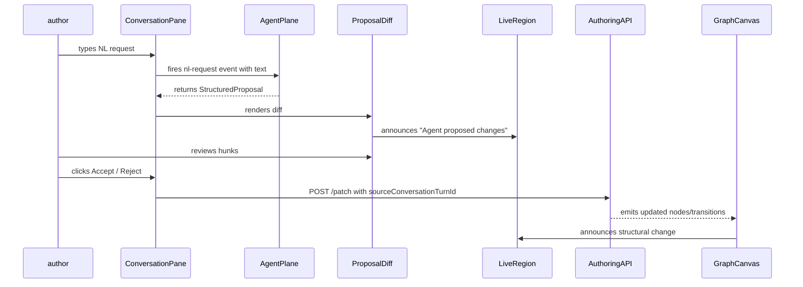

# Workflow Editor V1 — Authoring UX

**Author:** Isabelle (Frontend Dev & Accessibility Lead)  
**Date:** 2026-05-16  
**Status:** Draft  
**Relates to:** `docs/design/workflow-editor-v1/README.md` (three-plane architecture, Tom Nook)

---

## 1. Purpose & Scope

This document specifies the Authoring plane UX for V1 of the Prism workflow editor. It describes what a human author sees, how they navigate and edit a workflow, how agent proposals surface as reviewable diffs, and what accessibility requirements the editor must meet. It does not cover the Projection plane (Blathers) or Agent plane infrastructure (Tangy); those are detailed in their respective sections of README.md. Cross-cutting contracts — the `WorkflowDefinitionFile` shape, projection rules, and structured diff format — are also defined in README.md. Read that document first for the full three-plane architecture context.

---

## 2. Editor Surfaces

The editor is a single-page workspace composed of four surfaces arranged in a persistent shell. Each surface is independently scrollable and optionally collapsible to give more space to the active focus.

```
┌──────────────────────────────────────────────────────────────────────┐
│  Toolbar: workflow name · status badge · save button · undo/redo     │
├────────────────────────┬─────────────────────────────────────────────┤
│                        │                                             │
│   Graph Canvas         │   Step Inspector  (right panel, ~360px)    │
│   (primary, flex)      │                                             │
│                        │   ─────────────────────────────────────    │
│                        │   Conversation Pane (bottom of right panel) │
├────────────────────────┴─────────────────────────────────────────────┤
│   Preview Pane  (collapsible strip at bottom, expands to full-screen) │
└──────────────────────────────────────────────────────────────────────┘
```

### 2.1 Graph Canvas

The graph canvas renders the workflow as a directed state-machine graph: **nodes = states**, **edges = transitions**.

**Visual conventions:**

| Node type | Visual treatment |
|---|---|
| `question` | Rectangle, left-border accent (GDS blue) |
| `check-answers` | Rectangle, double border |
| `confirmation` | Rounded rectangle, GDS green accent |
| `task-list` | Rectangle, stacked-card shadow |
| `waiting` | Dashed border, clock icon |
| `status-timeline` | Rectangle, timeline icon |

Transitions are directed arrows labelled with the transition event name (e.g. `submit`, `approve`, `reject`). Conditional transitions are marked with a diamond. Nodes in the **front stage** (public/member-facing) are rendered in the upper lane; **back stage** (reviewer/system/business-app) nodes in the lower lane. A horizontal lane divider with label "Front stage / Back stage" is always visible.

**Pan and zoom:**

- Mouse wheel / trackpad pinch-to-zoom, range 25%–200%.
- Click-drag on canvas background to pan.
- `+` / `-` keys (with canvas focused) to zoom in/out.
- `0` key to reset to fit-to-viewport.
- Minimap (toggle `M`) in bottom-right corner for spatial orientation in large graphs.

**Keyboard-first navigation (see also §4):**

- `Tab` cycles through nodes in document order (top-left to bottom-right, front-stage before back-stage).
- `Arrow keys` navigate between spatially adjacent nodes (up/down crosses the lane boundary).
- `Enter` opens the Step Inspector for the focused node.
- `Esc` returns focus to the canvas from the Inspector.
- `Space` on a focused node selects/deselects it without opening the Inspector.
- `Delete` / `Backspace` on a selected node opens a confirmation dialog before removal.
- `Ctrl+Z` / `Ctrl+Shift+Z` undo/redo (also `Cmd` on macOS).

**Connecting states:**

- Drag from a node's output port to another node's input port to create a transition.
- Keyboard equivalent: focus source node → `Shift+Enter` to enter "connect mode" → `Arrow keys` to move a virtual cursor to the target node → `Enter` to confirm, `Esc` to cancel.

### 2.2 Step Inspector

The Step Inspector is a right-panel form that surfaces the selected state's properties. It opens when the user presses `Enter` on a focused graph node, clicks a node, or clicks a row in the Linear List View (§4.1).

**Inspector anatomy:**

```
┌──────────────────────────────────────────┐
│  [←] Back  |  Step Inspector             │
│  ─────────────────────────────────────── │
│  Name: [_________________________]        │
│  Component type: [question ▾]             │
│  ─────────────────────────────────────── │
│  ▼ Fields                                │
│    + Add field                            │
│    [field list rows]                      │
│  ─────────────────────────────────────── │
│  ▼ Validation                            │
│    Required / conditional rules           │
│  ─────────────────────────────────────── │
│  ▼ Role gating                           │
│    Visible to: [public ▾] [member ▾]     │
│    Editable by: [reviewer ▾]             │
│  ─────────────────────────────────────── │
│  ▼ Transitions (outgoing)                │
│    submit → check-answers                 │
│  ─────────────────────────────────────── │
│  [Provenance] (collapsed by default)     │
└──────────────────────────────────────────┘
```

**Component type** selector is a `<select>` with options: `question`, `check-answers`, `confirmation`, `task-list`, `waiting`, `status-timeline`. Changing the type triggers a warning if the field inventory is incompatible and shows the inferred shell in the Preview Pane. The editor never asks the author to specify the shell directly — it is inferred and shown as feedback only.

**Fields** sub-section shows a sortable, drag-reorderable list. Each field row exposes: label, field type (text/textarea/radios/checkboxes/date/select), required toggle, conditional-reveal parent (optional).

**Validation** sub-section shows field-level and cross-state validation rules in workflow terms, not schema terms (e.g. "reviewer action has no actor" rather than "transitions[2].actor undefined").

**Role gating** specifies which Prism roles can view and edit this step. Dropdowns are multi-select and populated from the workflow's declared actor roster.

**Provenance** section (collapsed by default): shows which agent proposed the current state of each field, with timestamp and accept/reject status. See §8 for full agentic detail.

### 2.3 Conversation Pane

The Conversation Pane is a collapsible panel anchored below the Step Inspector. It is the **primary surface for natural-language refinement and agentic interaction**. Authors type freeform requests; the agent responds with a structured proposal rendered as a diff.

**Anatomy:**

```
┌──────────────────────────────────────────┐
│  💬 Conversation                  [▲ ▼] │
│  ─────────────────────────────────────── │
│  [agent]  I've inserted an ID&V step     │
│           before "Final review". See     │
│           the diff below. ↓              │
│  ─────────────────────────────────────── │
│  [DIFF] +  id-verification (waiting)    │
│            → final-review                │
│         ~  final-review: added           │
│            inbound transition from id-v  │
│  [Accept all]  [Review step by step]     │
│  [Reject]                                │
│  ─────────────────────────────────────── │
│  [Type a message…]              [Send ↵] │
└──────────────────────────────────────────┘
```

**NL request examples the editor must handle:**

- "Insert an external ID&V step before the final review stage"
- "Make question 3 conditional on question 1 being answered 'Yes'"
- "Add a waiting state after submission and route the case to the housing team"
- "Generate a planning permission workflow with officer review and appeals"

Each request triggers the Agent plane, which returns a structured diff proposal. The editor renders the diff in the conversation thread as `<prism-proposal-diff>` (see §5). The diff is interactive — individual hunks can be accepted or rejected independently.

**Conversation history** persists for the lifetime of the authoring session and is attached to the workflow's provenance record so authors can trace which agent message produced each structural change.

### 2.4 Preview Pane

The Preview Pane renders the current authored state through Prism's actual rendering pipeline — the same shells (`question`, `check-answers`, `confirmation`, etc.) that public, member, and business-app users see.

**Modes:**

- **Collapsed strip** (default): shows the inferred shell name and a "Preview" button.
- **Inline panel** (expanded): renders the selected step's shell at ≈375px width with a surface selector (public / member / business-app).
- **Full-screen overlay**: triggered by the "Expand" icon or `F` key; shows the complete journey preview with next/back navigation between steps.

The preview is read-only. It updates automatically when the author saves a step change. It does not auto-update mid-edit to avoid confusion while edits are in flight.

---

## 3. Information Architecture

### 3.1 Surface Hierarchy

| Surface | Priority | Default state |
|---|---|---|
| Graph Canvas | Primary | Full-width, always visible |
| Step Inspector | Secondary | Opens on node select |
| Conversation Pane | Secondary | Collapsed (visible header) |
| Preview Pane | Tertiary | Collapsed strip |

The Graph Canvas is the primary orientation surface. The Step Inspector and Conversation Pane share the right rail; they are stacked vertically with the Inspector above. The Conversation Pane can be expanded to push the Inspector up or temporarily hide it via a split-pane resize handle.

### 3.2 Navigation Model

**Entry point:** The editor is reached from the Workflow Library (the list/browse surface, out of scope for V1 detail). The library passes a `workflowId` to the editor route.

**Within the editor:**

```
Workflow Library
  └─► Editor workspace  (route: /admin/workflow-editor/:id)
        ├─ Graph Canvas  (always visible)
        ├─ Step Inspector  (opens/closes in-place, no route change)
        ├─ Conversation Pane  (persistent, no route change)
        └─ Preview Pane  (in-place expand/collapse)
```

There is no nested routing within the editor in V1. State selection is held in component state, not the URL, to avoid disrupting the page during rapid navigation between nodes.

### 3.3 Mobile/Responsive Posture

Out of scope for V1 beyond **"readable on tablet"**: the editor is assumed to be a desktop-first tool used on screens ≥ 1024px wide. On tablet (768–1023px), the right rail collapses to a bottom sheet; the graph canvas takes full width. Portrait phone (< 768px) will display a "this editor is optimised for wider screens" notice. No functional restriction; an author can still edit, but the layout degrades gracefully rather than being redesigned.

---

## 4. Accessibility (WCAG 2.2 AA)

### 4.1 Dual-Mode Graph Navigation

Graph canvases are notoriously difficult for assistive technology. A pure SVG/canvas graph with drag-and-drop interactions is not operable by keyboard alone in a meaningful way without deliberate engineering. V1 adopts a **dual-mode** approach:

- **Visual graph mode** — the default canvas view. Keyboard navigable via Tab/Arrow/Enter/Esc (§2.1). Full keyboard operability of all graph operations.
- **Linear list view** — a parallel, accessible table/list representation of the same graph, toggled by pressing `L` or clicking the "List view" button in the toolbar. Each row is a state with its properties visible inline. Authors can read, edit (opens the Inspector), reorder, and delete states from this view. Screen readers should default to this view being announced as the primary structure.

Both modes always display the same data. Switching between them is instant (no data loss). The toggle button has `aria-pressed` reflecting the current mode. WCAG criterion: **2.1.1 Keyboard**, **2.1.2 No Keyboard Trap**.

### 4.2 Keyboard-Only Graph Navigation Rules

| Key | Context | Action |
|---|---|---|
| `Tab` | Canvas focused | Move focus to next node (document order) |
| `Shift+Tab` | Canvas focused | Move focus to previous node |
| `Arrow keys` | Node focused | Move focus to spatially adjacent node |
| `Enter` | Node focused | Open Step Inspector for this node |
| `Esc` | Inspector open | Close Inspector; return focus to node |
| `Shift+Enter` | Node focused | Enter "connect mode" |
| `Arrow keys` | Connect mode | Move virtual cursor to target |
| `Enter` | Connect mode | Confirm transition |
| `Esc` | Connect mode | Cancel; return focus to source node |
| `Space` | Node focused | Toggle selection without opening Inspector |
| `Delete` | Node selected | Open removal confirmation dialog |
| `Ctrl+Z` | Anywhere | Undo |
| `Ctrl+Shift+Z` | Anywhere | Redo |
| `L` | Canvas | Toggle linear list view |
| `M` | Canvas | Toggle minimap |
| `0` | Canvas | Fit graph to viewport |
| `F` | Preview strip | Expand preview to full screen |

WCAG criterion: **2.1.1 Keyboard**.

### 4.3 Focus Management Rules

**Opening the Step Inspector:**
- Focus moves to the Inspector panel's first interactive element (the Name field).
- Focus is trapped within the Inspector while it is open if the author used keyboard to open it.
- If the author clicked a node to open the Inspector, focus is not trapped (mouse users can click anywhere).

**Agent proposal diff dialog:**
- When an agent proposal arrives, an ARIA live region (role="status") announces: "Agent has proposed changes. Review in the Conversation pane." — this does not move focus.
- If the author explicitly opens the diff dialog (e.g. clicks "Review"), focus moves to the first hunk of the diff.
- Focus is trapped within the diff dialog using the WAI-ARIA dialog pattern.
- Accepting or rejecting all hunks moves focus back to the Conversation Pane input.
- `Esc` dismisses without accepting; focus returns to the element that opened the dialog.

WCAG criterion: **2.4.3 Focus Order**, **3.2.2 On Input**.

**Modal dialogs (delete confirmation, etc.):**
- Standard WAI-ARIA dialog pattern: `role="dialog"`, `aria-modal="true"`, `aria-labelledby`, focus trap on open, focus restored on close.

### 4.4 Screen Reader Semantics for the Graph

**Linear list view** (primary AT surface):
```html
<section aria-label="Workflow states">
  <table role="grid" aria-label="Workflow states — 6 rows">
    <thead>…</thead>
    <tbody>
      <tr data-node-id="question-1" aria-selected="false">
        <td>Project details</td>
        <td>question</td>
        <td>Front stage</td>
        <td><button aria-label="Edit Project details step">Edit</button></td>
      </tr>
      …
    </tbody>
  </table>
</section>
```

**Visual graph nodes** each have:
```html
<div
  role="button"
  tabindex="0"
  aria-label="Project details — question — Front stage"
  aria-description="Transitions: submit → Check answers"
  aria-selected="false"
  data-node-id="question-1"
  data-node-type="question"
  data-node-stage="front"
>
```

**Structural change announcements** use an ARIA live region:
```html
<div role="status" aria-live="polite" aria-atomic="true" class="sr-only" id="graph-announcer">
  <!-- Updated by JS: "Step 'ID verification' added between 'Submit application' and 'Final review'." -->
</div>
```

Every structural change (node add, remove, reorder, transition change) announces via this region. WCAG criterion: **4.1.3 Status Messages**, **1.3.1 Info and Relationships**.

### 4.5 Visible Focus Indicators

All interactive elements in the editor must have a visible focus indicator that meets the enhanced WCAG 2.2 AA criterion **2.4.11 Focus Appearance**:

- Minimum area: perimeter of the element × 2px.
- Minimum contrast: 3:1 between focused and unfocused states.

For graph nodes, which are rendered over a variable canvas background, the focus indicator uses a 3px solid `#0b0c0c` (GDS black) outline with a 2px `#ffdd00` (GDS yellow) offset — the GDS standard focus style. This combination maintains contrast against both the white canvas and any coloured lane backgrounds. WCAG criterion: **2.4.11 Focus Appearance**.

### 4.6 axe-core in Storybook

Every editor Web Component listed in §5 must have a Storybook story with axe-core enabled:

```ts
// In each *.stories.ts file:
export default {
  title: 'Workflow Editor/…',
  parameters: {
    a11y: {
      config: {
        rules: [
          { id: 'color-contrast', enabled: true },
          { id: 'aria-required-children', enabled: true },
        ],
      },
    },
  },
};
```

axe-core violations must be zero at the `critical` and `serious` levels before any component is considered shippable. Moderate issues must be documented as known exceptions with rationale. WCAG criterion: **4.1.2 Name, Role, Value**.

### 4.7 Colour Contrast Requirements

| Context | Minimum ratio | WCAG criterion |
|---|---|---|
| Body text on canvas | 4.5:1 | 1.4.3 Contrast (Minimum) |
| Node label text | 4.5:1 | 1.4.3 |
| Transition arrow labels | 4.5:1 | 1.4.3 |
| Lane divider label | 3:1 | 1.4.3 (large text) |
| Focus indicator vs background | 3:1 | 2.4.11 Focus Appearance |
| Diff added/removed highlights | 3:1 | 1.4.11 Non-text Contrast |

The editor **must not** use colour alone to distinguish front-stage from back-stage lanes. The lane label text and position must be the primary differentiator; colour is additive. WCAG criterion: **1.4.1 Use of Colour**.

---

## 5. Component Inventory

All components live in `src/UmbracoPrism.Client/src/workflow-editor/`. Each is a Lit-based custom element extending `UmbElementMixin(LitElement)` following the existing backoffice pattern.

| Component | Responsibility | Storybook required |
|---|---|---|
| `<prism-workflow-graph>` | SVG/canvas state-machine graph; pan/zoom; node/edge rendering; keyboard nav; fires node-select, node-delete, transition-create events | ✅ |
| `<prism-graph-node>` | Individual state node rendered within the graph; accepts type, label, stage, selected, focused props; manages its own ARIA attributes | ✅ |
| `<prism-linear-list>` | Accessible table/list alternative to the graph; same data, keyboard-operable, screen-reader-first | ✅ |
| `<prism-step-inspector>` | Right-panel form for editing a selected state's properties; fires patch-step events | ✅ |
| `<prism-field-editor-row>` | Single field row within the Inspector; handles label, type, required, conditional-reveal controls | ✅ |
| `<prism-conversation-pane>` | NL chat interface; renders conversation history; hosts `<prism-proposal-diff>` inline; fires nl-request events | ✅ |
| `<prism-proposal-diff>` | Renders a structured diff proposal from the agent; supports hunk-level accept/reject; announces changes via live region | ✅ |
| `<prism-workflow-preview>` | Renders a step's inferred shell through the actual Prism rendering pipeline in an iframe or shadow-DOM isolated view; surface selector (public/member/business-app) | ✅ |
| `<prism-workflow-toolbar>` | Top bar: workflow name, status badge, save button, undo/redo, view toggles | ✅ |
| `<prism-provenance-badge>` | Small inline badge showing who (human/agent) last modified a field, when, and with what rationale | ✅ |

---

## 6. Interaction Patterns

### 6.1 Graph Canvas

| Interaction | Mouse | Keyboard |
|---|---|---|
| Select node | Click node | `Tab` to node, `Space` |
| Open Inspector | Click node | `Enter` on selected node |
| Create transition | Drag output port → input port | `Shift+Enter` → Arrow → `Enter` |
| Delete node | Select + Delete key or node context menu → Delete | `Delete` key when node focused |
| Pan canvas | Click-drag background | N/A (minimap navigation) |
| Zoom | Scroll wheel / pinch | `+` / `-` |
| Fit to view | Double-click background | `0` |
| Toggle list view | "List view" button | `L` |

**Undo/redo:** Full graph operation history. Each operation is a discrete undo unit: add node, delete node, edit field, create transition, delete transition, accept diff hunk. Undo history is per-session; it is not persisted across page reloads in V1.

**Autosave vs explicit save:** V1 uses **explicit save** only. The toolbar Save button is the only write path. A dirty-state indicator (unsaved badge) appears next to the workflow name when there are uncommitted local changes. The editor will warn before navigating away with unsaved changes (using `beforeunload` + a custom confirmation dialog).

### 6.2 Step Inspector

| Interaction | Behaviour |
|---|---|
| Change component type | Shows confirmation if incompatible fields exist; updates preview immediately after confirm |
| Reorder fields | Drag-to-reorder; keyboard: focus a row handle, `Arrow keys` to move |
| Add field | "Add field" button → inline form row expands in place; Tab through to fill |
| Delete field | Trash icon on row; confirm with inline popover (not a full dialog) |
| Edit transition | Click transition row → inline edit popover for event name and target state |

### 6.3 Conversation Pane

| Interaction | Behaviour |
|---|---|
| Submit NL request | Type in input, press `Enter` or click Send | 
| Receive diff proposal | Diff appears inline; live region announces; no focus move |
| Accept all | Applies all hunks; announces "Changes applied"; closes diff; updates graph |
| Reject | Dismisses diff; announces "Proposal rejected"; input focus returns |
| Review step by step | Opens diff dialog; focus moves to first hunk; Tab through each hunk |
| Accept/reject per hunk | Inline buttons in diff dialog; ARIA-labelled with the change description |

### 6.4 Preview Pane

| Interaction | Behaviour |
|---|---|
| Expand inline | Click "Preview" button → pane grows to ~400px height |
| Full-screen preview | Click expand icon or press `F` → full-screen overlay |
| Navigate steps in preview | Previous/Next buttons in full-screen; shows complete journey |
| Change surface | Tabs: Public / Member / Business-app |
| Close full-screen | `Esc` or Close button; focus returns to the element that opened it |

---

## 7. Authoring Model Hooks (UI Side)

The editor consumes a JSON-over-HTTP API from the Authoring plane. These are the shapes the editor needs; Blathers owns the implementation.

### 7.1 Load Workflow

```
GET /api/workflow-editor/{id}
→ {
    id: string,
    name: string,
    version: number,
    isDirty: boolean,
    nodes: WorkflowNode[],
    transitions: WorkflowTransition[],
    actorRoster: Actor[],
    provenance: ProvenanceRecord[]
  }
```

### 7.2 Apply Patch

```
POST /api/workflow-editor/{id}/patch
Body: {
  patch: WorkflowPatch,        // structured diff/operation
  sourceConversationTurnId?: string  // if agent-proposed
}
→ {
    success: boolean,
    validationErrors: ValidationError[],
    updatedNodes?: WorkflowNode[],
    updatedTransitions?: WorkflowTransition[]
  }
```

The UI applies patches optimistically and rolls back on failure.

### 7.3 Request Validation

```
POST /api/workflow-editor/{id}/validate
Body: { scope: 'full' | 'node', nodeId?: string }
→ {
    valid: boolean,
    errors: ValidationError[]   // in workflow terms, not schema terms
  }
```

Validation is triggered: on save, when a diff is previewed, on demand via a "Validate" toolbar button.

### 7.4 Request Preview Render

```
POST /api/workflow-editor/{id}/preview
Body: { nodeId: string, surface: 'public' | 'member' | 'business-app' }
→ {
    html: string,               // rendered shell HTML
    inferredShell: ComponentType
  }
```

The editor renders the returned HTML inside `<prism-workflow-preview>` in an isolated context.

### 7.5 Save

```
PUT /api/workflow-editor/{id}
Body: { nodes, transitions, actorRoster }
→ { version: number, savedAt: string }
```

---

## 8. Agentic Integration (UI Surfaces Only)

### 8.1 NL Request → Structured Proposal Flow



The UI never applies agent changes silently. Every agent-proposed change must pass through `<prism-proposal-diff>` and require an explicit author action. This is a hard requirement, not a soft guideline.

### 8.2 Proposal Diff Rendering

`<prism-proposal-diff>` renders a structured diff in a format readable by both humans and screen readers:

```html
<prism-proposal-diff
  data-proposal-id="prop-abc123"
  data-turn-id="turn-7"
>
  <div role="group" aria-label="Proposed change 1 of 3">
    <p class="diff-summary">Add state: "ID verification" (waiting) after "Submit application"</p>
    <div class="diff-hunk diff-hunk--add" role="img" aria-label="New state: ID verification">
      + id-verification (waiting) → final-review
    </div>
    <button aria-label="Accept: Add ID verification state">Accept</button>
    <button aria-label="Reject: Add ID verification state">Reject</button>
  </div>
</prism-proposal-diff>
```

Each hunk is independently accept/rejectable. Accepting a hunk immediately updates the graph and announces the change. Partial acceptance is valid; the agent's provenance record notes which hunks were accepted, rejected, or modified.

### 8.3 Per-Step Provenance

The Step Inspector's collapsed **Provenance** section (§2.2) shows, for each field and the node as a whole:

```
[Agent: Copilot]  Added 2026-05-16T13:20:33  via turn #7
Rationale: "Inserted per author request: 'add ID&V before final review'"
Status: Accepted
```

Provenance is read-only in the Inspector. Authors can only modify the field value, not the provenance record itself.

### 8.4 Accept / Edit-then-Accept / Reject Flows

| Flow | UI action | Result |
|---|---|---|
| Accept all | "Accept all" button in Conversation Pane | All hunks applied; provenance records each as accepted |
| Reject | "Reject" button | No changes applied; provenance records as rejected; agent acknowledges in conversation thread |
| Review step by step | "Review step by step" button | Opens diff dialog; author can accept/reject per hunk or edit a field value before accepting |
| Edit-then-accept | Accept a hunk → immediately open Inspector for affected node | Author makes fine-grained edits on top of the accepted change |

---

## 9. Open Questions

1. **Collaborative cursors / multi-user editing:** Deferred entirely from V1. The save model is last-write-wins. Conflict detection on save (version mismatch → warn + merge UI) is a V2 concern.

2. **Comments and annotation:** Authors cannot leave inline comments on graph nodes in V1. The Conversation Pane history serves as a proxy audit trail.

3. **Transition event name vocabulary:** Should the editor provide a constrained list of valid transition event names or allow free text? Currently free text; a constrained vocabulary would improve validation. Deferred.

4. **Offline/local draft:** Does the editor need to work without a live server connection? Deferred; V1 requires connectivity.

5. **Keyboard shortcut discoverability:** A `?` key shortcut to open a keyboard shortcuts overlay is planned but not specced here.

6. **Agent "thinking" state UI:** When the agent is processing an NL request, the Conversation Pane shows a loading indicator. Exact treatment (skeleton, spinner, progressive streaming) is not specced — Tangy and I need to align on the streaming contract.

7. **Undo across agent proposals:** If the author undoes to before an accepted proposal, does the provenance record revert too? Assumed yes, but the patch/undo model needs a formal spec.

8. **Transition labels on complex conditional branches:** The current design shows one label per edge. Multi-condition transitions may need a richer display. Deferred.

---

## 10. Test Hooks

The following `data-*` attributes are exposed on editor elements for Tangy's Playwright tests. These are stable contracts — changing them is a breaking change.

| Attribute | Element | Purpose |
|---|---|---|
| `data-testid="workflow-graph"` | `<prism-workflow-graph>` root | Top-level graph locator |
| `data-node-id="{id}"` | Each graph node | Node-specific locator |
| `data-node-type="{type}"` | Each graph node | Filter by component type |
| `data-node-stage="front\|back"` | Each graph node | Filter by stage lane |
| `data-testid="linear-list"` | `<prism-linear-list>` root | List view locator |
| `data-testid="step-inspector"` | `<prism-step-inspector>` root | Inspector locator |
| `data-testid="inspector-name-field"` | Name input in Inspector | Name editing |
| `data-testid="inspector-type-select"` | Component type select | Type change |
| `data-testid="conversation-pane"` | `<prism-conversation-pane>` root | Conversation locator |
| `data-testid="conversation-input"` | NL text input | Typing NL requests |
| `data-testid="conversation-send"` | Send button | Submitting requests |
| `data-proposal-id="{id}"` | `<prism-proposal-diff>` root | Proposal locator |
| `data-testid="proposal-accept-all"` | Accept all button | Bulk accept |
| `data-testid="proposal-reject"` | Reject button | Bulk reject |
| `data-hunk-id="{n}"` | Individual diff hunk | Per-hunk actions |
| `data-testid="hunk-accept"` | Per-hunk accept button | Hunk accept |
| `data-testid="hunk-reject"` | Per-hunk reject button | Hunk reject |
| `data-testid="preview-pane"` | `<prism-workflow-preview>` root | Preview locator |
| `data-testid="preview-surface-select"` | Surface selector tabs | Surface switching |
| `data-testid="toolbar-save"` | Save button in toolbar | Save action |
| `data-testid="toolbar-undo"` | Undo button | Undo action |
| `data-testid="toolbar-redo"` | Redo button | Redo action |
| `data-testid="toolbar-list-view"` | List view toggle | Mode toggle |
| `data-testid="graph-announcer"` | Live region div | Assert SR announcements |
| `data-dirty="true\|false"` | Toolbar root | Dirty state assertion |

**Example Playwright selector patterns:**

```ts
// Select a specific node
page.locator('[data-node-id="question-1"]')

// Find a node by type
page.locator('[data-node-type="waiting"]')

// Assert proposal rendered
page.locator('[data-proposal-id]').first()

// Assert screen reader announcement
await expect(page.locator('[data-testid="graph-announcer"]'))
  .toHaveText(/ID verification.*added/i)
```
