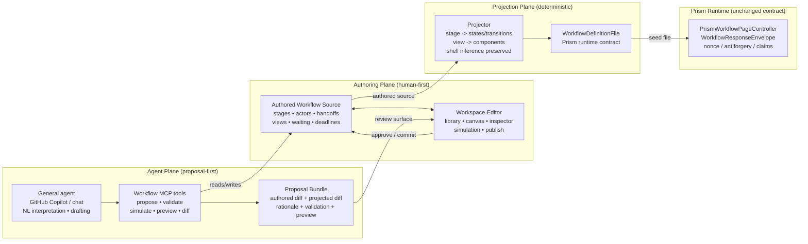

# Workflow Editor — First Iteration Design (V1)

- **Status:** Draft
- **Date:** 2026-05-16
- **Authors (Squad):**
  - Tom Nook — Lead (architecture, scope, handoffs)
  - Isabelle — UX (authoring experience)
  - Blathers — Runtime (projection, compatibility)
  - Brewster — Umbraco integration (content + backoffice topology)
  - Tangy — Agentic surfaces (proposal-first AI loop)

This document is the **spine**. It fixes the shared vocabulary, the three-plane architecture, the reference demo, and the cross-cutting contracts that each specialist section must respect. Specialist sections live alongside this file and are linked from the [Section Index](#8-section-index).

---

## 1. TL;DR

- **Three planes.** The editor is split into an **Authoring plane** (human-first model), a **Projection plane** (deterministic compiler to Prism's runtime contract), and an **Agent plane** (structured AI surfaces). The planes are independent products with stable contracts between them.
- **Planning application is the V1 reference.** It is the only end-to-end demo we promise to make excellent. Everything else — payment, enquiry, notification — keeps working but is not the design target.
- **Proposal-first agentic loop.** Every AI change is a structured **proposal bundle** (authored diff + projected diff + rationale + validation + preview). No agent ever mutates a live runtime instance.
- **Reuse, don't reinvent.** General natural-language interpretation, drafting, repo edits, and orchestration **lean on GitHub Copilot** and similar existing tools. Workflow-specific capabilities exist **only** where they add semantic value — workflow-aware transforms, safe projection, semantic diffing, and previews.
- **Authored model ≠ runtime contract.** Authors design **stages** (front stage / back stage, actors, handoffs, waiting, deadlines). `WorkflowDefinitionFile` is a *projection target*, not the editor's primary model.
- **Human-first, AI-co-authoring.** Human and agent edits meet in the same review surface — same diff, same validation, same provenance. AI is a co-author, not an autonomous editor.
- **Natural-language is a first-class entry point.** "Generate a workflow for X" and "insert external ID&V after the applicant declaration" are both supported by the same proposal/validate/preview loop.
- **Shell inference is preserved.** Projection emits components that continue to drive the existing `question` / `check-answers` / `confirmation` / `task-list` / `waiting` / `status-timeline` shells. No runtime regressions.

---

## 2. Goals & Non-Goals

### V1 is

- A **design spec** for an authored workflow model that is human-friendly and AI-tractable.
- A **deterministic projection** from authored stages to Prism's existing `WorkflowDefinitionFile` shape.
- A **proposal-first agent contract** (MCP-style tool surface) sufficient for the planning-application demo flows: generate from natural language, insert a new capability (external ID&V) at the right point, validate, preview, approve, re-project, commit.
- A **topology decision** on where authoring lives in the repo (Business App owns workflow authoring; Umbraco owns public/member shells; backoffice extension is a thin link/embed surface).
- A **reference walkthrough** on the planning application that every section can cite.

### V1 is not

- A live-runtime mutation API. Agents and editors never write to running instances; they emit definitions that re-seed.
- A replacement for the JSON / `/admin/workflow` developer surface. JSON stays as the advanced/debug view.
- A versioning, branching, or multi-tenant authoring product. Authored schema version is separate from workflow business version, but full lifecycle/rollback semantics are V2.
- A collaborative real-time editor. Single-author + proposal-based merge is the V1 collaboration model.
- A bespoke general-purpose agent platform. We do not rebuild what Copilot/MCP already do well.
- A workflow analytics or operational metrics surface.

---

## 3. Architecture Overview

Three planes. One authored source of truth. One runtime contract. One agent surface.



**Repo mapping (V1):**

| Plane | Lives in | Owns |
| --- | --- | --- |
| Authoring | `src/UmbracoPrism.MockBusinessApp/workflow-authoring/` (new) + workspace editor UI in the Business App | Authored sources, workspace editor, simulation/publish UX |
| Projection | `src/UmbracoPrism.Shared/Workflow/Projection/` (new) + existing `Models/Workflow/*` as the **target** | Pure functions: authored model → `WorkflowDefinitionFile`; validators |
| Runtime | `src/UmbracoPrism.Shared/Models/Workflow/*`, `src/UmbracoPrism.Core/Controllers/PrismWorkflowPageController.cs`, `src/UmbracoPrism.Core/Views/*` | Unchanged. Consumes projected seeds. |
| Agent | `src/UmbracoPrism.MockBusinessApp/workflow-agent/` (new): MCP server, skills, proposal artifacts under `workflow-authoring/.proposals/` | Tool surface, proposal bundles, provenance |
| Umbraco | `src/UmbracoPrism.Web/`, `src/UmbracoPrism.Core/` document types + a thin v17 backoffice extension | Public/member shells (`workflowPage`, `workflowHub`); link/embed to Business App editor |

---

## 4. Reference Demo: Planning Application

We anchor V1 on a **planning application** because it is the cheapest demo that forces every interesting capability into one flow:

- **Public initiation** — anonymous citizen starts an application (Umbraco public content → Prism `workflowPage`).
- **Optional member continuation** — sign in to save/resume; Brewster's member shell takes over.
- **Front stage capture** — multi-step questions, conditional reveal, check-answers, declaration, confirmation.
- **Hand-off to back stage** — case lands in the Business App for caseworker triage, validation, decision.
- **Waiting + deadlines** — applicant sees `waiting` / `status-timeline`; caseworker has SLA clocks.
- **External capability insertion point** — exactly where "insert external ID&V before submission" lands in the agent demo.
- **Outcomes** — approve / refuse / request-more-info, each with its own front-stage view.

### State-machine sketch (authored stages)

```
[public-start] --start--> [collect-applicant]
[collect-applicant] --continue--> [collect-site]
[collect-site] --continue--> [collect-proposal]
[collect-proposal] --continue--> [upload-evidence]
[upload-evidence] --continue--> [declaration]
[declaration] --submit--> [awaiting-triage]            (waiting, frontstage)
[awaiting-triage] --assign--> [caseworker-review]      (backstage)
[caseworker-review] --request-info--> [applicant-respond]
[applicant-respond] --resubmit--> [caseworker-review]
[caseworker-review] --decide--> [decision-issued]
[decision-issued] --notify--> [complete]
```

The agent demo inserts `[external-idv]` between `[declaration]` and `[awaiting-triage]`, with a back edge on failure to `[applicant-respond]`. Section 6 walks that through end-to-end.

---

## 5. End-to-End Walkthrough

This is the canonical narrative every section must support. Each step cites the specialist section that owns its detail.

1. **Human opens the planning workflow** in the workspace editor library and lands on the canvas (§01 Authoring UX — library + workspace).
2. **Human adds a "Proposal description" question** to the `collect-proposal` stage via the canvas + inspector. The authored source is updated; nothing else moves yet (§01).
3. **Projector runs on save**, deterministically emitting an updated `WorkflowDefinitionFile`. Shell inference picks `question` for the new state because the component shape is a `FieldsetComponent` with `InputComponent` children (§02 Projection; cf. `WorkflowDefinitionInferenceTests`).
4. **Prism renders the new shell** with no runtime code changes — the projected seed is dropped into `workflow-seeds/` and re-loaded (§02, §03 Umbraco integration).
5. **Human asks the agent** in natural language: *"Insert external ID&V after the applicant declaration; failures should route the applicant back to respond."* The general agent (GitHub Copilot or equivalent) interprets the request and calls the workflow MCP tools (§04 Agentic surfaces).
6. **Workflow-specific tooling** computes the correct insertion point (`declaration → ?`), drafts an authored-stage patch (new `external-idv` waiting stage + transition rewiring), runs the projector, and produces a **proposal bundle** with: structured authored diff, projected diff, rationale, target insertion point, validation results, and a preview of the affected applicant + caseworker journeys (§04).
7. **The proposal lands in the workspace review surface** — the same diff/validation UI a human uses (§01, §04). Validation is layered: authored schema + graph, projection compatibility, simulation of the planning journey, and a narrow Playwright walkthrough (§02, §04).
8. **Human refines conversationally** — "make the ID&V step skippable for already-verified members" — which produces a follow-up proposal layered onto the first (§04).
9. **Human approves.** The authored source is committed; the projector re-emits the runtime seed; Prism picks it up on next reload. Provenance (prompt, author, rationale, validation hashes) is written into the proposal artifact (§04).
10. **No live instances are mutated.** Existing in-flight planning cases continue on their projected definition snapshot; new cases pick up the new one. Migration semantics for in-flight cases are explicit V2 work (§02, §9).

---

## 6. Cross-Cutting Contracts

These are the **contracts between planes**. Each specialist section is free inside its plane, but must not break these.

### 6.1 Authoring → Projection contract

**Input shape (authored model, normative for V1):**

```jsonc
{
  "definitionKey": "planning-application",
  "displayName": "Planning application",
  "version": 1,
  "instancePolicy": "single",
  "actors":  [ /* public | member | reviewer | caseworker | system | <named> */ ],
  "stages":  [ /* StageDefinition (see Blathers §02) */ ],
  "handoffs":[ /* edges between stages, with action + actor */ ],
  "policies":[ /* named SLA / permission / routing policies */ ]
}
```

**Determinism guarantees the projector must hold:**

1. Pure function: same authored input ⇒ byte-identical `WorkflowDefinitionFile` (stable ordering of states, transitions, components).
2. No I/O, no clock, no randomness inside projection.
3. Errors are structured `WorkflowProblem`-shaped diagnostics with stage/path pointers — never thrown exceptions across the contract boundary.
4. Unknown authored fields are **rejected**, not silently dropped. Forward-compat is handled by explicit authored-schema migrations (Blathers §02).
5. Projection is total: every authored stage produces at least one runtime state; every authored handoff produces at least one transition.

### 6.2 Projection → Runtime contract

The projector's output **must** remain a valid `WorkflowDefinitionFile` as defined in `src/UmbracoPrism.Shared/Models/Workflow/WorkflowDefinitionFile.cs`. The following invariants are non-negotiable in V1:

- `definitionKey`, `initialState`, `instancePolicy`, `StateVersion` semantics preserved.
- Polymorphic `PrismComponent` tree as the only state body shape.
- **No authored `stepType`.** Step type is *inferred* from component shape via `PrismComponentExtensions.InferStepType()` — see `WorkflowDefinitionInferenceTests`. The projector must emit component shapes that infer correctly.
- Existing shell families remain authoritative: `question`, `check-answers`, `confirmation`, `task-list`, `waiting`, `status-timeline`.
- `WorkflowTransitionFile` (FromState, ToState, Action, RequiresRole) is the only transition shape.
- `WorkflowResponseEnvelope`, nonce, antiforgery, and claim-derived ownership behaviour are untouched.
- Operational truth (case status, assignment, deadlines, evidence manifests, ID&V records) lives in case/domain persistence — **not** in projected workflow field payloads (Blathers §02).

### 6.3 Agent ↔ Authoring contract

Every agent change is a **proposal bundle**, never a direct write to the authored source on the trunk. The bundle is the only artifact the workspace review surface needs to render a diff.

**Proposal artifact (normative):**

```jsonc
{
  "proposalId": "2026-05-16T13-20-33Z-insert-idv",
  "definitionKey": "planning-application",
  "intent": "insert-capability",
  "prompt": "Insert external ID&V after the applicant declaration...",
  "author": { "kind": "agent", "tool": "github-copilot", "skill": "workflow.insert-capability" },
  "targetInsertionPoint": { "afterStage": "declaration", "onAction": "submit" },
  "authoredDiff":  { /* structured patch over authored source */ },
  "projectedDiff": { /* structured patch over WorkflowDefinitionFile */ },
  "rationale": "Regulated planning submissions require identity assurance before triage...",
  "references": [ /* research notes, doc links */ ],
  "validation": { "authored": "pass", "projection": "pass", "simulation": "pass", "journeyTests": "pass" },
  "preview":    { "applicantJourney": "...", "caseworkerJourney": "..." },
  "createdAt":  "2026-05-16T13:20:33Z"
}
```

**Agent-plane rules:**

- No agent writes to live instances. Ever.
- No agent applies a proposal whose `validation` is red.
- Workflow-specific MCP tools (`propose_change`, `validate_workflow`, `simulate_workflow`, `preview_route`, `run_workflow_tests`, `apply_change`) are the only path. General agents call **these**; they do not invent workflow semantics from raw JSON.
- Natural-language generation and conversational refinement are first-class: a follow-up like *"make ID&V skippable for verified members"* is a new proposal layered on top, not a hidden mutation of the previous one.
- Provenance (prompt, author, rationale, validation results) is always recorded on the artifact.

### 6.4 Repo layout contract

| Concern | Path | Owner |
| --- | --- | --- |
| Authored sources | `src/UmbracoPrism.MockBusinessApp/workflow-authoring/<definitionKey>/authored.json` | Isabelle / Blathers |
| Projected runtime seeds | `src/UmbracoPrism.MockBusinessApp/workflow-seeds/<definitionKey>.json` | Blathers (generated) |
| Projector library | `src/UmbracoPrism.Shared/Workflow/Projection/` | Blathers |
| Agent proposals (durable) | `src/UmbracoPrism.MockBusinessApp/workflow-authoring/<definitionKey>/.proposals/` | Tangy |
| Agent MCP server + skills | `src/UmbracoPrism.MockBusinessApp/workflow-agent/` | Tangy |
| Umbraco shells | `src/UmbracoPrism.Web/`, `src/UmbracoPrism.Core/Views/` (unchanged) | Brewster |
| Backoffice extension (link/embed) | `src/UmbracoPrism.Web/App_Plugins/PrismWorkflowEditor/` | Brewster |

Projected files are **generated artifacts** under version control — they are diffable, but the authored source is the editable truth.

---

## 7. Section Index

| File | Author | One-liner |
| --- | --- | --- |
| [`01-authoring-ux.md`](./01-authoring-ux.md) | Isabelle | Three-layer UX — definition library, workspace editor (canvas + inspector + validation rail), simulation/publish — with front-stage/back-stage lanes and progressive disclosure. |
| [`02-runtime-projection.md`](./02-runtime-projection.md) | Blathers | Authored stage model, deterministic projection rules into `WorkflowDefinitionFile`, layered validation, and compatibility constraints that keep the existing Prism runtime untouched. |
| [`03-umbraco-integration.md`](./03-umbraco-integration.md) | Brewster | Repo topology — public/member journeys in Umbraco, workflow ownership in the Business App, and a thin v17 backoffice extension that links to (not re-implements) the editor. |
| [`04-agentic-surfaces.md`](./04-agentic-surfaces.md) | Tangy | Proposal-first agent loop: MCP tools, proposal bundle artifact, validation layers, and the explicit split between general agents (Copilot) and workflow-specific capabilities. |

---

## 8. Open Questions (V2)

Captured now so V1 can stay focused. None of these block V1; all of them want a decision before V2 scope is signed off.

1. **Versioning & lifecycle.** Authored-schema version vs workflow business version vs deployed-snapshot version — full draft/publish/retire/rollback semantics.
2. **In-flight instance migration.** What happens to live planning cases when the projected definition changes mid-flight? V1 says "new cases only"; V2 needs explicit migration steps.
3. **Multi-tenant authoring.** Multiple business apps, multiple tenants, scoped definition libraries, per-tenant overrides.
4. **Collaborative editing.** Real-time co-editing vs proposal-merge. V1 is single-author + proposals; V2 may need locking or CRDT-style merge.
5. **Operator backstage UI contract.** Whether backstage operator views stay inside Prism payloads or move to a dedicated operator UI contract (Blathers open decision #1).
6. **Permission expressiveness.** Named policies only vs inline role expressions (Blathers open decision #2).
7. **Routing authoring depth.** How much routing is declarative authored config vs delegated to business-app policy handlers (Blathers open decision #3).
8. **Task-list authorship.** Pure projection from stage dependencies vs optional hand-authored task-list ordering for editorial control (Blathers open decision #4).
9. **Agent autonomy ceiling.** When (if ever) can an agent auto-apply a green-validated proposal without a human in the loop, and for which change classes?
10. **Cross-workflow refactors.** Renaming an actor or policy across many definitions — out of scope for V1's single-workflow editor.

---

## 9. Iteration Plan

### V1 ships

- Authored stage model + JSON schema (Blathers §02).
- Deterministic projector authored → `WorkflowDefinitionFile`, with the planning application as the executable spec (Blathers §02).
- Workspace editor MVP: library, canvas with front-stage/back-stage lanes, inspector, validation rail, simulation + publish (Isabelle §01).
- Umbraco topology and backoffice link extension; planning public + member shells (Brewster §03).
- Workflow MCP server with the six core tools, proposal bundle artifact, provenance, and integration with GitHub Copilot as the general NL/agent surface (Tangy §04).
- Planning-application walkthrough as the reference end-to-end demo, including the **insert external ID&V** scenario, runnable from the agent surface and from the human workspace.

### V2 explores

- Items listed in §8 Open Questions, prioritised by: versioning/lifecycle → in-flight migration → operator backstage contract → multi-tenant → collaborative editing → agent autonomy ceiling.
- A second reference workflow (likely PASA death-process) to validate the contracts under a meaningfully different shape.

---

*The spine is fixed. The four specialist sections are free to evolve within these contracts; any change that crosses a plane boundary comes back here.* — Tom Nook
