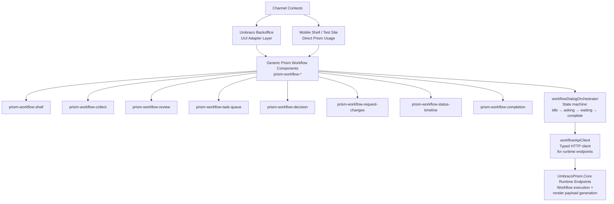
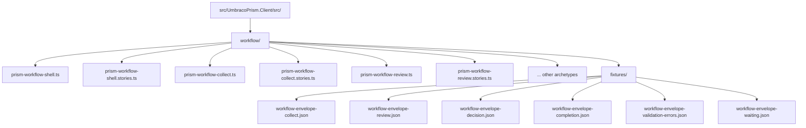

# Prism Workflow Forms Engine — Client Design

> **⚠️ v2.0 Schema Update:** Client architecture has been updated in v2.0 with polymorphic component rendering. Component partials now use `_Component-{Type}.cshtml` naming.

**Author:** Isabelle (Frontend Dev & Accessibility Lead)  
**Parent Proposal:** [workflow-forms-engine-demo.md](./workflow-forms-engine-demo.md)  
**Status:** Design for review  
**Date:** 2026-04-08

---

## 1. Component Architecture Overview

The Workflow Forms Engine client follows the **Hybrid adapter model** (Option C from the spec): a generic `prism-workflow-*` component layer that is channel-agnostic, with a thin adapter layer for UUI components in the backoffice.

### Architecture Diagram



### Layer Responsibilities

**Generic Prism Components (`prism-workflow-*`)**
- Consume `WorkflowRenderPayload` contract only
- No knowledge of workflow state machine internals
- Channel-agnostic styling via CSS custom properties
- WCAG 2.2 AA baseline accessibility
- Progressive disclosure patterns (GDS-inspired)

**Orchestrator (`workflowDialogOrchestrator`)**
- Owns lifecycle: `idle → creating → asking → submitting → waiting → polling → complete → error`
- Schedules polling for `wait` responses
- Enforces optimistic concurrency via `stateVersion`
- Emits `state-changed`, `workflow-complete`, `workflow-error` events
- Components never call API directly

**API Client (`workflowApiClient`)**
- Typed wrapper around runtime HTTP endpoints
- Always returns parsed `WorkflowEnvelope`
- Propagates `correlationId` for diagnostics
- No business logic

**Adapter Layer (Backoffice)**
- Maps `prism-workflow-*` events/slots to UUI controls when needed
- Handles Umbraco context integration (modal manager, notifications)
- Thin translation only — no duplication of archetype rendering

---

## 2. Core Web Components

All components are built with Lit, follow existing Prism patterns (see `prism-mobile-nav.ts`, `prism-create-tenant-modal.ts`), and use Shadow DOM.

### 2.1 `prism-workflow-shell`

**Purpose:** Container that orchestrates the entire workflow dialog lifecycle.

**Attributes:**
- `workflow-key` (string) — Workflow definition key to create
- `api-base-url` (string, optional) — Defaults to `/umbraco/prism/workflows`
- `context` (string, optional) — JSON-serialized initial context
- `correlation-id` (string, optional) — External correlation ID for diagnostics

**Properties:**
- `orchestrator` (private) — Instance of `WorkflowDialogOrchestrator`
- `state` (private) — Current orchestrator state snapshot

**Events Dispatched:**
- `workflow-complete` — `{ detail: { instanceId, outcome, correlationId } }`
- `workflow-error` — `{ detail: { error, correlationId } }`
- `workflow-state-changed` — `{ detail: { state: WorkflowOrchestratorState } }`

**Lifecycle:**
1. On `connectedCallback()`: create orchestrator, subscribe to state changes
2. Call `orchestrator.create(workflowKey, context)`
3. Listen for orchestrator `state-changed` event and update internal `state`
4. Render current archetype based on `state.renderPayload.archetype`
5. Forward user actions (submit/action) to orchestrator
6. On terminal state (`complete`/`error`), dispatch final events

**Rendering Logic:**
```typescript
private _renderCurrentArchetype() {
  if (!this.state.renderPayload) return html`<div class="loading">Loading...</div>`;
  
  const { archetype } = this.state.renderPayload;
  
  switch (archetype) {
    case 'Collect':
      return html`<prism-workflow-collect 
        .renderPayload="${this.state.renderPayload}"
        @submit="${this._handleSubmit}">
      </prism-workflow-collect>`;
    
    case 'Review':
      return html`<prism-workflow-review 
        .renderPayload="${this.state.renderPayload}"
        @action="${this._handleAction}">
      </prism-workflow-review>`;
    
    // ... other archetypes
    
    default:
      return html`<div class="error">Unknown archetype: ${archetype}</div>`;
  }
}
```

**Polling/Waiting State:**
When `state.status === 'waiting'` or `'polling'`, render a waiting indicator:
```html
<div class="workflow-waiting" role="status" aria-live="polite">
  <div class="spinner" aria-hidden="true"></div>
  <p>Processing your request...</p>
</div>
```

**Error State:**
When `state.status === 'error'`, render error archetype or fallback:
```html
<div class="workflow-error" role="alert">
  <h2>Something went wrong</h2>
  <p>${this.state.error?.message}</p>
  <button @click="${this._handleRetry}">Try again</button>
  <button @click="${this._handleCancel}">Cancel</button>
</div>
```

**CSS Custom Properties:**
- `--prism-workflow-shell-bg`
- `--prism-workflow-shell-padding`
- `--prism-workflow-shell-max-width`
- `--prism-workflow-shell-spinner-color`

---

### 2.2 `prism-workflow-collect`

**Purpose:** Render field groups for user input. Implements GDS one-question-per-page pattern (optional, controlled by layout hints).

**Properties:**
- `renderPayload` (object) — Full `WorkflowRenderPayload`
- `progressiveDisclosure` (boolean, default: false) — Show one section at a time

**Events Dispatched:**
- `submit` — `{ detail: { fieldGroupKey, values } }`
- `save-draft` — `{ detail: { fieldGroupKey, values } }`

**Rendering Strategy:**

If `progressiveDisclosure === true`:
- Show only current field group
- "Continue" button advances to next group
- "Back" button returns to previous
- "Check your answers" at end before final submit

If `progressiveDisclosure === false`:
- Show all field groups in sections
- Single "Submit" button at bottom

**Field Rendering:**

Each field descriptor in `fieldGroup.fields` is rendered based on `type`:
- `text` → `<input type="text">`
- `email` → `<input type="email">`
- `number` → `<input type="number">`
- `date` → `<input type="date">`
- `select` → `<select>` with options from field metadata
- `textarea` → `<textarea>`
- `checkbox` → `<input type="checkbox">`
- `radio` → `<fieldset>` with radio buttons

Each field includes:
- `<label>` with `for` attribute
- Hint text (if present) in `<div class="field-hint">`
- Error message (if validation failed) in `<span class="field-error" role="alert">`
- `aria-describedby` linking label, hint, and error

**Validation Summary:**

Show at top of form if any validation errors exist:
```html
<div class="validation-summary" role="alert" aria-labelledby="error-summary-title">
  <h2 id="error-summary-title">There is a problem</h2>
  <ul>
    <li><a href="#field-email">Enter a valid email address</a></li>
    <li><a href="#field-phone">Enter a phone number</a></li>
  </ul>
</div>
```

Links scroll to and focus the corresponding field.

**Conditional Visibility:**

Fields with `conditionalVisibility` rules are shown/hidden based on other field values:
```typescript
private _isFieldVisible(field: FieldDescriptor): boolean {
  if (!field.conditionalVisibility) return true;
  
  const { dependsOnField, dependsOnValue } = field.conditionalVisibility;
  const currentValue = this._formValues[dependsOnField];
  
  return currentValue === dependsOnValue;
}
```

**Check Your Answers (Review Step):**

Before final submit in progressive disclosure mode, show all collected answers:
```html
<div class="check-answers">
  <h2>Check your answers before submitting</h2>
  
  <dl class="summary-list">
    <div class="summary-row">
      <dt class="summary-key">Email address</dt>
      <dd class="summary-value">user@example.com</dd>
      <dd class="summary-action"><a href="#" @click="${this._changeField}">Change</a></dd>
    </div>
  </dl>
  
  <button type="submit" class="btn-primary">Confirm and submit</button>
</div>
```

**CSS Custom Properties:**
- `--prism-workflow-collect-field-gap`
- `--prism-workflow-collect-label-weight`
- `--prism-workflow-collect-error-color`
- `--prism-workflow-collect-hint-color`
- `--prism-workflow-collect-focus-color`

---

### 2.3 `prism-workflow-review`

**Purpose:** Read-only confirmation view before a major transition (e.g., final submission).

**Properties:**
- `renderPayload` (object) — Full `WorkflowRenderPayload`

**Events Dispatched:**
- `action` — `{ detail: { actionKey, payload? } }`
- `change` — `{ detail: { fieldGroupKey } }` — Request to edit a specific field group

**Rendering:**

Shows all submitted field groups as summary lists (GDS pattern):
```html
<div class="review-section">
  <h3>Personal details</h3>
  <dl class="summary-list">
    <div class="summary-row">
      <dt class="summary-key">Full name</dt>
      <dd class="summary-value">Jane Smith</dd>
      <dd class="summary-action"><a href="#" @click="${() => this._handleChange('personal-details')}">Change</a></dd>
    </div>
    <div class="summary-row">
      <dt class="summary-key">Email</dt>
      <dd class="summary-value">jane.smith@example.com</dd>
      <dd class="summary-action"><a href="#">Change</a></dd>
    </div>
  </dl>
</div>
```

**Actions:**

Render available actions from `renderPayload.availableActions`:
```html
<div class="review-actions">
  <button class="btn-primary" @click="${() => this._submitAction('submit-final')}">
    Submit application
  </button>
  <button class="btn-secondary" @click="${() => this._submitAction('save-draft')}">
    Save and continue later
  </button>
</div>
```

---

### 2.4 `prism-workflow-task-queue`

**Purpose:** Operator view showing pending workflow tasks.

**Properties:**
- `renderPayload` (object) — Full `WorkflowRenderPayload` with task list

**Events Dispatched:**
- `action` — `{ detail: { actionKey, payload? } }`

**Rendering:**

Task list with filters:
```html
<div class="task-queue">
  <div class="filters">
    <label>
      Status:
      <select @change="${this._handleFilterChange}">
        <option value="all">All</option>
        <option value="pending">Pending</option>
        <option value="in-progress">In progress</option>
      </select>
    </label>
    
    <label>
      Sort by:
      <select @change="${this._handleSortChange}">
        <option value="sla-asc">SLA (urgent first)</option>
        <option value="created-desc">Date (newest first)</option>
      </select>
    </label>
  </div>
  
  <ul class="task-list" role="list">
    ${this._tasks.map(task => html`
      <li class="task-item">
        <div class="task-header">
          <h3>${task.title}</h3>
          ${task.slaBadge ? html`<span class="badge badge--${task.slaBadge.severity}">${task.slaBadge.label}</span>` : ''}
        </div>
        <p class="task-meta">Submitted ${task.submittedAt} by ${task.submittedBy}</p>
        <div class="task-actions">
          <button class="btn-primary" @click="${() => this._claimTask(task.id)}">Claim</button>
          <button class="btn-secondary" @click="${() => this._viewTask(task.id)}">View details</button>
        </div>
      </li>
    `)}
  </ul>
</div>
```

**SLA Badge Variants:**
- `badge--ok` (green) — Within SLA
- `badge--warning` (amber) — Approaching SLA
- `badge--urgent` (red) — SLA breached

---

### 2.5 `prism-workflow-decision`

**Purpose:** Approve/reject/request-changes decision capture for reviewers.

**Properties:**
- `renderPayload` (object) — Full `WorkflowRenderPayload`

**Events Dispatched:**
- `action` — `{ detail: { actionKey, payload: { decision, rationale } } }`

**Rendering:**

Decision form with policy hints:
```html
<div class="decision-form">
  <div class="policy-hint" role="region" aria-labelledby="policy-title">
    <h3 id="policy-title">Policy guidance</h3>
    <p>${this.renderPayload.policyHint ?? 'Review the submission against approval criteria.'}</p>
  </div>
  
  <fieldset class="decision-options">
    <legend>Your decision</legend>
    <div class="radio-group">
      <label>
        <input type="radio" name="decision" value="approve" @change="${this._handleDecisionChange}">
        <span>Approve</span>
      </label>
      <label>
        <input type="radio" name="decision" value="reject" @change="${this._handleDecisionChange}">
        <span>Reject</span>
      </label>
      <label>
        <input type="radio" name="decision" value="request-changes" @change="${this._handleDecisionChange}">
        <span>Request changes</span>
      </label>
    </div>
  </fieldset>
  
  <label class="field-label">
    Decision rationale
    <span class="field-hint">Explain your decision for the audit trail</span>
    <textarea 
      class="field-textarea" 
      rows="5" 
      @input="${this._handleRationaleInput}"
      aria-describedby="rationale-hint"
      ?required="${this._decision === 'reject' || this._decision === 'request-changes'}">
    </textarea>
  </label>
  
  <div class="confirmation-step" ?hidden="${!this._decision}">
    <p><strong>Confirm ${this._decision}</strong></p>
    <button class="btn-primary" @click="${this._submitDecision}">
      Submit decision
    </button>
    <button class="btn-secondary" @click="${this._cancelDecision}">
      Cancel
    </button>
  </div>
</div>
```

**Rationale Requirement:**
- Optional for "Approve"
- Required for "Reject" and "Request changes"

**Confirmation Step:**
After selecting a decision, show confirmation prompt before submitting to prevent accidental clicks.

---

### 2.6 `prism-workflow-request-changes`

**Purpose:** Display required corrections and capture submitter's response.

**Properties:**
- `renderPayload` (object) — Full `WorkflowRenderPayload` with change requests

**Events Dispatched:**
- `action` — `{ detail: { actionKey, payload: { notes, changedFieldGroups } } }`

**Rendering:**

List of required changes with due date:
```html
<div class="request-changes">
  <div class="change-request-summary" role="region" aria-labelledby="changes-title">
    <h2 id="changes-title">Changes requested</h2>
    <p class="due-date">Due: ${this.renderPayload.dueDate}</p>
    
    <ul class="change-list">
      ${this.renderPayload.changeRequests.map(change => html`
        <li class="change-item">
          <h3>${change.fieldGroupLabel}</h3>
          <p>${change.requestedChange}</p>
          <a href="#" @click="${() => this._editFieldGroup(change.fieldGroupKey)}">
            Make changes
          </a>
        </li>
      `)}
    </ul>
  </div>
  
  <label class="field-label">
    Notes to reviewer (optional)
    <textarea class="field-textarea" rows="3" @input="${this._handleNotesInput}"></textarea>
  </label>
  
  <button class="btn-primary" @click="${this._submitChanges}">
    Submit corrections
  </button>
</div>
```

---

### 2.7 `prism-workflow-status-timeline`

**Purpose:** Visual state timeline with actor history (GDS step indicator pattern).

**Properties:**
- `renderPayload` (object) — Full `WorkflowRenderPayload` with timeline events

**Events Dispatched:**
- None (read-only display)

**Rendering:**

Vertical timeline with step indicators:
```html
<div class="status-timeline" role="list" aria-label="Application timeline">
  ${this.renderPayload.timeline.map((event, index) => html`
    <div class="timeline-event" 
         role="listitem"
         data-status="${event.status}"
         ?data-current="${index === this._currentStepIndex}">
      
      <div class="timeline-marker" aria-hidden="true">
        ${event.status === 'complete' 
          ? html`<span class="marker-icon">✓</span>`
          : event.status === 'current'
          ? html`<span class="marker-number">${index + 1}</span>`
          : html`<span class="marker-empty"></span>`
        }
      </div>
      
      <div class="timeline-content">
        <h3 class="timeline-title">${event.title}</h3>
        <p class="timeline-meta">
          ${event.actor && html`<span class="actor">${event.actor}</span>`}
          ${event.timestamp && html`<time datetime="${event.timestamp}">${this._formatDate(event.timestamp)}</time>`}
        </p>
        ${event.notes && html`<p class="timeline-notes">${event.notes}</p>`}
      </div>
    </div>
  `)}
</div>
```

**Visual States:**
- Complete steps: Green marker with checkmark
- Current step: Blue marker with number
- Future steps: Gray empty circle

**CSS:**
```css
.timeline-event[data-status="complete"] .timeline-marker {
  background-color: var(--prism-workflow-timeline-complete-color, #00703c);
}

.timeline-event[data-status="current"] .timeline-marker {
  background-color: var(--prism-workflow-timeline-current-color, #1d70b8);
}

.timeline-event[data-status="pending"] .timeline-marker {
  background-color: var(--prism-workflow-timeline-pending-color, #b1b4b6);
}
```

---

### 2.8 `prism-workflow-completion`

**Purpose:** Terminal outcome display with next-step guidance.

**Properties:**
- `renderPayload` (object) — Full `WorkflowRenderPayload` with completion data

**Events Dispatched:**
- `workflow-complete` — Bubbles up to shell

**Rendering:**

Outcome banner with receipt:
```html
<div class="completion-panel" role="region" aria-labelledby="completion-title">
  <div class="outcome-banner outcome-banner--${this.renderPayload.outcome}">
    <h2 id="completion-title">
      ${this.renderPayload.outcome === 'approved' 
        ? '✓ Application approved'
        : '✗ Application rejected'}
    </h2>
  </div>
  
  <div class="receipt">
    <h3>Reference number</h3>
    <p class="reference-number">${this.renderPayload.referenceNumber}</p>
    
    ${this.renderPayload.summaryUrl && html`
      <a href="${this.renderPayload.summaryUrl}" download class="btn-secondary">
        Download summary (PDF)
      </a>
    `}
  </div>
  
  <div class="next-steps">
    <h3>What happens next</h3>
    <p>${this.renderPayload.nextStepGuidance}</p>
  </div>
  
  <button class="btn-primary" @click="${this._close}">Close</button>
</div>
```

**Outcome Variants:**
- `outcome-banner--approved` (green)
- `outcome-banner--rejected` (red)
- `outcome-banner--withdrawn` (gray)

---

## 3. workflowDialogOrchestrator

The orchestrator is a TypeScript class that manages workflow lifecycle state and coordinates between the shell component and API client.

### State Machine

```
States:
  idle        → No workflow active
  creating    → POST /instances in flight
  asking      → Render payload available, waiting for user action
  submitting  → POST /submit or /action in flight
  waiting     → Backend returned 202 + wait, timer not started yet
  polling     → Scheduled poll timer active
  complete    → Terminal state reached
  error       → Unrecoverable error occurred
  
Transitions:
  idle → creating                  [create() called]
  creating → asking                [201 + ask_now response]
  creating → waiting               [202 + wait response]
  creating → error                 [4xx/5xx response]
  
  asking → submitting              [submit() or action() called]
  submitting → asking              [200 + ask_now response]
  submitting → waiting             [202 + wait response]
  submitting → complete            [200 + complete response]
  submitting → error               [422/409/5xx response]
  
  waiting → polling                [schedulePoll() starts timer]
  polling → asking                 [poll() returns ask_now]
  polling → waiting                [poll() returns wait, reschedule]
  polling → complete               [poll() returns complete]
  polling → error                  [poll() fails]
  
  error → idle                     [cancel() or reset()]
  complete → idle                  [cancel() or reset()]
```

### TypeScript Interface

```typescript
interface WorkflowOrchestratorState {
  status: 'idle' | 'creating' | 'asking' | 'submitting' | 'waiting' | 'polling' | 'complete' | 'error';
  instanceId: string | null;
  stateVersion: number | null;
  correlationId: string | null;
  renderPayload: WorkflowRenderPayload | null;
  pollTimer: ReturnType<typeof setTimeout> | null;
  error: WorkflowError | null;
  pollAttempts: number;
  maxPollAttempts: number;
}

interface WorkflowError {
  category: 'validation' | 'auth' | 'conflict' | 'system';
  message: string;
  problems?: WorkflowProblem[];
  correlationId?: string;
}
```

### Orchestrator API

```typescript
class WorkflowDialogOrchestrator extends EventTarget {
  private state: WorkflowOrchestratorState;
  private apiClient: WorkflowApiClient;
  
  constructor(apiClient: WorkflowApiClient, options?: { maxPollAttempts?: number }) {
    super();
    this.state = {
      status: 'idle',
      instanceId: null,
      stateVersion: null,
      correlationId: null,
      renderPayload: null,
      pollTimer: null,
      error: null,
      pollAttempts: 0,
      maxPollAttempts: options?.maxPollAttempts ?? 60, // 60 × 5s = 5min default
    };
    this.apiClient = apiClient;
  }
  
  /**
   * Create a new workflow instance.
   */
  async create(workflowKey: string, context?: Record<string, unknown>): Promise<void> {
    if (this.state.status !== 'idle') {
      throw new Error(`Cannot create workflow: current status is ${this.state.status}`);
    }
    
    this._setState({ status: 'creating', correlationId: this._generateCorrelationId() });
    
    try {
      const envelope = await this.apiClient.createInstance(workflowKey, context);
      this._handleEnvelope(envelope);
    } catch (error) {
      this._handleError(error);
    }
  }
  
  /**
   * Submit a field group with values.
   */
  async submit(fieldGroupKey: string, values: Record<string, unknown>): Promise<void> {
    if (this.state.status !== 'asking') {
      throw new Error(`Cannot submit: current status is ${this.state.status}`);
    }
    
    if (!this.state.instanceId || this.state.stateVersion === null) {
      throw new Error('Cannot submit: no active instance');
    }
    
    this._setState({ status: 'submitting' });
    
    try {
      const envelope = await this.apiClient.submitFieldGroup(
        this.state.instanceId,
        fieldGroupKey,
        this.state.stateVersion,
        values
      );
      this._handleEnvelope(envelope);
    } catch (error) {
      this._handleError(error);
    }
  }
  
  /**
   * Trigger a workflow action.
   */
  async action(actionKey: string, payload?: Record<string, unknown>): Promise<void> {
    if (this.state.status !== 'asking') {
      throw new Error(`Cannot trigger action: current status is ${this.state.status}`);
    }
    
    if (!this.state.instanceId || this.state.stateVersion === null) {
      throw new Error('Cannot trigger action: no active instance');
    }
    
    this._setState({ status: 'submitting' });
    
    try {
      const envelope = await this.apiClient.triggerAction(
        this.state.instanceId,
        actionKey,
        this.state.stateVersion,
        payload
      );
      this._handleEnvelope(envelope);
    } catch (error) {
      this._handleError(error);
    }
  }
  
  /**
   * Internal: Poll for updated render payload.
   */
  private async poll(): Promise<void> {
    if (!this.state.instanceId) return;
    
    try {
      const envelope = await this.apiClient.getRenderPayload(this.state.instanceId);
      this._handleEnvelope(envelope);
    } catch (error) {
      this._handleError(error);
    }
  }
  
  /**
   * Schedule next poll based on pollAfterMs hint.
   */
  private schedulePoll(pollAfterMs: number): void {
    if (this.state.pollTimer) {
      clearTimeout(this.state.pollTimer);
    }
    
    this._setState({ 
      status: 'polling',
      pollAttempts: this.state.pollAttempts + 1,
    });
    
    if (this.state.pollAttempts >= this.state.maxPollAttempts) {
      this._handleError(new Error('Maximum poll attempts exceeded'));
      return;
    }
    
    const timer = setTimeout(() => {
      this.poll();
    }, pollAfterMs);
    
    this._setState({ pollTimer: timer });
  }
  
  /**
   * Cancel current workflow and reset to idle.
   */
  cancel(): void {
    if (this.state.pollTimer) {
      clearTimeout(this.state.pollTimer);
    }
    
    this._setState({
      status: 'idle',
      instanceId: null,
      stateVersion: null,
      correlationId: null,
      renderPayload: null,
      pollTimer: null,
      error: null,
      pollAttempts: 0,
    });
  }
  
  /**
   * Get current state snapshot (read-only).
   */
  getState(): Readonly<WorkflowOrchestratorState> {
    return { ...this.state };
  }
  
  /**
   * Handle workflow envelope response.
   */
  private _handleEnvelope(envelope: WorkflowEnvelope): void {
    const { instanceId, responseState, stateVersion, correlationId, pollAfterMs, render, problems } = envelope;
    
    this._setState({
      instanceId,
      stateVersion,
      correlationId: correlationId ?? this.state.correlationId,
    });
    
    switch (responseState) {
      case 'ask_now':
        this._setState({
          status: 'asking',
          renderPayload: render,
          error: null,
          pollAttempts: 0,
        });
        break;
      
      case 'wait':
        this._setState({
          status: 'waiting',
          renderPayload: render ?? this.state.renderPayload,
        });
        this.schedulePoll(pollAfterMs ?? 5000); // Default 5s poll interval
        break;
      
      case 'complete':
        this._setState({
          status: 'complete',
          renderPayload: render,
          error: null,
        });
        this.dispatchEvent(new CustomEvent('workflow-complete', {
          detail: {
            instanceId,
            outcome: render?.outcome,
            correlationId,
          },
        }));
        break;
      
      case 'error':
        this._handleValidationError(problems);
        break;
    }
  }
  
  /**
   * Handle validation errors (keep status as 'asking' to allow re-submit).
   */
  private _handleValidationError(problems: WorkflowProblem[] | undefined): void {
    if (!problems || problems.length === 0) {
      this._handleError(new Error('Validation failed with no details'));
      return;
    }
    
    // Validation errors keep status as 'asking' so user can correct and re-submit
    this._setState({
      status: 'asking',
      error: {
        category: 'validation',
        message: 'Please correct the errors below',
        problems,
        correlationId: this.state.correlationId ?? undefined,
      },
    });
  }
  
  /**
   * Handle unrecoverable errors.
   */
  private _handleError(error: unknown): void {
    const workflowError: WorkflowError = {
      category: 'system',
      message: error instanceof Error ? error.message : 'An unexpected error occurred',
      correlationId: this.state.correlationId ?? undefined,
    };
    
    this._setState({
      status: 'error',
      error: workflowError,
    });
    
    this.dispatchEvent(new CustomEvent('workflow-error', {
      detail: { error: workflowError },
    }));
  }
  
  /**
   * Update state and dispatch state-changed event.
   */
  private _setState(updates: Partial<WorkflowOrchestratorState>): void {
    this.state = { ...this.state, ...updates };
    this.dispatchEvent(new CustomEvent('state-changed', {
      detail: { state: this.getState() },
    }));
  }
  
  /**
   * Generate a correlation ID for diagnostics.
   */
  private _generateCorrelationId(): string {
    return `wf_${Date.now()}_${Math.random().toString(36).substr(2, 9)}`;
  }
}
```

### Events

All events extend `CustomEvent` and use the `detail` property for payload:

**`state-changed`**
```typescript
detail: { state: WorkflowOrchestratorState }
```

**`workflow-complete`**
```typescript
detail: { instanceId: string, outcome: string | undefined, correlationId: string | null }
```

**`workflow-error`**
```typescript
detail: { error: WorkflowError }
```

---

## 4. workflowApiClient

Typed HTTP client for workflow runtime endpoints. Uses `fetch` API with typed request/response contracts.

### TypeScript Interface

```typescript
interface WorkflowApiClient {
  /**
   * Create a new workflow instance.
   * POST /umbraco/prism/workflows/instances
   */
  createInstance(workflowKey: string, context?: unknown): Promise<WorkflowEnvelope>;
  
  /**
   * Get current render payload for an instance.
   * GET /umbraco/prism/workflows/instances/{id}/render
   */
  getRenderPayload(instanceId: string): Promise<WorkflowEnvelope>;
  
  /**
   * Submit a field group.
   * POST /umbraco/prism/workflows/instances/{id}/submit/{fieldGroupKey}
   */
  submitFieldGroup(
    instanceId: string,
    fieldGroupKey: string,
    stateVersion: number,
    values: unknown
  ): Promise<WorkflowEnvelope>;
  
  /**
   * Trigger a workflow action.
   * POST /umbraco/prism/workflows/instances/{id}/actions/{actionKey}
   */
  triggerAction(
    instanceId: string,
    actionKey: string,
    stateVersion: number,
    payload?: unknown
  ): Promise<WorkflowEnvelope>;
  
  /**
   * Get instance timeline/audit history.
   * GET /umbraco/prism/workflows/instances/{id}/timeline
   */
  getTimeline(instanceId: string): Promise<WorkflowTimelineResponse>;
}
```

### Implementation

```typescript
class DefaultWorkflowApiClient implements WorkflowApiClient {
  constructor(private baseUrl: string = '/umbraco/prism/workflows') {}
  
  async createInstance(workflowKey: string, context?: unknown): Promise<WorkflowEnvelope> {
    const response = await fetch(`${this.baseUrl}/instances`, {
      method: 'POST',
      headers: { 'Content-Type': 'application/json' },
      body: JSON.stringify({ workflowKey, context }),
      credentials: 'include',
    });
    
    return this._parseEnvelope(response);
  }
  
  async getRenderPayload(instanceId: string): Promise<WorkflowEnvelope> {
    const response = await fetch(`${this.baseUrl}/instances/${instanceId}/render`, {
      method: 'GET',
      credentials: 'include',
    });
    
    return this._parseEnvelope(response);
  }
  
  async submitFieldGroup(
    instanceId: string,
    fieldGroupKey: string,
    stateVersion: number,
    values: unknown
  ): Promise<WorkflowEnvelope> {
    const response = await fetch(`${this.baseUrl}/instances/${instanceId}/submit/${fieldGroupKey}`, {
      method: 'POST',
      headers: { 
        'Content-Type': 'application/json',
        'X-Prism-Workflow-StateVersion': stateVersion.toString(),
      },
      body: JSON.stringify({ values }),
      credentials: 'include',
    });
    
    return this._parseEnvelope(response);
  }
  
  async triggerAction(
    instanceId: string,
    actionKey: string,
    stateVersion: number,
    payload?: unknown
  ): Promise<WorkflowEnvelope> {
    const response = await fetch(`${this.baseUrl}/instances/${instanceId}/actions/${actionKey}`, {
      method: 'POST',
      headers: { 
        'Content-Type': 'application/json',
        'X-Prism-Workflow-StateVersion': stateVersion.toString(),
      },
      body: JSON.stringify(payload ?? {}),
      credentials: 'include',
    });
    
    return this._parseEnvelope(response);
  }
  
  async getTimeline(instanceId: string): Promise<WorkflowTimelineResponse> {
    const response = await fetch(`${this.baseUrl}/instances/${instanceId}/timeline`, {
      method: 'GET',
      credentials: 'include',
    });
    
    if (!response.ok) {
      throw new Error(`Timeline request failed: ${response.status}`);
    }
    
    return response.json();
  }
  
  private async _parseEnvelope(response: Response): Promise<WorkflowEnvelope> {
    if (!response.ok) {
      // For 422/409/401/403/404, parse envelope with problems
      if (response.status >= 400 && response.status < 500) {
        const envelope = await response.json();
        return envelope; // Let orchestrator handle error state
      }
      
      // For 5xx, throw error
      throw new Error(`Workflow request failed: ${response.status}`);
    }
    
    return response.json();
  }
}
```

---

## 5. Shared TypeScript Types

### Envelope and Response State

```typescript
interface WorkflowEnvelope {
  instanceId: string;
  responseState: WorkflowResponseState;
  stateVersion: number;
  correlationId: string | null;
  serverTimeUtc: string;
  pollAfterMs: number | null;
  render: WorkflowRenderPayload | null;
  problems: WorkflowProblem[];
}

type WorkflowResponseState = 'ask_now' | 'wait' | 'complete' | 'error';
```

### Render Payload

```typescript
interface WorkflowRenderPayload {
  archetype: WorkflowArchetype;
  fieldGroups: FieldGroupRenderDescriptor[];
  availableActions: WorkflowAction[];
  
  // Archetype-specific metadata
  policyHint?: string; // Decision
  dueDate?: string; // RequestChanges
  changeRequests?: ChangeRequest[]; // RequestChanges
  timeline?: TimelineEvent[]; // StatusTimeline
  outcome?: 'approved' | 'rejected' | 'withdrawn'; // Completion
  referenceNumber?: string; // Completion
  summaryUrl?: string; // Completion
  nextStepGuidance?: string; // Completion
}

type WorkflowArchetype = 
  | 'Collect'
  | 'Review'
  | 'TaskQueue'
  | 'Decision'
  | 'RequestChanges'
  | 'StatusTimeline'
  | 'Completion';
```

### Field Group and Fields

```typescript
interface FieldGroupRenderDescriptor {
  fieldGroupKey: string;
  label: string;
  fields: FieldDescriptor[];
  layoutHints?: {
    progressiveDisclosure?: boolean;
    columns?: number;
  };
}

interface FieldDescriptor {
  key: string;
  type: FieldType;
  label: string;
  hint?: string;
  required: boolean;
  validationRules?: ValidationRule[];
  conditionalVisibility?: ConditionalVisibility;
  options?: FieldOption[]; // For select/radio/checkbox
  currentValue?: unknown; // Pre-filled value
  error?: string; // Validation error message
}

type FieldType = 
  | 'text'
  | 'email'
  | 'number'
  | 'date'
  | 'select'
  | 'textarea'
  | 'checkbox'
  | 'radio';

interface ValidationRule {
  rule: 'required' | 'email' | 'min' | 'max' | 'pattern' | 'custom';
  value?: unknown;
  message: string;
}

interface ConditionalVisibility {
  dependsOnField: string;
  dependsOnValue: unknown;
}

interface FieldOption {
  value: string;
  label: string;
}
```

### Actions and Problems

```typescript
interface WorkflowAction {
  actionKey: string;
  label: string;
  variant: 'primary' | 'secondary' | 'danger';
  requiresConfirmation?: boolean;
}

interface WorkflowProblem {
  category: 'validation' | 'auth' | 'conflict' | 'system';
  field?: string; // Field key if field-level error
  message: string;
  code?: string; // Machine-readable error code
}
```

### Timeline

```typescript
interface TimelineEvent {
  title: string;
  status: 'complete' | 'current' | 'pending';
  actor?: string;
  timestamp?: string; // ISO 8601
  notes?: string;
}

interface WorkflowTimelineResponse {
  instanceId: string;
  events: TimelineEvent[];
}
```

### Change Requests

```typescript
interface ChangeRequest {
  fieldGroupKey: string;
  fieldGroupLabel: string;
  requestedChange: string;
}
```

---

## 6. GDS Design System Principles

The GDS (Government Digital Service) Design System emphasizes clarity, simplicity, and accessibility. We adopt these principles for workflow forms:

### 6.1 One Question Per Page (Optional Pattern)

When `progressiveDisclosure: true` is set on a field group, show one question at a time:

**Benefits:**
- Reduces cognitive load
- Works better on mobile
- Easier to track progress
- Clearer error states

**Implementation:**
- `prism-workflow-collect` tracks `currentQuestionIndex`
- "Continue" button advances
- "Back" button returns (with answers preserved)
- Progress indicator shows "Question 2 of 5"

**When to use:**
- Long forms (>5 questions)
- Complex conditional logic
- Mobile-first contexts

**When NOT to use:**
- Short forms (<3 questions)
- Related questions that benefit from side-by-side comparison
- Power-user/operator contexts where speed matters

### 6.2 Error Summary

Always show error summary at top of page when validation fails:

```html
<div class="validation-summary" role="alert" aria-labelledby="error-summary-title">
  <h2 id="error-summary-title" class="validation-summary-title">
    There is a problem
  </h2>
  <ul class="validation-summary-list">
    <li>
      <a href="#field-email">Enter a valid email address</a>
    </li>
    <li>
      <a href="#field-phone">Enter a phone number in the correct format</a>
    </li>
  </ul>
</div>
```

**Requirements:**
- Links scroll to and focus the field
- Error summary appears BEFORE the form
- Use `role="alert"` for screen reader announcement
- Clear, actionable error messages (no jargon)

### 6.3 Clear Labels and Hints

Every field must have:

```html
<label class="field-label" for="field-email">
  Email address
  <span class="field-hint" id="field-email-hint">
    We'll only use this to contact you about your application
  </span>
  <input 
    type="email" 
    id="field-email" 
    name="email"
    class="field-input"
    aria-describedby="field-email-hint field-email-error"
    aria-invalid="true">
  <span class="field-error" id="field-email-error" role="alert">
    Enter an email address in the correct format, like name@example.com
  </span>
</label>
```

**Label requirements:**
- No placeholders as labels
- Label text is clear and specific
- Avoid jargon and abbreviations
- Use sentence case (not title case)

**Hint requirements:**
- Explain WHY we need the information
- Give examples when format matters
- Keep concise (1-2 sentences max)

### 6.4 Step Indicator

Show progress through multi-step workflows:

```html
<div class="step-indicator" role="navigation" aria-label="Application progress">
  <ol class="step-list">
    <li class="step step--complete">
      <span class="step-number">1</span>
      <span class="step-label">Personal details</span>
    </li>
    <li class="step step--current">
      <span class="step-number">2</span>
      <span class="step-label">Your address</span>
    </li>
    <li class="step step--pending">
      <span class="step-number">3</span>
      <span class="step-label">Review and submit</span>
    </li>
  </ol>
</div>
```

**Visual states:**
- Complete: Green with checkmark
- Current: Blue with number
- Pending: Gray with number

### 6.5 Back Navigation

Always provide a "Back" link at top of page:

```html
<a href="#" class="link-back" @click="${this._handleBack}">
  <span aria-hidden="true">←</span> Back
</a>
```

**Behavior:**
- Returns to previous step
- Preserves user's answers
- Does NOT trigger validation
- Keyboard accessible (standard link)

### 6.6 CSS Custom Properties for Theming

All GDS-inspired components support theming via CSS custom properties:

**Mobile variant:**
```css
:root {
  --prism-workflow-primary-color: #007aff; /* iOS blue */
  --prism-workflow-success-color: #34c759; /* iOS green */
  --prism-workflow-error-color: #ff3b30; /* iOS red */
  --prism-workflow-font-family: -apple-system, BlinkMacSystemFont, 'Segoe UI', sans-serif;
}
```

**Backoffice variant:**
```css
:root {
  --prism-workflow-primary-color: #1d70b8; /* GDS blue */
  --prism-workflow-success-color: #00703c; /* GDS green */
  --prism-workflow-error-color: #d4351c; /* GDS red */
  --prism-workflow-font-family: 'Inter', sans-serif;
}
```

**Full property set:**
```css
/* Colors */
--prism-workflow-primary-color
--prism-workflow-success-color
--prism-workflow-error-color
--prism-workflow-warning-color
--prism-workflow-text-color
--prism-workflow-bg-color
--prism-workflow-border-color

/* Typography */
--prism-workflow-font-family
--prism-workflow-font-size-base
--prism-workflow-font-size-small
--prism-workflow-font-size-large
--prism-workflow-line-height

/* Spacing */
--prism-workflow-spacing-xs
--prism-workflow-spacing-sm
--prism-workflow-spacing-md
--prism-workflow-spacing-lg
--prism-workflow-spacing-xl

/* Focus states */
--prism-workflow-focus-color
--prism-workflow-focus-width
--prism-workflow-focus-offset

/* Border radius */
--prism-workflow-radius-sm
--prism-workflow-radius-md
--prism-workflow-radius-lg

/* Transitions */
--prism-workflow-transition-fast
--prism-workflow-transition-base
```

### 6.7 No Jargon in User-Facing Copy

**Bad:**
- "Authenticate your identity"
- "Provide PII data"
- "Submit form payload"

**Good:**
- "Confirm who you are"
- "Tell us your personal details"
- "Send your application"

**Copy guidelines:**
- Use plain English (reading age: 11-12 years)
- Active voice ("We'll email you" not "You will be emailed")
- Specific ("Enter your postcode" not "Enter your location")
- Positive ("Check your details" not "Don't submit without checking")

---

## 7. Storybook Stories Plan

All archetype components should have comprehensive Storybook stories using fixture JSON payloads.

### File Structure



### Story List per Archetype

#### `prism-workflow-shell.stories.ts`

1. **Default** — Full lifecycle from create → collect → review → complete
2. **Waiting State** — Shows polling indicator
3. **Error State** — System error with retry
4. **Validation Errors** — Field-level errors from backend
5. **Multiple Archetypes** — Transitions through all archetype types

#### `prism-workflow-collect.stories.ts`

1. **Default** — 3 field groups, no errors
2. **Progressive Disclosure** — One question per page
3. **Validation Errors** — Field-level and summary errors
4. **Conditional Fields** — Show/hide based on answers
5. **Check Your Answers** — Review step before submit
6. **Save Draft** — Draft saving workflow
7. **Long Form** — 10+ fields with scrolling
8. **Accessibility Check** — axe addon validates WCAG 2.2 AA

#### `prism-workflow-review.stories.ts`

1. **Default** — Summary list with change links
2. **Multiple Sections** — Grouped field summaries
3. **With Actions** — Submit/save-draft buttons
4. **Empty State** — No submissions yet

#### `prism-workflow-task-queue.stories.ts`

1. **Default** — 5 pending tasks
2. **With SLA Badges** — Urgent/warning/ok states
3. **Filtered** — Status filter applied
4. **Empty Queue** — No tasks available
5. **Claimed Task** — Task assigned to operator

#### `prism-workflow-decision.stories.ts`

1. **Default** — Approve/reject/request-changes options
2. **Policy Hint** — Shows approval guidance
3. **Rationale Required** — Rejection with required notes
4. **Confirmation Step** — Pre-submit confirmation
5. **Accessibility Check** — Focus management validation

#### `prism-workflow-request-changes.stories.ts`

1. **Default** — 2 change requests with due date
2. **Single Change** — One correction needed
3. **Overdue** — Past due date (red warning)

#### `prism-workflow-status-timeline.stories.ts`

1. **Default** — 4 events (2 complete, 1 current, 1 pending)
2. **Long Timeline** — 10+ events with scrolling
3. **With Notes** — Reviewer comments on events

#### `prism-workflow-completion.stories.ts`

1. **Approved** — Green success banner
2. **Rejected** — Red rejection banner
3. **With PDF Download** — Summary download link
4. **Minimal** — No download, just outcome

### Fixture JSON Example

`fixtures/workflow-envelope-collect.json`:

```json
{
  "instanceId": "wf_demo_001",
  "responseState": "ask_now",
  "stateVersion": 1,
  "correlationId": "test_correlation_001",
  "serverTimeUtc": "2026-04-08T10:00:00Z",
  "pollAfterMs": null,
  "render": {
    "archetype": "Collect",
    "fieldGroups": [
      {
        "fieldGroupKey": "personal-details",
        "label": "Personal details",
        "fields": [
          {
            "key": "fullName",
            "type": "text",
            "label": "Full name",
            "hint": "Enter your first and last name",
            "required": true,
            "validationRules": [
              {
                "rule": "required",
                "message": "Enter your full name"
              }
            ]
          },
          {
            "key": "email",
            "type": "email",
            "label": "Email address",
            "hint": "We'll only use this to contact you about your application",
            "required": true,
            "validationRules": [
              {
                "rule": "required",
                "message": "Enter an email address"
              },
              {
                "rule": "email",
                "message": "Enter an email address in the correct format, like name@example.com"
              }
            ]
          }
        ]
      }
    ],
    "availableActions": [
      {
        "actionKey": "save-draft",
        "label": "Save and continue later",
        "variant": "secondary"
      }
    ]
  },
  "problems": []
}
```

### Story Decorators

Use decorators for theming variants:

```typescript
import type { Meta, StoryObj } from '@storybook/web-components';
import './prism-workflow-collect';
import collectFixture from './fixtures/workflow-envelope-collect.json';

const meta: Meta = {
  title: 'Workflow/Collect',
  component: 'prism-workflow-collect',
  parameters: {
    layout: 'centered',
  },
};

export default meta;
type Story = StoryObj;

export const Default: Story = {
  args: {
    renderPayload: collectFixture.render,
  },
};

export const MobileTheme: Story = {
  args: {
    renderPayload: collectFixture.render,
  },
  decorators: [
    (story) => html`
      <style>
        :root {
          --prism-workflow-primary-color: #007aff;
          --prism-workflow-font-family: -apple-system, BlinkMacSystemFont, 'Segoe UI', sans-serif;
        }
      </style>
      ${story()}
    `,
  ],
};

export const ValidationErrors: Story = {
  args: {
    renderPayload: {
      ...collectFixture.render,
      fieldGroups: [
        {
          ...collectFixture.render.fieldGroups[0],
          fields: collectFixture.render.fieldGroups[0].fields.map(field => ({
            ...field,
            error: field.key === 'email' 
              ? 'Enter an email address in the correct format, like name@example.com'
              : undefined,
          })),
        },
      ],
    },
  },
};
```

---

## 8. Accessibility Contract

Every archetype component must meet **WCAG 2.2 AA** compliance before demo sign-off.

### 8.1 Keyboard Navigation Requirements

**All interactive elements must be keyboard accessible:**

| Element | Requirement |
|---------|-------------|
| Form fields | `Tab` to focus, `Shift+Tab` to reverse |
| Buttons | `Enter` or `Space` to activate |
| Links | `Enter` to follow |
| Radio buttons | Arrow keys to change selection within group |
| Checkboxes | `Space` to toggle |
| Error summary links | `Enter` to jump to field and focus |

**Focus order:**
- Logical reading order (top to bottom, left to right)
- Focus trap when in modal/dialog context
- No keyboard traps (can always escape)

**Skip links:**
- "Skip to main content" link at top of page
- Hidden until focused
- Jumps to first heading or form field

### 8.2 ARIA Roles and Labels

**Form structure:**
```html
<form role="form" aria-labelledby="form-title">
  <h1 id="form-title">Personal details</h1>
  
  <fieldset role="group" aria-labelledby="address-legend">
    <legend id="address-legend">Your address</legend>
    <!-- Fields -->
  </fieldset>
</form>
```

**Error summary:**
```html
<div class="validation-summary" role="alert" aria-labelledby="error-summary-title">
  <h2 id="error-summary-title">There is a problem</h2>
  <ul>
    <li><a href="#field-email">Enter a valid email address</a></li>
  </ul>
</div>
```

**Field with error:**
```html
<label for="field-email">Email address</label>
<span id="field-email-hint">We'll only use this to contact you</span>
<input 
  type="email" 
  id="field-email"
  aria-describedby="field-email-hint field-email-error"
  aria-invalid="true">
<span id="field-email-error" role="alert">Enter a valid email address</span>
```

**Loading/polling state:**
```html
<div role="status" aria-live="polite" aria-atomic="true">
  <p>Processing your request...</p>
</div>
```

**Timeline:**
```html
<div class="status-timeline" role="list" aria-label="Application timeline">
  <div class="timeline-event" role="listitem">
    <h3>Application submitted</h3>
    <p>By Jane Smith on <time datetime="2026-04-08T10:00:00Z">8 April 2026 at 10:00am</time></p>
  </div>
</div>
```

### 8.3 Focus Management on State Transitions

**When transitioning between archetypes:**
1. Move focus to first heading (`<h1>` or `<h2>`)
2. Announce transition to screen readers via `aria-live="polite"`

**Example:**
```typescript
private _transitionToArchetype(newArchetype: WorkflowArchetype) {
  this.currentArchetype = newArchetype;
  
  // After render, focus the heading
  this.updateComplete.then(() => {
    const heading = this.shadowRoot?.querySelector('h1, h2') as HTMLElement;
    heading?.focus({ preventScroll: false });
    
    // Announce to screen readers
    this._announceToScreenReader(`Now showing: ${newArchetype} step`);
  });
}

private _announceToScreenReader(message: string) {
  const announcement = document.createElement('div');
  announcement.setAttribute('role', 'status');
  announcement.setAttribute('aria-live', 'polite');
  announcement.className = 'sr-only';
  announcement.textContent = message;
  
  document.body.appendChild(announcement);
  
  setTimeout(() => {
    document.body.removeChild(announcement);
  }, 1000);
}
```

**Error focus:**
When validation fails, move focus to error summary:
```typescript
private _showValidationErrors(errors: WorkflowProblem[]) {
  this.validationErrors = errors;
  
  this.updateComplete.then(() => {
    const errorSummary = this.shadowRoot?.querySelector('.validation-summary') as HTMLElement;
    errorSummary?.focus();
  });
}
```

### 8.4 Screen Reader Announcements for Polling/Waiting States

**Polling timer announcement:**
```html
<div role="status" aria-live="polite" aria-atomic="true">
  <!-- Update every 5 seconds -->
  <p>Still processing... (${this.pollingElapsedSeconds} seconds elapsed)</p>
</div>
```

**Completion announcement:**
```html
<div role="alert" aria-live="assertive" aria-atomic="true">
  <p>Your application has been approved. Reference number: ${this.referenceNumber}</p>
</div>
```

**Use `aria-live` carefully:**
- `polite` — Announce at next opportunity (loading states)
- `assertive` — Announce immediately (errors, completion)
- `atomic="true"` — Read entire region, not just changed text

### 8.5 Colour Contrast Requirements

**WCAG 2.2 AA minimum contrast ratios:**

| Element | Background | Foreground | Minimum Ratio |
|---------|------------|------------|---------------|
| Body text | White (#FFFFFF) | Dark gray (#0B0C0C) | 4.5:1 |
| Large text (18pt+) | White (#FFFFFF) | Dark gray (#0B0C0C) | 3:1 |
| Link text | White (#FFFFFF) | GDS blue (#1d70b8) | 4.5:1 |
| Error text | White (#FFFFFF) | GDS red (#d4351c) | 4.5:1 |
| Success text | White (#FFFFFF) | GDS green (#00703c) | 4.5:1 |
| Button (primary) | GDS blue (#1d70b8) | White (#FFFFFF) | 4.5:1 |
| Button (secondary) | Light gray (#f3f2f1) | Dark gray (#0B0C0C) | 4.5:1 |

**Testing:**
- Use axe DevTools in Storybook
- Test in high contrast mode (Windows, macOS)
- Verify focus indicators have 3:1 contrast against background

**Focus indicator:**
```css
:focus-visible {
  outline: 3px solid var(--prism-workflow-focus-color, #ffdd00);
  outline-offset: 0;
  box-shadow: 0 0 0 4px var(--prism-workflow-focus-bg, #0B0C0C);
}
```

This creates a high-contrast yellow outline with black background — visible on both light and dark themes.

### 8.6 Accessibility Checklist (Pre-Demo Sign-Off)

Before any archetype component is considered demo-ready, complete this checklist:

- [ ] All interactive elements are keyboard accessible
- [ ] Tab order is logical and follows visual layout
- [ ] Focus indicators are visible (3:1 contrast minimum)
- [ ] All form fields have associated `<label>` elements
- [ ] Error messages use `role="alert"` and `aria-invalid="true"`
- [ ] Error summary links jump to and focus the field
- [ ] Loading states use `role="status"` with `aria-live="polite"`
- [ ] All images have `alt` text (or `aria-hidden="true"` if decorative)
- [ ] Colour is not the only indicator of state (use icons + text)
- [ ] All text meets 4.5:1 contrast ratio (3:1 for large text)
- [ ] Component tested with VoiceOver (macOS) or NVDA (Windows)
- [ ] Component tested with keyboard only (no mouse)
- [ ] Storybook axe addon shows 0 violations
- [ ] Focus management works on archetype transitions
- [ ] Heading structure is logical (`<h1>` → `<h2>` → `<h3>`)

**Automated testing:**

Run axe addon in Storybook for every story:

```typescript
export const AccessibilityCheck: Story = {
  args: {
    renderPayload: collectFixture.render,
  },
  play: async ({ canvasElement }) => {
    const canvas = within(canvasElement);
    
    // Wait for render
    await new Promise(resolve => setTimeout(resolve, 500));
    
    // axe addon will automatically run
    // and report violations in the Storybook UI
  },
};
```

---

## 9. File Organization

```
src/UmbracoPrism.Client/src/
├── workflow/
│   ├── orchestrator/
│   │   ├── workflowDialogOrchestrator.ts
│   │   ├── workflowDialogOrchestrator.test.ts
│   │   └── index.ts
│   ├── api/
│   │   ├── workflowApiClient.ts
│   │   ├── workflowApiClient.test.ts
│   │   └── index.ts
│   ├── types/
│   │   ├── WorkflowEnvelope.ts
│   │   ├── WorkflowRenderPayload.ts
│   │   ├── FieldDescriptor.ts
│   │   ├── WorkflowError.ts
│   │   └── index.ts
│   ├── fixtures/
│   │   ├── workflow-envelope-collect.json
│   │   ├── workflow-envelope-review.json
│   │   ├── workflow-envelope-decision.json
│   │   ├── workflow-envelope-task-queue.json
│   │   ├── workflow-envelope-request-changes.json
│   │   ├── workflow-envelope-status-timeline.json
│   │   ├── workflow-envelope-completion.json
│   │   ├── workflow-envelope-validation-errors.json
│   │   └── workflow-envelope-waiting.json
│   ├── components/
│   │   ├── prism-workflow-shell.ts
│   │   ├── prism-workflow-shell.stories.ts
│   │   ├── prism-workflow-collect.ts
│   │   ├── prism-workflow-collect.stories.ts
│   │   ├── prism-workflow-review.ts
│   │   ├── prism-workflow-review.stories.ts
│   │   ├── prism-workflow-task-queue.ts
│   │   ├── prism-workflow-task-queue.stories.ts
│   │   ├── prism-workflow-decision.ts
│   │   ├── prism-workflow-decision.stories.ts
│   │   ├── prism-workflow-request-changes.ts
│   │   ├── prism-workflow-request-changes.stories.ts
│   │   ├── prism-workflow-status-timeline.ts
│   │   ├── prism-workflow-status-timeline.stories.ts
│   │   ├── prism-workflow-completion.ts
│   │   ├── prism-workflow-completion.stories.ts
│   │   └── index.ts
│   ├── styles/
│   │   ├── workflow-variables.css
│   │   ├── workflow-forms.css
│   │   └── workflow-gds.css
│   └── index.ts
```

**Imports:**
- Components never import from orchestrator/api directly
- Components receive `renderPayload` as prop only
- Shell component owns orchestrator instance
- Types are shared via `workflow/types/index.ts`

---

## 10. Next Steps

### Implementation Order

1. **Types First** — Define all TypeScript interfaces in `workflow/types/`
2. **API Client** — Implement `workflowApiClient.ts` with mock endpoints
3. **Orchestrator** — Implement state machine and unit tests
4. **Shell Component** — Container with orchestrator integration
5. **Collect Component** — Most complex archetype (forms + validation)
6. **Other Archetypes** — Review, Decision, Completion, etc.
7. **Storybook Stories** — Comprehensive stories with fixtures
8. **Accessibility Audit** — WCAG 2.2 AA validation for all components

### Testing Strategy

**Unit tests (orchestrator):**
- State transitions
- Polling logic
- Error handling
- Optimistic concurrency

**Component tests (Lit):**
- Rendering logic
- Event dispatching
- Conditional visibility
- Validation display

**Storybook tests (interactions):**
- User flows (fill form → submit)
- Error states
- Keyboard navigation
- axe accessibility checks

**E2E tests (Playwright):**
- Full workflow lifecycle
- Multi-archetype transitions
- Backend integration
- Real polling/waiting behavior

### Collaboration Points

**With Blathers (Backend):**
- Validate `WorkflowEnvelope` contract matches backend implementation
- Confirm HTTP status codes for each scenario
- Test polling behavior with real backend delays

**With Tangy (Testing):**
- Define Playwright selectors for each archetype
- Create E2E test scenarios for demo workflows
- Validate keyboard navigation requirements

**With Tom Nook (Architecture):**
- Review orchestrator state machine design
- Validate adapter layer approach for UUI integration
- Confirm CSS custom property naming conventions

---

## Appendix A: State Diagram (Orchestrator)

```
                    ┌──────┐
                    │ idle │
                    └──┬───┘
                       │ create()
                       ▼
                 ┌──────────┐
                 │ creating │
                 └─────┬────┘
                       │
              ┌────────┴────────┐
              │                 │
         201 + ask_now    202 + wait
              │                 │
              ▼                 ▼
         ┌─────────┐      ┌─────────┐
         │ asking  │      │ waiting │
         └────┬────┘      └────┬────┘
              │                │
   ┌──────────┼───────┐   schedulePoll()
   │          │       │        │
submit()   action() save()     ▼
   │          │       │   ┌─────────┐
   │          │       │   │ polling │◄───┐
   └──────────┴───────┘   └────┬────┘    │
              │                 │         │
              ▼                 │    poll() → wait
        ┌───────────┐           │         │
        │submitting │           │         │
        └─────┬─────┘           │         │
              │                 │         │
    ┌─────────┼─────────┐       │         │
    │         │         │       │         │
ask_now     wait    complete    │         │
    │         │         │       │         │
    │         │         │       │         │
    ▼         │         │       │         │
┌─────────┐  │         │       │         │
│ asking  │  │         │       │         │
└─────────┘  │         │       │         │
             │         │       │         │
             │         ├───────┴─────────┘
             │         │
             │         ▼
             │    ┌──────────┐
             │    │ complete │
             │    └──────────┘
             │
             ▼
        ┌─────────┐
        │ waiting │
        └─────────┘

     (error state can be entered from any state)
```

---

## Appendix B: Fixture Template (Collect)

Complete fixture for copy-paste into `fixtures/workflow-envelope-collect.json`:

```json
{
  "instanceId": "wf_demo_001",
  "responseState": "ask_now",
  "stateVersion": 1,
  "correlationId": "test_001",
  "serverTimeUtc": "2026-04-08T10:00:00Z",
  "pollAfterMs": null,
  "render": {
    "archetype": "Collect",
    "fieldGroups": [
      {
        "fieldGroupKey": "personal-details",
        "label": "Personal details",
        "layoutHints": {
          "progressiveDisclosure": false,
          "columns": 1
        },
        "fields": [
          {
            "key": "fullName",
            "type": "text",
            "label": "Full name",
            "hint": "Enter your first and last name",
            "required": true,
            "validationRules": [
              {
                "rule": "required",
                "message": "Enter your full name"
              }
            ]
          },
          {
            "key": "email",
            "type": "email",
            "label": "Email address",
            "hint": "We'll only use this to contact you about your application",
            "required": true,
            "validationRules": [
              {
                "rule": "required",
                "message": "Enter an email address"
              },
              {
                "rule": "email",
                "message": "Enter an email address in the correct format, like name@example.com"
              }
            ]
          },
          {
            "key": "phone",
            "type": "text",
            "label": "Phone number",
            "hint": "UK phone numbers only",
            "required": false
          }
        ]
      }
    ],
    "availableActions": [
      {
        "actionKey": "save-draft",
        "label": "Save and continue later",
        "variant": "secondary",
        "requiresConfirmation": false
      }
    ]
  },
  "problems": []
}
```

---

**End of Client Design Document**
