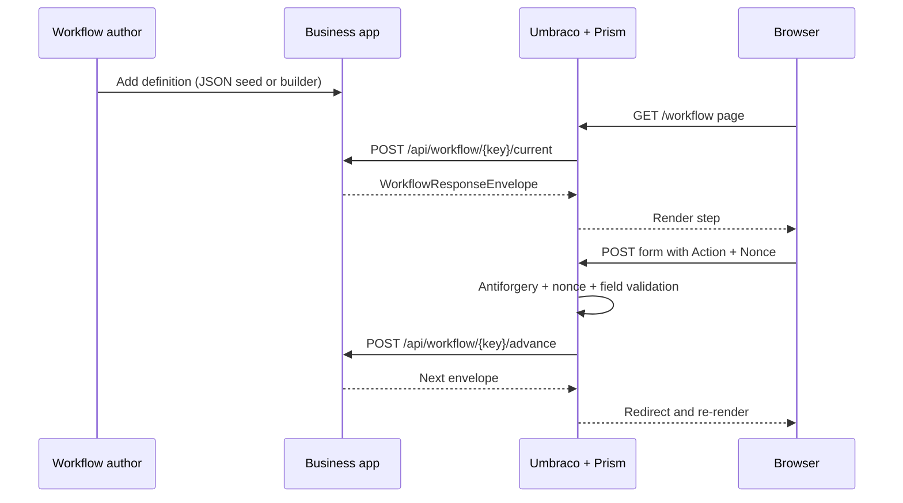

# Building a workflow with Umbraco.Prism

This guide tells the shortest complete story for implementing your own workflow: define it, expose it from a business app, wire Prism into Umbraco, and let the package handle rendering and validation.

## The happy path



## 1. Start with a real definition

The current package expects authored states to contain `components`, not legacy field-group references.

Short example based on `src/UmbracoPrism.MockBusinessApp/workflow-seeds/community-enquiry.json`:

```json
{
  "definitionKey": "community-enquiry",
  "displayName": "Get in Touch",
  "instancePolicy": "single",
  "initialState": "collecting-details",
  "states": [
    {
      "stateKey": "collecting-details",
      "displayName": "Tell us about your enquiry",
      "components": [
        {
          "type": "fieldset",
          "legend": "About You",
          "children": [
            { "type": "text", "fieldKey": "full-name", "label": "Full name", "required": true },
            { "type": "email", "fieldKey": "email-address", "label": "Email address", "required": true }
          ]
        }
      ]
    }
  ],
  "transitions": [
    { "fromState": "collecting-details", "toState": "under-review", "action": "submit" }
  ]
}
```

Good example seeds live in:

- `src/UmbracoPrism.MockBusinessApp/workflow-seeds/community-enquiry.json`
- `src/UmbracoPrism.MockBusinessApp/workflow-seeds/information-request.json`
- `src/UmbracoPrism.MockBusinessApp/workflow-seeds/payment-demo.json`
- `src/UmbracoPrism.MockBusinessApp/workflow-seeds/planning-notification.json`

If you prefer code-first authoring, the fluent builder is already documented in code:
`src/UmbracoPrism.Shared/Builders/WorkflowDefinitionBuilder.cs`.

## 2. Decide what belongs in Prism and what belongs in your business app

| Concern | Owned by |
| --- | --- |
| Workflow states, transitions, reviewer logic, domain rules | Your business app |
| Rendering GOV.UK form shells and components | Prism |
| Authenticating the Umbraco member and forwarding bearer tokens | Prism |
| Field structure validation and tamper-proofing | Prism |
| Sanitizing authored HTML content before render | Prism |

Prism is intentionally not your case-management engine. It is the web package that hosts and protects the journey.

## 3. Expose the three business-app endpoints

The demo app maps these in `src/UmbracoPrism.MockBusinessApp/Program.cs`:

- `POST /api/workflow/{workflowKey}/current`
- `POST /api/workflow/{workflowKey}/advance`
- `GET /api/workflow/instances`

The current endpoint contract is deliberately small:

- **Current** returns the user's current instance or creates one according to instance policy.
- **Advance** validates action + state version and returns the next envelope.
- **Instances** powers the workflow hub and prompt-mode resume experience.

## 4. Register Prism in Umbraco

In Umbraco, call `AddPrismWorkflowEngine()` so Prism can register:

- `IBusinessAppWorkflowClient`
- `IWorkflowStepNonceService`
- `IWorkflowFieldValidator`
- `IWorkflowContentSanitizer`
- `PrismWorkflowOptions`

Then configure the business-app base URL via `PrismBusinessApp:WorkflowApiBaseUrl`.

## 5. Create a workflow page

Prism seeds a `workflowPage` document type with a `workflowKey` property. A page instance only needs to point at the workflow definition key you authored.

On GET, the package controller:

1. reads `workflowKey` from the current page,
2. requests the current envelope from the business app,
3. optionally pre-populates fields,
4. caches authoritative field definitions behind a nonce,
5. renders the matching shell.

`src/UmbracoPrism.TestSite/Controllers/WorkflowPageController.cs` shows the common extension point: overriding `PrePopulateFields()` to set `DefaultValue` and `ReadOnly` from authenticated member claims.

## 6. Let the package handle the POST round-trip

The important thing to understand is that Prism does not trust the browser submission.

Before `AdvanceAsync()` is called, Prism validates:

- antiforgery token,
- safe return URL,
- nonce existence and expiry,
- field whitelist,
- required fields,
- option membership,
- length / range / regex / date constraints,
- conditional visibility rules.

After that, your business app can apply domain-specific rules. The mock business app demonstrates this with a technical-support message rule that can return `validation_error` and a `WorkflowProblem` without advancing the instance.

## 7. Add the workflow hub when your journey can be resumed

`workflowHub` is the companion page for resumable workflows. It lists active and completed instances and resolves the correct `workflowPage` URL for each instance by matching `workflowKey`.

This matters most when you use:

- `instancePolicy = "multiple"` — users can have several live requests.
- `instancePolicy = "prompt"` — Prism shows an instance picker before starting a new request.
- waiting/review states — users need somewhere obvious to come back to later.

## Recommended reading after this

- [Backend authoring and contracts](./workflow-forms-engine-backend.md)
- [Umbraco integration](./workflow-forms-engine-umbraco.md)
- [Workflow hub and conditional fields](./workflow-hub-and-conditional-fields.md)
