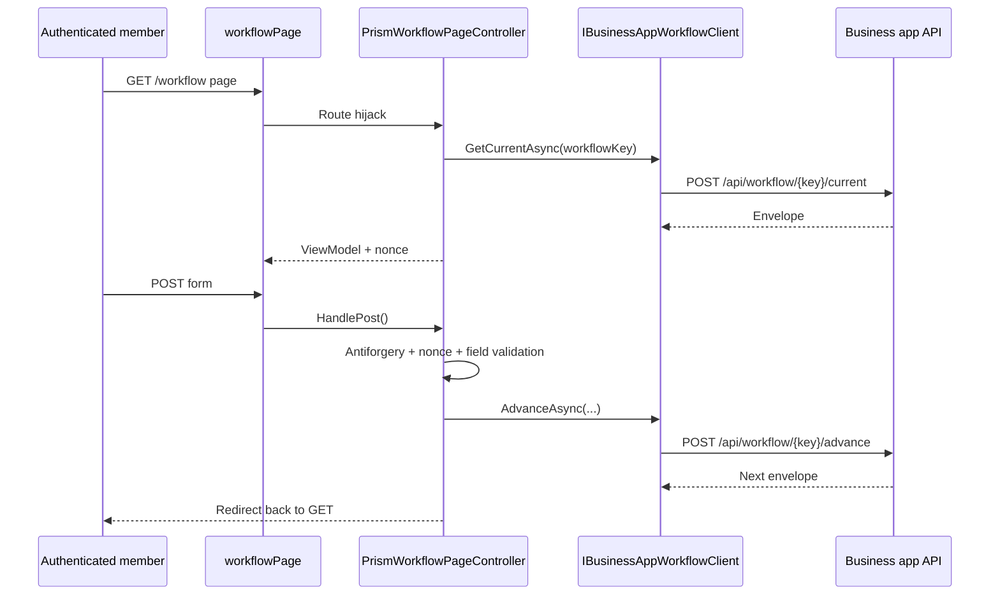

# Workflow package integration in Umbraco

This guide covers the Umbraco-facing side of Prism workflows: service registration, seeded document types, route hijacking controllers, page setup, and the workflow hub.

## Register the package services

`src/UmbracoPrism.Core/Extensions/WorkflowBuilderExtensions.cs` exposes `AddPrismWorkflowEngine()`.

That call registers:

- `IBusinessAppWorkflowClient`
- `IWorkflowStepNonceService`
- `IWorkflowFieldValidator`
- `IWorkflowContentSanitizer`
- `PrismWorkflowOptions`
- `IDistributedCache` (memory-backed by default)

### Configuration

| Setting | Purpose |
| --- | --- |
| `PrismBusinessApp:WorkflowApiBaseUrl` | Browser-facing workflow API base URL for the business app |
| `Prism:Workflow:NonceExpiry` | How long the nonce cache should keep field definitions |

For production, replace the default in-memory distributed cache with a shared backing store such as Redis or SQL Server.

## Seeded document types

`src/UmbracoPrism.Core/PrismContentTypeSeeder.cs` creates the document types Prism needs:

| Document type | Purpose |
| --- | --- |
| `workflowPage` | Hosts a single workflow journey |
| `workflowHub` | Lists active and completed workflow instances |

`workflowPage` also gets a `workflowKey` property. That key is the bridge between an Umbraco content node and a workflow definition in the business app.

## Route hijacking controller

`PrismWorkflowPageController<TViewModel>` is the core integration point.

Responsibilities on GET:

1. read `workflowKey` from the current content node,
2. call `GetCurrentAsync()`,
3. support prompt-mode `instance_picker`,
4. allow optional field pre-population,
5. generate the nonce bound to the rendered field definitions,
6. populate `PrismWorkflowViewModel`.

Responsibilities on POST:

1. validate antiforgery,
2. resolve and validate nonce-backed fields,
3. coerce posted values (including GOV.UK date inputs),
4. call `AdvanceAsync()`,
5. redirect back to GET.

## Common extension point: pre-populating from member claims

The TestSite controller is a good model because it is small and realistic:

```csharp
protected override WorkflowResponseEnvelope PrePopulateFields(WorkflowResponseEnvelope envelope)
{
    // Read authenticated claims and set DefaultValue / ReadOnly before nonce generation.
    return envelope;
}
```

See `src/UmbracoPrism.TestSite/Controllers/WorkflowPageController.cs` for the real implementation.

## Workflow form tag helper

`prism-workflow-form` is the form wrapper Prism expects. `PrismWorkflowFormTagHelper` writes:

- the antiforgery token,
- `InstanceId`,
- `StateVersion`,
- `WorkflowKey`,
- `ReturnUrl`,
- `Nonce`.

That means partial views can focus on fields and actions instead of rebuilding hidden plumbing on every step.

## Workflow hub

`WorkflowHubController` powers the `workflowHub` page. It:

- calls `GetInstancesAsync()`,
- splits active vs completed instances,
- resolves the matching `workflowPage` by `workflowKey`,
- appends `instanceId` for resumable journeys.

This is the piece that makes `multiple` and `prompt` instance policies user-friendly rather than purely technical.

## Request lifecycle in Umbraco



## What you usually customise

- Your workflow page content and information architecture in Umbraco
- A derived workflow view model with extra page data
- A derived workflow controller with claim/API-driven pre-population
- Optional view overrides for Prism partials when your site needs a different presentation

## What you usually should not customise first

- the nonce service,
- the field validator,
- the BusinessApp workflow client contract,
- the seeded document type aliases.

Start with the package defaults. They already encode the security and rendering rules the rest of the docs assume.
