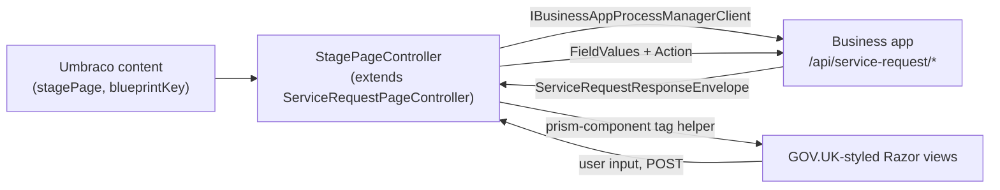

# Setting Up a Prism Service Blueprint

A guide for integrators: wire a service blueprint into your Umbraco site, using the
reference implementation (TestSite + MockBusinessApp) as the model.

**For the JSON authoring schema itself** (queues, stages, gateways, routes, components,
calculations), see the
[Reference Service Blueprint Contract](./reference-service-blueprint-contract.md) — this
guide doesn't repeat that; it covers wiring the Umbraco-hosted rendering side to a
business app that already speaks that contract.

## Overview

A service blueprint runs on two surfaces (see [Umbraco Integration](./umbraco-integration.md)
for the full picture): the **member surface**, an Umbraco `stagePage` that renders whatever
stage the user is currently on, and the **business app**, a separate host that owns the
authored service blueprint and advances service request state. Umbraco never stores or
authors the blueprint itself — it reads a runtime `ServiceBlueprint` projection and
renders it.



## What's Prism/Wayfinder and what's your business app?

| Layer | Owner | Customise? |
|---|---|---|
| Form rendering (Razor views, `prism-component` tag helper, CSS) | `Wayfinder.Umbraco` | Yes — override partials, CSS variables |
| Antiforgery + nonce tamper-proofing | `Wayfinder.Umbraco` | No — automatic |
| Member authentication & sessions | `UmbracoPrism.Core` | No — `PrismMemberCookie` scheme |
| `stagePage`/`serviceRequestHub` content types & route hijacking | `Wayfinder.Umbraco` | No — seeded automatically |
| Authored service blueprints (queues/stages/gateways/components) | Your business app | Yes — you author these |
| Service request state, transitions, business logic | Your business app | Yes — your engine or `Wayfinder.Engine` |
| `/api/service-request/{blueprintKey}/*` endpoints | Your business app | Yes — implement to the client contract below |

`MockBusinessApp` (`src/UmbracoPrism.MockBusinessApp/`) is the reference business app —
it hosts `Wayfinder.Engine` in-process and seeds several example blueprints from
`service-blueprints/*.json`. Your business app is analogous, whether it hosts
`Wayfinder.Engine` itself or implements the wire contract with its own engine.

## Prerequisites

1. Prism is installed in your Umbraco 17+ project (`UmbracoPrism.Core`, which references
   `Wayfinder.Umbraco`).
2. Members authenticate via the `PrismMemberCookie` scheme (OIDC configured).
3. A business app is running and reachable over HTTP(S) from Umbraco.
4. `IBusinessAppProcessManagerClient` is registered with that business app's base URL.

## The business app wire contract

Umbraco talks to your business app via `IBusinessAppProcessManagerClient`
(`Wayfinder.Umbraco.Services`):

| Call | Route | Purpose |
|---|---|---|
| Get current | `POST {BaseUrl}/api/service-request/{blueprintKey}/current` | Resume or create the caller's instance; optional body `{ InstanceId, Action }` (e.g. `Action: "start-new"`) |
| Advance | `POST {BaseUrl}/api/service-request/{blueprintKey}/advance` | Body `{ InstanceId, Action, StateVersion, FieldValues }` — submits the current stage's action |
| List instances | `GET {BaseUrl}/api/service-request/instances` | Backs the service request hub |

The bearer token from the authenticated member's session is forwarded automatically —
your business app resolves tenant/user identity from its claims, not from anything in the
request body (see [security guarantees](../design/service-request-forms-engine-security.md)).

Every response is a `ServiceRequestResponseEnvelope` (`Wayfinder.Models.ServiceDesign`):
`InstanceId`, `ResponseState` (`render` / `defer` / `complete` / `error`, plus
`instance_picker` for `requestPolicy: "prompt"`), `StateVersion`, `Render` (a `StepContent`
with `Components`/`AvailableActions` for the current stage), `PollAfterMs`, `Problems`.
If you're hosting `Wayfinder.Engine` yourself (as `MockBusinessApp` does), you get this
envelope for free — implement the wire contract only if you're integrating an existing
system without adopting the engine directly.

## Setting up the member surface

### 1. Create the content node

The `stagePage` content type is seeded automatically. Create a content node, set its
**Blueprint Key** property to your blueprint's `definitionKey`, and publish. Umbraco
route-hijacks the page automatically — see
[Umbraco Integration](./umbraco-integration.md#member-surface--what-you-get) for the
full content-type/routing story.

### 2. Implement your `StagePageController`

`ServiceRequestPageController<TViewModel>` (`Wayfinder.Umbraco.Controllers`) is the
abstract base — it handles GET/POST dispatch, antiforgery, nonce validation, field
validation, file uploads, and the POST-Redirect-Get cycle. Most integrators only need a
thin subclass:

```csharp
using Microsoft.AspNetCore.Antiforgery;
using Microsoft.AspNetCore.Mvc.ViewEngines;
using Microsoft.Extensions.Logging;
using Umbraco.Cms.Core.Models.PublishedContent;
using Umbraco.Cms.Core.Web;
using Umbraco.Cms.Web.Common.Controllers;
using Wayfinder.Umbraco.Controllers;
using Wayfinder.Umbraco.Services;

namespace YourApp.Controllers;

public class StagePageController(
    ILogger<RenderController> logger,
    ICompositeViewEngine compositeViewEngine,
    IUmbracoContextAccessor umbracoContextAccessor,
    IBusinessAppProcessManagerClient processManagerClient,
    IPublishedValueFallback publishedValueFallback,
    IAntiforgery antiforgery,
    IStageNonceService nonceService,
    IServiceRequestFieldValidator fieldValidator,
    IServiceRequestFileStorage fileStorage,
    IUploadTokenService uploadTokenService)
    : ServiceRequestPageController<StageViewModel>(
        logger,
        compositeViewEngine,
        umbracoContextAccessor,
        processManagerClient,
        publishedValueFallback,
        antiforgery,
        nonceService,
        fieldValidator,
        fileStorage,
        uploadTokenService)
{
    // The base class handles everything. Override PrePopulateFields() below
    // only if you need to pre-fill fields from the member's claims.
}
```

`StageViewModel` can be `PrismServiceRequestViewModel` itself, or a thin subclass if your
own views need extra properties.

### 3. Pre-populate fields from claims (optional)

Override `PrePopulateFields` to set a `DefaultValue`/`ReadOnly` on fields sourced from the
authenticated member's claims — TestSite's real implementation:

```csharp
protected override ServiceRequestResponseEnvelope PrePopulateFields(ServiceRequestResponseEnvelope envelope)
{
    if (envelope.Render == null)
        return envelope;

    var email = HttpContext.User.FindFirstValue(ClaimTypes.Email) ?? HttpContext.User.FindFirstValue("email");
    var name  = HttpContext.User.FindFirstValue(ClaimTypes.Name)  ?? HttpContext.User.FindFirstValue("name");

    var updatedComponents = envelope.Render.Components
        .Select(component => component with
        {
            Fields = component.Fields.Select(field =>
            {
                if (field.FieldKey == "email-address" && !string.IsNullOrWhiteSpace(email))
                    return field with { DefaultValue = email, ReadOnly = true };

                if (field.FieldKey == "full-name" && !string.IsNullOrWhiteSpace(name))
                    return field with { DefaultValue = name, ReadOnly = true };

                return field;
            }).ToList()
        }).ToList();

    return envelope with { Render = envelope.Render with { Components = updatedComponents } };
}
```

Pre-population runs before the nonce is created, so the rendered field definition and the
later POST validation still agree.

`RequiresAuthentication` defaults to `true`; override it to `false` for an anonymous-first
public journey (e.g. a GDS-style public entry point) — the blueprint itself still resolves
its own notion of "who this is" via the engine's `ActorProfile`.

## Customising rendering

The `<prism-component>` tag helper (`Wayfinder.Umbraco.TagHelpers.PrismComponentTagHelper`)
dispatches every authored component to a Razor partial by naming convention. Kebab-case
`type` becomes PascalCase: `"summary-list"` → `SummaryList`, `"notification-banner"` →
`NotificationBanner`.

**Top-level components** (`stages[].components`, container/content/data-display types) —
resolved against `~/Views/Partials/PrismComponents/`:

```
type: "fieldset" → _PrismComponent-Fieldset.cshtml
type: "unknown"  → _PrismComponent-Default.cshtml (fallback)
```

**Input fields** (declare a `fieldKey`) — resolved against `~/Views/Partials/PrismFields/`:

```
fieldType: "text"    → _Component-Text.cshtml
fieldType: "unknown" → _Component-Default.cshtml (fallback)
```

Every field partial receives `Wayfinder.Umbraco.Models.PrismFieldContext` — pre-built ARIA
attributes, CSS classes, and the resolved display value, so partials stay declarative:

| Property | Purpose |
|---|---|
| `Field` | The raw `FieldRenderPayload` (`Label`, `Hint`, `Required`, `Options`, `Prefix`, `Min`/`Max`, `MinLength`/`MaxLength`, `Pattern`, `ReadOnly`, `ConditionalOn`/`VisibleWhen`) |
| `DisplayValue` | Resolved value: default > submitted > stored |
| `HasFieldError`, `FieldError` | Validation state for this field |
| `WrapperClass`, `WrapperAttrs` | Pre-built `govuk-form-group` wrapper classes/attrs, including conditional-field data attributes |
| `RequiredAttr`, `AriaRequired`, `AriaInvalid`, `ReadOnlyAttr` | Pre-built HTML5/ARIA attribute strings |
| `MinLengthAttr`, `MaxLengthAttr`, `PatternAttr`, `MinAttr`, `MaxAttr`, `StepAttr` | Pre-built constraint attribute strings |
| `HintId`, `ErrorId`, `DescribedBy` | Pre-built ids and `aria-describedby` |

### Overriding a built-in field type

Create a partial with the same resolved name under your own app's
`~/Views/Partials/PrismFields/` — Umbraco's view engine resolves your app's copy first.
For example, to restyle `text`:

```cshtml
@* ~/Views/Partials/PrismFields/_Component-Text.cshtml *@
@model Wayfinder.Umbraco.Models.PrismFieldContext
<div class="@Model.WrapperClass"@Html.Raw(Model.WrapperAttrs)>
    @await Html.PartialAsync("~/Views/Partials/PrismFields/_ComponentLabel.cshtml", Model)
    <input class="govuk-input@(Model.HasFieldError ? " govuk-input--error" : "")"
           type="text"
           id="@Model.Field.FieldKey"
           name="fields[@Model.Field.FieldKey]"
           value="@Model.DisplayValue"
           @Html.Raw(Model.DescribedBy)@Html.Raw(Model.RequiredAttr)@Html.Raw(Model.AriaRequired)@Html.Raw(Model.AriaInvalid) />
</div>
```

### Adding a new field type

Authoring a component with a `type`/`fieldType` outside the built-in catalog (below) just
falls back to `_Component-Default.cshtml`/`_PrismComponent-Default.cshtml` unless you add a
partial for it — the tag helper never rejects an unrecognised discriminator, it just
renders the fallback. Add `~/Views/Partials/PrismFields/_Component-{PascalName}.cshtml`
(model `PrismFieldContext`) and it's picked up automatically. Note the built-in
`PrismComponent` catalog is closed at compile time (see
[queue render capabilities](./reference-service-blueprint-contract.md#queue-render-capabilities-host-declared))
— a genuinely new authored `type` discriminator needs your own `PrismComponent` derived
type and `[JsonDerivedType]` entry, not just a partial; a partial alone only lets you
*re-render* an existing discriminator differently.

### Built-in component/field catalog

Input field types (`Views/Partials/PrismFields/_Component-*.cshtml`): `text`, `number`,
`decimal`, `select`, `radio`, `checkboxlist`, `date`, `email`, `textarea`, `boolean`,
`slider`, `file-upload`, `guidance-checklist`.

Top-level component types (`Views/Partials/PrismComponents/_PrismComponent-*.cshtml`):
`fieldset`, `accordion`, `panel`, `body`, `heading`, `inset-text`, `warning-text`,
`details`, `notification-banner`, `waiting`, `summary-list`, `task-list`, `stat-group`,
`chart`.

See [Components](./reference-service-blueprint-contract.md#components) in the contract
reference for what each authored type means and its authoring-side fields.

## Waiting and Join gateways

There's no per-stage "waiting" configuration in the current model — waiting is a property
of a **Join gateway** converging cursors from a Split. A Join carries
`waitingContent`/`waitingExpectedSeconds`/`waitingPollIntervalMs`/`waitingAllowDefer`/
`waitingDeferMessage`/`requiredIncomingQueues`; the client receives `ResponseState: "defer"`
with `PollAfterMs`, and `PrismServiceRequestViewModel.PollAfterMs` drives the polling UI's
refresh interval. See
[Gateways and routing](./reference-service-blueprint-contract.md#gateways-and-routing) for
the full shape and the authoring conventions around Join loop-backs.

## Request policy

`requestPolicy` on the blueprint controls how many active service requests a member can
have:

| Value | Behaviour |
|---|---|
| `"single"` | At most one instance per user — an existing instance (including a terminal one) is always resumed. |
| `"multiple"` | Every visit creates a new instance. |
| `"prompt"` | If an active (non-terminal) instance exists, the response is `instance_picker` (`PrismServiceRequestViewModel.ShowInstancePicker`) instead of the form — the view offers "continue" or "start new". |

## Role-gated routes

A route can carry `requiresRole` (checked against the caller's claims by the business app
when the action is submitted); a stage or queue can carry `roleGates` to restrict who sees
it at all. Both are authoring-side fields documented in
[Stages and routes](./reference-service-blueprint-contract.md#stages-and-routes) — Umbraco
renders whatever actions the envelope returns and surfaces an `error` response's
`Problems` if the business app rejects an unauthorised action.

## Checklist

- [ ] Author the blueprint (JSON, or via the [MCP/REST authoring toolkit](./ai-service-blueprint-authoring.md)) against the [contract reference](./reference-service-blueprint-contract.md)
- [ ] Implement or host the `/api/service-request/{blueprintKey}/*` wire contract in your business app
- [ ] Create a `stagePage` content node with `blueprintKey` set
- [ ] Implement your `StagePageController` (base class alone is often enough)
- [ ] Override `PrePopulateFields` if you need claims-based defaults
- [ ] Publish and test

**Next steps:**
- [Customise Service Blueprint UI](./service-request-customisation.md) — CSS variables, partial overrides
- [Form Validation](./service-request-forms-validation.md) — validation layers
- [GDS Components](./service-blueprint-gds-components.md) — available form elements and patterns

---

[← Back to Guides](README.md)
