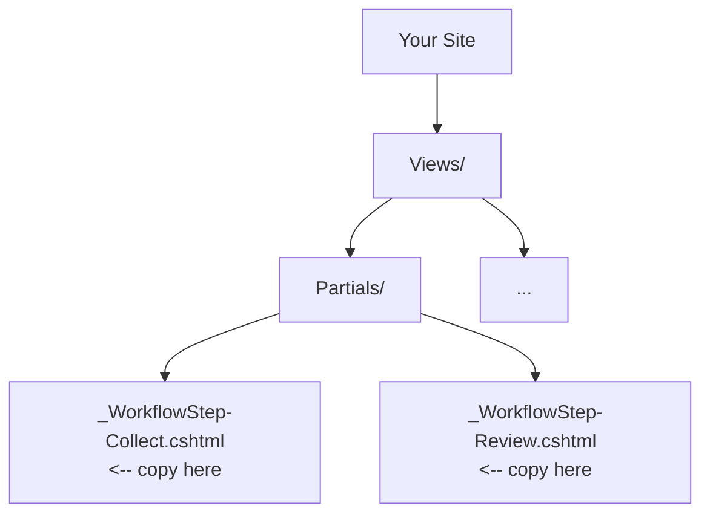

# Customising Workflow UI

A guide for designers and frontend developers to theme and extend Prism workflow forms.

## Overview

Prism provides a complete, accessible workflow rendering system out of the box. All form styling is CSS-first using CSS custom properties (CSS variables) for theming. Want to change colours, spacing, or border radius? Override a variable. Need a custom field layout or step archetype? Replace or create a partial view. No C# coding required.

**The philosophy:** Prism provides working defaults (GDS-inspired accessibility and styling); you layer your brand on top using CSS, HTML, and Razor (the Umbraco view engine).

## What's Prism and What's the Mock Business App?

> **🔵 Prism Platform** — Provided by `UmbracoPrism.Core`. You don't build this.
> **🟠 Mock Business App** — Provided by `UmbracoPrism.MockBusinessApp` as a reference implementation. Replace this with your real workflow engine.

**In this guide:**
- 🔵 Customisation sections (CSS, partials, archetypes) describe Prism Platform features you control
- 🟠 Workflow definitions (JSON structure, states, transitions) are your business app's responsibility

For Prism customisation, you override CSS variables and Razor views. Your business app defines what workflows exist and how they behave.

## The CSS File

> 🔵 **Prism Platform** — The Prism design system is part of `UmbracoPrism.Core`. You override CSS variables; you don't replace the stylesheet.

**Location:** `src/UmbracoPrism.TestSite/wwwroot/branding/prism-forms.css` — part of the Prism branding system, imported automatically via `prism-branding.css`

This file contains:
- All form and field styles
- CSS custom properties (variables) for theming
- GDS-compliant accessible defaults (focus visible, hint text associations, required field markers)

**How it's loaded:**
- Prism's layout view imports `prism-branding.css` automatically
- `prism-branding.css` imports `prism-forms.css` (plus other Prism styles)
- Your site's CSS loads **after** Prism branding, so you can override variables
- Prism doesn't bundle CSS; you control what loads and in what order

**What it covers:**
- Workflow container layout
- Form fieldsets and legends
- Input styling (text, email, number, date, select, textarea, etc.)
- Button and action styles
- Error and validation states
- Review step display
- Status timeline
- Completion messages
- Accessibility (focus indicators, ARIA labels)

## CSS Custom Properties Reference

Below are all available `--prism-*` variables and their defaults. Override any to match your brand.

### Layout & Spacing

```css
--prism-workflow-max-width: 680px;           /* Container width */
--prism-workflow-padding: 1.5rem;            /* Container padding */
--prism-form-group-spacing: 1.5rem;          /* Gap between form groups */
--prism-actions-gap: 1rem;                   /* Gap between action buttons */
```

### Inputs

```css
--prism-input-border: 2px solid #0b0c0c;     /* All input borders (text, select, etc.) */
--prism-input-border-radius: 0;              /* Corner radius (0 = sharp, GDS style) */
--prism-input-padding: 0.5rem 0.625rem;      /* Padding inside inputs */
--prism-input-font-size: 1rem;               /* Font size in inputs */
--prism-input-focus-color: #ffdd00;          /* Focus background (GDS yellow) */
--prism-input-focus-outline: 3px solid #0b0c0c; /* Focus outline */
```

### Labels & Hints

```css
--prism-label-font-size: 1rem;               /* Label size */
--prism-label-font-weight: 700;              /* Label weight (bold by default) */
--prism-hint-font-size: 0.9375rem;           /* Hint text size */
--prism-hint-color: #505a5f;                 /* Hint text colour */
--prism-required-color: #d4351c;             /* Required field indicator (*) colour */
```

### Buttons

```css
--prism-button-font-size: 1rem;              /* Button text size */
--prism-button-padding: 0.625rem 1.25rem;    /* Button padding */
--prism-button-border-radius: 0;             /* Button corner radius */
```

### Panels & Review

```css
--prism-panel-confirmation-border-color: #00703c;  /* Review panel border (green) */
--prism-panel-confirmation-bg: #f3faf5;           /* Review panel background */
--prism-panel-confirmation-padding: 1.5rem;       /* Review panel padding */
--prism-review-dt-color: #505a5f;                 /* Review field label colour */
--prism-review-item-border: 1px solid #b1b4b6;    /* Review field separator */
```

## Theming by Overriding Variables

> 🔵 **Prism Platform** — The design system tokens are already defined in `prism-forms.css`. You override them in your own stylesheet.

The Prism design system exposes CSS variables for every visual element. Override them in your site's stylesheet (which loads after Prism branding) to apply your brand.

### Example 1: Change Your Brand Colours

In your site's main stylesheet (or a dedicated branding file):

```css
/* Add to your site's stylesheet (loads after prism-branding.css) */
:root {
  /* Use your brand primary colour */
  --prism-input-focus-color: #0066cc;
  --prism-input-focus-outline: 3px solid #003d7a;
  
  /* Custom brand green for panels */
  --prism-panel-confirmation-border-color: #0a7a2e;
  --prism-panel-confirmation-bg: #f0f8f3;
  
  /* Brand sans-serif */
  --prism-label-font-size: 1.1rem;
}
```

That's it. Prism renders with your brand applied.

### Example 2: Rounded, Spacious Design

For a modern, rounded look:

```css
:root {
  --prism-input-border-radius: 8px;
  --prism-button-border-radius: 8px;
  
  --prism-workflow-max-width: 800px;
  --prism-form-group-spacing: 2rem;
  --prism-workflow-padding: 2rem;
}
```

### Example 3: Compact Mobile-First Layout

For tight spacing on mobile:

```css
@media (max-width: 640px) {
  :root {
    --prism-workflow-padding: 1rem;
    --prism-form-group-spacing: 1rem;
    --prism-button-padding: 0.5rem 1rem;
  }
}
```

## Overriding a Partial View

> 🔵 **Prism Platform** — Partial views (Razor templates) are part of Prism. You override them to customise rendering, but Prism provides all the defaults.

Umbraco uses a view resolution order: **your site's Views folder takes precedence** over defaults. To override any workflow partial, copy it to your site and modify.

### Step 1: Identify the Partial

Partials are located in `src/UmbracoPrism.TestSite/Views/Partials/`:
- `_WorkflowStep-Collect.cshtml` — Data entry form
- `_WorkflowStep-Review.cshtml` — Review step
- `_WorkflowStep-StatusTimeline.cshtml` — Waiting state
- `_WorkflowStep-Completion.cshtml` — Success state
- `_WorkflowField.cshtml` — Individual field rendering
- `WorkflowPage.cshtml` — Main dispatcher view

### Step 2: Copy to Your Site

Copy the partial to your site's `Views/Partials/` (or `Views/` if the directory structure differs):



### Step 3: Modify

Edit the partial. For example, add a custom CSS class:

```cshtml
<!-- Original: -->
<form class="workflow-form" method="post">

<!-- Modified: -->
<form class="workflow-form my-custom-form" method="post">
```

Umbraco will now use your version instead of the default.

## Creating a Custom Archetype

> 🔵 **Prism Platform** — Archetypes are rendering templates. Create a new partial to define a custom step type, then use it in your business app's workflow JSON.

Want a new step type? Create a custom archetype without touching C#.

### Example: "Documents" Archetype

Create a new partial view for document upload/download steps:

**File:** `Views/Partials/_WorkflowStep-Documents.cshtml`

```cshtml
@model UmbracoPrism.TestSite.Models.WorkflowViewModel

<div class="prism-workflow">
    <h2 class="prism-workflow__heading">@Model.CurrentStep.DisplayName</h2>
    
    <div class="documents-container">
        <h3>Required Documents</h3>
        <ul>
            <li>Proof of identity (passport or driving license)</li>
            <li>Proof of address (utility bill or council tax)</li>
            <li>Bank statement (last 3 months)</li>
        </ul>
    </div>
    
    <form method="post" action="@Model.ReturnUrl" enctype="multipart/form-data">
        @Html.AntiForgeryToken()
        <input type="hidden" name="InstanceId" value="@Model.InstanceId" />
        <input type="hidden" name="StateVersion" value="@Model.StateVersion" />
        
        <div class="prism-form-group">
            <label for="upload-docs">Upload your documents:</label>
            <input type="file" id="upload-docs" name="documents" multiple accept=".pdf,.jpg,.png" required>
        </div>
        
        <div class="prism-form-group">
            <button type="submit" class="prism-button prism-button--primary">
                Continue
            </button>
        </div>
    </form>
</div>
```

**Then use it in your workflow JSON:**

```json
{
  "states": [
    {
      "stateKey": "upload-docs",
      "displayName": "Upload Your Documents",
      "archetype": "Documents",
      "allowedActions": ["continue"],
      "fieldGroupKeys": []
    }
  ]
}
```

The dispatcher (`WorkflowPage.cshtml`) uses convention-based routing:
1. Looks for `_WorkflowStep-Documents.cshtml`
2. Finds your custom partial
3. Renders it

No code changes needed.

## The Field Partial

> 🔵 **Prism Platform** — The field renderer is part of Prism. Override it to customise how individual form fields render across all archetypes.

**File:** `Views/Partials/_WorkflowField.cshtml`

This partial renders individual form fields (text boxes, dropdowns, etc.). Override it to customise all field rendering at once.

**Default rendering:**
- Text inputs render as `<input type="text">`
- Select fields render as `<select>`
- Checkboxes render as `<input type="checkbox">`
- Etc.

**Why override it:**
- Add custom styling classes
- Wrap fields in custom containers
- Change label rendering
- Add icons or custom help text

### Example: Add Custom Styling

```cshtml
<!-- Custom _WorkflowField.cshtml -->
@model Field

<div class="custom-field custom-field--@Model.FieldType">
    <label for="@Model.FieldKey" class="custom-label">
        @Model.Label
        @if (Model.Required) { <span class="required">*</span> }
    </label>
    
    @if (!string.IsNullOrEmpty(Model.Hint)) {
        <p class="custom-hint">@Model.Hint</p>
    }
    
    <!-- Render the appropriate input -->
    @if (Model.FieldType == "textarea") {
        <textarea id="@Model.FieldKey" name="@Model.FieldKey" 
                  class="custom-input custom-textarea"
                  required="@Model.Required"></textarea>
    } else {
        <input type="@Model.FieldType" id="@Model.FieldKey" 
               name="@Model.FieldKey" 
               class="custom-input"
               required="@Model.Required">
    }
</div>
```

## Accessibility Considerations

Prism workflows ship with WCAG 2.2 AA accessibility by default. When customising, maintain these standards:

### Focus Indicators

The default `--prism-input-focus-color: #ffdd00` (yellow) provides high contrast on dark text. Ensure any override maintains **at least 3:1 contrast ratio** in focus state.

**Good:**
```css
--prism-input-focus-color: #ffdd00;        /* Yellow on dark = high contrast */
--prism-input-focus-outline: 3px solid #0b0c0c;
```

**Poor (avoid):**
```css
--prism-input-focus-color: #ffddcc;        /* Light peach = low contrast */
```

### ARIA Attributes

Hints are linked to inputs via `aria-describedby`:

```html
<label for="email">Email</label>
<p id="email-hint" class="hint">We'll use this to contact you</p>
<input id="email" type="email" aria-describedby="email-hint">
```

Don't remove this association when overriding partials.

### Required Field Indicators

The default asterisk `<span class="prism-field__required"> *</span>` is marked `aria-hidden="true"` (screen readers don't need it; the `required` attribute is enough). Keep this structure.

### Keyboard Navigation

Ensure all interactive elements (buttons, links, form fields) are reachable via Tab and Enter. The default partials already do this; maintain it in custom partials.

### Colour Alone

Don't rely on colour alone to communicate state:
- Error states: use colour + icon + text
- Success states: use colour + checkmark + text

The default partials do this correctly.

## Example: Brand the Community Enquiry Form

Let's say you're integrating the `community-enquiry` workflow for a fictional tech company "Acme Tech" with brand colours: navy (#003d80) and gold (#d4a574).

### Step 1: Create Your Theme CSS

**File:** `wwwroot/css/acme-theme.css`

```css
:root {
  /* Brand colours */
  --prism-input-focus-color: #d4a574;
  --prism-input-focus-outline: 3px solid #003d80;
  
  --prism-panel-confirmation-border-color: #003d80;
  --prism-panel-confirmation-bg: #f5f5f5;
  
  /* Rounded modern style */
  --prism-input-border-radius: 4px;
  --prism-button-border-radius: 4px;
  
  /* Slightly more spacious */
  --prism-workflow-max-width: 720px;
  --prism-form-group-spacing: 1.75rem;
  --prism-workflow-padding: 2rem;
}
```

### Step 2: Override the Collect Partial

**File:** `Views/Partials/_WorkflowStep-Collect.cshtml`

Copy the default and add Acme branding:

```cshtml
@model UmbracoPrism.TestSite.Models.WorkflowViewModel

<div class="prism-workflow acme-workflow">
    <div class="acme-header">
        <h1 class="acme-title">@Model.CurrentStep.DisplayName</h1>
        <p class="acme-subtitle">Acme Tech contact form</p>
    </div>
    
    <form class="workflow-form" method="post" action="@Model.ReturnUrl" novalidate>
        @Html.AntiForgeryToken()
        <!-- ... rest of form (unchanged) ... -->
    </form>
</div>
```

### Step 3: Add Acme-Specific Styles

**Add to `acme-theme.css`:**

```css
.acme-workflow {
  background: #fafafa;
  border: 1px solid #e0e0e0;
  border-radius: 8px;
}

.acme-header {
  text-align: center;
  margin-bottom: 2rem;
  padding-bottom: 2rem;
  border-bottom: 2px solid #d4a574;
}

.acme-title {
  color: #003d80;
  font-size: 1.75rem;
  font-weight: 700;
  margin-bottom: 0.5rem;
}

.acme-subtitle {
  color: #666;
  font-size: 1rem;
}
```

### Step 4: Include Both Stylesheets

**In your layout/master view:**

```html
<link rel="stylesheet" href="/css/prism-workflow.css">
<link rel="stylesheet" href="/css/acme-theme.css">
```

Now your workflow renders with:
- Navy headers and gold focus states
- Rounded corners and extra breathing room
- Acme branding (company subtitle, header styling)
- Full accessibility maintained

## Responsive Design

Prism workflows don't enforce responsive rules; you control them via CSS:

```css
/* Mobile first */
:root {
  --prism-workflow-max-width: 100%;
  --prism-workflow-padding: 1rem;
}

/* Tablet and up */
@media (min-width: 768px) {
  :root {
    --prism-workflow-max-width: 680px;
    --prism-workflow-padding: 1.5rem;
  }
}

/* Desktop and up */
@media (min-width: 1024px) {
  :root {
    --prism-workflow-max-width: 800px;
  }
}
```

## Testing Your Customisations

1. **Visit the workflow page** in a browser (as an authenticated member)
2. **Inspect the form** using browser DevTools (F12)
3. **Verify CSS variables** are applied (Elements tab → Computed)
4. **Test keyboard navigation** (Tab through all fields)
5. **Check focus indicators** (use Tab key to see focus state)
6. **Test on mobile** (DevTools device mode or actual device)
7. **Validate HTML** (use a validator to ensure your partials are valid)

## Performance Considerations

- **CSS custom properties** have minimal performance impact; they're native browser features
- **Partial overrides** don't impact performance; Umbraco caches views
- **Large field counts** (50+ fields) may slow form rendering; batch field groups or use pagination

## Troubleshooting

| Problem | Cause | Solution |
|---------|-------|----------|
| Styles don't change | CSS not loading | Check file path in `<link>` tag; ensure no typos |
| Variable not working | Wrong variable name | Check spelling against the reference above |
| Override partial not rendering | File in wrong location | Ensure it's in `Views/Partials/` (or site's view root) |
| Focus not visible | Contrast too low | Increase colour contrast or use thicker outline |
| Form broken after override | Invalid Razor syntax | Check for missing `@` symbols, unclosed tags |

## Next Steps

- **Set up workflows:** See [Setting Up a Prism Workflow](./workflow-setup.md) if you haven't already
- **Explore Umbraco views:** Learn more about Umbraco's view resolution at umbraco.com/documentation
- **Check GDS design system:** Review GOV.UK Design System for accessibility and pattern inspiration
