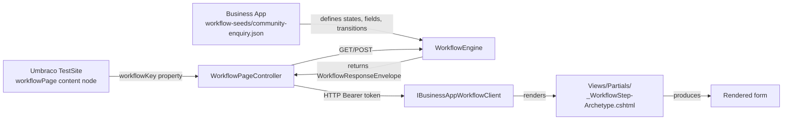

# Setting Up a Prism Workflow

A complete guide to building and deploying a multi-step workflow form using Umbraco.Prism.

## Overview

A Prism workflow is a multi-step form engine that connects your Umbraco website to a Business App (a separate .NET web API). The Business App defines the workflow structure—steps, fields, validation rules—as JSON files. Umbraco renders the forms and handles authentication.

**Architecture:**



Workflows support complex scenarios: multi-step data collection, review steps, approval workflows, status tracking, and completion states. Each step can validate, branch logic, or trigger backend actions.

## What's Prism and What's the Mock Business App?

> **🔵 Prism Platform** — Provided by `UmbracoPrism.Core`. You don't build this.
> **🟠 Mock Business App** — Provided by `UmbracoPrism.MockBusinessApp` as a reference implementation. Replace this with your real workflow engine.

**Responsibility breakdown:**

| Component | Provided by | Replace with |
|-----------|-------------|--------------|
| Form rendering (Razor views, partials) | 🔵 Prism | Customise/override views — don't replace |
| Authentication & member sessions | 🔵 Prism | No change needed |
| Umbraco content type & routing | 🔵 Prism | No change needed |
| CSS design system | 🔵 Prism | Override variables / add your own theme |
| Workflow definitions (JSON files) | 🟠 Mock Business App | Your case management system's API |
| State machine / workflow engine | 🟠 Mock Business App | Your case management system |
| `/api/workflow/*` HTTP endpoints | 🟠 Mock Business App | Your case management system's equivalent endpoints |

**In real integrations:** You replace the Mock Business App with your actual case management system (ServiceNow, Salesforce, a bespoke .NET API, etc.). Prism remains unchanged — it calls your system via HTTP.

## Prerequisites

Before setting up a workflow, ensure:

1. **Prism is installed** in your Umbraco 17 package
2. **Your Umbraco members are authenticated** using the `PrismMemberCookie` authentication scheme (Entra tenant configured)
3. **Your Business App is running** and accessible via HTTP(S) from the Umbraco server
4. **Business App client is configured** in Umbraco's `appsettings.json` with the correct endpoint URL and Entra token

## Step 1: Define the Workflow in Your Business App

> 🟠 **Mock Business App** — This step describes the mock implementation. In a real integration, your case management system hosts workflow definitions and serves them via API.

A workflow is a JSON file stored in your Business App's `workflow-seeds/` directory.

**Create a new file:** `workflow-seeds/my-workflow.json`

### Complete Example: Get in Touch (Community Enquiry) Workflow

```json
{
  "definitionKey": "community-enquiry",
  "displayName": "Get in Touch",
  "version": 1,
  "initialState": "collecting-info",
  "states": [
    {
      "stateKey": "collecting-info",
      "displayName": "Tell us what you need",
      "stepType": "Collect",
      "allowedActions": ["submit", "save-draft"],
      "fieldGroupKeys": ["contact-details", "enquiry-info"]
    },
    {
      "stateKey": "review-details",
      "displayName": "Check your answers",
      "stepType": "Review",
      "allowedActions": ["submit", "back"],
      "fieldGroupKeys": []
    },
    {
      "stateKey": "under-review",
      "displayName": "We're looking at your enquiry",
      "stepType": "StatusTimeline",
      "allowedActions": [],
      "fieldGroupKeys": []
    },
    {
      "stateKey": "complete",
      "displayName": "Thank you for reaching out",
      "stepType": "Completion",
      "allowedActions": ["start-another"],
      "fieldGroupKeys": []
    }
  ],
  "transitions": [
    { "fromState": "collecting-info", "toState": "review-details", "action": "submit" },
    { "fromState": "collecting-info", "toState": "collecting-info", "action": "save-draft" },
    { "fromState": "review-details", "toState": "collecting-info", "action": "back" },
    { "fromState": "review-details", "toState": "under-review", "action": "submit" },
    { "fromState": "under-review", "toState": "complete", "action": "approve", "requiresRole": "reviewer" }
  ],
  "fieldGroups": [
    {
      "fieldGroupKey": "contact-details",
      "displayName": "Your Details",
      "fields": [
        {
          "fieldKey": "full-name",
          "label": "Full name",
          "fieldType": "text",
          "required": true,
          "hint": "Enter your first and last name"
        },
        {
          "fieldKey": "email-address",
          "label": "Email address",
          "fieldType": "email",
          "required": true,
          "hint": "We'll use this to get back to you"
        },
        {
          "fieldKey": "organisation",
          "label": "Organisation (optional)",
          "fieldType": "text",
          "required": false,
          "hint": "The company or organisation you represent"
        },
        {
          "fieldKey": "your-role",
          "label": "Your role",
          "fieldType": "select",
          "required": true,
          "options": [
            { "key": "executive", "label": "Executive" },
            { "key": "developer", "label": "Developer" },
            { "key": "designer", "label": "Designer" },
            { "key": "other", "label": "Other" }
          ]
        }
      ]
    },
    {
      "fieldGroupKey": "enquiry-info",
      "displayName": "Your Enquiry",
      "fields": [
        {
          "fieldKey": "enquiry-type",
          "label": "What's your enquiry about?",
          "fieldType": "radio",
          "required": true,
          "options": [
            { "key": "general", "label": "General enquiry" },
            { "key": "technical", "label": "Technical support" },
            { "key": "partnership", "label": "Partnership opportunity" },
            { "key": "other", "label": "Other" }
          ]
        },
        {
          "fieldKey": "enquiry-type-other",
          "label": "Please describe your enquiry",
          "fieldType": "textarea",
          "required": false,
          "hint": "Visible only if you selected 'Other' above"
        },
        {
          "fieldKey": "message",
          "label": "Tell us more",
          "fieldType": "textarea",
          "required": true,
          "hint": "Please provide as much detail as possible"
        },
        {
          "fieldKey": "topics",
          "label": "Topics of interest",
          "fieldType": "checkboxlist",
          "required": false,
          "options": [
            { "key": "prism-workflows", "label": "Prism Workflows" },
            { "key": "notifications", "label": "Notifications" },
            { "key": "mobile", "label": "Mobile" },
            { "key": "integration", "label": "Integration" }
          ]
        },
        {
          "fieldKey": "newsletter",
          "label": "Subscribe to our newsletter",
          "fieldType": "boolean",
          "required": false
        }
      ]
    }
  ]
}
```

### Workflow Definition Properties

| Property | Type | Required | Description |
|----------|------|----------|-------------|
| `definitionKey` | string | Yes | Unique identifier matching the filename (without `.json`). Used in Umbraco `workflowKey` property. |
| `displayName` | string | Yes | Human-readable name shown in admin interfaces. |
| `version` | number | Yes | Version number for your workflow; increment when you modify structure. |
| `initialState` | string | Yes | The `stateKey` to start the workflow in. |
| `states` | array | Yes | Array of workflow states (see State Properties below). |
| `transitions` | array | Yes | Array of allowed transitions between states (see Transition Properties). |
| `fieldGroups` | array | Yes | Array of field groupings for data collection (see Field Group Properties). |

### State Properties

Each state in the `states` array:

| Property | Type | Required | Description |
|----------|------|----------|-------------|
| `stateKey` | string | Yes | Unique identifier for the state (used in transitions). |
| `displayName` | string | Yes | Title shown to the user (e.g., "Check your answers"). |
| `stepType` | string | Yes | Rendering type: `Collect`, `Review`, `StatusTimeline`, or `Completion`. |
| `allowedActions` | array | Yes | List of action keys that can be triggered in this state. |
| `fieldGroupKeys` | array | Yes | Which field groups to display in this state. Empty array `[]` for non-data states. |

### Transition Properties

Each transition defines a path through the workflow:

| Property | Type | Required | Description |
|----------|------|----------|-------------|
| `fromState` | string | Yes | Starting state (`stateKey`). |
| `toState` | string | Yes | Destination state (`stateKey`). |
| `action` | string | Yes | Action key (e.g., "submit", "back", "save-draft"). Must be in the `allowedActions` of `fromState`. |
| `requiresRole` | string | No | If specified, only users with this role can trigger this transition. For backend validation. |

### Field Group Properties

Each field group in `fieldGroups`:

| Property | Type | Required | Description |
|----------|------|----------|-------------|
| `fieldGroupKey` | string | Yes | Unique identifier (referenced in state `fieldGroupKeys`). |
| `displayName` | string | Yes | Legend/heading shown above the field group. |
| `fields` | array | Yes | Array of fields (see Field Properties). |

### Field Properties

Each field in a field group:

| Property | Type | Required | Description |
|----------|------|----------|-------------|
| `fieldKey` | string | Yes | Unique identifier for the field (used when collecting values). |
| `label` | string | Yes | Label shown in the form. |
| `fieldType` | string | Yes | Input type (see Field Types below). |
| `required` | boolean | No | Whether the field must be filled (default: false). |
| `hint` | string | No | Helper text displayed below the label. |
| `options` | array | No | For `select`, `radio`, or `checkboxlist` fields. Array of `{ key, label }` objects. |

### Field Types Reference

| Type | HTML Element | Example |
|------|--------------|---------|
| `text` | `<input type="text">` | Name, username, postal code |
| `email` | `<input type="email">` | Email address with validation |
| `number` | `<input type="number">` | Integer values (age, quantity) |
| `decimal` | `<input type="number" step="0.01">` | Monetary amounts, percentages |
| `date` | `<input type="date">` | Date picker |
| `datetime` | `<input type="datetime-local">` | Date and time picker |
| `select` | `<select>` | Dropdown list (requires `options`) |
| `radio` | Radio buttons | Single choice from list (requires `options`) |
| `checkboxlist` | Checkboxes | Multiple selections (requires `options`) |
| `textarea` | `<textarea>` | Multi-line text (comments, descriptions) |
| `boolean` | Checkbox | Yes/no toggle |

## Step 2: Register the Workflow

> 🟠 **Mock Business App** — This step describes the mock implementation. A real business app would load workflows from your system's database or API.

The Business App's `WorkflowEngine` automatically discovers all JSON files in the `workflow-seeds/` directory at startup. No code changes needed.

**File location:** `src/UmbracoPrism.MockBusinessApp/workflow-seeds/community-enquiry.json`

**How it works:**
1. Business App starts up
2. `WorkflowEngine` scans `workflow-seeds/` directory
3. Each `.json` file is loaded and indexed by `definitionKey`
4. When Umbraco calls `GET /api/workflow/{key}/current`, the engine returns the workflow state

To reload workflows without restarting, restart the Business App.

## Step 3: Set Up the Umbraco Document Type

> 🔵 **Prism Platform** — This is handled by `UmbracoPrism.Core`. The content type and routing are part of Prism's built-in form engine. No changes needed for basic usage.

Create a new document type in Umbraco's backoffice to represent workflow pages.

1. **Create document type `workflowPage`:**
   - Go to **Settings > Document Types > Create**
   - Name: `Workflow Page`
   - Alias: `workflowPage` (must match the controller name convention)
   - Icon: Choose an icon (e.g., a form icon)

2. **Add a property:**
   - Name: `Workflow Key`
   - Alias: `workflowKey`
   - Type: **Text string**
   - Description: "The key of the workflow definition (e.g., 'community-enquiry')"
   - Required: Yes

3. **Optional properties** you may want to add:
   - `workflowDescription` (Text string) — description of the form
   - `successRedirectUrl` (Text string) — URL to redirect to after completion

4. **Save the document type**

Note: The `WorkflowPageController` requires this exact alias. If you rename it, also rename the controller file (Umbraco route-hijacking uses filename conventions).

## Step 4: Publish the Content Node

> 🔵 **Prism Platform** — Form routing and rendering are handled by Prism. You define content in Umbraco as you would any page.

Create and publish a content page using the `workflowPage` document type.

1. **Create a content node:**
   - Go to **Content**
   - Right-click the root and select **Create > Workflow Page**
   - Name: "Get in Touch" (or your form title)

2. **Fill in the properties:**
   - `workflowKey`: `community-enquiry` (must match the JSON `definitionKey` exactly)
   - Any other properties you added (description, redirect URL, etc.)

3. **Publish the page:**
   - Click **Save and Publish**

4. **Note the URL:**
   - Umbraco assigns a URL like `/get-in-touch/`
   - This is the public URL where members will visit the form

## Step 5: Test It

Visit the published content page from a browser where you're authenticated as an Umbraco member (with a valid `PrismMemberCookie`).

### Expected Flow

1. **GET request:** Browser requests the page → `WorkflowPageController.Index()` → Calls Business App → Renders the first state (`collecting-info`)
2. **Form display:** Partials render based on step type (e.g., `_WorkflowStep-Collect.cshtml`)
3. **Fill form:** Member completes fields
4. **POST request:** Form submits → Controller validates → Calls Business App advance endpoint → Redirects to page (PRG pattern)
5. **Next state:** Page reloads, controller fetches new state, new partial renders
6. **Completion:** Final state (`Completion` step type) shows success message

### Troubleshooting

| Problem | Cause | Solution |
|---------|-------|----------|
| "No workflow key configured" | `workflowKey` property is empty | Set it in Umbraco backoffice |
| "Could not start workflow" | Business App offline or key not found | Check Business App is running; verify JSON file exists and `definitionKey` matches |
| Form doesn't look right | Partial not found | Ensure `_WorkflowStep-{StepType}.cshtml` exists in `Views/Partials/` |
| Form won't submit | Antiforgery validation failed | Ensure `@Html.AntiForgeryToken()` is in the partial; check security headers |
| Member redirected to login | Not authenticated | Member must have valid `PrismMemberCookie` session |

## Step Type Reference

Choose a step type based on what the user should do in each state:

| Step Type | Purpose | Renders | Examples |
|-----------|---------|---------|----------|
| `Collect` | Data entry form | Input fields from `fieldGroupKeys` | Name, email, preferences |
| `Review` | Confirm and submit | Read-only display of collected data + submit action | "Check your answers" step |
| `StatusTimeline` | Waiting state | Status message (no form) | "Under review", "Processing..." |
| `Completion` | Success state | Completion message (no form) | "Quote sent!", "Application approved" |

The view dispatch looks for a partial file named `_WorkflowStep-{Archetype}.cshtml` in `Views/Partials/`. Default partials ship with Prism but you can override them.

## Action Styles

Actions define how buttons appear. Use the appropriate style for intent:

| Style | Appearance | Use For |
|-------|-----------|---------|
| `primary` | Bold, main colour | Primary next step ("Continue", "Submit", "Approve") |
| `secondary` | Secondary colour | Alternative action ("Go back", "Save draft", "Cancel") |
| `destructive` | Red/alert colour | Dangerous action ("Delete", "Reject", "Cancel") |

## Complete Workflow JSON Template

Use this as a starting point for new workflows:

```json
{
  "definitionKey": "my-workflow",
  "displayName": "My Workflow",
  "version": 1,
  "initialState": "step-1",
  "states": [
    {
      "stateKey": "step-1",
      "displayName": "Step 1: Collect Info",
      "stepType": "Collect",
      "allowedActions": ["continue", "save"],
      "fieldGroupKeys": ["personal"]
    },
    {
      "stateKey": "step-2",
      "displayName": "Step 2: Review",
      "stepType": "Review",
      "allowedActions": ["submit", "back"],
      "fieldGroupKeys": []
    },
    {
      "stateKey": "complete",
      "displayName": "Complete",
      "stepType": "Completion",
      "allowedActions": [],
      "fieldGroupKeys": []
    }
  ],
  "transitions": [
    { "fromState": "step-1", "toState": "step-2", "action": "continue" },
    { "fromState": "step-1", "toState": "step-1", "action": "save" },
    { "fromState": "step-2", "toState": "step-1", "action": "back" },
    { "fromState": "step-2", "toState": "complete", "action": "submit" }
  ],
  "fieldGroups": [
    {
      "fieldGroupKey": "personal",
      "displayName": "Personal Information",
      "fields": [
        {
          "fieldKey": "name",
          "label": "Full name",
          "fieldType": "text",
          "required": true
        }
      ]
    }
  ]
}
```

## Connecting to a Real Business App

> 🟠 **Mock Business App** — The `UmbracoPrism.MockBusinessApp` is a reference implementation. In production, replace it with your real case management system.

The Mock Business App demonstrates what a minimal business app implementation looks like. When integrating Prism with a real system, follow this pattern:

### How Prism Communicates with Your Business App

Prism calls your business app via HTTP endpoints. The Mock Business App implements these endpoints; your real system should do the same.

**Endpoints Prism expects:**

1. **GET `/api/workflow/{key}/current`**
   - Returns the current workflow state (form fields, available actions, etc.)
   - Response format: `WorkflowResponseEnvelope`

2. **POST `/api/workflow/{key}/advance`**
   - Advances the workflow to the next state based on user action
   - Accepts form data and action name
   - Returns updated workflow state

3. **GET `/api/workflow/{key}/history`** (optional)
   - Returns workflow history/audit trail
   - Used by `StatusTimeline` step type

### Configuring Your Business App URL

In Umbraco's `appsettings.json`, configure the endpoint:

```json
{
  "Prism": {
    "BusinessAppUrl": "https://your-business-app.example.com",
    "EntraToken": {
      "Authority": "https://login.microsoftonline.com/your-tenant-id",
      "ClientId": "your-client-id",
      "ClientSecret": "your-client-secret"
    }
  }
}
```

When you deploy, change `BusinessAppUrl` to point to your real system instead of the Mock Business App.

### The HTTP Contract

Prism sends and expects specific JSON shapes. The Mock Business App shows the exact contract:

**Request (POST `/api/workflow/{key}/advance`):**
```json
{
  "instanceId": "abc-123",
  "stateVersion": 1,
  "action": "submit",
  "formData": {
    "full-name": "Jane Doe",
    "email": "jane@example.com"
  }
}
```

**Response (WorkflowResponseEnvelope):**
```json
{
  "instanceId": "abc-123",
  "currentStateKey": "review-details",
  "currentState": {
    "stateKey": "review-details",
    "displayName": "Check your answers",
    "stepType": "Review",
    "allowedActions": ["submit", "back"],
    "fieldGroupKeys": []
  },
  "collectedData": {
    "full-name": "Jane Doe",
    "email": "jane@example.com"
  },
  "stateVersion": 2,
  "isComplete": false
}
```

### Reference Implementation

The Mock Business App source code is at:
- **Workflow definitions:** `src/UmbracoPrism.MockBusinessApp/workflow-seeds/`
- **Workflow engine:** `src/UmbracoPrism.MockBusinessApp/Services/WorkflowEngine.cs`
- **API endpoints:** `src/UmbracoPrism.MockBusinessApp/Controllers/WorkflowController.cs`

Review these files to understand the expected contract, then implement equivalent endpoints in your system.

### Real-World Examples

When replacing the Mock Business App:
- **ServiceNow:** Wire Prism's HTTP calls to ServiceNow's Incident or Case API
- **Salesforce:** Create Apex endpoints or use standard REST APIs to manage Cases
- **Bespoke .NET API:** Implement the HTTP contract above in your custom service
- **Legacy system with REST wrapper:** Add an API layer in front of your existing system

The key point: **Prism is workflow-agnostic.** It calls HTTP endpoints and renders the response. Your business app handles the complexity.
