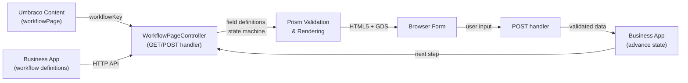
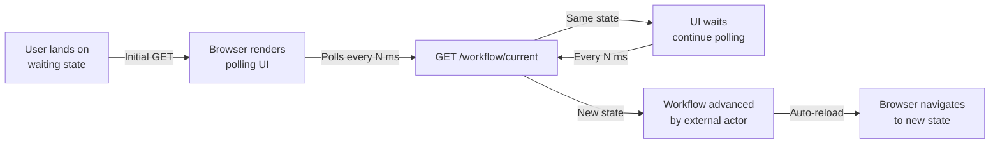
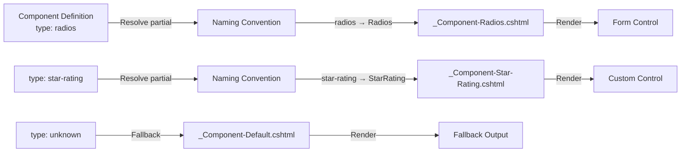

# Setting Up a Prism Workflow

> **⚠️ v2.0 Schema Update:** This guide is being updated for v2.0. JSON examples still use the legacy v1 schema (`fieldType`, flat `fields[]`). The fluent builder API examples have been updated. See [walkthroughs/](../walkthroughs/) for complete v2.0 examples with the polymorphic component model (`type` discriminator, `children[]`, `conditionalChildren`).

A complete guide to building and deploying a multi-step workflow form using Umbraco.Prism.

## Overview

Prism is a workflow rendering engine that connects your Umbraco website to a Business App (a separate .NET web API). The Business App defines the workflow structure—steps, fields, validation rules—as JSON files or C# code. Umbraco renders the forms, handles authentication, and collects user data.

**Key design principle:** Workflows are platform-agnostic. Prism handles presentation and validation; your Business App handles business logic and state transitions.

### Architecture



## What's Prism and What's Your Business App?

> 🔵 **Prism Platform** — Provided by the `UmbracoPrism.Core` package. You don't build this.
> 🟠 **Your Business App** — Your workflow engine, case management system, or API. Replace the mock implementation with your real system.

| Component | Owner | Customise? |
|-----------|-------|-----------|
| Form rendering (Razor views, CSS) | 🔵 Prism | Yes — override partials, add CSS variables |
| HTML5 validation & nonce tamper-proofing | 🔵 Prism | No — automatic |
| Member authentication & sessions | 🔵 Prism | No — uses PrismMemberCookie scheme |
| Umbraco content type & routing | 🔵 Prism | No — automatically wired |
| Workflow definitions (JSON / C#) | 🟠 Your Business App | Yes — you define these |
| State machine & transitions | 🟠 Your Business App | Yes — you define these |
| Business logic validation | 🟠 Your Business App | Yes — implement in endpoints |
| `/api/workflow/*` endpoints | 🟠 Your Business App | Yes — implement these |

**In real integrations:** Your Business App is your existing case management system (ServiceNow, Salesforce, custom .NET API, etc.). Prism remains unchanged — it calls your API via HTTP and renders whatever step you return.

## Prerequisites

Before setting up a workflow, ensure:

1. **Prism is installed** in your Umbraco 17+ project
2. **Members are authenticated** using `PrismMemberCookie` authentication scheme (OIDC configured)
3. **Business App is running** and accessible via HTTP(S) from Umbraco
4. **IBusinessAppWorkflowClient is configured** in `appsettings.json` with the correct endpoint URL and bearer token

## Quick Start: 5 Steps to Running Your First Workflow

1. **Create a workflow definition** — JSON or C# (see examples below)
2. **Create field groups** — define the data to collect
3. **Implement `/api/workflow/get-current` endpoint** — returns the current step and fields
4. **Implement `/api/workflow/advance` endpoint** — processes actions and returns the next step
5. **Create a content node** with the workflow key configured

**Result:** Users see a multi-step form. Validation happens automatically.

---

## Step Types Reference

Every step in a workflow has a `stepType` property that controls how it's rendered. Prism provides 6 built-in step types:

| Step Type | Purpose | Rendering | User Interaction |
|-----------|---------|-----------|------------------|
| `question` | Collects data from the user | Form fields with labels, validation, error messages | User enters data, clicks next/submit |
| `check-answers` | Read-only summary of all answers | Display-only list with "Change" links | User reviews, then confirms or goes back |
| `status-timeline` | Shows the current status and timeline | Timeline widget, status badges | Read-only (no data entry) |
| `task-list` | Shows tasks with individual statuses | List with status indicators (pending, in progress, complete) | Read-only; may have task-specific links |
| `waiting` | Waiting for external processing to complete | Auto-polling spinner with message, optional defer link | Read-only; page auto-refreshes when state changes |
| `confirmation` | Success state — thank you screen | Success message, reference number, next steps | Read-only; offers action to start another workflow |

**Choose the right step type:**
- Use `question` for data collection
- Use `check-answers` before final submission (let users review)
- Use `status-timeline` for showing progress/status timelines (e.g., "Your application is being reviewed")
- Use `task-list` when the workflow is a series of subtasks (e.g., permit application with multiple inspections)
- Use `waiting` for external processing (e.g., payment gateway, background job, approval queue) — the page auto-polls and advances automatically
- Use `confirmation` for the final success state

---

## Creating a Workflow Definition

A workflow definition is a JSON (or C#) blueprint that describes all possible states, transitions, and actions. It does **not** contain field definitions—field definitions live in separate field group files.

### Workflow Definition Structure

```json
{
  "definitionKey": "community-enquiry",
  "displayName": "Get in Touch",
  "version": 1,
  "instancePolicy": "single",
  "initialState": "collecting-details",
  "states": [
    {
      "stateKey": "collecting-details",
      "displayName": "Tell us about your enquiry",
      "stepType": "question",
      "allowedActions": ["submit", "save-draft"],
      "fieldGroupKeys": ["contact-details", "enquiry-info"]
    },
    {
      "stateKey": "check-answers",
      "displayName": "Check your answers",
      "stepType": "check-answers",
      "allowedActions": ["submit", "back"],
      "fieldGroupKeys": []
    },
    {
      "stateKey": "under-review",
      "displayName": "Your enquiry is with us",
      "stepType": "status-timeline",
      "allowedActions": [],
      "fieldGroupKeys": [],
      "statusTimeline": [
        { "label": "Received", "completed": true },
        { "label": "Being reviewed", "completed": false },
        { "label": "Complete", "completed": false }
      ]
    },
    {
      "stateKey": "complete",
      "displayName": "Thank you for reaching out",
      "stepType": "confirmation",
      "allowedActions": ["start-another"],
      "fieldGroupKeys": []
    }
  ],
  "transitions": [
    { "fromState": "collecting-details", "toState": "check-answers", "action": "submit" },
    { "fromState": "collecting-details", "toState": "collecting-details", "action": "save-draft" },
    { "fromState": "check-answers", "toState": "collecting-details", "action": "back" },
    { "fromState": "check-answers", "toState": "under-review", "action": "submit" },
    { "fromState": "under-review", "toState": "complete", "action": "approve", "requiresRole": "reviewer" },
    { "fromState": "complete", "toState": "collecting-details", "action": "start-another" }
  ]
}
```

### Workflow Definition Properties

| Property | Type | Required | Description |
|----------|------|----------|-------------|
| `definitionKey` | string | Yes | Unique identifier for the workflow (e.g., `"community-enquiry"`). Used in URLs and API calls. |
| `displayName` | string | Yes | User-facing name (e.g., `"Get in Touch"`). Displayed in the backoffice. |
| `version` | number | Yes | Semantic version. Increment when changing states or fields. |
| `instancePolicy` | string | Yes | `"single"` (one instance per user), `"multiple"` (unlimited), or `"prompt"` (ask user). |
| `initialState` | string | Yes | The first state users land in (e.g., `"collecting-details"`). |
| `states` | array | Yes | Array of state objects (see State Properties below). |
| `transitions` | array | Yes | Array of transition rules (see Transition Properties below). |

### State Properties

| Property | Type | Required | Description |
|----------|------|----------|-------------|
| `stateKey` | string | Yes | Unique identifier for this state (e.g., `"collecting-details"`). |
| `displayName` | string | Yes | User-facing name displayed at the top of the page (e.g., `"Tell us about your enquiry"`). |
| `stepType` | string | Yes | One of: `question`, `check-answers`, `status-timeline`, `task-list`, `waiting`, `confirmation`. |
| `allowedActions` | array | Yes | Which actions users can take from this state (e.g., `["submit", "save-draft"]`). |
| `fieldGroupKeys` | array | Yes | References to field groups to display (e.g., `["contact-details", "enquiry-info"]`). Empty for read-only steps. |
| `statusTimeline` | array | No | For `status-timeline` step type. Array of `{ label, completed }` objects showing progress. |
| `waitingConfig` | object | No | For `waiting` step type. Configuration for auto-polling behavior (see Waiting State Configuration below). |

### Transition Properties

| Property | Type | Required | Description |
|----------|------|----------|-------------|
| `fromState` | string | Yes | Current state key. |
| `toState` | string | Yes | Next state key. |
| `action` | string | Yes | Action name (e.g., `"submit"`, `"back"`, `"approve"`). Must be in `allowedActions` of the source state. |
| `requiresRole` | string | No | If set, only members with this role can perform this action. Role is checked against user claims. |

---

## Waiting States

Waiting states are used when your workflow needs to pause and wait for external processing to complete — such as payment gateway processing, approval queue review, or background job completion. The page automatically polls for state changes and reloads when the workflow advances.

### When to Use Waiting States

Use a waiting state when:
- **External system is processing** — Payment gateway, email verification, document processing
- **Queue-based workflow** — Waiting for a human reviewer to approve or process the request
- **Background job** — Long-running operation (report generation, data sync) where the user should see progress
- **SLA timer** — You want to inform users of expected wait time

Do **not** use waiting states for:
- **Instant state transitions** — Use regular state navigation instead
- **Read-only status display** — Use `status-timeline` instead
- **Optional user actions** — Use `question` or `task-list` instead

### Waiting State Configuration Reference

| Property | Type | Default | Description |
|----------|------|---------|-------------|
| `message` | string | — | **Required.** Main message shown to the user (e.g., `"We're processing your payment. This usually takes 30 seconds."`). Supports plain text. |
| `expectedWaitSeconds` | number | — | **Required.** Expected duration in seconds. Used to set user expectations (e.g., 30 → `"This usually takes about 30 seconds."`). |
| `pollIntervalMs` | number | 3000 | How often the page polls the server in milliseconds. Lower = more responsive but higher server load. Higher = less load but slower detection. Typical range: 2000–5000. |
| `allowDefer` | boolean | true | Whether to show a "Leave and come back later" link. When true, users can navigate to their workflow hub and return to the instance later. |
| `deferMessage` | string | null | Optional custom message for the defer option. If null, a sensible default is shown. Example: `"You can check status in My Applications."`  |

### JSON Definition Example

Here's a complete workflow with a waiting state:

```json
{
  "definitionKey": "payment-application",
  "displayName": "Submit Payment",
  "version": 1,
  "instancePolicy": "single",
  "initialState": "enter-amount",
  "states": [
    {
      "stateKey": "enter-amount",
      "displayName": "Enter Payment Amount",
      "stepType": "question",
      "allowedActions": ["submit", "cancel"],
      "fieldGroupKeys": ["payment-details"]
    },
    {
      "stateKey": "confirm-details",
      "displayName": "Review Your Payment",
      "stepType": "check-answers",
      "allowedActions": ["submit", "back"],
      "fieldGroupKeys": []
    },
    {
      "stateKey": "processing-payment",
      "displayName": "Processing Your Payment",
      "stepType": "waiting",
      "allowedActions": [],
      "fieldGroupKeys": [],
      "waitingConfig": {
        "message": "We are securely processing your payment. This usually takes about 30 seconds. Please do not close this page.",
        "expectedWaitSeconds": 30,
        "pollIntervalMs": 3000,
        "allowDefer": true,
        "deferMessage": "You can leave and check the status later via My Applications."
      }
    },
    {
      "stateKey": "payment-complete",
      "displayName": "Payment Confirmed",
      "stepType": "confirmation",
      "allowedActions": ["start-another"],
      "fieldGroupKeys": []
    }
  ],
  "transitions": [
    { "fromState": "enter-amount", "toState": "confirm-details", "action": "submit" },
    { "fromState": "confirm-details", "toState": "enter-amount", "action": "back" },
    { "fromState": "confirm-details", "toState": "processing-payment", "action": "submit" },
    { "fromState": "processing-payment", "toState": "payment-complete", "action": "complete" },
    { "fromState": "enter-amount", "toState": "enter-amount", "action": "cancel" }
  ]
}
```

### C# Builder API Example

Using the fluent builder:

```csharp
var workflow = new WorkflowDefinitionBuilder()
    .Key("payment-application")
    .DisplayName("Submit Payment")
    .Version(1)
    .InstancePolicy("single")
    .StartsAt("enter-amount")
    .AddState("enter-amount", state => state
        .DisplayName("Enter Payment Amount")
        .StepType("question")
        .AllowActions("submit", "cancel")
        .WithFieldGroups("payment-details"))
    .AddState("confirm-details", state => state
        .DisplayName("Review Your Payment")
        .StepType("check-answers")
        .AllowActions("submit", "back")
        .WithFieldGroups())
    .AddState("processing-payment", state => state
        .DisplayName("Processing Your Payment")
        .WaitWith(
            message: "We are securely processing your payment. This usually takes about 30 seconds. Please do not close this page.",
            expectedWaitSeconds: 30,
            pollIntervalMs: 3000,
            allowDefer: true,
            deferMessage: "You can leave and check the status later via My Applications."))
    .AddState("payment-complete", state => state
        .DisplayName("Payment Confirmed")
        .StepType("confirmation")
        .AllowActions("start-another")
        .WithFieldGroups())
    .AddTransition("enter-amount", "confirm-details", "submit")
    .AddTransition("confirm-details", "enter-amount", "back")
    .AddTransition("confirm-details", "processing-payment", "submit")
    .AddTransition("processing-payment", "payment-complete", "complete")
    .AddTransition("enter-amount", "enter-amount", "cancel")
    .Build();
```

Note: The `WaitWith()` method automatically sets the step type to `"waiting"` — you do not need to call `.StepType("waiting")` separately.

### How Waiting States Work



**Execution flow:**

1. **User arrives** at a waiting state (e.g., payment gateway has begun processing)
2. **Page renders** a spinner, message, and optional defer link
3. **Browser polls** the Business App's `/api/workflow/current` endpoint every `pollIntervalMs` milliseconds
4. **While waiting** — if the state hasn't changed, the UI continues polling silently
5. **State advances** — When an external actor (e.g., payment webhook) calls `AdvanceAsync` to move to the next state, the polling detects the change
6. **Auto-reload** — The page automatically navigates to the new state and renders its UI

**Accessibility:**
- The polling UI uses ARIA live region (`role="status"`) to announce updates to screen readers
- Users can defer (leave) at any time if `allowDefer: true`
- Navigation via browser back button is prevented while polling (to avoid stale state)

---

Field groups define the data you collect in `question` steps. Each field group is a **separate JSON file** in your Business App's `workflow-seeds/field-groups/` directory.

### Field Group File Structure

**File:** `workflow-seeds/field-groups/contact-details-v1.json`

```json
{
  "groupKey": "contact-details",
  "displayName": "Contact Details",
  "version": 1,
  "fields": [
    {
      "fieldKey": "full-name",
      "label": "Full name",
      "fieldType": "text",
      "required": true,
      "maxLength": 100
    },
    {
      "fieldKey": "email-address",
      "label": "Email address",
      "fieldType": "email",
      "required": true
    },
    {
      "fieldKey": "organisation",
      "label": "Organisation (optional)",
      "fieldType": "text",
      "required": false,
      "maxLength": 200
    }
  ]
}
```

**File:** `workflow-seeds/field-groups/enquiry-info-v1.json`

```json
{
  "groupKey": "enquiry-info",
  "displayName": "Your Enquiry",
  "version": 1,
  "fields": [
    {
      "fieldKey": "enquiry-type",
      "label": "What's your enquiry about?",
      "fieldType": "select",
      "required": true,
      "options": [
        "General enquiry",
        "Technical support",
        "Partnership",
        "Other"
      ]
    },
    {
      "fieldKey": "message",
      "label": "Your message",
      "fieldType": "textarea",
      "required": true,
      "maxLength": 5000,
      "minLength": 10
    }
  ]
}
```

### Field Group Properties

| Property | Type | Required | Description |
|----------|------|----------|-------------|
| `groupKey` | string | Yes | Unique identifier for the group (e.g., `"contact-details"`). Referenced in workflow states via `fieldGroupKeys`. |
| `displayName` | string | Yes | Human-readable name (e.g., `"Contact Details"`). Used as a section heading. |
| `version` | number | Yes | Semantic version of the field group. |
| `fields` | array | Yes | Array of field objects (see Field Properties below). |

### Field Properties

| Property | Type | Required | Description |
|----------|------|----------|-------------|
| `fieldKey` | string | Yes | Unique identifier within the group (e.g., `"full-name"`). Used as the form input name. |
| `label` | string | Yes | User-facing label displayed above the input (e.g., `"Full name"`). |
| `fieldType` | string | Yes | Type of input (see Available Field Types below). |
| `required` | bool | No | If true, field must have a value. Default: false. |
| `maxLength` | number | No | Maximum character length (enforced client- and server-side). |
| `minLength` | number | No | Minimum character length. |
| `min` | number | No | Minimum numeric value (for `number` fields). |
| `max` | number | No | Maximum numeric value (for `number` fields). |
| `pattern` | string | No | Regex pattern for validation (e.g., `"^[A-Z]{2}\\d{1,5}$"` for postcodes). |
| `options` | array | No | For `select`, `radio`, `checkbox`: plain string array of options (e.g., `["Option A", "Option B"]`). |
| `defaultValue` | string | No | Pre-filled value (can be overridden by authenticated user claims). |
| `readOnly` | bool | No | If true, field is displayed but cannot be edited. |
| `conditionalOn` | string | No | Field key that triggers this field's visibility (see Conditional Logic below). |
| `visibleWhen` | array | No | Values of the triggering field that make this field visible. |

---

## Available Field Types

| Field Type | Renders As | Example | Validation |
|-----------|-----------|---------|-----------|
| `text` | HTML5 text input | `<input type="text">` | `maxLength`, `minLength`, `pattern` |
| `email` | HTML5 email input | `<input type="email">` | Built-in email format validation |
| `number` | HTML5 number input | `<input type="number">` | `min`, `max` |
| `date-input` | GDS date input (day/month/year) | Three text inputs (gov.uk style) | Built-in date validation |
| `textarea` | Multi-line text area | `<textarea>` | `maxLength`, `minLength` |
| `select` | Dropdown list | `<select>` | Must match `options` array |
| `radio` | Radio button group | `<input type="radio">` x N | Must match `options` array |
| `checkbox` | Single checkbox | `<input type="checkbox">` | Boolean |
| `checkboxes` | Multiple checkboxes | `<input type="checkbox">` x N | Must match `options` array; array of selected values |
| `file-upload` | File input (scan/document) | `<input type="file">` | MIME type, max file size (configurable) |
| `hidden` | Not displayed to user | Hidden input in form | Never visible; used for internal data |

---

## Custom Field Types

The field type system is **extensible by convention**. You can create custom field types without modifying Prism Core.

### How Custom Field Types Work

The `<prism-field>` tag helper dispatches field rendering to Razor partials by convention:



**Convention Rule:** Field type `"kebab-case-name"` resolves to `_PrismField-PascalCaseName.cshtml`

| Field Type | Resolves To |
|-----------|-----------|
| `text` | `_PrismField-Text.cshtml` |
| `email` | `_PrismField-Email.cshtml` |
| `star-rating` | `_PrismField-Star-Rating.cshtml` |
| `my-custom-widget` | `_PrismField-My-Custom-Widget.cshtml` |
| Unknown type | `_PrismField-Default.cshtml` (fallback) |

### Built-in Field Types Quick Reference

| Field Type | Partial | Purpose |
|-----------|---------|---------|
| `text` | `_PrismField-Text.cshtml` | Standard text input |
| `email` | `_PrismField-Email.cshtml` | Email with autocomplete |
| `number` | `_PrismField-Number.cshtml` | Integer input with min/max |
| `decimal` | `_PrismField-Decimal.cshtml` | Decimal input (step="any"); supports prefix |
| `textarea` | `_PrismField-Textarea.cshtml` | Multi-line text |
| `select` | `_PrismField-Select.cshtml` | Dropdown from options |
| `radio` | `_PrismField-Radio.cshtml` | Radio button group (GDS fieldset/legend) |
| `boolean` | `_PrismField-Boolean.cshtml` | Single checkbox (GDS pattern) |
| `checkboxlist` | `_PrismField-Checkboxlist.cshtml` | Multi-select checkbox group (comma-separated value) |
| `date` | `_PrismField-Date.cshtml` | Three inputs (day/month/year) with GDS styling |
| `datetime` | `_PrismField-Datetime.cshtml` | Date and time picker |
| `inset-text` | `_PrismField-Inset-Text.cshtml` | Static inset box (no form control) |
| `warning-text` | `_PrismField-Warning-Text.cshtml` | GDS warning component (no form control) |

---

## Creating a Custom Field Type

To add a new field type, create a Razor partial in `~/Views/Partials/PrismFields/` following the naming convention. The partial receives `@model UmbracoPrism.Core.Models.Workflow.PrismFieldContext`.

### Step-by-Step Example: Star Rating

Suppose you want a 5-star rating field type that isn't provided out-of-the-box.

**Step 1: Define the field in your workflow JSON**

```json
{
  "fieldKey": "satisfaction",
  "label": "How satisfied were you?",
  "fieldType": "star-rating",
  "required": true
}
```

**Step 2: Create the partial file**

File: `~/Views/Partials/PrismFields/_PrismField-Star-Rating.cshtml`

```cshtml
@model UmbracoPrism.Core.Models.Workflow.PrismFieldContext

<div class="@Model.WrapperClass"@Html.Raw(Model.WrapperAttrs)>
    @await Html.PartialAsync("~/Views/Partials/PrismFields/_PrismFieldLabel.cshtml", Model)
    
    <fieldset class="govuk-fieldset star-rating" data-module="star-rating">
        <legend class="govuk-visually-hidden">@Model.Field.Label rating</legend>
        
        @for (var i = 1; i <= 5; i++)
        {
            var starId = $"{Model.Field.FieldKey}-{i}";
            <div class="star-rating__item">
                <input type="radio"
                       id="@starId"
                       name="fields[@Model.Field.FieldKey]"
                       value="@i"
                       class="star-rating__input govuk-visually-hidden"
                       @(Model.DisplayValue == i.ToString() ? "checked" : "")
                       @Html.Raw(Model.RequiredAttr)
                       @Html.Raw(Model.AriaRequired)
                       @Html.Raw(Model.AriaInvalid) />
                <label for="@starId" class="star-rating__label" aria-label="@i star@(i > 1 ? "s" : "")">★</label>
            </div>
        }
    </fieldset>
</div>
```

**Step 3: Add CSS (optional)**

File: `~/css/components/star-rating.css` (or embedded in your stylesheet)

```css
.star-rating {
    display: flex;
    gap: 0.5rem;
    border: none;
    padding: 0;
    margin: 0;
}

.star-rating__item {
    position: relative;
}

.star-rating__input {
    position: absolute;
    opacity: 0;
}

.star-rating__label {
    cursor: pointer;
    font-size: 2rem;
    color: #b1b4b6;
    transition: color 0.2s ease-in-out;
}

.star-rating__input:checked ~ .star-rating__label,
.star-rating__label:hover,
.star-rating__input:hover ~ .star-rating__label {
    color: #ffd700;
}

.star-rating__input:focus ~ .star-rating__label {
    outline: 3px solid #0b0c0c;
    outline-offset: 2px;
}
```

**Step 4: Use it in your workflow**

The custom field type is now available and will render whenever `"fieldType": "star-rating"` is used in any field definition.

```json
{
  "fieldKey": "satisfaction",
  "label": "How satisfied were you?",
  "fieldType": "star-rating",
  "required": true
}
```

---

## PrismFieldContext Reference

All field type partials receive a `PrismFieldContext` model containing field metadata, validation state, and pre-built attribute strings.

### Core Properties

| Property | Type | Description |
|----------|------|-------------|
| `Field` | `FieldRenderPayload` | The raw field definition from JSON |
| `DisplayValue` | `string` | Resolved value: submitted > default > stored |
| `HasFieldError` | `bool` | Whether a validation error exists for this field |
| `FieldError` | `string` | The error message text (if any) |

### Field Definition Properties (via `Field.*`)

| Property | Type | Description |
|----------|------|-------------|
| `FieldKey` | `string` | Unique identifier (HTML id and name) |
| `Label` | `string` | Visible label text |
| `Hint` | `string` | Optional hint/help text |
| `Required` | `bool` | Whether field is required |
| `Options` | `List<string>` | Option list (for `radio`, `select`, `checkboxlist`) |
| `Prefix` | `string` | Currency/unit prefix (e.g. "£" for decimal fields) |
| `Min`, `Max` | `decimal?` | Numeric constraints |
| `MinLength`, `MaxLength` | `int?` | String length constraints |
| `Pattern` | `string` | Regex pattern constraint |
| `ReadOnly` | `bool` | Whether field is readonly |
| `ConditionalOn` | `string` | Parent field key for conditional display |
| `VisibleWhen` | `List<string>` | Values that make this field visible |
| `Content` | `string` | Content for `inset-text` and `warning-text` types |

### Accessibility & Aria Attributes (Pre-built)

| Property | Type | Example | Purpose |
|----------|------|---------|---------|
| `HintId` | `string` | `"full-name-hint"` | ID for hint text (if present) |
| `ErrorId` | `string` | `"full-name-error"` | ID for error message (if present) |
| `DescribedBy` | `string` | `'aria-describedby="full-name-hint full-name-error"'` | Pre-built attribute string |
| `RequiredAttr` | `string` | `' required'` or `""` | For HTML5 validation |
| `AriaRequired` | `string` | `' aria-required="true"'` or `""` | Accessibility flag |
| `AriaInvalid` | `string` | `' aria-invalid="true"'` or `""` | Indicates validation error |
| `ReadOnlyAttr` | `string` | `' readonly aria-readonly="true"'` or `""` | Readonly state |

### Constraint Attributes (Pre-built)

| Property | Example | Purpose |
|----------|---------|---------|
| `MinLengthAttr` | `' minlength="5"'` | HTML5 minlength validation |
| `MaxLengthAttr` | `' maxlength="100"'` | HTML5 maxlength validation |
| `MinAttr` | `' min="0"'` | HTML5 min value |
| `MaxAttr` | `' max="100"'` | HTML5 max value |
| `PatternAttr` | `' pattern="[A-Z]{2}"'` | HTML5 pattern validation |

### CSS & Wrapper

| Property | Type | Example |
|----------|------|---------|
| `WrapperClass` | `string` | `"govuk-form-group govuk-form-group--error"` (includes error state) |
| `WrapperAttrs` | `string` | `' data-conditional="parent-key" data-visible-when="value1,value2"'` (for conditionals) |

### Usage Example in a Custom Partial

```cshtml
@model UmbracoPrism.Core.Models.Workflow.PrismFieldContext

<div class="@Model.WrapperClass"@Html.Raw(Model.WrapperAttrs)>
    <label for="@Model.Field.FieldKey" class="govuk-label">
        @Model.Field.Label
        @if (Model.Field.Required)
        {
            <span class="govuk-required-indicator">*</span>
        }
    </label>
    
    @if (!string.IsNullOrEmpty(Model.Field.Hint))
    {
        <div id="@Model.HintId" class="govuk-hint">
            @Model.Field.Hint
        </div>
    }
    
    <input type="text"
           id="@Model.Field.FieldKey"
           name="fields[@Model.Field.FieldKey]"
           value="@Model.DisplayValue"
           @Html.Raw(Model.RequiredAttr)
           @Html.Raw(Model.AriaRequired)
           @Html.Raw(Model.AriaInvalid)
           @Html.Raw(Model.DescribedBy)
           @Html.Raw(Model.MaxLengthAttr) />
    
    @if (Model.HasFieldError)
    {
        <span id="@Model.ErrorId" class="govuk-error-message">
            <span class="govuk-visually-hidden">Error:</span>
            @Model.FieldError
        </span>
    }
</div>
```

---

## Overriding Built-in Field Types

You can replace any built-in field type by creating your own partial with the same name. For example, to customize the `text` field type:

1. Create `~/Views/Partials/PrismFields/_PrismField-Text.cshtml` with your custom implementation
2. It will be used instead of the built-in version
3. The convention is the same—your partial receives `PrismFieldContext`

**Use case:** Customize styling, add extra validation logic, or integrate third-party libraries (e.g., rich text editor for textarea, date picker library).

---

## Accessibility Notes

When building custom field types:

1. **Use semantic HTML** — `<fieldset>` and `<legend>` for grouped inputs (radio, checkbox)
2. **Wire accessibility attributes** — Use the pre-built `AriaRequired`, `AriaInvalid`, and `DescribedBy` properties from `PrismFieldContext`
3. **Associate labels** — Always use `<label for="...">` tied to the input `id`
4. **Provide error context** — Display `Model.FieldError` with `id="@Model.ErrorId"` for screen readers
5. **Support focus indicators** — Ensure keyboard navigation is visible (outline/border on `:focus`)
6. **Test with a screen reader** — Use NVDA (Windows), JAWS, or VoiceOver (macOS) to verify announcements

**GDS (GOV.UK Design System) patterns** already follow these conventions. When in doubt, review the existing partials in `~/Views/Partials/PrismFields/` for reference.

---

## Using C# Fluent Builder (Alternative to JSON)

Prism provides a fluent builder API as an alternative to hand-writing JSON. Use this if you prefer type-safe C# or want to generate definitions programmatically.

### Workflow Definition Builder

```csharp
using UmbracoPrism.Core.Models.Workflow;
using UmbracoPrism.Core.Builders;

var definition = new WorkflowDefinitionBuilder()
    .Key("community-enquiry")
    .DisplayName("Get in Touch")
    .Version(1)
    .InstancePolicy("single")
    .StartsAt("collecting-details")
    .AddState("collecting-details", state => state
        .DisplayName("Tell us about your enquiry")
        .StepType("question")
        .AllowActions("submit", "save-draft")
        .WithFieldGroups("contact-details", "enquiry-info"))
    .AddState("check-answers", state => state
        .DisplayName("Check your answers")
        .StepType("check-answers")
        .AllowActions("submit", "back")
        .WithFieldGroups())
    .AddState("under-review", state => state
        .DisplayName("Your enquiry is with us")
        .StepType("status-timeline")
        .AllowActions()
        .WithFieldGroups()
        .WithTimeline(
            ("Received", true),
            ("Being reviewed", false),
            ("Complete", false)))
    .AddState("complete", state => state
        .DisplayName("Thank you for reaching out")
        .StepType("confirmation")
        .AllowActions("start-another")
        .WithFieldGroups())
    .AddTransition("collecting-details", "check-answers", "submit")
    .AddTransition("collecting-details", "collecting-details", "save-draft")
    .AddTransition("check-answers", "collecting-details", "back")
    .AddTransition("check-answers", "under-review", "submit")
    .AddTransition("under-review", "complete", "approve", requiresRole: "reviewer")
    .AddTransition("complete", "collecting-details", "start-another")
    .Build();
```

### Fluent Builder API (v2.0)

```csharp
var workflow = new WorkflowDefinitionBuilder()
    .Key("contact-details")
    .DisplayName("Contact Details")
    .Version(1)
    .InitialState("collecting-info")
    .AddState("collecting-info", state => state
        .DisplayName("Your Information")
        .Fieldset(fs => fs
            .Legend("Contact Details")
            .TextInput(t => t
                .FieldKey("full-name")
                .Label("Full name")
                .Required()
        .MaxLength(100))
    .AddField("email-address", f => f
        .Label("Email address")
        .FieldType("email")
        .Required())
    .AddField("organisation", f => f
        .Label("Organisation (optional)")
        .FieldType("text")
        .MaxLength(200))
    .Build();
```

The builder ensures all required properties are set and provides IntelliSense guidance. Both JSON and builder approaches produce identical runtime behavior.

---

## Connecting to Umbraco

Once your workflow definition and field groups are ready, connect them to an Umbraco content page.

### Step 1: Create a Content Type

> 🔵 **Prism Platform** — Prism provides a content type generator. Run this once to create the `workflowPage` content type in your Umbraco backoffice.

In Umbraco's backoffice:
1. **Content** → **Content Types**
2. Look for **`workflowPage`** — if it exists, skip to Step 2
3. If not, run the Prism seeding command (see ASPIRE_DEV.md for details)

The `workflowPage` content type has these properties:
- **Workflow Key** — the `definitionKey` from your workflow definition (e.g., `"community-enquiry"`)
- **Page Title** — e.g., "Get in Touch"
- **Page Description** — e.g., "Submit an enquiry to our team"

### Step 2: Create a Content Node

1. Go to **Content**
2. Click **+ Create**
3. Choose **`workflowPage`** as the content type
4. Set **Workflow Key** to your workflow's `definitionKey` (e.g., `"community-enquiry"`)
5. Publish
6. Navigate to the published URL — you should see the first workflow step

### Step 3: Verify Routing

Umbraco automatically route-hijacks the `workflowPage` content type with the `WorkflowPageController` (provided by Prism). When you visit the page:

- **GET request** → Controller calls Business App's `/api/workflow/get-current` endpoint
- **Business App responds** with the current step and fields
- **Controller renders** the appropriate Razor partial (e.g., `_WorkflowStep-question.cshtml`)
- **User sees** the first workflow step

---

## Implementing a Workflow Controller

Prism provides a base controller class that handles all GET/POST logic automatically. Most projects only need to use the base class as-is, or override one method to pre-populate user data from claims.

### Minimal Controller Implementation

```csharp
using Microsoft.AspNetCore.Authorization;
using Microsoft.AspNetCore.Mvc.ViewEngines;
using Microsoft.Extensions.Logging;
using UmbracoPrism.Core.Controllers;
using UmbracoPrism.Core.Services;
using Umbraco.Cms.Core.Models.PublishedContent;
using Umbraco.Cms.Core.Web;
using Microsoft.AspNetCore.Antiforgery;

namespace YourApp.Controllers;

/// <summary>
/// Handles GET/POST for workflow pages. The base class handles all routing,
/// validation, and Business App communication. You only override PrePopulateFieldsFromClaims
/// if you want to auto-fill fields from the authenticated user's claims.
/// </summary>
[Authorize(AuthenticationSchemes = "PrismMemberCookie")]
public class WorkflowPageController(
    ILogger<WorkflowPageController> logger,
    ICompositeViewEngine compositeViewEngine,
    IUmbracoContextAccessor umbracoContextAccessor,
    IBusinessAppWorkflowClient workflowClient,
    IPublishedValueFallback publishedValueFallback,
    IAntiforgery antiforgery,
    IWorkflowStepNonceService nonceService,
    IWorkflowFieldValidator fieldValidator)
    : PrismWorkflowPageController(logger, compositeViewEngine, umbracoContextAccessor,
        workflowClient, publishedValueFallback, antiforgery, nonceService, fieldValidator)
{
    // The base class handles everything. Override PrePopulateFieldsFromClaims() below
    // only if you need to pre-fill fields from user claims.
}
```

### Pre-Populating Fields from User Claims (Optional)

If you want to auto-fill common fields (email, name) from the authenticated user's claims, override `PrePopulateFieldsFromClaims()`:

```csharp
[Authorize(AuthenticationSchemes = "PrismMemberCookie")]
public class WorkflowPageController(
    ILogger<WorkflowPageController> logger,
    ICompositeViewEngine compositeViewEngine,
    IUmbracoContextAccessor umbracoContextAccessor,
    IBusinessAppWorkflowClient workflowClient,
    IPublishedValueFallback publishedValueFallback,
    IAntiforgery antiforgery,
    IWorkflowStepNonceService nonceService,
    IWorkflowFieldValidator fieldValidator)
    : PrismWorkflowPageController(logger, compositeViewEngine, umbracoContextAccessor,
        workflowClient, publishedValueFallback, antiforgery, nonceService, fieldValidator)
{
    protected override WorkflowResponseEnvelope PrePopulateFieldsFromClaims(WorkflowResponseEnvelope envelope)
    {
        // Base implementation already handles email-address and full-name from standard claims
        // Call base to get the standard behavior, then add custom logic below if needed
        var updated = base.PrePopulateFieldsFromClaims(envelope);

        // Example: pre-fill a custom department field from a claim
        var department = HttpContext.User.FindFirstValue("department");
        if (!string.IsNullOrEmpty(department))
        {
            // Update field groups to set department field's default value
            // (this is an example; real implementation depends on your field group structure)
        }

        return updated;
    }
}
```

**What the base class provides automatically:**
- ✅ GET: Calls Business App, renders the current step
- ✅ POST: Validates form, advances workflow, redirects (PRG pattern)
- ✅ Antiforgery validation
- ✅ Nonce tamper-proofing
- ✅ Field validation (client + server)
- ✅ Pre-populates `email-address` and `full-name` from authenticated user claims
- ✅ Error display and form repopulation on validation failure

---

## Conditional Logic

Workflows often need conditional fields: show Field B only if Field A has a certain value.

### Conditional Visibility

Use `conditionalOn` and `visibleWhen` properties:

```json
{
  "groupKey": "enquiry-details",
  "displayName": "Enquiry Details",
  "version": 1,
  "fields": [
    {
      "fieldKey": "enquiry-type",
      "label": "Type of enquiry",
      "fieldType": "select",
      "required": true,
      "options": ["General", "Technical", "Partnership", "Other"]
    },
    {
      "fieldKey": "technical-issue",
      "label": "Describe the technical issue",
      "fieldType": "textarea",
      "required": true,
      "conditionalOn": "enquiry-type",
      "visibleWhen": ["Technical"]
    },
    {
      "fieldKey": "partnership-interest",
      "label": "What kind of partnership?",
      "fieldType": "textarea",
      "required": true,
      "conditionalOn": "enquiry-type",
      "visibleWhen": ["Partnership"]
    }
  ]
}
```

**Behavior:**
- `technical-issue` is hidden until `enquiry-type` is set to `"Technical"`
- `partnership-interest` is hidden until `enquiry-type` is set to `"Partnership"`
- Users only see relevant fields

**How Prism handles conditional fields:**
- HTML5 attributes hide fields client-side (instant feedback)
- Server-side validation skips hidden fields (no false "required" errors)
- On `check-answers` step, hidden fields are not displayed in the review

### Conditional Fields in C# Builder

```csharp
.AddField("enquiry-type", f => f
    .Label("Type of enquiry")
    .FieldType("select")
    .Required()
    .WithOptions("General", "Technical", "Partnership", "Other"))
.AddField("technical-issue", f => f
    .Label("Describe the technical issue")
    .FieldType("textarea")
    .Required()
    .ConditionalOn("enquiry-type", "Technical"))
.AddField("partnership-interest", f => f
    .Label("What kind of partnership?")
    .FieldType("textarea")
    .Required()
    .ConditionalOn("enquiry-type", "Partnership"))
```

---

## Role-Restricted Transitions

Some workflows require role checks: only managers can approve an application, only reviewers can reject.

### Checking Roles on Transitions

Add `requiresRole` to a transition:

```json
{
  "transitions": [
    { "fromState": "under-review", "toState": "approved", "action": "approve", "requiresRole": "reviewer" },
    { "fromState": "under-review", "toState": "rejected", "action": "reject", "requiresRole": "reviewer" },
    { "fromState": "approved", "toState": "complete", "action": "send-confirmation", "requiresRole": "admin" }
  ]
}
```

**How Prism handles role checks:**
- The action is rendered in the UI for all users
- When a user without the required role clicks the action, the Business App's `/api/workflow/advance` endpoint is called
- The Business App checks the user's roles (via JWT claims) and returns an error if the user is not authorized
- Prism displays the error message to the user

**In your Business App:**
```csharp
// In your /api/workflow/advance endpoint
var hasRole = claims.FirstOrDefault(c => c.Type == "roles")?.Value?.Contains(transition.RequiresRole) ?? false;
if (!hasRole)
{
    return new WorkflowResponseEnvelope
    {
        ResponseState = "error",
        Problems = new[] { new WorkflowProblem { Message = "You don't have permission to approve this." } }
    };
}
```

---

## Instance Policies

The `instancePolicy` property controls how many workflow instances a single user can have.

| Policy | Behavior | Example |
|--------|----------|---------|
| `"single"` | User can have only one active instance at a time | Application form (users submit one at a time) |
| `"multiple"` | User can have unlimited active instances | Support ticket system (users open many tickets in parallel) |
| `"prompt"` | Ask the user: "Start a new one or continue existing?" | Multi-step process where users might abandon and restart |

**How Prism uses `instancePolicy`:**

When a user visits a workflow page:

1. **`"single"`** — If an existing instance exists, resume it. If not, create a new one.
2. **`"multiple"`** — Always create a new instance.
3. **`"prompt"`** — If an existing instance exists, show the user a choice ("Continue" or "Start new").

---

## Summary: Complete Workflow Setup Checklist

- [ ] Define workflow JSON (or use C# builder) with states and transitions
- [ ] Create field group JSON files (separate files, in `workflow-seeds/field-groups/`)
- [ ] Implement Business App endpoints:
  - [ ] `GET /api/workflow/get-current` — returns current step and fields
  - [ ] `POST /api/workflow/advance` — processes action and returns next step
- [ ] Create `workflowPage` content type in Umbraco (auto-generated by Prism)
- [ ] Create a content node with `workflowKey` configured
- [ ] Implement minimal `WorkflowPageController` (or use base class as-is)
- [ ] Publish and test

**Next steps:**
- [Customise Workflow UI](./workflow-customisation.md) — override partials, adjust CSS
- [Form Validation](./workflow-forms-validation.md) — understand validation layers
- [GDS Components](./workflow-gds-components.md) — available form elements and patterns
