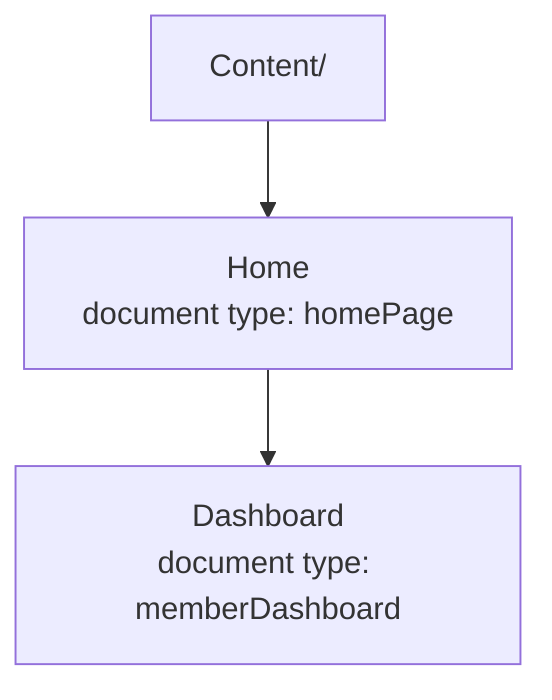

# Adding Prism to Your Umbraco Site

This guide walks you through adding Umbraco Prism to an existing Umbraco v17+ site (or bootstrapping it in a greenfield project). The process is designed to be minimal: install the package, register services, and Prism handles the rest.

## 1. Install the NuGet Package

In your Umbraco project:

```bash
dotnet add package UmbracoPrism
```

## 2. Configure Program.cs

Your `Program.cs` needs just one line to register Prism services. Key Vault setup is optional.

### Register Prism Services

Add Prism services after Umbraco setup:

```csharp
builder.Services.AddUmbraco(env, builder.Configuration)
    .AddBackOffice()
    .AddWebsite()
    .AddComposers()
    .Build();

// Add this line:
builder.Services.AddPrism(builder.Configuration);
```

### Optional: Key Vault for Production

If using Azure Key Vault in production, Prism loads secrets automatically when you add `Prism:VaultUri` to your `appsettings.json`:

```json
{
  "Prism": {
    "VaultUri": "https://prismvault.vault.azure.net/"
  }
}
```

That's all you need. Secrets load automatically on first use (fail-late, the default). 

**Authentication note:** `Prism:VaultUri` is all this config needs to *say*, but Key Vault access
itself goes through `DefaultAzureCredential`, which needs *something* in its credential chain to
actually succeed — this "just works" in two common cases, and needs one explicit extra step in a
third:
- **Local development**: your machine's own interactive Azure CLI/Visual Studio sign-in is picked
  up automatically. Nothing to configure.
- **Hosted on Azure itself** (App Service, a VM, etc.): a Managed Identity is picked up
  automatically. Nothing to configure — no app registration needed at all.
- **Hosted anywhere else** (a plain VPS, on-prem, another cloud): neither of the above exists, so
  `DefaultAzureCredential` has nothing to fall back to. You need a real service-principal identity
  — a dedicated Entra app registration, in whichever tenant owns the Key Vault (which may not be
  the same tenant as your OIDC login app — Entra External ID tenants in particular are usually
  standalone identity directories with no Azure subscription of their own) — granted the **Key
  Vault Secrets User** role, with its Client ID/Secret/Tenant ID supplied as the standard
  `AZURE_CLIENT_ID`/`AZURE_CLIENT_SECRET`/`AZURE_TENANT_ID` environment variables.

For fail-fast behavior (validate Key Vault at startup), optionally add this line to `Program.cs` **before** `builder.AddUmbraco()`:

```csharp
builder.AddPrismKeyVault();
```

**Full example `Program.cs` (with optional Key Vault fail-fast):**

```csharp
var builder = WebApplication.CreateBuilder(args);

// Optional: Configure Key Vault for fail-fast validation at startup
// (Key Vault loads automatically if Prism:VaultUri is in appsettings)
builder.AddPrismKeyVault();

// Register Umbraco and Prism services
builder.Services.AddUmbraco(env, builder.Configuration)
    .AddBackOffice()
    .AddWebsite()
    .AddComposers()
    .Build();

builder.Services.AddPrism(builder.Configuration);

var app = builder.Build();
// ... rest of Program.cs
```

**Minimal example `Program.cs` (no Key Vault line needed for local dev):**

```csharp
var builder = WebApplication.CreateBuilder(args);

// Register Umbraco and Prism services
builder.Services.AddUmbraco(env, builder.Configuration)
    .AddBackOffice()
    .AddWebsite()
    .AddComposers()
    .Build();

builder.Services.AddPrism(builder.Configuration);

var app = builder.Build();
// ... rest of Program.cs
```

## 3. What Happens Automatically on First Startup

When your Umbraco site starts, Prism's `PrismContentTypeSeeder` runs automatically:

- **Creates two document types** (if they don't exist):
  - `homePage`, the root/landing page type
  - `memberDashboard`, the authenticated member portal page type
- **Non-destructive:** If either type already exists, Prism skips creation and uses what's there.
- **No breaking changes:** Existing content, members, and navigation remain untouched.

**What Prism does NOT touch:**
- Your existing content tree (if any)
- Your existing member records
- Navigation menus or other templates
- Any document types outside `homePage` and `memberDashboard`

## 4. Content Tree Structure

Prism expects a simple content hierarchy:



- **Home page:** The public landing page. Users see "Sign In" and "Register" CTAs here.
- **Dashboard page:** A child of Home. Renders only for authenticated members. Shows the member portal with personalized content.

### For Existing Sites (Manual Setup)

If you have an existing Umbraco content tree:

1. **Create a Home page** using the `homePage` document type (if you don't have one).
2. **Create a Dashboard page** as a child of Home, using the `memberDashboard` document type.
3. **Publish both pages.**
4. **Configure your first tenant** in the Prism backoffice dashboard (see step 5 below).

### For New/Greenfield Sites (Auto-Seeding)

If you're starting fresh, set the optional auto-seed flag:

```json
{
  "Prism": {
    "SeedStarterContent": true
  }
}
```

On the next startup, Prism will:
- Create the `homePage` document type
- Create the `memberDashboard` document type
- Auto-create a **Home** page (document type: `homePage`)
- Auto-create a **Dashboard** page (child of Home, document type: `memberDashboard`)
- Auto-create a **Content Blueprint** so editors can use "Create from Blueprint" for additional member portal pages

Your content tree is then ready to use. No manual page creation needed.

## 5. Configure Your First Tenant

Tenants are managed in the Umbraco backoffice. Navigate to:

**Settings → Prism Dashboard**

In the Prism dashboard:
- **Add a new tenant** with a name and hostname (e.g., `localhost:44345` for local dev, or your production domain).
- **Set the Entra configuration** (OIDC Client ID, Tenant ID, etc.) if using authentication.
- **Configure branding** (logo, colors, theme) in the tenant editor.

For local development without Azure Key Vault, you can test Prism without authentication. The site will render pages but without member sign-in.

### Seeding a Tenant as Code (uSync), and Promoting It Through Environments

Manually adding a tenant via the backoffice is fine for local development, but a real deployment
usually wants tenant config checked into source control and applied automatically on deploy —
the same way any other Umbraco content is managed via uSync. Prism's tenant records are fully
uSync-portable (`PrismTenantHandler`/`PrismTenantSerializer`), so a tenant can be defined as a
`.config` file under `uSync/v17/Tenants/` in your site project, alongside every other uSync file.

Notably, nothing about a tenant record is inherently secret — `EntraTenantId` and `EntraClientId`
are public identifiers (Microsoft's own docs treat both as safe to expose), and `SecretKeyName`
is just the *name* of a secret in Key Vault, not the secret's value. That makes tenant `.config`
files safe to commit even to a public repo.

**Promoting the same file across environments** (dev → staging → production, say, where the
Entra tenant/app registration genuinely differs per environment) uses Prism's own token
mechanism: write `{{TOKEN_NAME}}` (uppercase, digits, underscores) instead of a literal value for
any `Identity` field except `Hostname`, and it resolves live against `IConfiguration` — meaning a
plain environment variable of that exact name — every time the tenant is looked up, not just
once at import time (`TenantService` calls `ITenantTokenResolver.Resolve()` on every `Identity`
field on every lookup; only `Hostname` is resolved once, at uSync import time, since it's the DB's
lookup key and must be stored already-resolved):

```xml
<?xml version="1.0" encoding="utf-8"?>
<PrismTenant Key="17aaedc1-ea01-f94e-7825-a5261d1ad818" Alias="my-tenant" Level="1">
  <Info>
    <Name>My Tenant</Name>
    <Hostname>my-tenant.example.com</Hostname>
    <AllowBiometricLogin>true</AllowBiometricLogin>
  </Info>
  <Identity>
    <EntraTenantId>{{MY_TENANT_ENTRA_TENANT_ID}}</EntraTenantId>
    <EntraClientId>{{MY_TENANT_ENTRA_CLIENT_ID}}</EntraClientId>
    <SecretKeyName>{{MY_TENANT_SECRET_KEY_NAME}}</SecretKeyName>
  </Identity>
  <Branding />
  <MobileBranding />
</PrismTenant>
```

The same committed file works in every environment — only the environment variables differ (set
via whatever your deployment already uses: a systemd `EnvironmentFile`, a container's env config,
GitHub Actions environment secrets/variables surfaced at deploy time, etc.). To apply a new or
changed tenant file to an *already-running* site (not a fresh install, which auto-imports uSync
on first boot), drop a `usync.once` marker file into your uSync root
(`uSync/v17/usync.once`) before restarting the app — a standard uSync convention that tells it to
reapply everything on next boot, not something Prism adds itself.

See [`UmbracoPrism.TestSite`'s own production reference deployment](https://github.com/jonnymuir/Umbraco.Prism/blob/main/src/UmbracoPrism.TestSite/uSync/v17/Tenants/prism-reference.config)
for a real, working example of this pattern.

## 6. The MockBackOffice Demo (Optional)

Prism ships with a `MockBackOffice` example that demonstrates downstream credential flow, showing how Prism tenant credentials can be securely passed to a business API or microservice.

### Running the Demo

In one terminal, start your main Umbraco site:

```bash
dotnet run --project src/UmbracoPrism.TestSite
```

In another terminal, start the MockBackOffice service:

```bash
dotnet run --project src/UmbracoPrism.MockBackOffice
```

### Testing the Demo

1. Navigate to the Umbraco site (e.g., `https://localhost:44345`).
2. Log in or use the Sign In CTA.
3. Once authenticated, visit `/dashboard?callApi=true` in the authenticated session.
4. The dashboard will call the MockBackOffice API to fetch mock data, demonstrating the credential flow in action.

This example shows how Prism isolates tenant identity and can safely propagate context to downstream services without exposing secrets.

## 7. Verify It's Working

After setup, you should see:

- ✅ **Homepage loads** and displays Sign In / Register CTAs (if authentication is configured).
- ✅ **Document types exist:** In Umbraco Settings → Document Types, you see `homePage` and `memberDashboard`.
- ✅ **Content tree is correct:** Home page exists; Dashboard page exists as a child of Home.
- ✅ **Tenant is configured:** In Settings → Prism Dashboard, your tenant is listed and assigned to the appropriate hostname.
- ✅ **Dashboard loads when authenticated:** Log in, navigate to `/dashboard`, and you see the member portal page.

## 8. Next Steps

Once Prism is running:

- **Configure Key Vault (production only):** Add `Prism:VaultUri` to `appsettings.Production.json`. Secrets load automatically. Optionally call `builder.AddPrismKeyVault()` in `Program.cs` for fail-fast validation at startup.
- **Configure Entra authentication** by providing your Entra app registration details in `appsettings.json` (Client ID, Tenant ID, etc.).
- **Customize the dashboard** by editing the Dashboard Razor template (`memberDashboard.cshtml`).
- **Add more pages** under Dashboard by creating new documents and assigning the `memberDashboard` type (or custom subtypes).
- **Add tenant branding overrides** by referencing `<link rel="stylesheet" href="/umbraco/prism/branding.css" />` in your layout — see [branding-design-system.md](branding-design-system.md#how-overrides-reach-the-live-site). Prism doesn't inject this for you.
- **Generate a mobile app** from the Prism backoffice tenant editor to ship native iOS/Android apps for your portal. If you do, your layout needs a few more asset references — see [Wiring the Mobile Shell and Biometric Scripts into Your Layout](walkthroughs/building-a-mobile-app.md#wiring-the-mobile-shell-and-biometric-scripts-into-your-layout).
- **Enable biometric auth** (optional) for returning users to skip OIDC on subsequent app launches. See `/docs/biometric-setup.md` for key configuration details.

For detailed feature walkthroughs, see the main [README.md](../README.md).
