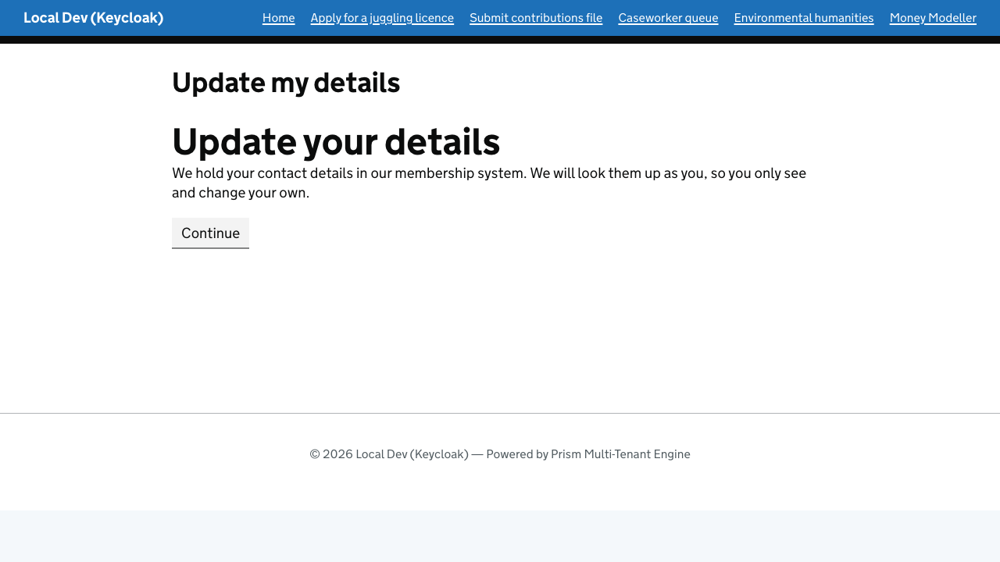
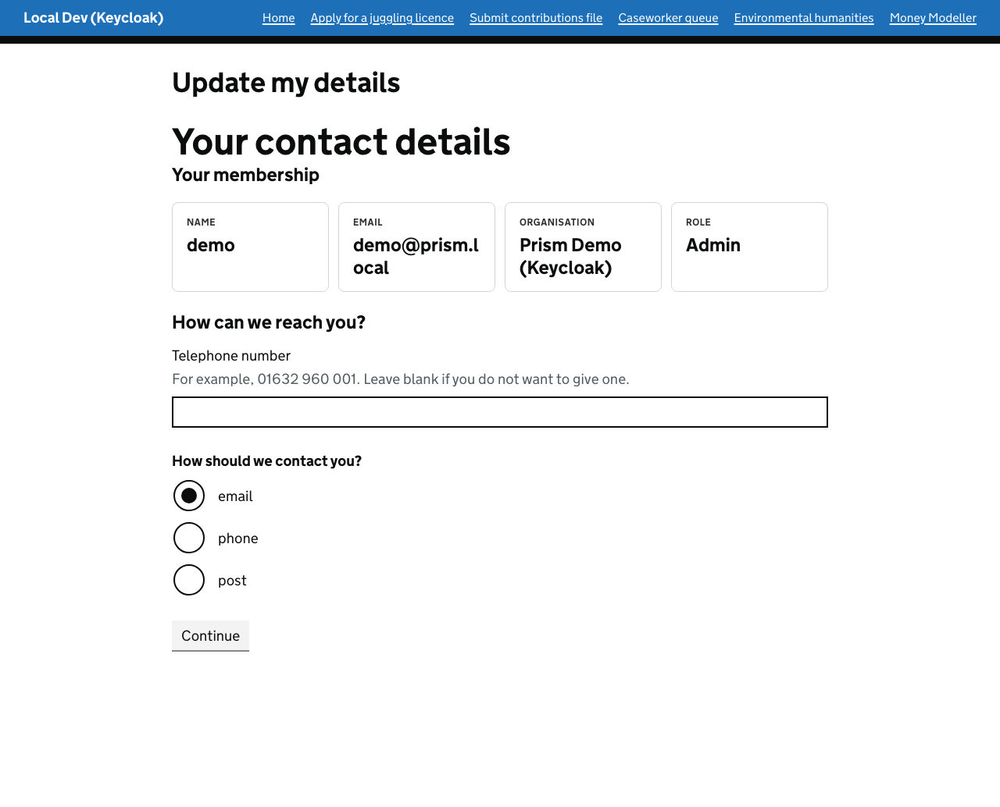
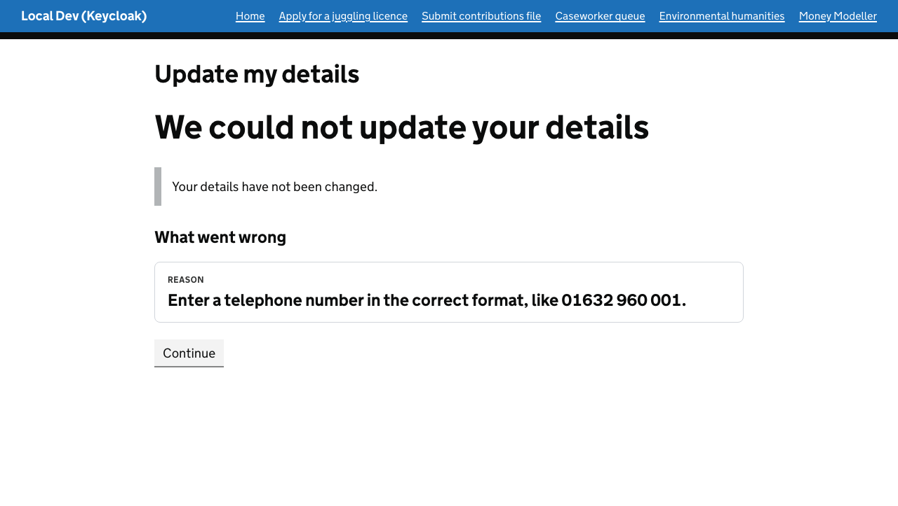
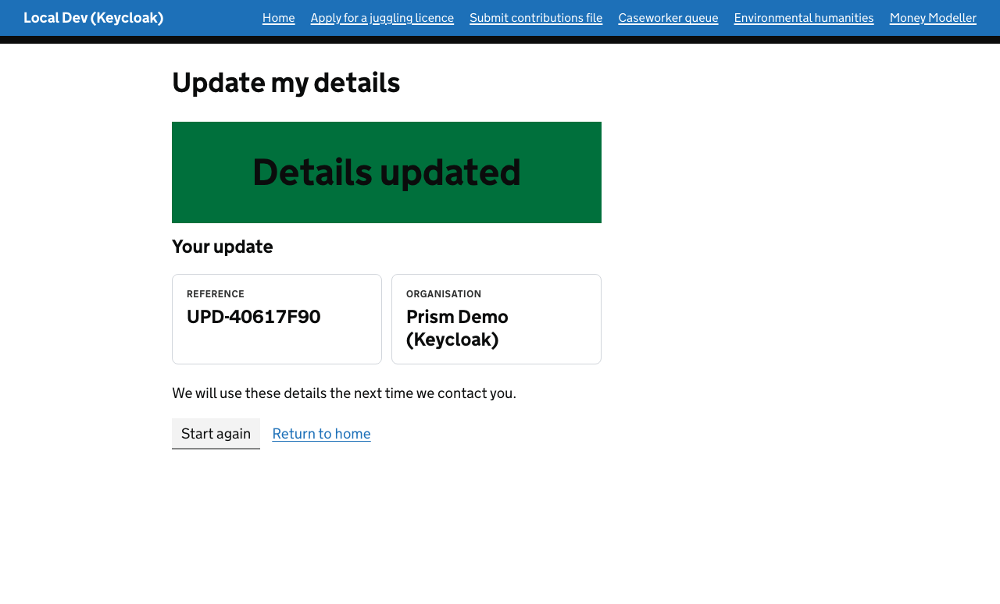
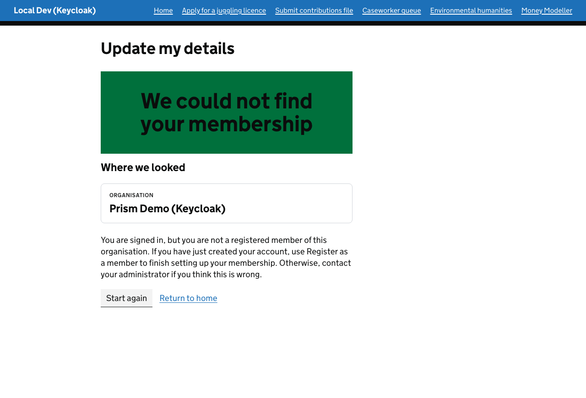

# Calling a business app as the signed-in member

**The question:** a member signs in to a Prism tenant, fills in a front-stage journey, and the
journey needs to ask the organisation's business system something *on their behalf*. How does the
business system know who is asking and which tenant they belong to, without the journey ever
handling a credential?

**The answer in one line:** the stage that makes the call runs inside the member's own request, so
the host's support-system client attaches the member's own bearer token (the same one the
downstream demo uses) to the outgoing call. The business app reads the member and tenant from
that token. Nothing else identifies them.

The example is the `update-my-details` blueprint, the page at `/update-my-details` in TestSite.

---

## The journey

```
 Update your details      (member, front stage)
        |  continue
        v
 Loading your details     (system stage, onEnter: GET  /api/backoffice/profile as the member)
        |  registered / not-registered          member waits at "Details loaded"
        v
 Your contact details     (prefilled from the business app's answer)
        |
 Check your answers
        |  submit
        v
 Saving your details      (system stage, onEnter: PUT  /api/backoffice/profile as the member)
        |  updated / rejected                   member waits at "Details saved"
        v
 Details updated          (shows the business app's reference)
```

Two branches show that a business answer is a route, not an error:

- **`not-registered`**: the member is signed in and the tenant is known, but the business system has
  no member record for them. They see "We could not find your membership".
- **`rejected`**: the business system refused the change (for example a malformed phone number). The
  member returns to the form with the business system's own reason.

## What the member sees



The member's record, read from the business app with their own token. The name, email, organisation and role are the business app's answer, and the phone number and contact preference prefill the form:



A change the business app refuses comes back with its own reason, and the member returns to the form:



An accepted change is confirmed with the business app's own reference:



Someone who can sign in to the tenant but is not a member is told so instead of being shown a form:



## Where each piece lives

| Piece | File |
|---|---|
| Blueprint | `src/UmbracoPrism.TestSite/service-blueprints/update-my-details.json` |
| Capabilities (`load-profile`, `save-profile`) and the client that calls them | `src/UmbracoPrism.TestSite/Services/ServiceDesign/MockBusinessAppProfileClient.cs` |
| The business app's endpoints | `src/UmbracoPrism.MockBusinessApp/Services/Profile/ProfileEndpoints.cs` |
| Tests | `UpdateMyDetailsBlueprintTests.cs`, `MockBusinessAppProfileEndpointsTests.cs` in `UmbracoPrism.Core.Tests` |

## How the identity travels

1. The member signs in; Prism keeps their tokens in the encrypted `PrismMemberCookie`.
2. The member submits the first page. That request enters the `load-profile` stage, whose `onEnter`
   `support-system-call` action invokes `MockBusinessAppProfileClient`.
3. The client resolves `IPrismContext` from the **current request** and calls
   `GetAuthorizationHeaderAsync()`. That reads the cookie, checks the tenant binding, refreshes the
   token if it has expired, and returns the bearer header, or `null`.
4. If there is no header, the client throws and **sends nothing**. A call without the member's token
   would be answered for nobody.
5. The header goes on the outgoing request only. It is not put in the support-system inputs, in a
   field value, or in a log line, so it cannot be rendered to the member or stored with the case.
6. The business app validates the JWT, reads the tenant from its issuer or `tid` claim and the person
   from the verified `email` claim (never `preferred_username`, which a person chooses when they
   register), and looks the member up for **that tenant**.
7. The answer comes back as an outcome (`registered` / `not-registered`, `updated` / `rejected`) plus
   a payload. The engine merges the payload into the case's field values and the matching route fires.

Both capabilities use poll completion. The client makes the call in `InvokeAsync`, holds the answer
in memory against the invocation id, and the join gateway's next poll collects it. That is fine for
a demo. A deployment with several instances, or one that must survive a restart mid-call, would hold
the answer in a shared store.

## Prefilling the form

The business app's answer reaches the form through two `source: "service"` fields,
`profilePhone` and `profileContactPreference`, declared in the blueprint's `calculations`. TestSite's
generic service-field resolver hands back whatever the support system last wrote under those names,
and the form's `defaultFrom` points at them. A support system's *outputs* are not visible to
calculation expressions on their own; declaring a service field with the same key is what exposes one.

## Run it

Start the stack with Aspire (`dotnet run --project src/UmbracoPrism.AppHost`), then:

| Sign in as | Expect |
|---|---|
| `demo@prism.local` / `password` | The edit form, prefilled. Change the phone number and contact preference, check your answers, submit. The confirmation shows a `UPD-` reference. |
| `njf-caseworker@prism.local` / `password` | "We could not find your membership". This user can sign in to the tenant but is not in `PrismBusinessApp:Members`. |

To see the rejected route, enter `not a number` as the phone number.

## What to check for security

- **The token never leaves the outgoing request.** `TheBearerToken_NeverAppearsInAnythingTheMemberIsShown`
  fails if it reaches anything the journey renders.
- **No token, no call.** `WhenNoBearerTokenCanBeReleased_NothingIsSentToTheBusinessApp` fails if the
  client ever falls back to an anonymous call.
- **Tenant comes from the token, not the request.** The same email is registered under two tenants in
  `PrismBusinessApp:Members`. `ThePersonRegisteredInTwoTenants_HasTwoIndependentRecords_AndEachTokenSeesOnlyItsOwn`
  fails if a write under one tenant is visible under the other.
- **A write cannot be aimed at someone else.** `AWriteCannotBeAimedAtAnotherMember_ByNamingThemInTheRequest`
  names another member in the body and shows the body is ignored.
- **Deny by default.** A fallback policy means a route with no policy of its own still demands a
  token, and no route is anonymous outside Development. `MockBusinessAppHostSecurityTests` boots the
  real app, enumerates every route, and fails if one is anonymous or answers without a valid token, so a
  route added later is covered without anyone remembering to test it.
- **Tokens minted for this API only.** The Keycloak tenant sets `Audience`, so a token issued to the
  web client for something else, or its ID token, is rejected. See the app's README for the setting.
- **The token only goes to HTTPS, and nowhere else.** `MemberBearerProvider` refuses any non-HTTPS
  destination, and the clients do not follow redirects.

The app's README lists each practice with the file and test that pins it, as a checklist to copy.

## Limits to know about

- **The call must happen in the member's own request.** A stage entered after a callback or an
  automation resolution has no member cookie, so this pattern does not work there. Keep the
  business-app call on a stage the member's own submit enters. A caseworker acting on a citizen's case
  acts as themselves, not as the citizen.
- **The bearer is short-lived.** That suits a call made at once. For slow work, do the authenticated
  call first and pass its result (not the token) to anything asynchronous, such as an Umbraco
  Automate automation.
- **The profile store is in memory.** A restart of Mock Business App resets every record.
