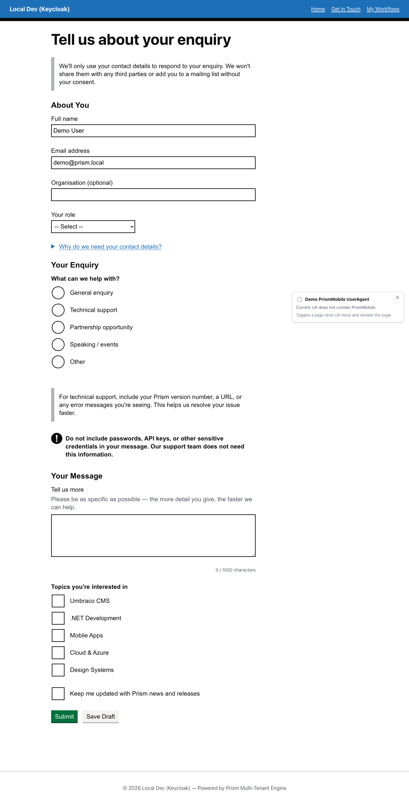
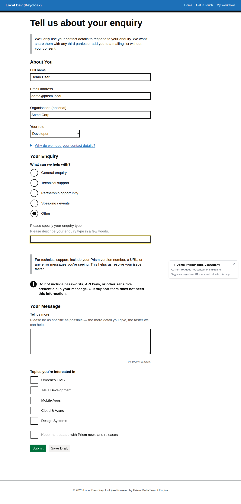
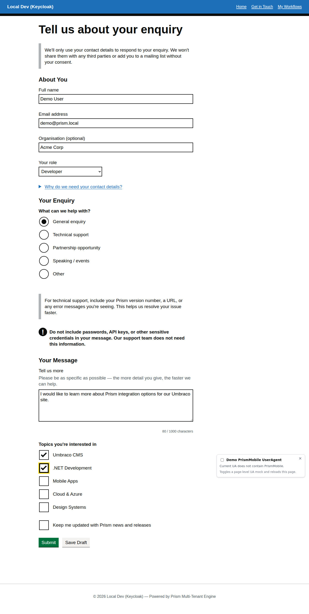
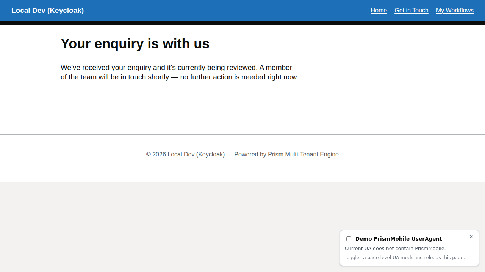

# Community Enquiry Workflow

A multi-section contact form demonstrating the polymorphic component model with conditional reveals, checkboxes, and form validation.

## Overview

The community enquiry workflow (`community-enquiry`) collects contact details and enquiry preferences through a single-page form. It demonstrates:

- **Fieldsets** grouping related fields
- **Conditional radios** with `conditionalChildren` (select "Other" to reveal a text input)
- **Checkboxes** for multi-select options
- **Validation** with required fields and format constraints
- **Readonly fields** pre-populated from authenticated user claims

## Initial Form



The form presents three logical sections:

1. **About You** – Name, email, organisation, and role (fieldset with text, email, and select inputs)
2. **Your Enquiry** – Enquiry type with conditional "Other" option (radios with `conditionalChildren`)
3. **Topics of Interest** – Multi-select checkboxes

### Pre-populated Fields

Notice that "Full name" and "Email address" are readonly and pre-filled with values from the authenticated user's claims. The Prism controller automatically populates these from `ClaimTypes.Name` and `ClaimTypes.Email`.

### Conditional Reveal Pattern



When the user selects **"Other"** under "Type of enquiry", a conditional text input appears asking them to specify the enquiry type. This uses the `conditionalChildren` property on the `radios` component:

```json
{
  "type": "radios",
  "fieldKey": "enquiry-type",
  "label": "Type of enquiry",
  "required": true,
  "options": [
    { "value": "General enquiry", "label": "General enquiry" },
    { "value": "Technical support", "label": "Technical support" },
    { "value": "Partnership", "label": "Partnership" },
    { "value": "Other", "label": "Other" }
  ],
  "conditionalChildren": {
    "Other": [
      {
        "type": "text",
        "fieldKey": "enquiry-type-other-specify",
        "label": "Please specify your enquiry type",
        "required": true,
        "maxLength": 100
      }
    ]
  }
}
```

The `conditionalChildren` dictionary maps radio values to arrays of components that should be revealed when that option is selected.

### Filled Form



A completed form shows the enquiry type selection, the free-text "Tell us more" field, and the chosen topics of interest. In this example: **Organisation:** Acme Corp, **Role:** Developer, **Enquiry type:** General enquiry, topics **Umbraco CMS** and **.NET Development** checked.

### After Submission



Successful submission transitions the instance to its terminal state and displays a confirmation panel. Subsequent visits to `/get-in-touch` show this same confirmation — the `single` instance policy means no new instance can be started until the current one is reset or resolved.

### Workflow Admin handoff (development only)

In the local demo, this is also the point where a tester or operator can pick up the story in the [Workflow Administration walkthrough](workflow-administration.md). The development-only admin panel exposes **Request Changes** and **Approve** actions for the `under-review` state, letting you exercise the "member submits → reviewer responds" handoff against the real UI without adding operator controls to the public form.

## Workflow Seed JSON

**Location:** `src/UmbracoPrism.MockBusinessApp/workflow-seeds/community-enquiry.json`

**Definition key:** `community-enquiry`  
**Display name:** Get in Touch  
**Instance policy:** `single` (only one active instance per user)

The workflow uses the polymorphic component schema:
- All components have a `type` discriminator (`"text"`, `"email"`, `"radios"`, `"checkboxes"`, `"fieldset"`, etc.)
- Fieldsets use `children[]` arrays for nested components
- Radios use `conditionalChildren` for conditional reveals
- No `fields[]` arrays – everything is first-class components

## Key Takeaways

✅ **Polymorphic components** – Every component has a `type` discriminator  
✅ **Fieldsets as containers** – Use `children[]` to group related fields  
✅ **Conditional logic** – Implemented via `conditionalChildren` on radios/checkboxes  
✅ **Readonly fields** – Pre-populated from auth claims for authenticated workflows  
✅ **Validation built-in** – `required`, `maxLength`, and type-specific constraints

---

[← Back to Walkthroughs](README.md)

---

**Executable spec:** This walkthrough is executed on every PR by [`community-enquiry.walkthrough.spec.ts`](../../src/UmbracoPrism.Client/tests/walkthroughs/community-enquiry.walkthrough.spec.ts). Screenshots above regenerate via the [`Capture Walkthrough Screenshots`](../../.github/workflows/capture-screenshots.yml) workflow (manual dispatch). See [`walkthroughs-as-executable-specs`](../../.claude/skills/walkthroughs-as-executable-specs/SKILL.md) for the policy.
