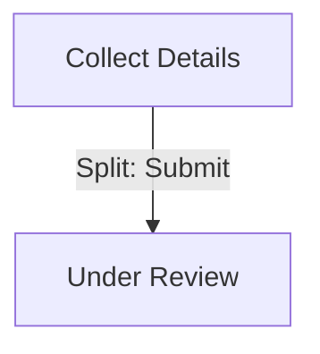
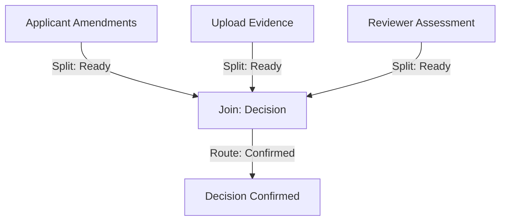
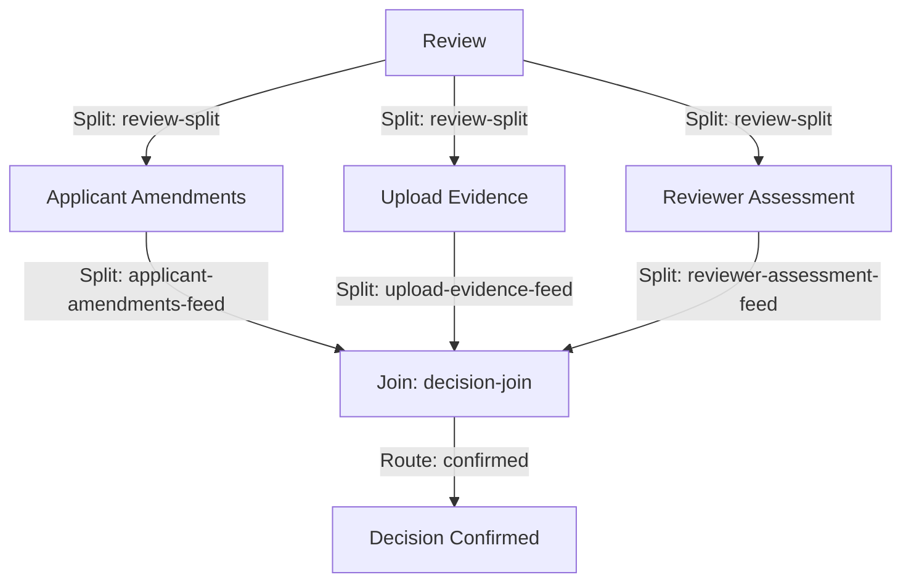

# Gateway-First Authoring

A guide to the gateway-and-route model. Understand how the workflow editor structures transitions.

---

## The Core Principle

Every move from one stage to another happens through a **gateway**. There are no direct stage-to-stage transitions.

Stages describe **where** you are in the journey. Gateways describe **how** you get from one stage to another.

---

## Two Gateway Types

### Split Gateway

A Split gateway is anchored to a source stage. It emits one or more routes to target stages (or other gateways).

- **Rendering:** Single-route Splits render as a small pill on the canvas. Multi-route Splits render as a diamond.
- **Source:** Required. The stage that owns this gateway.
- **Routes:** At least one route. Each route has a `trigger`, a `target`, and optional `condition` / `requiresRole` / `actions`.

Example: a Submit gateway after a form stage:



### Join Gateway

A Join gateway collects routes from multiple sources and emits one or more routes to target stages. It does **not** have a source stage. Instead, each contributing stage has its own Split gateway that targets the Join.

- **Rendering:** Renders as a diamond.
- **Source:** Forbidden. Joins have no source stage.
- **Routes:** At least one route. Each route emits from the Join to a target stage.

Example: a decision Join that collects routes from three feeder stages:



---

## Fan-In Pattern

When multiple stages need to converge to a single point (e.g., all must complete before proceeding), you use **fan-in**.

The new model has no inbound-binding mechanism on Joins. Instead, you express fan-in by giving each contributing source stage its own Split with a route targeting the Join.

### Worked Example — Leave Request (5 Gateways)

The Leave Request workflow demonstrates the fan-in pattern. Five gateways:

1. **`review-split`** — Split anchored to the `review` stage. Emits three routes:
   - `request-amendments` → targets `applicant-amendments` stage
   - `request-evidence` → targets `upload-evidence` stage
   - `continue-assessment` → targets `reviewer-assessment` stage
2. **`applicant-amendments-feed`** — Split anchored to the `applicant-amendments` stage. Emits one route:
   - `ready` → targets `decision-join`
3. **`upload-evidence-feed`** — Split anchored to the `upload-evidence` stage. Emits one route:
   - `ready` → targets `decision-join`
4. **`reviewer-assessment-feed`** — Split anchored to the `reviewer-assessment` stage. Emits one route:
   - `ready` → targets `decision-join`
5. **`decision-join`** — Join (no source). Collects routes from the three feeder splits. Emits one route:
   - `confirmed` → targets `decision-confirmed` stage

Diagram:



### Key Points

- Each contributing stage has its own Split gateway. You cannot have three stages share one Split.
- The Join collects the routes. It does not have a source stage.
- This pattern is verbose, but it is explicit. You see exactly which stages contribute to the Join.

---

## Modeling Decisions

### Why Gateways Own Routes

The old model had a top-level `transitions[]` array. Every transition was a first-class object. This was flat and simple, but it made fan-in and conditional routing hard to model.

The new model treats gateways as the sole owners of routing. A gateway is a **routing point**. It decides where to go next based on triggers, conditions, and roles.

This makes the model:

- **Explicit:** You see the routing logic at the gateway, not scattered across a flat list.
- **Composable:** You can add new routes to a gateway without touching unrelated transitions.
- **Analyzable:** The validator can check that every gateway has at least one route, that every route has a target, that every Split has a source, etc.

### Why Joins Have No Source

A Join is a **convergence point**. It does not belong to any one stage. It belongs to the workflow as a whole.

If you try to give a Join a source, you create ambiguity: which stage owns the Join? What happens if that stage is deleted?

Instead, each contributing stage has its own Split that targets the Join. This makes ownership clear: each stage owns its own Split, and the Join is just a target.

---

## Rendering Hints

The editor renders gateways differently depending on the number of routes:

- **Single-route Split:** Renders as a small pill between the source stage and the target stage. This is the common case (stage A → stage B).
- **Multi-route Split:** Renders as a diamond with outgoing edges to each target. This is the conditional case (stage A → stage B OR stage C, depending on a condition).
- **Join:** Always renders as a diamond with incoming edges from each contributing Split and outgoing edges to each target.

The rendering is automatic. You do not configure it.

---

## Authoring Workflow

When you add a new transition in the editor:

1. Select a source stage.
2. Click "Add Route" in the inspector.
3. The editor finds the Split gateway for that stage (or creates one if none exists).
4. The editor adds a new route to the Split.
5. You configure the route: trigger, target, condition, requiresRole, actions.

When you delete a transition:

1. Select the gateway in the inspector.
2. Select the route.
3. Click "Delete Route".
4. The editor removes the route from the gateway.
5. If the gateway has no routes left, the editor deletes the gateway.

This workflow is the same whether you have a single-route Split or a multi-route Split. The editor handles the rendering automatically.

---

## JSON Shape

The JSON shape for a gateway looks like this:

```json
{
  "key": "submit-gateway",
  "title": "Submit",
  "kind": "Split",
  "source": "collect-details",
  "routes": [
    {
      "id": "submit-route",
      "target": "under-review",
      "trigger": "submit",
      "condition": {
        "kind": "expression",
        "expression": "application.isComplete == true"
      },
      "requiresRole": "applicant",
      "actions": [
        {
          "type": "forms.submit",
          "params": {
            "formDefinitionId": "applicant-details"
          }
        }
      ]
    }
  ]
}
```

Key fields:

- **`kind`** — `"Split"` or `"Join"`.
- **`source`** — Required for Split, forbidden for Join.
- **`routes`** — Array of route objects. Each route has `id`, `target`, `trigger`, and optional `condition`, `requiresRole`, `actions`.

---

## Validator Rules

The editor enforces these rules:

- **PROJ141:** Split gateway must declare a `source`.
- **PROJ142:** Gateway `source` is not a known stage.
- **PROJ143:** Two split gateways cannot share the same source stage.
- **PROJ144:** Every gateway must declare at least one route.
- **PROJ145:** Route `id` is required.
- **PROJ146:** Duplicate route id within a gateway.
- **PROJ147:** Route `trigger` is required.
- **PROJ148:** Duplicate `(trigger, target)` within a gateway.
- **PROJ149:** Route `target` is required.
- **PROJ150:** Route `target` is neither a known stage nor a known gateway.
- **PROJ151:** Route condition expression is empty.
- **PROJ152:** Join gateway must not declare a `source`.

If any of these rules are violated, the editor shows a validation issue and blocks save.

---

## Migration from the Old Model

If you have old workflows with a top-level `transitions[]` array, you need to migrate them to the gateway-and-route model:

1. For each transition, find or create a Split gateway anchored to the `from` stage.
2. Add a route to that Split: `target = transition.to`, `trigger = transition.action`, `condition = transition.condition`, etc.
3. Delete the top-level `transitions[]` array.

The editor does this automatically when you open an old workflow. The migration is one-way. Once migrated, you cannot go back to the flat transition model.

---

## Related Documentation

- [Embedding the Workflow Editor](../guides/embedding-the-workflow-editor.md) — integrator recipe
- [Authoring a Workflow](authoring-a-workflow.md) — how to author workflows in the editor
- [Planning Workflow Editor](planning-workflow-editor.md) — tour of the editor UI

---

[← Back to Walkthroughs](README.md)
