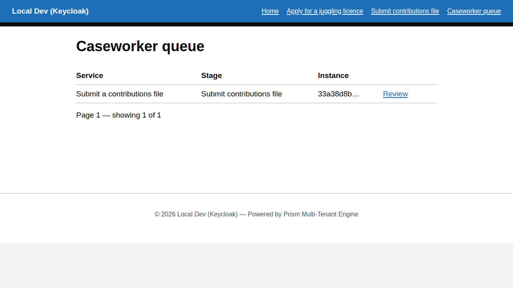

# Home Entry Walkthrough

How an end user first encounters the Prism demo and navigates into Wayfinder's Block
Grid-composed service design pages.

## Overview

The home entry journey (`home-entry`) documents the authenticated and unauthenticated views of the Prism TestSite homepage and the path from the homepage hero into the dashboard and Wayfinder's own service design demo. It demonstrates:

- **Unauthenticated hero** – The landing page a new visitor sees before signing in
- **Personalised hero** – The signed-in view with a welcome message and direct dashboard link
- **Homepage → Dashboard → Wayfinder service design demo card** – The primary "jump straight in" route for a signed-in NJF Contributions Team member
- **Homepage → Dashboard → Caseworker queue** – The route into the team's worklist

## Unauthenticated Homepage

Before signing in, the homepage presents the product hero with a **Sign In** call-to-action. No dashboard or service design navigation is shown, protected content is not accessible until the OIDC flow is completed.

## Authenticated Homepage

After signing in via Keycloak, the hero updates to show a personalised welcome message ("Welcome back, Demo User") and replaces the Sign In link with:

- **Go to Dashboard** – direct entry point to the member dashboard
- **Sign Out** – accessible from the navigation

## Dashboard

The `/dashboard` route (protected by `[Authorize]`) shows the member dashboard with two primary Wayfinder entry points:

1. **Caseworker queue** (`/caseworker-queue`) – the NJF Contributions Team's worklist, rendered by Wayfinder.Umbraco's packaged Block Grid worklist element
2. **Wayfinder service design demo** – the "Submit contributions file" card, rendered by Wayfinder.Umbraco's packaged Block Grid stage element

Service design itself is entirely Wayfinder's job here, Prism's dashboard only links out to pages an ordinary CMS editor composed from Wayfinder's own Block Grid blocks (see `docs/guides/support-systems.md` in the core Wayfinder repo).

## Wayfinder Service Design Demo Entry Point

Clicking **Start** on the **Submit contributions file** card takes the signed-in member straight to `/submit-contributions-file`, a `wayfinderServicePage` content node whose `stageArea` carries one `wayfinderServiceRequestStage` Block Grid block. Uploading a file here starts the bulk-contributions service blueprint, which calls a real downstream support system (Mock Business App) before landing in the caseworker queue below.

## Caseworker Queue

The caseworker queue at `/caseworker-queue`, another `wayfinderServicePage` node, this one carrying a `wayfinderServiceRequestWorklist` Block Grid block in its `worklistArea`, shows every contributions file assigned to the signed-in member's team (see `docs/guides/team-assignment.md`). On a freshly seeded environment the queue is empty until a contributions file has been submitted and validated.

---

[← Back to Walkthroughs](README.md)

---

**Executable spec:** This walkthrough is executed on every PR by [`home-entry.walkthrough.spec.ts`](../../src/UmbracoPrism.Client/tests/walkthroughs/home-entry.walkthrough.spec.ts). Screenshots above regenerate via the [`Capture Walkthrough Screenshots`](../../.github/workflows/capture-screenshots.yml) workflow (manual dispatch). See [`walkthroughs-as-executable-specs`](../../.claude/skills/walkthroughs-as-executable-specs/SKILL.md) for the policy.
