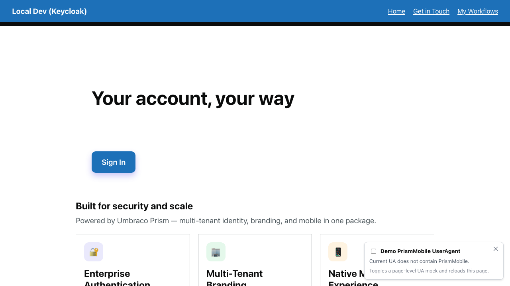
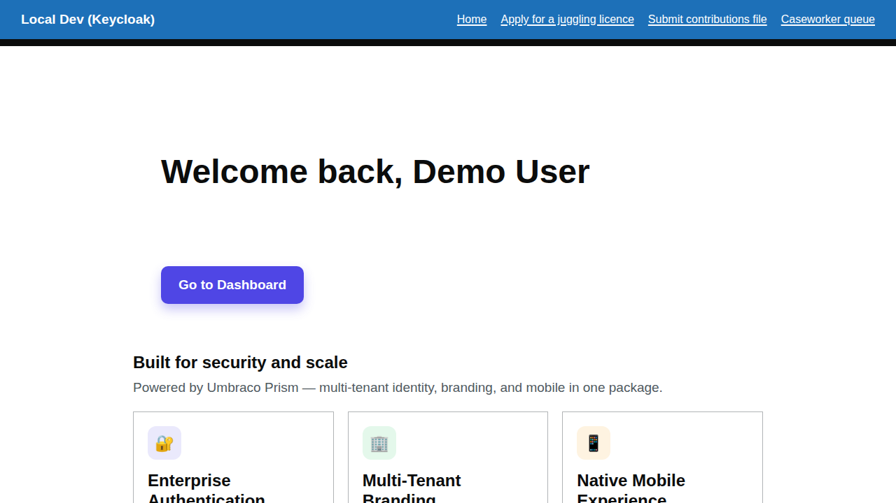
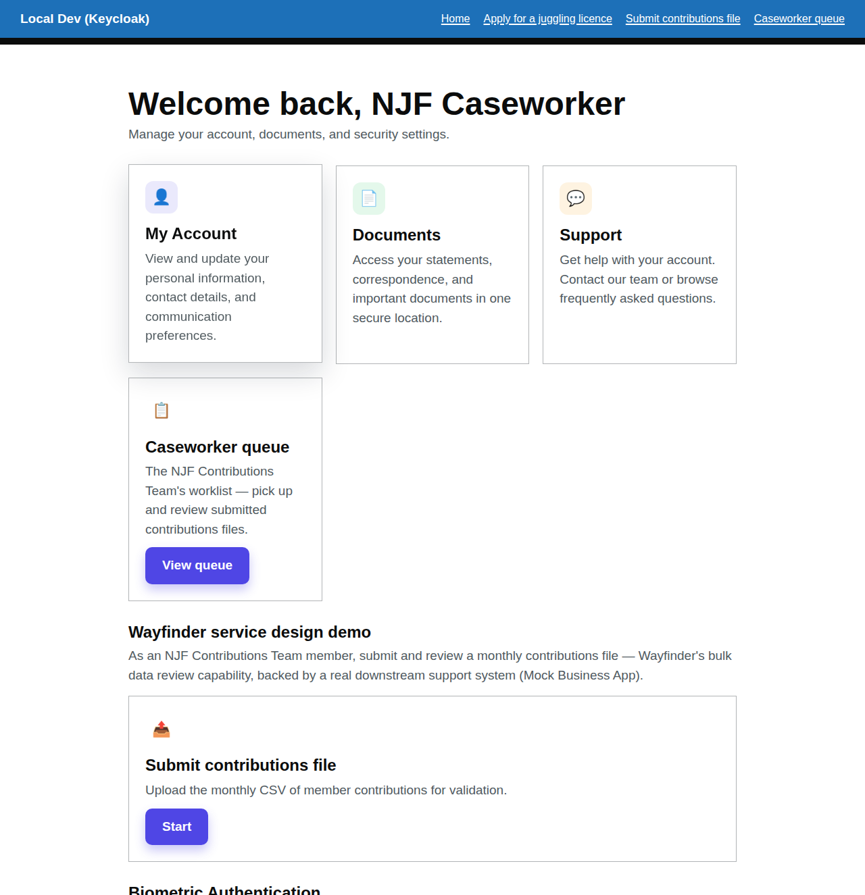
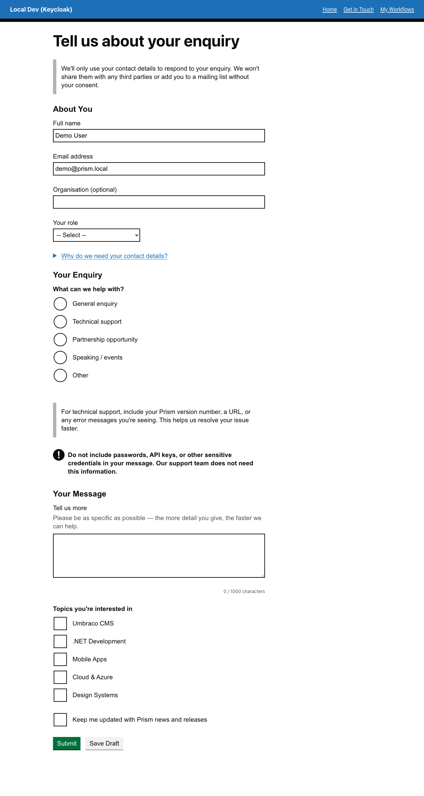
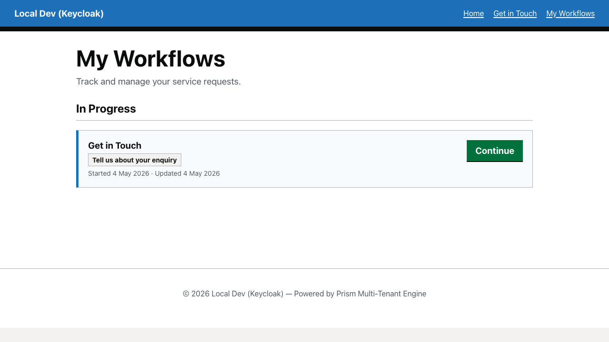

# Home Entry Walkthrough

How an end user first encounters the Prism demo and navigates to their first service blueprint.

## Overview

The home entry journey (`home-entry`) documents the authenticated and unauthenticated views of the Prism TestSite homepage and the path from the homepage hero into the dashboard and service request hub. It demonstrates:

- **Unauthenticated hero** – The landing page a new visitor sees before signing in
- **Personalised hero** – The signed-in view with a welcome message and direct dashboard link
- **Homepage → Dashboard → Service Blueprint demo card** – The primary "jump straight in" route for a signed-in member
- **Homepage → Dashboard → Service Request Hub** – The route into existing and in-progress service requests

## Unauthenticated Homepage

Before signing in, the homepage presents the product hero with a **Sign In** call-to-action. No dashboard or service blueprint navigation is shown — protected content is not accessible until the OIDC flow is completed.

## Authenticated Homepage

After signing in via Keycloak, the hero updates to show a personalised welcome message ("Welcome back, Demo User") and replaces the Sign In link with:

- **Go to Dashboard** – direct entry point to the member dashboard
- **Sign Out** – accessible from the navigation

## Dashboard

The `/dashboard` route (protected by `[Authorize]`) shows the member dashboard with two primary service blueprint entry points:

1. **View Service Blueprints** (`/my-service-blueprints`) – lists all active and completed service requests for the signed-in member
2. **Service Blueprint Demos** – a grid of seeded demo cards, each with its own **Start** button

The same page also advertises the development-only **Service Desk** card for local operators and testers, but the end-user entry journey keeps its focus on the member-facing routes first.

## Service Blueprint Demo Entry Point

Clicking **Start** on the **Get in Touch** demo card takes the signed-in member straight to the seeded community enquiry service blueprint at `/get-in-touch`. This is the quickest way to move from the homepage hero into a real product journey without first visiting the service request hub.

## Service Request Hub

The service request hub at `/my-service-blueprints` shows all service requests owned by the signed-in member. On a freshly seeded environment the list is empty; after starting a service blueprint an **In Progress** entry appears.

---

[← Back to Walkthroughs](README.md)

---

**Executable spec:** This walkthrough is executed on every PR by [`home-entry.walkthrough.spec.ts`](../../src/UmbracoPrism.Client/tests/walkthroughs/home-entry.walkthrough.spec.ts). Screenshots above regenerate via the [`Capture Walkthrough Screenshots`](../../.github/workflows/capture-screenshots.yml) workflow (manual dispatch). See [`walkthroughs-as-executable-specs`](../../.claude/skills/walkthroughs-as-executable-specs/SKILL.md) for the policy.
