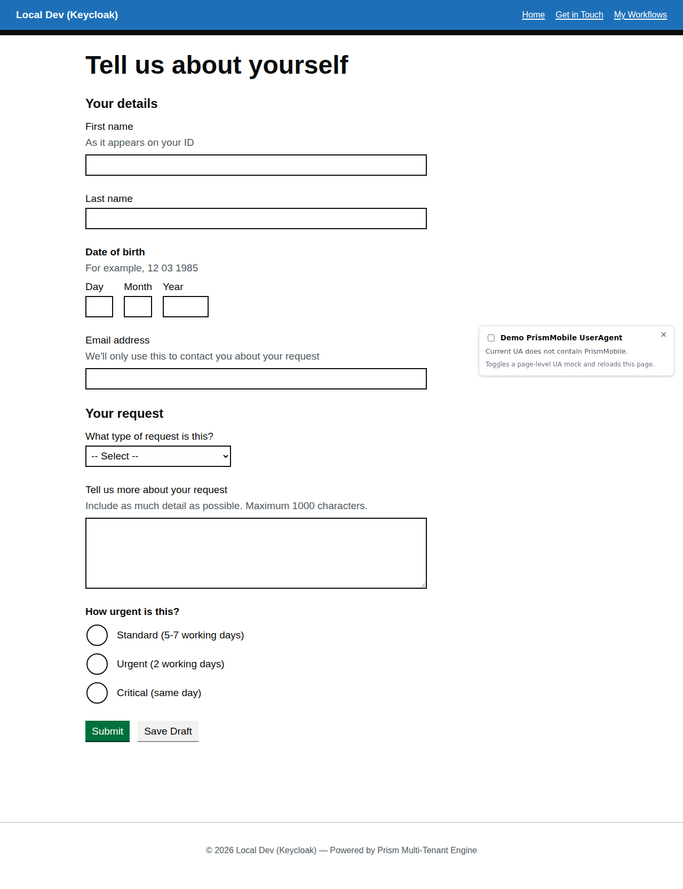
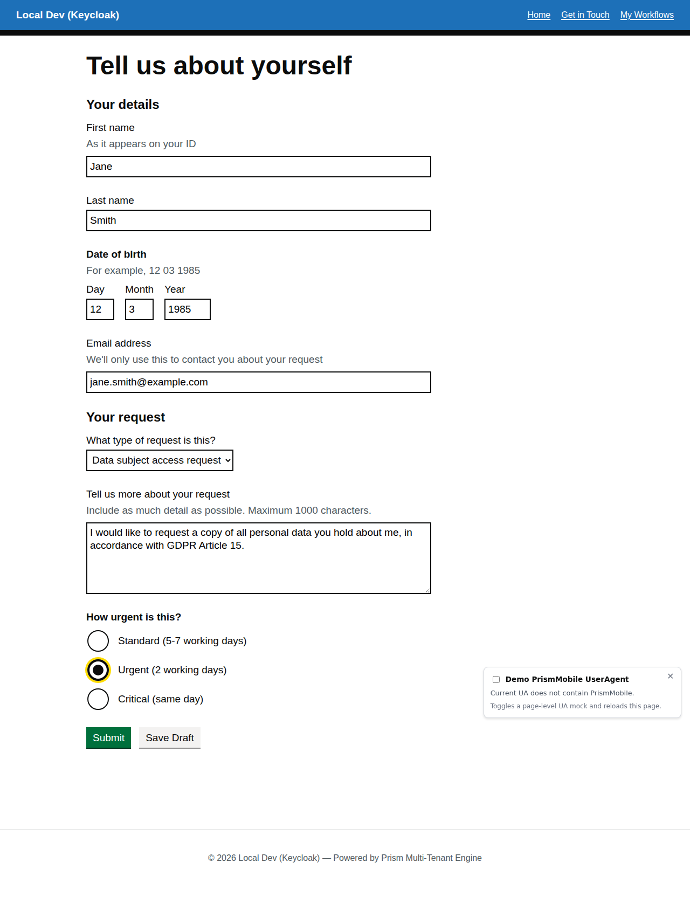
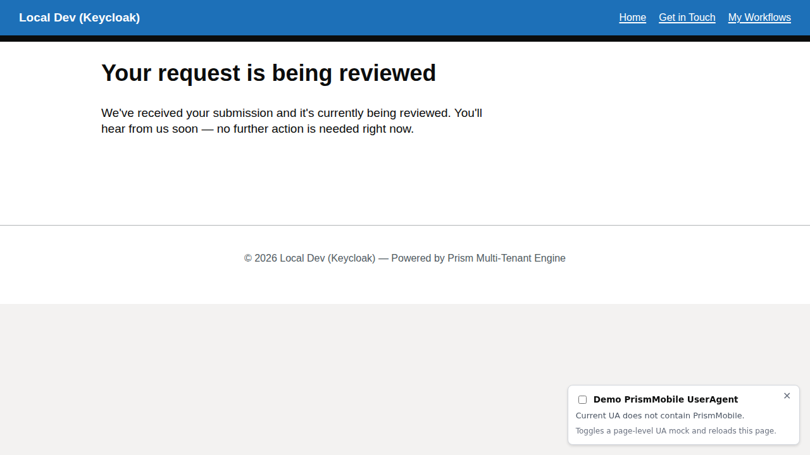

# Information Request Workflow

A data request form demonstrating date pickers, textareas, and conditional urgency options.

## Overview

The information request workflow (`information-request`) handles user requests for information with:

- **Date inputs** for specifying date of birth or relevant dates
- **Textareas** for detailed request descriptions
- **Radios with conditional reveals** for urgency levels
- **Email confirmation** pattern

## Initial Form



The form collects:

1. **Personal details** – Name, date of birth, email
2. **Request details** – Type of request and detailed description
3. **Urgency** – Standard or urgent (with justification for urgent requests)

### Filled Form



A completed form shows personal details, the selected request type, and the description. In this example: **First name:** Jane, **Last name:** Smith, **Date of birth:** 12/03/1985, **Email:** jane.smith@example.com, **Request type:** Data subject access request, with detailed description and **Urgency:** Urgent (2 working days) selected.

### After Submission



Successful submission transitions the instance to the `request-submitted` state and displays a confirmation panel. The user is informed their request is under review and can expect a response within the selected urgency window.

## V2.0 Schema Example

The date input uses the polymorphic `date` component:

```json
{
  "type": "date",
  "fieldKey": "date-of-birth",
  "label": "Date of birth",
  "hint": "For example, 15 03 1985",
  "required": true
}
```

The urgency field demonstrates conditional reveals:

```json
{
  "type": "radios",
  "fieldKey": "urgency",
  "label": "Request urgency",
  "required": true,
  "options": [
    { "value": "standard", "label": "Standard (7 working days)" },
    { "value": "urgent", "label": "Urgent (2 working days)" }
  ],
  "conditionalChildren": {
    "urgent": [
      {
        "type": "textarea",
        "fieldKey": "urgency-justification",
        "label": "Why is this request urgent?",
        "hint": "Please provide a brief explanation",
        "required": true,
        "maxLength": 500
      }
    ]
  }
}
```

## Workflow Seed JSON

**Location:** `src/UmbracoPrism.MockBusinessApp/workflow-seeds/information-request.json`

**Definition key:** `information-request`  
**Display name:** Request Information  
**States:** `collecting-request` → `request-submitted`

## Key Takeaways

✅ **Date inputs** – GDS-style date components with validation  
✅ **Textareas** – Multi-line text input with character limits  
✅ **Conditional urgency** – Show justification field only when needed  
✅ **Email confirmation** – Terminal state with confirmation message

---

[← Back to Walkthroughs](README.md)
