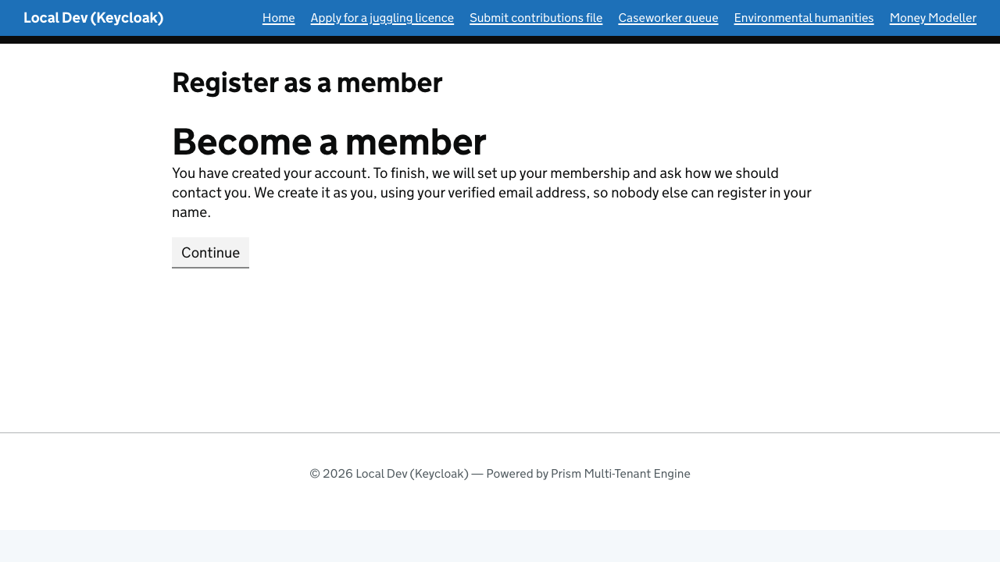
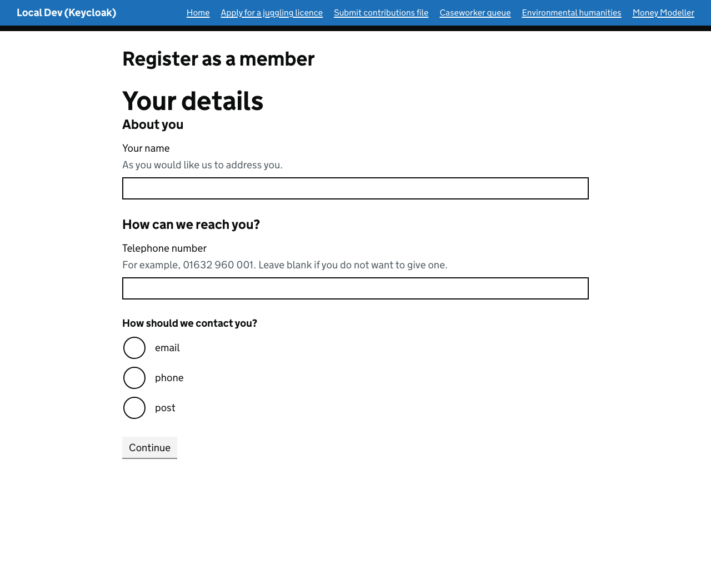
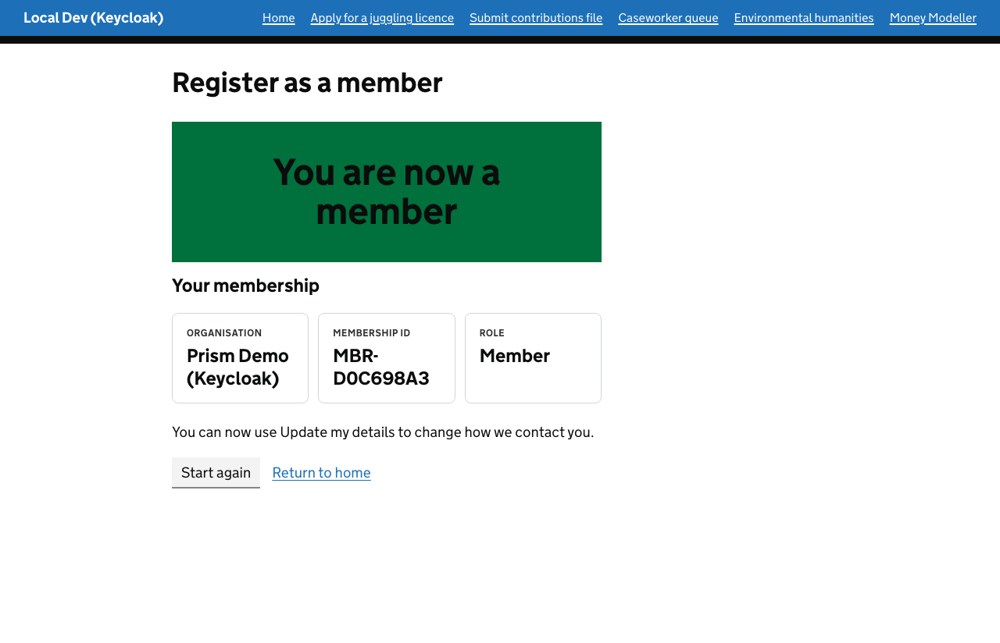
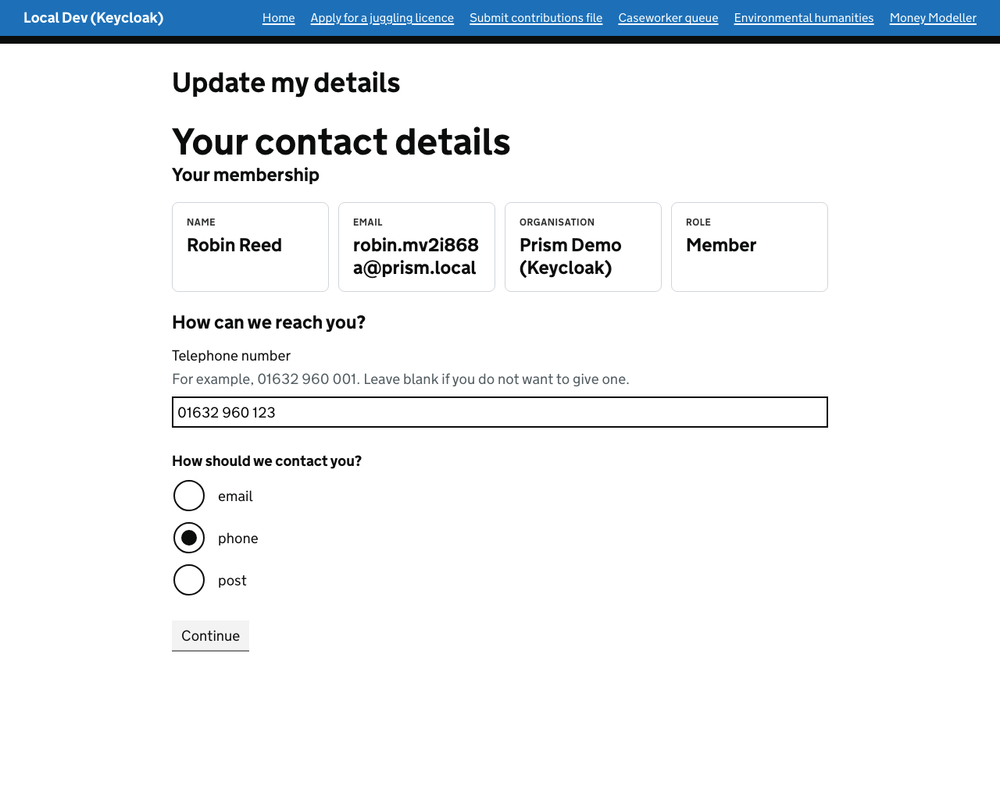
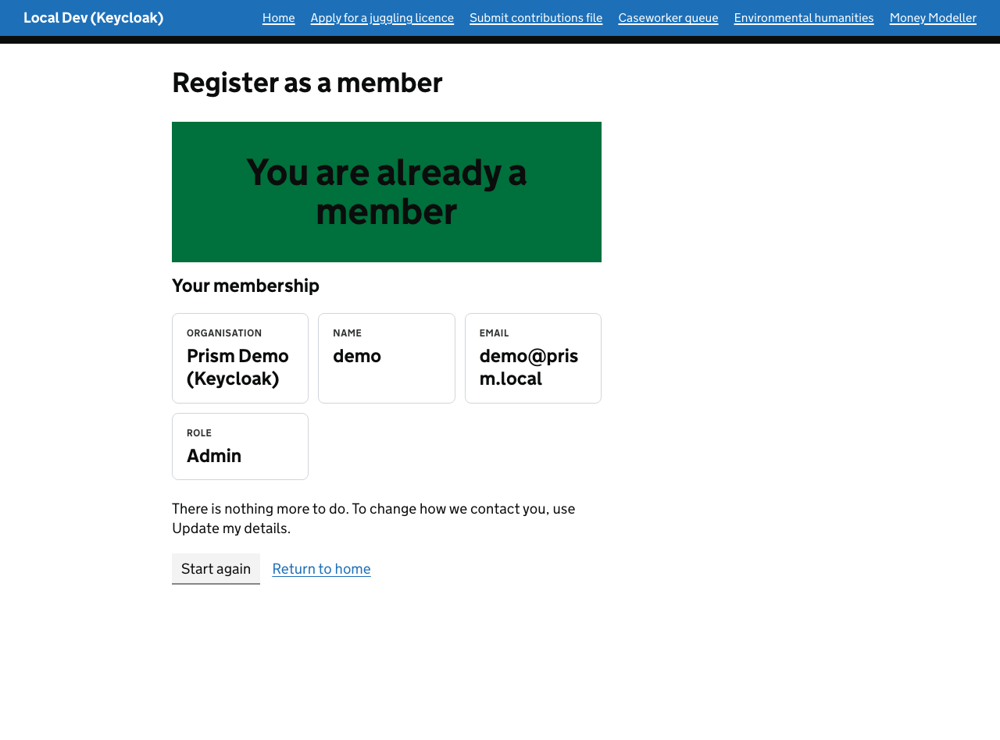

# Registering a member

**The question:** a person who has never used the service wants to become a member. Their login must
live with the identity provider, and their membership must live in the organisation's business system.
How do the two get created, and how does the business system know the membership belongs to the
person who just registered and not to someone who typed in their email address?

**The answer in one line:** the identity provider registers the person and proves their email. The
journey then asks the business app to create their membership **with the token that registration
produced**, and the business app takes who they are and which tenant they join from that verified
token, never from the form.

The example is the `register-as-a-member` blueprint, the page at `/register-as-a-member` in
TestSite. It is the step after [Calling a business app as the signed-in member](authenticated-business-app-call.md)
and uses the same pattern.

---

## The journey

```
 /auth/register?returnUrl=/register-as-a-member
        |  Prism sends the browser to Keycloak with OIDC prompt=create
        v
 Keycloak registration page     (Keycloak holds the password; neither Prism nor the business app sees it)
        |
 Verify your email              (Keycloak emails a link; the person cannot continue without it)
        |  they click the link, and Keycloak signs them in
        v
 Become a member                (journey start, signed in as the new person)
        |  continue
        v
 Checking for a membership      (system stage, onEnter: GET  /api/backoffice/profile as the person)
        |  registered / not-registered          person waits at "Membership checked"
        v
 Your details  ->  Check your answers
        |  submit
        v
 Registering your membership    (system stage, onEnter: POST /api/backoffice/members as the person)
        |  registered / rejected                person waits at "Registration sent"
        v
 You are now a member           (shows the business app's membership id)
```

Two branches show that a business answer is a route, not an error:

- **`registered` at the first check** sends the person to "You are already a member". Nothing is
  created twice.
- **`rejected`** returns the person to the form with the business app's reason (for example, an
  unverified email, or a tenant that has not opened registration).

## What the person sees

After registering at Keycloak and following the link in the verification email, they land in the journey, signed in as themselves:



The business app has been asked, as them, whether they already have a membership. They do not, so the form asks only what they are telling us about themselves. There is no field for the organisation or a role:



The business app creates the membership from their verified token and the confirmation shows its membership id:



Update my details now finds them, with the name and contact details they gave:



Someone who is already a member is told so, and is not given a second membership:



## Where each piece lives

| Piece | File |
|---|---|
| Blueprint | `src/UmbracoPrism.TestSite/service-blueprints/register-as-a-member.json` |
| The `register-member` capability and its client | `src/UmbracoPrism.TestSite/Services/ServiceDesign/MockBusinessAppProfileClient.cs` |
| The business app's endpoint | `src/UmbracoPrism.MockBusinessApp/Services/Members/MemberEndpoints.cs` |
| Who counts as a member | `src/UmbracoPrism.MockBusinessApp/Services/Members/MemberDirectory.cs` |
| Who is calling | `src/UmbracoPrism.MockBusinessApp/Services/CallerIdentity.cs` |
| Registration, verification and mail catcher | `keycloak/realm-export.json`, `src/UmbracoPrism.AppHost/Program.cs` |
| Tests | `MockBusinessAppMemberRegistrationTests.cs`, `RegisterAsAMemberBlueprintTests.cs` in `UmbracoPrism.Core.Tests` |

## Why registration is the identity provider's job

Prism's `/auth/register` endpoint challenges the OIDC flow with `prompt=create`
(OpenID Connect Initiated User Registration), so the identity provider shows its own registration
page for the current tenant. The password is entered there and stays there. This keeps credentials out
of the journey, and means the journey needs no administrative credential to create users.

Keycloak 26.1 or later is needed: 26.0 ignores `prompt=create` and shows the ordinary sign-in page.
The realm file turns on registration, uses the email as the username, and requires email
verification. **`verifyEmail: true` on its own does nothing.** The `VERIFY_EMAIL` required action
must also be registered in the realm, or a new person signs in with `email_verified: false` and
nothing stops them. The local stack runs Mailpit at http://localhost:8025 to catch the email.

## How the business app decides who the person is

1. Token validation pins the issuer to a configured tenant, so the **tenant** is the one whose
   identity provider signed the token.
2. The **person** is the token's `sub`, with the `email` claim as their address. The business app
   does **not** use `preferred_username`: that is the login name, chosen at registration, and could
   be set to another member's email address.
3. The email counts only if `email_verified` is `true`. Without that, anyone could register another
   person's address at the identity provider and be matched to that person's membership.
4. Registration is opt-in per tenant (`PrismBusinessApp:SelfRegistration:Tenants`; closed by
   default). The new member gets the least-privileged role, set by the server.
5. The request body carries only what the person is telling us about themselves: name, telephone,
   contact preference. It cannot name a tenant, a role or a membership id; the tests send those and
   show they are ignored.
6. The call is safe to repeat. A person who is already a member gets their record back unchanged, so
   a journey that lost the response can retry.

A pre-provisioned member (someone already in the business system's directory) is matched by verified
email. A self-registered member is matched by `sub`, so changing the email at the identity provider
later cannot hand their record to someone else. Profiles are stored against the membership id for the
same reason.

## Run it

Start the stack with Aspire (`dotnet run --project src/UmbracoPrism.AppHost`). Your local Keycloak
only imports the realm file when the realm does not exist yet, so if it predates registration, clear
`artifacts/aspire/keycloak-data` first.

1. Browse to `https://localhost:44345/auth/register?returnUrl=/register-as-a-member`.
2. Register with any email, for example `robin@prism.local`.
3. Open http://localhost:8025, open the email, and follow the link.
4. Finish the journey. The confirmation shows an `MBR-` membership id from the business app.
5. Open `/update-my-details`: the new member's record is there.

Signing in as `demo@prism.local` / `password` and opening `/register-as-a-member` shows "You are
already a member".

## What to check for security

- **Nobody can claim another person's membership with a login name.**
  `ALoginName_ChosenToLookLikeAnotherMembersEmail_GrantsNothing` fails if the business app ever reads
  `preferred_username` as the email.
- **An unverified email grants nothing.** `AnEmailTheProviderHasNotVerified_CannotRegister_AndNothingIsCreated`
  and `AnUnverifiedClaimToAPreProvisionedMembersEmail_GrantsNothing_ButTheVerifiedOwnerIsRecognised`
  fail if an unverified claim can create a membership or read and edit someone else's.
- **The form cannot choose the tenant, role or id.** `TheBody_CannotChooseTheTenant_TheRole_OrTheMembershipId`.
- **Registration is closed unless the tenant opens it.** `ATenantThatHasNotOpenedRegistration_RefusesIt`
  and `AnEntraTenant_CannotBeSelfRegisteredInto`.
- **Safe to repeat, never overwrites.** `Registering_IsSafeToRepeat_AndNeverOverwritesWhatIsAlreadyHeld`.
- **A record never follows an email address.** `TwoPeopleRegistering_GetSeparateRecords_EvenIfOneLaterTakesTheOthersOldEmail`.
- **The person's own token is what registers them, and it is never shown.**
  `ARegistration_IsSentWithTheNewcomersOwnToken_AndOnlyTheDetailsTheyTypedIn` and
  `TheBearerToken_NeverAppearsInAnythingThePersonIsShown`.

## Limits to know about

- **The membership store is in memory** and capped (500). A restart of Mock Business App forgets
  self-registered members, while their accounts at Keycloak remain. A real business system would
  persist them, and the journey's first check would find them again.
- **The identity provider and the business app can disagree.** If registration at Keycloak succeeds
  and the membership call fails, the person is signed in with no membership. That is why the first
  stage asks the business app whether they already have one, and why the call is safe to repeat: they
  re-open the page and carry on.
- **One tenant per identity provider realm in this demo.** The membership is created for the tenant
  whose identity provider issued the token.
