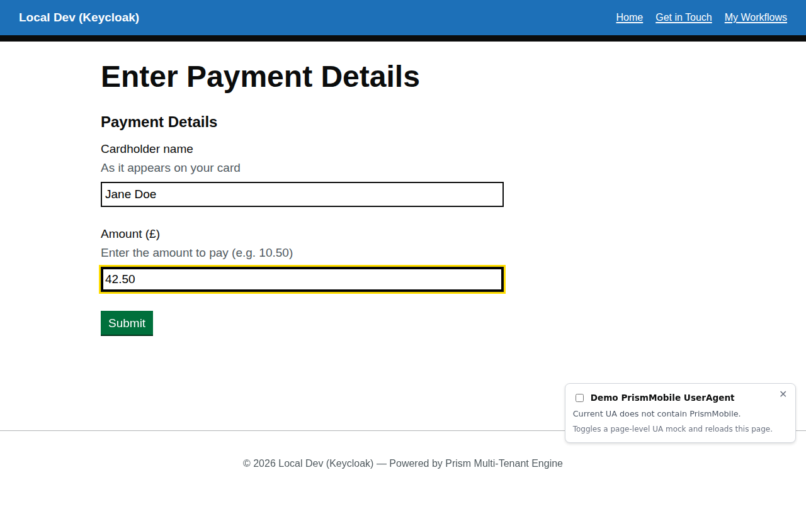
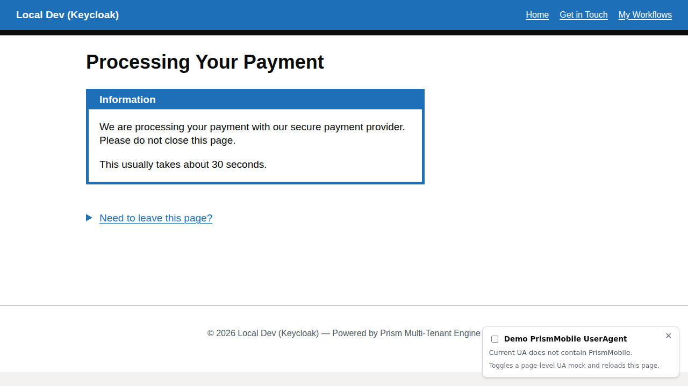

# Payment Demo Workflow

A compact payment journey demonstrating decimal money input, a processing/waiting state, and operator-assisted completion in the local demo.

## Overview

The payment demo workflow (`payment-demo`) showcases a realistic "submit then wait" pattern with:

- **Decimal currency input** using pence-level precision
- **Immediate transition into a waiting state** after submit
- **Deferred completion** via a reviewer/operator action in the development harness
- **Return-safe processing page** that the member can revisit later

## Initial Form


The first step collects payment details:

1. **Cardholder name** – Plain text input for the payer name
2. **Amount (£)** – Decimal currency input with pence precision
3. **Submit action** – Transitions the workflow into its waiting state

This demonstrates the `decimal` component with `step: 0.01` for currency precision.

### Filled Form



Enter the cardholder name and amount to proceed. The amount field accepts decimal values (e.g. `42.50`) using `step: 0.01` for pence-level precision.

### Processing



After submission the workflow transitions to a processing state while the payment is handled asynchronously. The user sees a holding screen with a defer message explaining that they can safely leave and come back later.

### Workflow Admin handoff (development only)

In the local demo, the processing state is intentionally paired with the [Workflow Administration](workflow-administration.md) panel. A tester can open **Workflow Admin** from the dashboard and use the reviewer-only completion transition to move the instance from `processing-payment` to `payment-complete`, which is useful for exercising the full flow without waiting on a real payment provider.

## V2.0 Schema Example

The payment amount field uses the polymorphic `decimal` component:

```json
{
  "type": "decimal",
  "fieldKey": "amount",
  "label": "Amount (£)",
  "hint": "Enter the amount to pay (e.g. 10.50)",
  "required": true,
  "min": 0.01,
  "step": 0.01
}
```

## Workflow Seed JSON

**Location:** `src/UmbracoPrism.MockBusinessApp/workflow-seeds/payment-demo.json`

**Definition key:** `payment-demo`  
**Display name:** Payment Demo  
**States:** `enter-details` → `processing-payment` → `payment-complete`

## Key Takeaways

✅ **Waiting-state workflows** – Submit now, finish later  
✅ **Number inputs** – Precision control with `min`, `max`, `step`  
✅ **Deferred completion** – Reviewer/operator can complete the flow in the local harness  
✅ **Return-safe UX** – Members can leave the processing page and revisit it later

---

[← Back to Walkthroughs](README.md)

---

**Executable spec:** This walkthrough is executed on every PR by [`payment-demo.walkthrough.spec.ts`](../../src/UmbracoPrism.Client/tests/walkthroughs/payment-demo.walkthrough.spec.ts). Screenshots above regenerate via the [`Capture Walkthrough Screenshots`](../../.github/workflows/capture-screenshots.yml) workflow (manual dispatch). See [`walkthroughs-as-executable-specs`](../../.squad/skills/walkthroughs-as-executable-specs/SKILL.md) for the policy.
