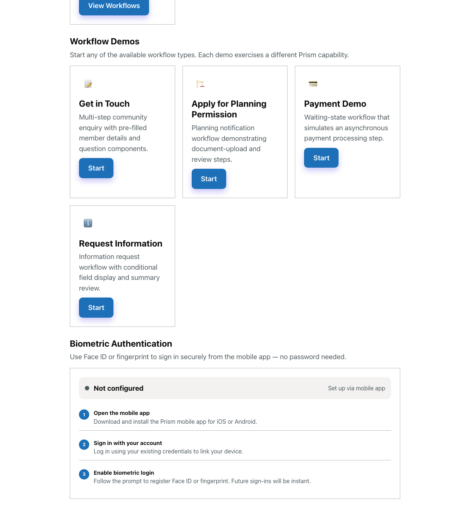
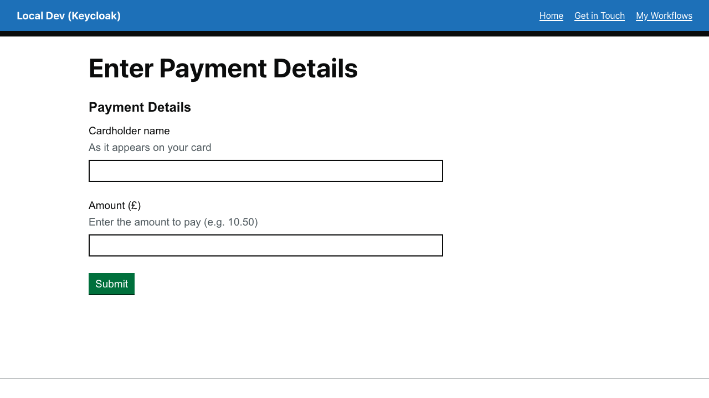
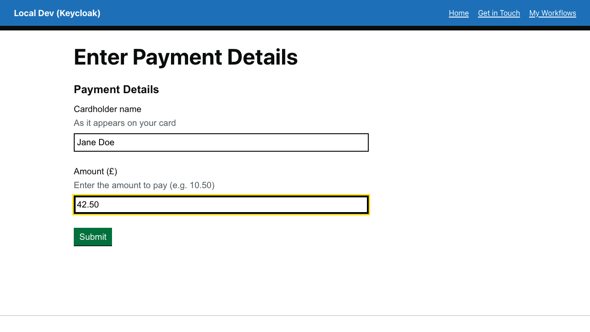
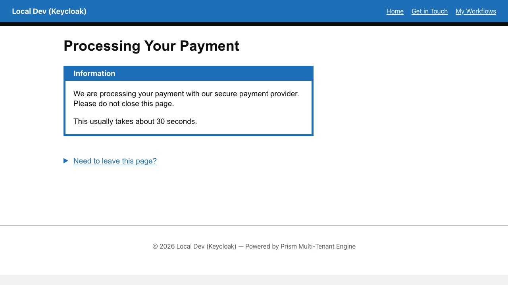
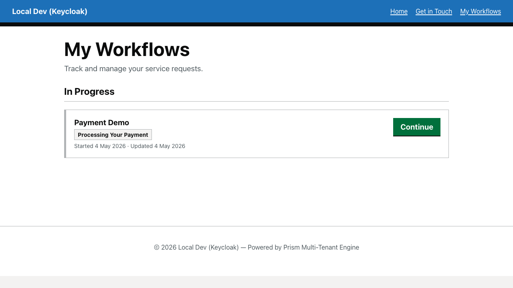
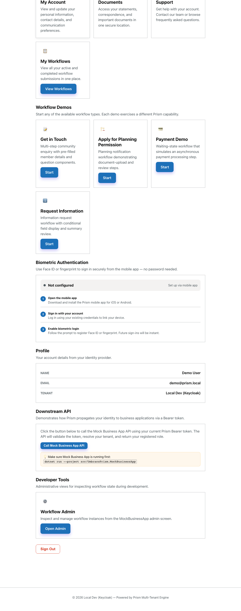
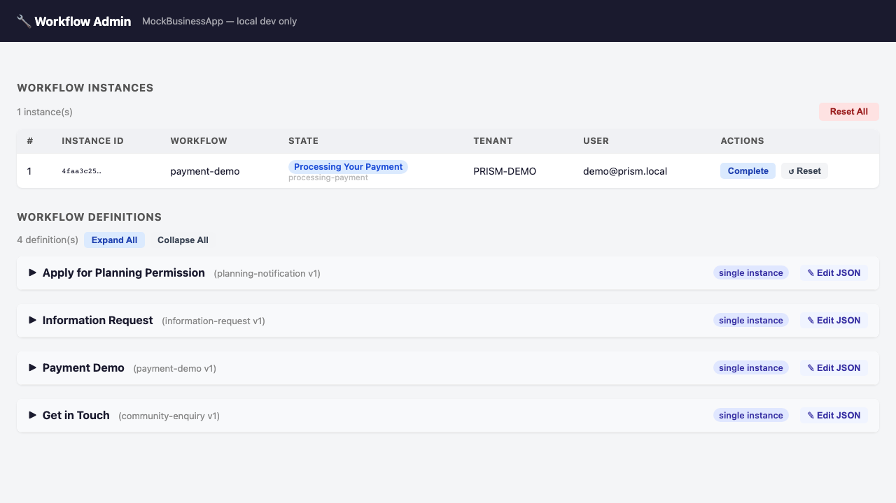
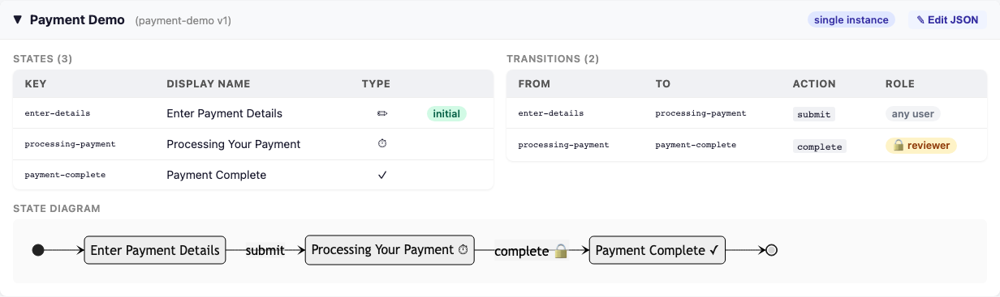
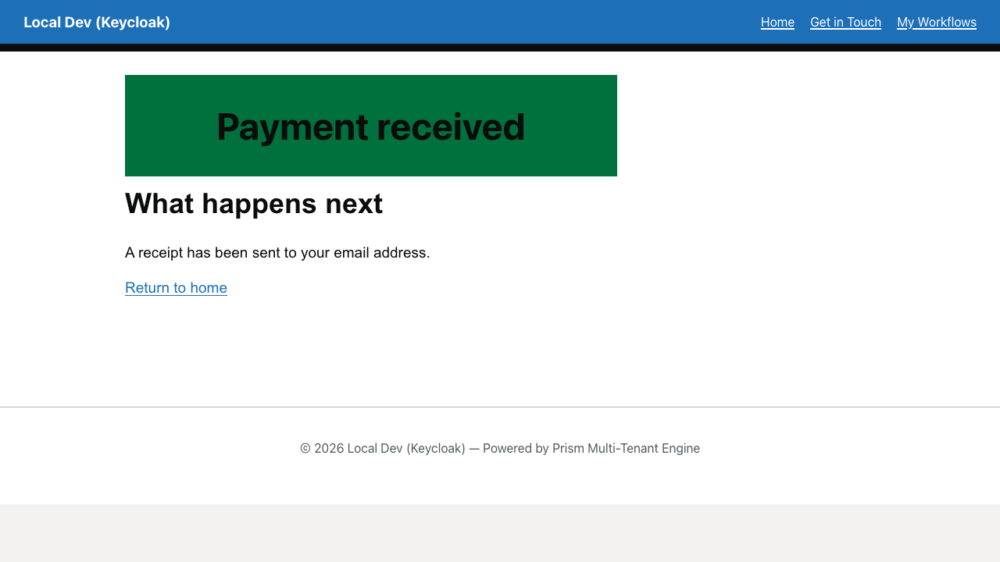

# Payment Demo Workflow

A complete waiting-state walkthrough: member submits a payment, the payment waits for reviewer/service completion, and the original member journey moves on automatically when the workflow is approved.

## Overview

The payment demo workflow (`payment-demo`) is the clearest example of Prism's **submit now, finish later** pattern:

- **The member starts from the real dashboard entry point** (not a deep link)
- **Submission moves the workflow into a waiting state** — the form doesn't complete, it pauses
- **The waiting state is visible in My Workflows** with a "Continue" action the member can return to
- **The reviewer reaches Workflow Admin through a discoverable dashboard route**
- **Workflow Admin shows both the live instance state and the underlying definition**
- **Completing the reviewer action advances the original member page automatically** — no refresh needed

This walkthrough demonstrates **the complete end-to-end handoff**: start as a member, pause in a waiting state, switch to reviewer role, advance the workflow, and watch the member page update in real time.

This is the pattern to copy when you need a user-facing journey to pause while another actor or background service finishes the work.

---

## Part 1: Start the journey from the dashboard

**Step 1:** After signing in with `demo@prism.local` / `password`, open the member dashboard.

**Step 2:** Find the **Payment Demo** workflow card in the demos section.

This matters because the walkthrough uses the same route a real tester or reviewer would discover in the demo: **Sign In → Dashboard → Payment Demo Card → Start**. The admin panel will later reach the same workflow from the same dashboard, proving the routes are discoverable.

**Step 3:** Click **Start** on the Payment Demo card to enter the workflow.

The workflow begins on the **Enter Payment Details** form with two fields:

1. **Cardholder name** — A text input for the person making the payment
2. **Amount (£)** — A decimal currency input with pence-level precision (`step: 0.01`)
3. **Submit** — A button that transitions the workflow to `processing-payment`

### Fill the payment details

**Step 4:** Enter a cardholder name and amount, then inspect the form.

Example values:
- **Cardholder name:** Jane Doe
- **Amount (£):** 42.50

The amount field demonstrates decimal precision — the form validates that at least 0.01 is entered (no free payments).

### Submit the form

**Step 5:** Click **Submit** to move into the waiting state.

After submission, the workflow transitions to `processing-payment`. The page displays:

- **Heading:** "Processing Your Payment"
- **Explanation:** "You can leave this page. Your payment is being processed. You can return to check the status in My Workflows."

This is the **waiting state contract**:

- The member has genuinely submitted their data
- They are **not** on a transient confirmation screen — the instance is persisted
- They can safely close the browser or navigate away
- The workflow is paused, waiting for reviewer/service action

---

## Part 2: Verify the waiting state is persistent

**Step 6:** Open a **new browser tab** and navigate to `/my-workflows` (or use the workflow hub from the original page).

The workflow hub shows:

- **Workflow name:** Payment Demo
- **State badge:** "Processing Your Payment" (the display name from the workflow definition)
- **Action:** "Continue" (not "View") — because the workflow is still active, the member can resume it
- **Instance ID and submission time** — proof this is a persistent instance, not a transient screen

This proves the member has genuinely reached a persisted waiting state. If they close the browser and come back tomorrow, the instance will still be here in "In Progress" with the same state.

---

## Part 3: Switch to reviewer role and access Workflow Admin

**Step 7:** Go back to the **dashboard** in the first tab (or open the dashboard in a new tab).

**Step 8:** Scroll to the **Admin** section at the bottom of the dashboard.

In the local Aspire/demo stack, a **Workflow Admin** card is visible in the Admin section (development only; not present in production). This card provides the entry point for the reviewer/operator role.

**Step 9:** Click **Open Admin** on the Workflow Admin card. This opens the MockBusinessApp admin panel in a new browser tab.

---

## Part 4: Inspect the live instance in Workflow Admin

**Step 10:** In the **Workflow Admin** panel, you see a **Workflow Instances** table listing all running workflows.

Find the row for `payment-demo`. It shows:

- **Workflow key:** `payment-demo`
- **Current state:** `Processing Your Payment` (the display name the member sees)
- **Raw state key:** `processing-payment` (the internal state identifier)
- **Reviewer action:** **Complete** button is visible

This row tells you:
1. Which workflow this is
2. Exactly where the member is in the journey
3. Which reviewer action is available next

---

## Part 5: Inspect the workflow definition

**Step 11:** Below the instances table, find the **Workflow Definitions** section.

**Step 12:** Click the `payment-demo` definition card to expand it and see the full state machine.

The definition shows:

- **States:** `initial` → `processing-payment` → `payment-complete`
- **Initial state:** `initial` (where the form appears)
- **Transitions:** 
  - Member action: move from `initial` to `processing-payment` (on Submit)
  - Reviewer action: move from `processing-payment` to `payment-complete` (on Complete, `requiresRole: "reviewer"`)

This is where everything comes together:

1. The **member page** you saw earlier = the `processing-payment` state displayed to the user
2. The **instance row** above = the current state of the workflow
3. The **definition card** here = the rules that govern which transitions are possible

Now you can see that the instance is genuinely stuck waiting for a reviewer action, and that reviewer action is defined in the state machine.

---

## Part 6: Complete the reviewer action

**Step 13:** Click the **Complete** button on the instance row.

The Workflow Admin panel updates: the instance now shows state `payment-complete` (terminal state).

**Step 14:** Switch to the **original member page** (the one that was showing "Processing Your Payment").

The page has automatically updated to show:

- **Heading:** "Payment Complete" or similar confirmation
- **Confirmation message:** "Payment received. A receipt has been sent to your email address."
- **Final action:** "Return to My Workflows" link

The member page advanced **without a refresh**. This proves the real-time connection: the reviewer's action in Workflow Admin triggered an immediate update to the member's waiting page.

---

## Complete Handoff Verification

After reviewing the workflow and approving it:
- The member page advanced to the completion page
- The instance state changed from `processing-payment` to `payment-complete`
- My Workflows now shows the instance under **Completed** instead of **In Progress**

---

## Key Takeaways

✅ **Discoverable route** — Started from the dashboard, not an unexplained deep link  
✅ **Real waiting state** — Form submission paused at `processing-payment`, not transient  
✅ **Member visibility** — My Workflows shows the instance as in progress with a "Continue" action  
✅ **Reviewer visibility** — Workflow Admin shows the live state and the state machine definition  
✅ **Reviewer transition** — Admin panel provides the Complete button  
✅ **Automatic progression** — Member page advanced in real time after reviewer action, no refresh needed  
✅ **Completion visibility** — My Workflows updated to show the instance as completed

This is **the complete "submit now, finish later" pattern** you can replicate for any workflow that needs human review, payment processing, or async service completion.

---

[← Back to Walkthroughs](README.md)

---

**Executable spec:** This walkthrough is executed on every PR by [`payment-demo.walkthrough.spec.ts`](../../src/UmbracoPrism.Client/tests/walkthroughs/payment-demo.walkthrough.spec.ts). Screenshots above regenerate via the [`Capture Walkthrough Screenshots`](../../.github/workflows/capture-screenshots.yml) workflow (manual dispatch). See [`walkthroughs-as-executable-specs`](../../.squad/skills/walkthroughs-as-executable-specs/SKILL.md) for the policy.
