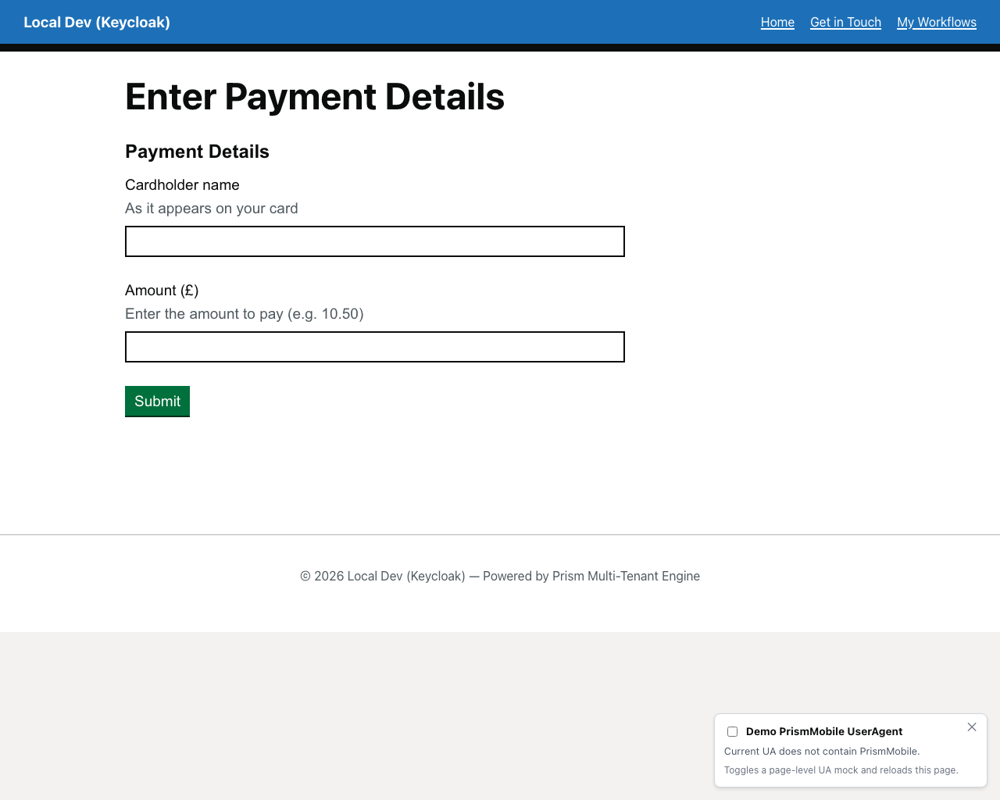

# Payment Demo Workflow

A two-step workflow demonstrating payment integration, currency formatting, and the check-answers pattern.

## Overview

The payment demo workflow (`payment-demo`) showcases a typical e-commerce checkout flow with:

- **Multi-step progression** (enter-details → confirm-payment)
- **Number inputs** with currency formatting
- **Check-answers pattern** for review before payment
- **Payment provider integration** (Stripe)

## Initial Form



The first step collects payment details:

1. **Amount to pay** – Currency-formatted number input
2. **Payment reference** – Optional reference for the transaction
3. **Card details** – Integrated Stripe payment element

This demonstrates the `number` component with `step: 0.01` for currency precision.

## V2.0 Schema Example

The payment amount field uses the polymorphic `number` component:

```json
{
  "type": "number",
  "fieldKey": "amount",
  "label": "Amount to pay",
  "hint": "Enter an amount between £5 and £500",
  "required": true,
  "min": 5,
  "max": 500,
  "step": 0.01
}
```

The check-answers state uses a `summary-list` component to display collected data before payment.

## Workflow Seed JSON

**Location:** `src/UmbracoPrism.MockBusinessApp/workflow-seeds/payment-demo.json`

**Definition key:** `payment-demo`  
**Display name:** Payment Demo  
**States:** `enter-details` → `confirm-payment` → `payment-complete`

## Key Takeaways

✅ **Multi-step workflows** – State transitions with progressive disclosure  
✅ **Number inputs** – Precision control with `min`, `max`, `step`  
✅ **Check-answers pattern** – Summary list before final submission  
✅ **Payment integration** – Stripe component for card collection

---

[← Back to Walkthroughs](README.md)
