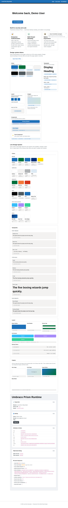
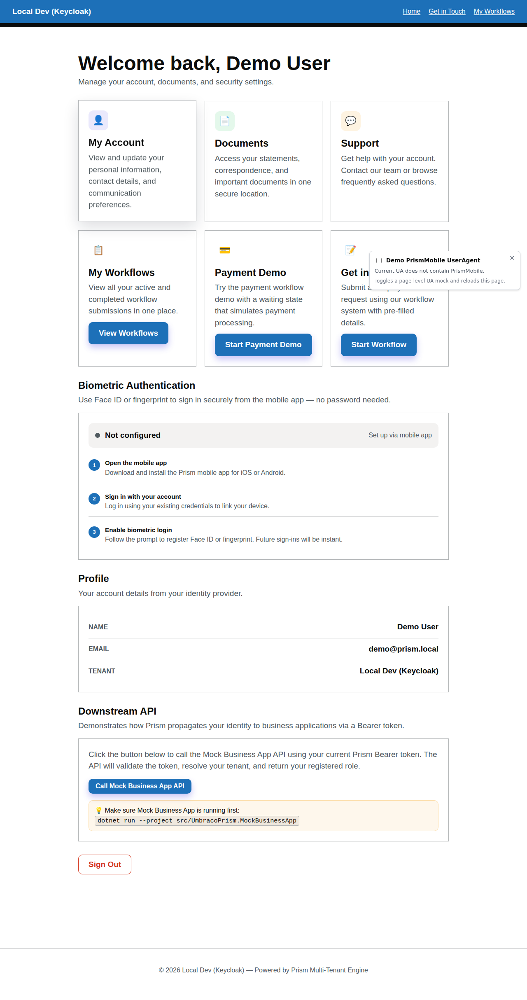
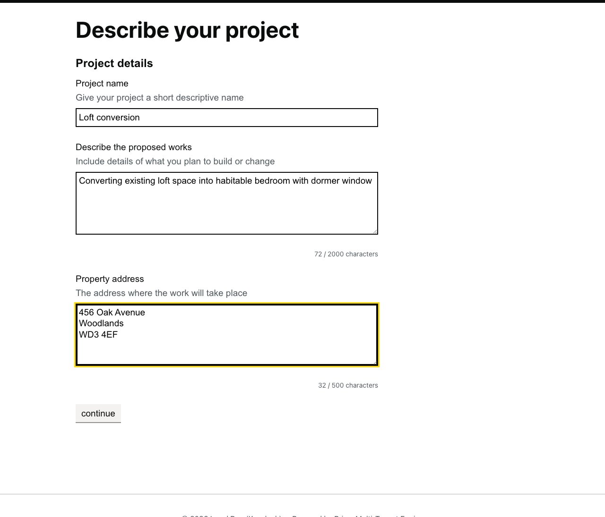
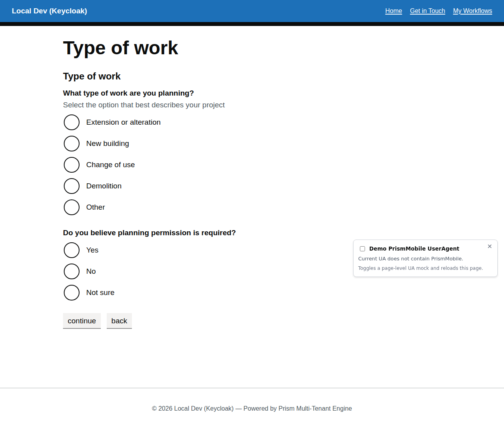
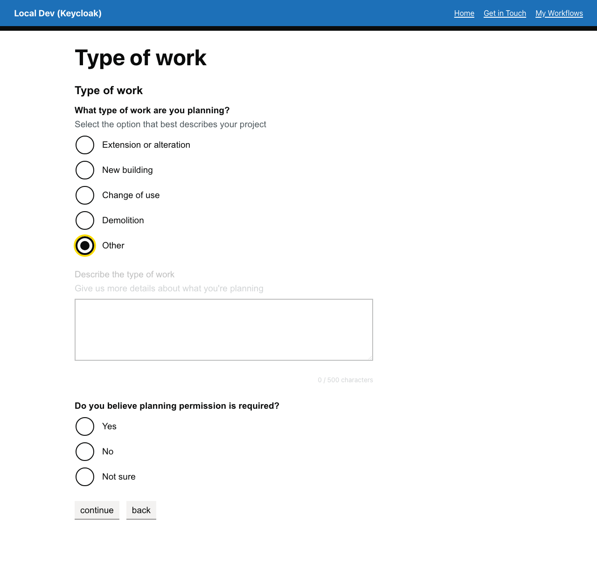
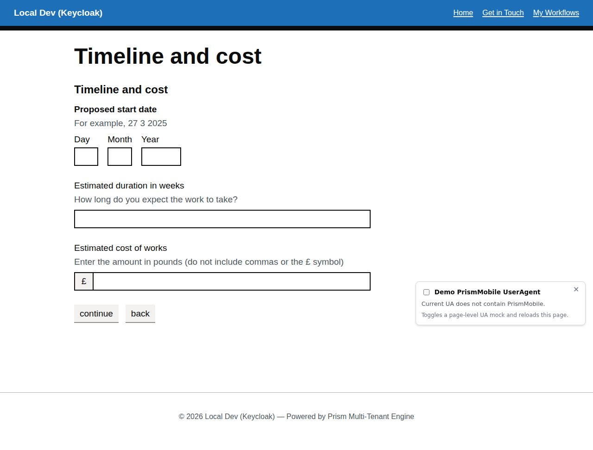
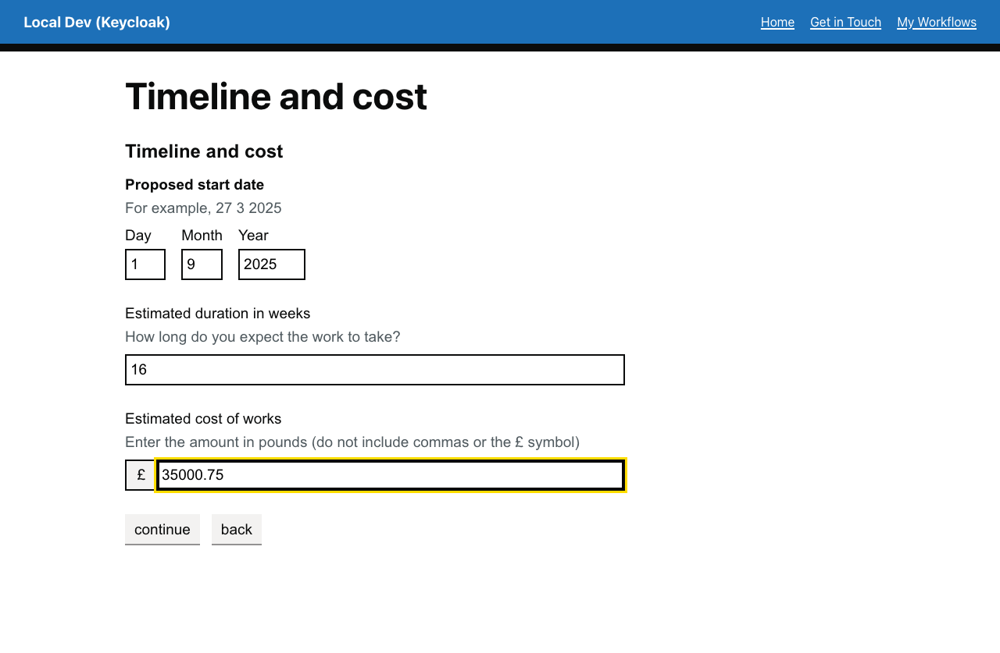
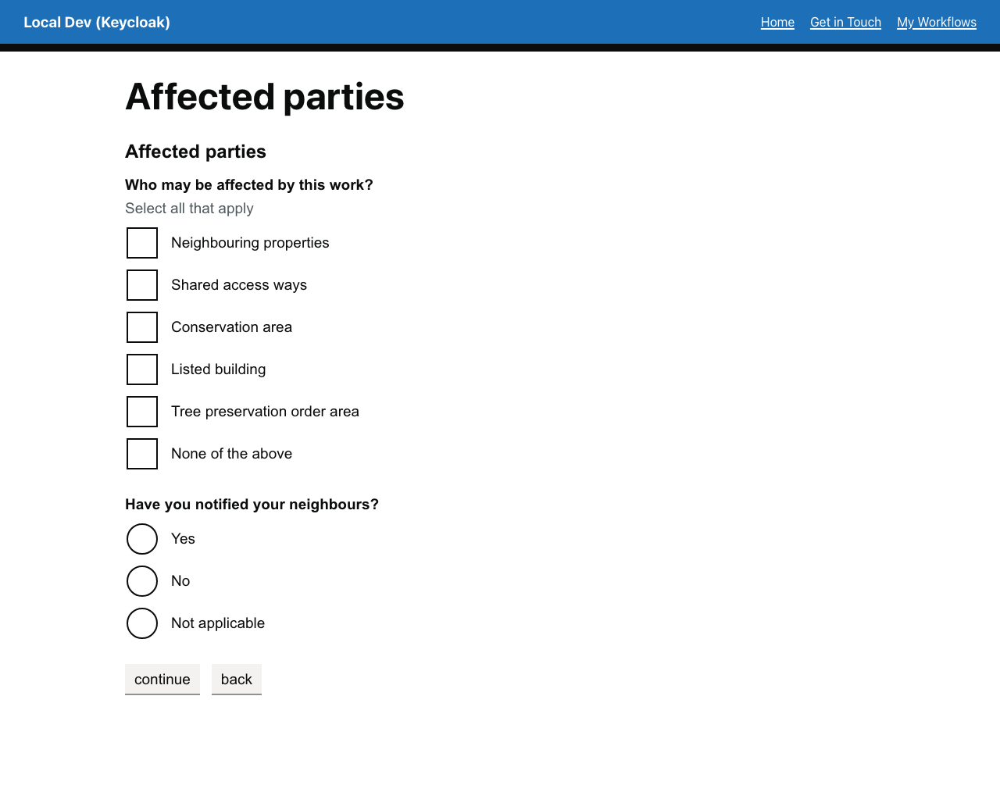
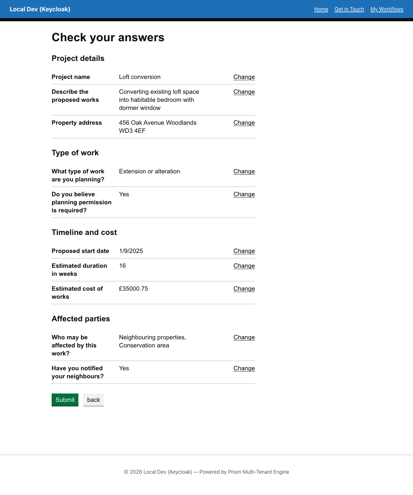
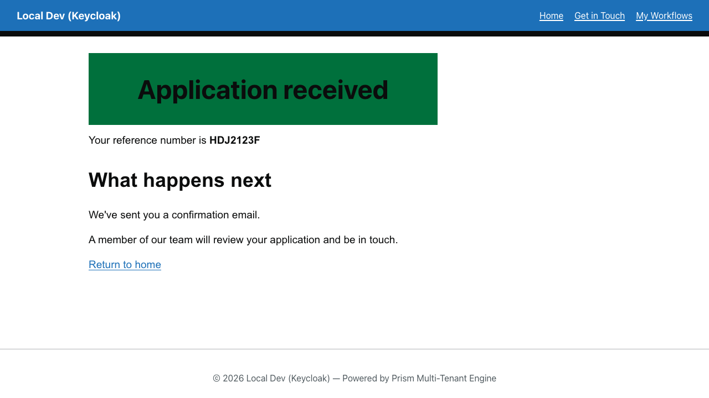

# Interactive Walkthrough — "Apply for Planning Permission"

A complex multi-page service blueprint demonstrating file uploads, address lookups, progressive disclosure, and the full end-to-end flow with explanations of what Umbraco.Prism and the Umbraco backoffice do at each step.

## Overview

The planning notification service blueprint (`planning-notification`) handles planning permission applications with:

- **Multi-page flow** with state transitions
- **File upload** for supporting documents
- **Address lookup** integration
- **Conditional sections** based on property type
- **Complex validation** rules
- **Check-answers** review screen
- **Confirmation** on submission

> **Prerequisites:** Spin up the stack via [Codespaces](../../README.md#try-it-now--no-install-required) or [local setup](../../README.md#try-the-demo--local-setup) first, then return here to follow along.

---

## Part 1: Log In and Start the Service Blueprint

### Step 1: Navigate to the TestSite



1. Open the TestSite in your browser:
   - **Codespaces:** Click the forwarded link from the terminal (or `https://{CODESPACE_NAME}-44345.app.github.dev`)
   - **Local:** `https://localhost:44345`

   You see a branded homepage.

2. 💡 **What's happening:** Umbraco.Prism's middleware resolved your hostname to a tenant (seeded as `localhost` for local dev, or `{CODESPACE_NAME}.app.github.dev` for Codespaces). This tenant configuration is stored in the Umbraco backoffice **Prism Dashboard** under **Settings** and includes the tenant's branding, OIDC authority (Keycloak), and tenant ID.

### Step 2: Log In

1. Click **My Service Blueprints** in the navigation or find the link on the homepage.

2. You are redirected to the Keycloak login screen.

3. Enter credentials:
   - Username: `demo@prism.local`
   - Password: `password`

4. Click **Sign In**.

   After a few seconds, you land on the **My Service Blueprints** page with a list of available service blueprints.

   

5. 💡 **What's happening:** This is an OpenID Connect (OIDC) authentication flow. Here's what occurred:
   - Your browser was redirected to Keycloak at `https://localhost:8443/realms/prism-dev` (or the Codespaces forwarded URL).
   - Keycloak presented a login form and verified your credentials against the seeded realm.
   - Upon successful login, Keycloak issued an `id_token` (identity proof) and an `access_token` (authorization proof) and redirected your browser back to the TestSite with an authorization code.
   - The TestSite exchanged that code for tokens with Keycloak and stored the `id_token` in a secure cookie.
   - Your browser session now includes claims like `sub` (your unique ID) and `email_verified` that Prism uses to authorize downstream requests.

### Step 3: Find and Click "Apply for Planning Permission"

1. On the **My Service Blueprints** page, find the tile labeled **Apply for Planning Permission** and click it.

   The page title changes to **Describe your project** and you see a form with three fields.

2. ✅ **What you're about to do:** You are about to start a new service request — a stateful conversation between you and the system that collects information, validates it, shows it back to you, and then submits it.

---

## Part 2: Walk Through the Service Blueprint Steps

Each step collects information or presents a review screen. Let's fill in the form as we go.

### Step 1: "Describe your project"


**What you see:**
- Form title: **Describe your project**
- Three input fields:
  - **Project name** (required, max 100 characters)
  - **Describe the proposed works** (required, textarea, max 2000 characters)
  - **Property address** (required, textarea, max 500 characters)

**What to type** (concrete example):
- **Project name:** `Loft conversion`
- **Describe the proposed works:** `Converting existing loft space into habitable bedroom with dormer window`
- **Property address:** `456 Oak Avenue, Woodlands, WD3 4EF`



**Click Continue**

1. 💡 **How this works:**
   - This stage's `fieldset` component declares its input fields inline (`text`/`textarea` components with `fieldKey`, `label`, `required`, `maxLength`) — there's no separate "field group" file; the fields live directly in the stage's `components` array in `planning-notification.json`.
   - The Umbraco TestSite made an HTTP POST to `https://localhost:7245/api/service-request/planning-notification/current` (the MockBusinessApp's service blueprint engine) with your tenant ID, user ID, and bearer token.
   - The service blueprint engine created a new instance in memory and returned a `ServiceRequestResponseEnvelope` describing the current stage (display name, rendered components, allowed actions).
   - The TestSite's `<prism-component>` tag helper dispatched each component to a GDS-styled Razor partial by naming convention (e.g. a `fieldset` component to `_PrismComponent-Fieldset.cshtml`, a `text` field inside it to `_Component-Text.cshtml`).

2. ✅ **Data validation happens in real-time:**
   - If you leave the **Project name** blank and click Continue, the browser validates (HTML5 `required` attribute) and the form doesn't submit.
   - If you exceed 100 characters, the browser truncates or the form rejects submission.
   - Server-side validation happens when you click Continue — if the submission fails structural or domain validation, the TestSite re-renders the stage with `Problems` from the response envelope shown against the relevant fields.

### Step 2: "Type of work"



**What you see:**
- Form title: **Type of work**
- Radio buttons to select the primary work type

**What to select:**
1. First select **Other** to see the conditional reveal — a "Describe the type of work" text input appears.

   

   Enter: `Listed building restoration with specialist masonry`

2. Then select **Extension or alteration** (the conditional input collapses again).

**Click Continue**

1. 💡 **What's happening:**
   - This stage's radio component declares `conditionalChildren` — the "Describe the type of work" field only appears when `Other` is selected, both as a client-side reveal and as a server-enforced rule (a hidden conditional field isn't required to submit).
   - The Umbraco client sent your filled-in `projectName`, `projectDescription`, and `propertyAddress` values to the service blueprint engine along with an action `continue`.
   - The service blueprint engine validated those fields, stored them on the instance, advanced to the `work-type` stage, and returned that stage's components.

### Step 3: "Timeline and cost"



**What you see:**
- Form title: **Timeline and cost**
- Date field: **When do you plan to start?** (required, three separate day/month/year inputs)
- Number field: **Estimated duration in weeks** (required)
- Currency field: **Estimated cost of works** (required, displayed with £ prefix)

**What to enter:**
- **Start date:** day `1`, month `9`, year `2025`
- **Duration:** `16` (weeks)
- **Estimated cost:** `35000.75` (the system will display as £35,000.75)



**Click Continue**

1. 💡 **What's happening:**
   - The `date` component renders three separate inputs with IDs `proposedStartDate-day`, `proposedStartDate-month`, and `proposedStartDate-year`. The service blueprint engine combines these into a single date value stored under the base field key.
   - The `decimal` component stores the raw number and its `prefix` (`£`) is rendered separately from the input, then shown alongside the value in the summary.
   - When you click Continue, the TestSite POSTs the filled values to `/api/service-request/planning-notification/advance` with action `continue`, and the engine advances to the next stage.

### Step 4: "Affected parties"



**What you see:**
- Form title: **Affected parties**
- Checkboxes: Select all that apply

**What to select:**
- Check **Neighbouring properties**
- Check **Conservation area**

**Click Continue**

1. ✅ **Multi-select fields:**
   - This is a `checkboxlist` component on the `affected-parties` stage.
   - The engine stores which boxes were checked.
   - Validation ensures at least one is selected (if `required: true`).

### Step 5: "Check your answers"



**What you see:**
- Form title: **Check your answers**
- A summary table showing all the information you entered, grouped by field:
   - **Project details:** Project name, description, address
   - **Work type:** Selected type
   - **Timeline and cost:** Start date, estimated duration, estimated cost
   - **Affected parties:** Checked options
- Two buttons: **Back** (to edit) and **Submit**

1. 💡 **The check-answers shell:**
   - This stage's components are `summary-list` components, each with a `changeStateKey` pointing back to the stage that captured those answers — that's what powers the **Change** links.
   - There's no separate `stepType` to author: the shell Prism renders is inferred from the components on the stage (a stage made entirely of `summary-list` components renders as `check-answers`).
   - The summary lists re-declare the fields from each earlier stage so their captured values render read-only — none of your earlier answers are lost.
   - This is a UX checkpoint: users confirm their data is correct before submission.

2. ✅ **What you can do:**
   - **Edit:** Click **Back** to return to the previous step, make changes, and click **Continue** again. The service request remembers your earlier answers, so you land back on the **Affected parties** step with your previous choices still selected.
   - **Submit:** Click **Submit** to finalize the service blueprint.

**Click Submit**

1. 💡 **Submitting the service blueprint:**
   - The TestSite POSTs to `/api/service-request/planning-notification/advance` with action `submit`.
   - The service blueprint engine validates that all required fields are filled, advances to the `complete` stage, and marks the instance as terminal (no outgoing routes).
   - The Business App stores the instance in its in-memory state (for this demo; in production, it would persist to a database and possibly trigger downstream actions like sending emails or creating records).

### Step 6: "Application received"



**What you see:**
- Form title: **Application received**
- A confirmation panel:
  ```
  Thank you for your application!
  Your reference number is: {instanceId}
  We will review your application and contact you within 5 working days.
  ```
- One button: **Start another application**

1. 💡 **The confirmation shell:**
   - The `complete` stage's components are a `panel` plus `body`/`heading` content — a stage with a panel and no interactive inputs is what makes Prism infer the `confirmation` shell; there's no separate `stepType` to author.
   - `_Stage-Completion.cshtml` (in [`jonnymuir/Wayfinder.Umbraco`](https://github.com/jonnymuir/Wayfinder.Umbraco)) renders that shell.
   - The reference number shown here is authored directly into the panel's content for this demo, rather than generated per-instance.
   - Subsequent requests to `/api/service-request/planning-notification/current` will show this same completion stage (the instance is terminal, but still returned on every visit).

2. ✅ **Starting another application:**
   - Click **Start another application**.
   - This blueprint's `requestPolicy` is `"single"` — not `"multiple"` — so a plain revisit always shows this same completed instance, by design (a returning visitor should see their real confirmation, not a silently-reset blank form).
   - The button is a real product feature for exactly this case: it's a GET link back to the same page with `?action=start-new`, which the engine treats as an explicit, visitor-initiated request for a genuinely new instance — the one escape hatch past `"single"`'s normal resume behaviour.

---

## Part 3: Behind the Scenes — How Umbraco.Prism Powers This Service Blueprint

### The Service Blueprint

**Location:** `src/UmbracoPrism.MockBusinessApp/service-blueprints/planning-notification.json`

This JSON file defines the entire service blueprint structure. See the
[Reference Service Blueprint Contract](../guides/reference-service-blueprint-contract.md) for
the full schema — the shape actually used here:

```json
{
  "definitionKey": "planning-notification",
  "displayName": "Apply for Planning Permission",
  "version": 1,
  "requestPolicy": "single",
  "initialStage": "project-details",
  "stages": [
    { "stageKey": "project-details", "displayName": "Describe your project", "components": [ ... ] },
    { "stageKey": "work-type", "displayName": "Type of work", "components": [ ... ] },
    { "stageKey": "check-answers", "displayName": "Check your answers", "components": [ ... ] },
    { "stageKey": "complete", "displayName": "Application received", "components": [ ... ] }
  ],
  "transitions": [
    { "fromState": "project-details", "toState": "work-type", "action": "continue" },
    ...
  ]
}
```

**What this means:**
- **definitionKey:** The unique service blueprint identifier (used in the URL: `/api/service-request/planning-notification/...`).
- **displayName:** Human-readable name shown to users.
- **requestPolicy:** `"single"` means each user has at most one instance, always resumed (see the "Starting another application" note above).
- **stages:** Each stage owns its `components` — the shell Prism renders (`question`, `check-answers`, `confirmation`, ...) is inferred from what those components are, not authored separately.
- **transitions:** This particular seed still uses the flat `fromState`/`toState`/`action` routing style — a supported back-compat form. Most current demo seeds (e.g. `payment-demo.json`, `money-modeller.json`) instead give each stage its own `routes` targeting first-class Split/Join `gateways`; see [Gateways and routing](../guides/reference-service-blueprint-contract.md#gateways-and-routing).

### Component Model

Stage `components` are a polymorphic tree discriminated by `"type"` — see
[Components](../guides/reference-service-blueprint-contract.md#components) for the full catalog
(input, content, structural, and data-display components). This blueprint's `checkboxlist` and
`radio` components with `conditionalChildren`, and its `check-answers` stage's `summary-list`
components with `changeStateKey`, are both documented there.

### The Service Blueprint Engine

**Location:** `src/UmbracoPrism.MockBusinessApp/Services/BusinessAppProcessManager.cs`

This is `MockBusinessApp`'s engine — it extends `Wayfinder.Engine`'s `ProcessManagerEngine`, the same generic state-machine engine `Wayfinder.Umbraco` hosts in-process for CMS Workflow. It:

1. **Loads seed data at startup:** reads all JSON files from `service-blueprints/` into memory as `ServiceBlueprint` objects.
2. **Maintains instance state:** stores each user's service requests in memory, scoped by tenant, user, and blueprint key.
3. **Handles current:** returns the current stage of a service request, or creates a fresh one according to `requestPolicy`.
4. **Handles advance:** validates the submitted fields against the current stage's components, advances the instance, and returns the new stage.
5. **Tracks terminal instances:** once a service blueprint reaches a stage with no outgoing routes (e.g. `complete`), it keeps returning that same stage on every subsequent visit rather than resetting.

### Integration: How Umbraco Calls the Engine

**Location:** `src/UmbracoPrism.Core/Services/BusinessAppProcessManagerClient.cs`

The Umbraco site (TestSite) includes a service that makes HTTP calls to the Business App:

1. **GetCurrentAsync:** POSTs to `/api/service-request/{blueprintKey}/current`
   - The TestSite controller routes this request through `BusinessAppProcessManagerClient`.
   - The client forwards your bearer token (JWT) so the Business App can verify your identity.
   - Returns a `ServiceRequestResponseEnvelope` with the current stage and rendered components.

2. **AdvanceAsync:** POSTs to `/api/service-request/{blueprintKey}/advance` with your form data
   - The client serializes your filled-in fields as JSON.
   - The Business App engine validates them, advances the instance, and returns the next envelope.
   - If validation fails, the engine returns `Problems` on the envelope instead of advancing.

### The Response Envelope

Every service request API response from the Business App is a `ServiceRequestResponseEnvelope`
(`Wayfinder.Models.ServiceDesign`, in [`jonnymuir/Wayfinder`](https://github.com/jonnymuir/Wayfinder)):

```csharp
public record ServiceRequestResponseEnvelope
{
    public required string InstanceId { get; init; }        // Unique ID for this service request
    public required string ResponseState { get; init; }     // render, defer, complete, error
    public required int StateVersion { get; init; }         // Optimistic-concurrency token
    public required string CorrelationId { get; init; }
    public required DateTimeOffset ServerTimeUtc { get; init; }
    public int? PollAfterMs { get; init; }                  // Set on "defer" responses
    public StepContent? Render { get; init; }               // Present when ResponseState is "render"
    public string? RequestPolicy { get; init; }             // Echoes the blueprint's requestPolicy
    public IReadOnlyList<ServiceRequestProblem> Problems { get; init; }
}
```

`Render.StepType`, `.StateDisplayName`, `.Components`, and `.AvailableActions` are what the TestSite actually renders.

### Rendering: How Umbraco Displays the Service Blueprint

**Location:** `stagePage.cshtml` in [`jonnymuir/Wayfinder.Umbraco`](https://github.com/jonnymuir/Wayfinder.Umbraco)

1. The TestSite controller fetches the current stage via `BusinessAppProcessManagerClient.GetCurrentAsync()`.
2. It passes the `ServiceRequestResponseEnvelope` to `PrismServiceRequestViewModel`, which `stagePage.cshtml` renders.
3. The view picks a shell partial based on the inferred step type (`_Stage-Question.cshtml`, `_Stage-Review.cshtml`, `_Stage-Completion.cshtml`, and so on).
4. Each component on the stage is rendered by the `<prism-component>` tag helper, which dispatches by naming convention — a `summary-list` component to `_PrismComponent-SummaryList.cshtml`, a `text` field to `_Component-Text.cshtml`, and so on.

### Umbraco Backoffice Content

Log into the Umbraco backoffice to see how this service blueprint is wired:

1. Go to `https://localhost:44345/umbraco` (or the Codespaces URL + `/umbraco`)
2. Log in with:
   - Username: `admin@prism.local`
   - Password: `PrismLocal!12345`
3. Navigate to **Content** and find **Get in Touch** or **Apply for Planning Permission**
4. Look at the page properties:
   - **URL:** `/apply-for-planning-permission`
   - **Blueprint Key:** `planning-notification` (links to the service blueprint)

**What the backoffice user controls:**
- The page title, description, and any static UI text.
- The blueprint key (which service blueprint to use).
- Content publishing and unpublishing (determines if the page is visible to users).

**What the backoffice user does NOT control:**
- The service blueprint's stages, routes, or components — those are baked into the JSON seed files in the MockBusinessApp.
- In a real system, the backoffice might include a visual service blueprint builder, but this demo uses JSON as the source of truth.

### Keycloak: Identity and Authorization

When you logged in at the start, Keycloak issued tokens. Here's what happened:

1. **Authentication:** Keycloak verified your username and password against its user store.
2. **Token issuance:** Keycloak created:
   - `id_token`: Contains claims about your identity (subject ID, email, etc.)
   - `access_token`: An OAuth 2.0 JWT that proves you're authorized to call APIs
3. **Token storage:** The TestSite stored the `id_token` in a secure cookie and the `access_token` in memory.
4. **API authorization:** When the TestSite calls the service blueprint engine, it includes the `access_token` as a Bearer token in the HTTP Authorization header.
5. **Token validation:** The MockBusinessApp validates the token's signature using Keycloak's public key (fetched from `https://localhost:8443/realms/prism-dev/.well-known/openid-configuration`).
6. **Tenant resolution:** The token includes a `tenantId` claim (set by Prism during token exchange) that the Business App uses to isolate service requests by tenant.

---

## Exploring Further

### View the Service Blueprint

In your Codespace or local terminal:

```bash
cat src/UmbracoPrism.MockBusinessApp/service-blueprints/planning-notification.json
```

You'll see the full state machine definition. Try changing a field label or adding a new field, restarting the AppHost, and see it reflected in the service blueprint UI.

### View the Engine Logs

While running the service blueprint, watch the MockBusinessApp logs in the Aspire Dashboard:

1. Open the Aspire Dashboard (`https://localhost:17214` or Codespaces forwarded URL)
2. Click **Resources** and find **MockBusinessApp**
3. Click **View Logs** to see real-time engine activity

### Edit the Backoffice

Log into the Umbraco backoffice and explore:

1. Navigate to **Content**
2. Find the **Get in Touch** or planning permission page
3. Edit the page name or description and click **Save**
4. Publish the page and see the change reflected on the frontend

### Test with Multiple Browsers or Tabs

Open the TestSite in two separate browsers or private windows (both logged in as `demo@prism.local`):

1. Start the service blueprint in Browser A.
2. Go to the service blueprint in Browser B.
3. Both should see the same active instance.
4. Complete the service blueprint in Browser B.
5. Go back to Browser A — you'll see the completion page (the instance is shared).

---

## Schema Reference

For details on all available component types and the polymorphic component model, see:
- [Service Blueprint GDS Components Guide](../guides/service-blueprint-gds-components.md)
- [Service Blueprint Forms Validation Guide](../guides/service-request-forms-validation.md)

---

[← Back to Walkthroughs](README.md)

---

**Executable spec:** This walkthrough is executed on every PR by [`planning-notification.walkthrough.spec.ts`](../../src/UmbracoPrism.Client/tests/walkthroughs/planning-notification.walkthrough.spec.ts). Screenshots above regenerate via the [`Capture Walkthrough Screenshots`](../../.github/workflows/capture-screenshots.yml) workflow (manual dispatch). See [`walkthroughs-as-executable-specs`](../../.claude/skills/walkthroughs-as-executable-specs/SKILL.md) for the policy.
