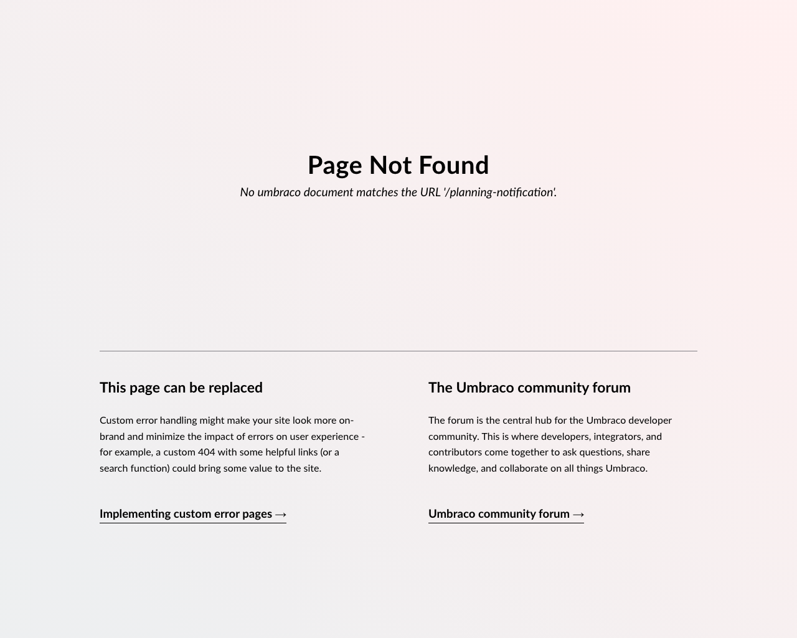

# Planning Notification Workflow

A complex multi-page workflow demonstrating file uploads, address lookups, and progressive disclosure patterns.

## Overview

The planning notification workflow (`planning-notification`) handles planning permission applications with:

- **Multi-page flow** with state transitions
- **File upload** for supporting documents
- **Address lookup** integration
- **Conditional sections** based on property type
- **Complex validation** rules

## Initial Form



The workflow guides users through multiple steps:

1. **Property details** – Address, property type, and description
2. **Application details** – Work description, dates, and supporting documents
3. **Applicant information** – Contact details and relationship to property
4. **Review and submit** – Check-answers before final submission

## V2.0 Schema Example

The file upload component uses the polymorphic `file` type:

```json
{
  "type": "file",
  "fieldKey": "supporting-docs",
  "label": "Supporting documents",
  "hint": "Upload plans, drawings, or photos (PDF, JPG, PNG up to 10MB each)",
  "required": false,
  "accept": ".pdf,.jpg,.jpeg,.png",
  "maxFileSize": 10485760,
  "multiple": true
}
```

## Workflow Seed JSON

**Location:** `src/UmbracoPrism.MockBusinessApp/workflow-seeds/planning-notification.json`

**Definition key:** `planning-notification`  
**Display name:** Apply for Planning Permission  
**Instance policy:** `multiple` (users can submit multiple applications)

## Key Takeaways

✅ **Multi-page workflows** – Complex state machines with branching logic  
✅ **File uploads** – Multiple file support with size/type constraints  
✅ **Address components** – Integration with lookup services  
✅ **Progressive disclosure** – Show/hide sections based on previous answers

---

[← Back to Walkthroughs](README.md)
