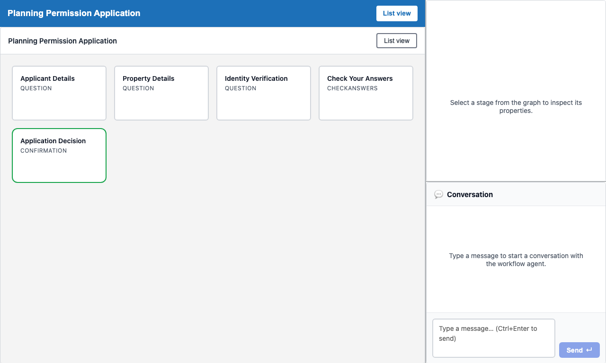

# Walkthrough — Planning Service Blueprint Editor

A developer-facing guide to using the service blueprint editor to inspect and modify the planning application service blueprint in Umbraco.Prism.

> **Prerequisites:** Stack running via [Codespaces](../../README.md#try-it-now--no-install-required) or [local setup](../../README.md#try-the-demo--local-setup). Familiarity with the [Planning Notification](planning-notification.md) walkthrough is recommended so you understand the citizen-facing journey you are modifying.

---

## Overview

The Prism service blueprint editor gives developers and operators a browser-based surface for inspecting and iterating on a live service blueprint. The editor is graph-first: stages and gateways sit in vertical lanes that read top to bottom, with same-level siblings sliding into a slot matrix to the right. Alongside the canvas, an editable JSON **Definition** tab keeps the same service blueprint in sync for power users, copy-paste, and quick diffs. AI assistance is handled by an external MCP client — there is no chat or proposal-diff surface inside the editor.

| Who uses this | Use case |
|---|---|
| Developer | Inspect and tune a service blueprint in the browser |
| Operator / caseworker architect | Adjust stage order, add validation steps, or tune role assignments |
| QA engineer | Inspect the current live definition before writing a journey test |

The editor is mounted in MockBusinessApp — the reference business-app host. It is **not** mounted in the Umbraco backoffice; that boundary is deliberate. The editor is composed of:

| Component | Role |
|---|---|
| `<prism-service-blueprint-editor-shell>` | Thin reference host: service blueprint picker, API base config, integration snippet |
| `<prism-service-blueprint-editor>` | Assembled editor: canvas, outline, step inspector, Definition tab, confidence tabs |
| `<prism-service-blueprint-graph>` | Renders the vertical-lanes canvas; doubles as a read-only viewer when `read-only` is set |
| `<prism-step-inspector>` | Sidebar showing the selected stage's fields and component tree |

---

## Step 1 — Load the reference shell

Navigate to `/service-blueprint-editor`. MockBusinessApp redirects this to `/service-blueprint-editor.html?service-blueprint=planning`, serving the thin reference shell (`<prism-service-blueprint-editor-shell>`).



The shell hero displays:
- **Heading:** "Service Blueprint Editor"
- **Intro:** The shell stays focused on authoring — service blueprint selection, editor mounting, and API wiring. Runtime cases, approvals, and business processing remain in the downstream business app.
- **Launch card:** A service blueprint picker (pre-selected to `planning`) and an authoring API base URL field pointing at MockBusinessApp's origin.
- **Integration snippet:** The minimal `<prism-service-blueprint-editor>` element and `authoring-api-base` attribute needed to embed the editor in any downstream app.

The editor loads with the service blueprint graph visible in visual (graph) mode. The `<prism-service-blueprint-graph>` canvas has `role="application"` and is keyboard-accessible.

---

## Step 2 — Canvas shows the planning application stages in vertical lanes

`<prism-service-blueprint-graph>` renders the service blueprint as vertical lane columns that read top to bottom. Each stage is a card in the lane that owns it; gateways control routing between stages. Every move from one stage to another happens through a gateway. Single-route gateways render as a small pill; multi-route gateways open up as a diamond. Same-level siblings in one lane expand into a slot matrix to the right, so the canvas stays scannable as the service blueprint grows.


For the live planning service blueprint the stages are (from the planning seed):

| Stage key | Kind | Description |
|---|---|---|
| `declaration` | Capture | Applicant identity and site basics |
| `application-form` | Capture | Main planning request details |
| `check-answers` | Review | GDS check-answers summary |
| `submitted` | Terminal | Confirmation that the application was received |

Each node carries `data-prism-stage="{stageKey}"` in shadow DOM — the same selector used by the `service-blueprint-graph-keyboard.spec.ts` accessibility contract tests.

---

## Step 3 — Click a stage to open the step inspector

Clicking any stage node dispatches a `stage-selected` CustomEvent. `<prism-step-inspector>` renders in the right-hand sidebar.


The inspector shows the stage's display name, kind, and any role constraints. The sidebar root carries `data-prism-component="step-inspector"` and `data-prism-stage-detail="{stageKey}"`.

**Source:** [`prism-step-inspector.ts`](../../src/UmbracoPrism.Client/src/service blueprint-editor/prism-step-inspector.ts)

---

## Step 4 — Step inspector shows stage properties

The inspector lists the polymorphic component tree for the selected stage — sections, fieldsets, form fields, and conditional children. This mirrors the JSON structure in the service blueprint seed file.


Each operation (field or component in the tree) carries `data-prism-op-index="{n}"`. The tree is read-only in Wave 1; editing individual components is a Wave 2 milestone.

**Source:** [`prism-step-inspector.ts`](../../src/UmbracoPrism.Client/src/service blueprint-editor/prism-step-inspector.ts), [`types.ts`](../../src/UmbracoPrism.Client/src/service blueprint-editor/types.ts)

---

## Step 5 — Collapse the side panels and keep the canvas primary

The simplified editor lets authors collapse the outline and properties drawer without leaving the graph canvas. This keeps the graph as the main authoring surface while the surrounding chrome gets out of the way when extra room is needed.


At this step the executable spec proves that:
- The outline and properties drawer expose collapse/expand affordances with `aria-expanded` state.
- Restoring the panels brings both drawers back without losing the canvas.
- No `List view` toggle or `[data-prism-linear-table]` workspace is present.
- The graph viewport (`.graph-viewport`) is the scrollable surface while browser-page scrolling stays at rest.

The graph-first keyboard contract is exercised by [`service-blueprint-graph-keyboard.spec.ts`](../../src/UmbracoPrism.Client/tests/service blueprint-editor/service blueprint-graph-keyboard.spec.ts).

**Source:** [`prism-service-blueprint-graph.ts`](../../src/UmbracoPrism.Client/src/service blueprint-editor/prism-service blueprint-graph.ts), [`prism-service-blueprint-editor.ts`](../../src/UmbracoPrism.Client/src/service blueprint-editor/prism-service blueprint-editor.ts)

---

## Step 6 — Open keyboard help

The editor chrome includes a help affordance for keyboard shortcuts and graph navigation. Authors can open it from the toolbar without leaving the service blueprint canvas or changing the current stage selection.


The shortcut dialog carries `data-prism-shortcut-dialog`; the help button and close button expose accessible names and stable test hooks for the executable walkthrough.

**Source:** [`prism-help-panel.ts`](../../src/UmbracoPrism.Client/src/service blueprint-editor/prism-help-panel.ts), [`prism-service-blueprint-editor.ts`](../../src/UmbracoPrism.Client/src/service blueprint-editor/prism-service blueprint-editor.ts)

---

## Step 7 — Review validation in the confidence tabs

The Validation tab is the single place for detailed service blueprint validation feedback. The canvas stays focused on topology while the confidence panel presents any validation issues, save status, and supporting detail.


The validation panel carries `data-prism-confidence-panel="validation"`; the validation rail carries `data-prism-validation-rail`.

---

## Step 8 — Preview the selected stage

The Preview tab shows how the selected stage will read in the downstream journey. Selecting a stage in the graph keeps the preview, outline, and inspector aligned around the same authored node.


The preview surface exposes `data-prism-preview-stage-name` for the currently selected stage.

---

## Step 9 — Simulate the service blueprint path

The Simulation tab starts from the service blueprint's initial stage and lets authors inspect the currently modelled path through the planning service blueprint. This keeps behavioural checks close to the graph without adding chat UI to the editor shell.


---

## Step 10 — Open the Definition tab for the JSON view

The Definition tab shows the same service blueprint as JSON. It stays in sync with the canvas in both directions — visual edits re-serialise the JSON, and valid JSON edits flow back through the same undo stack. Invalid JSON keeps the canvas on the last good state and surfaces the reason in a banner above the editor.

Use the Definition tab when you want to copy a stage into another service blueprint, diff a change, or paste a small fix without hunting through the canvas. The author-facing label is "Definition" — JSON is the implementation detail.

For the exact sync rules, lint behaviour, and test hooks, see [`src/UmbracoPrism.Client/src/service-blueprint-editor/README.md`](../../src/UmbracoPrism.Client/src/service blueprint-editor/README.md).

---

## Running the screenshots

Regenerate screenshots with:

```bash
cd src/UmbracoPrism.Client
CAPTURE_SCREENSHOTS=1 npx playwright test \
  --config=playwright.localhost-auth.config.ts \
  tests/walkthroughs/01-planning-service-blueprint-editor.walkthrough.spec.ts \
  --reporter=line
```

The spec runs against the full Aspire stack (LiveAppHost) and writes PNGs to `docs/images/walkthroughs/planning-service-blueprint-editor/`. Alternatively, trigger the [`Capture Walkthrough Screenshots`](../../.github/workflows/capture-screenshots.yml) GitHub Actions workflow (manual dispatch) to regenerate all walkthrough screenshots on the branch automatically.

---

## Related

- **Executable spec:** This walkthrough is executed on every PR by [`01-planning-service-blueprint-editor.walkthrough.spec.ts`](../../src/UmbracoPrism.Client/tests/walkthroughs/01-planning-service-blueprint-editor.walkthrough.spec.ts). Screenshots above regenerate via the [`Capture Walkthrough Screenshots`](../../.github/workflows/capture-screenshots.yml) workflow (manual dispatch).
- **Shell component:** [`prism-service-blueprint-editor-shell.ts`](../../src/UmbracoPrism.Client/src/service blueprint-editor/prism-service blueprint-editor-shell.ts)
- **Keyboard contract tests:** [`service-blueprint-graph-keyboard.spec.ts`](../../src/UmbracoPrism.Client/tests/service blueprint-editor/service blueprint-graph-keyboard.spec.ts)
- **Fixture contract tests:** [`PlanningWorkflowFixtureTests.cs`](../../src/UmbracoPrism.Core.Tests/Service Blueprint/Authoring/PlanningWorkflowFixtureTests.cs)
- **Design doc:** [`01-authoring-ux.md`](../design/service-blueprint-editor-v1/01-authoring-ux.md)
- **Citizen-facing context:** [Planning Notification](planning-notification.md)
