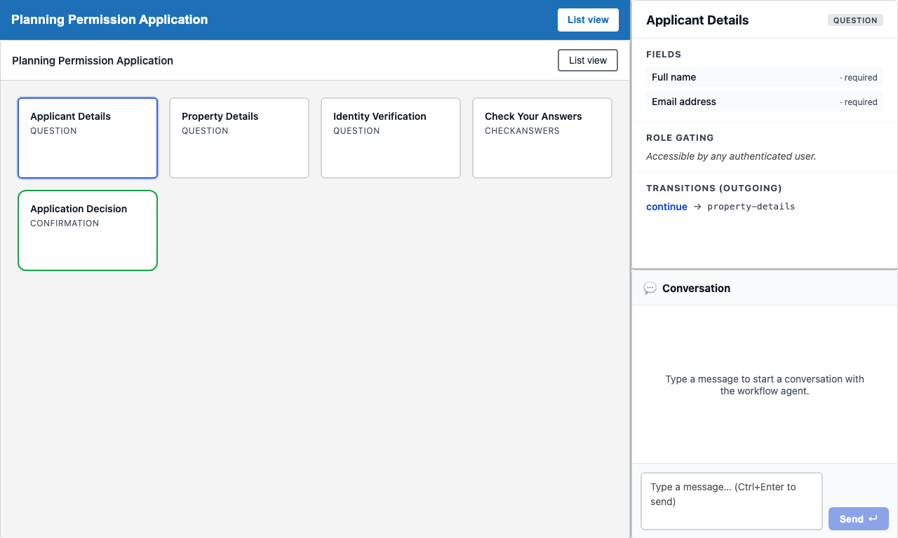
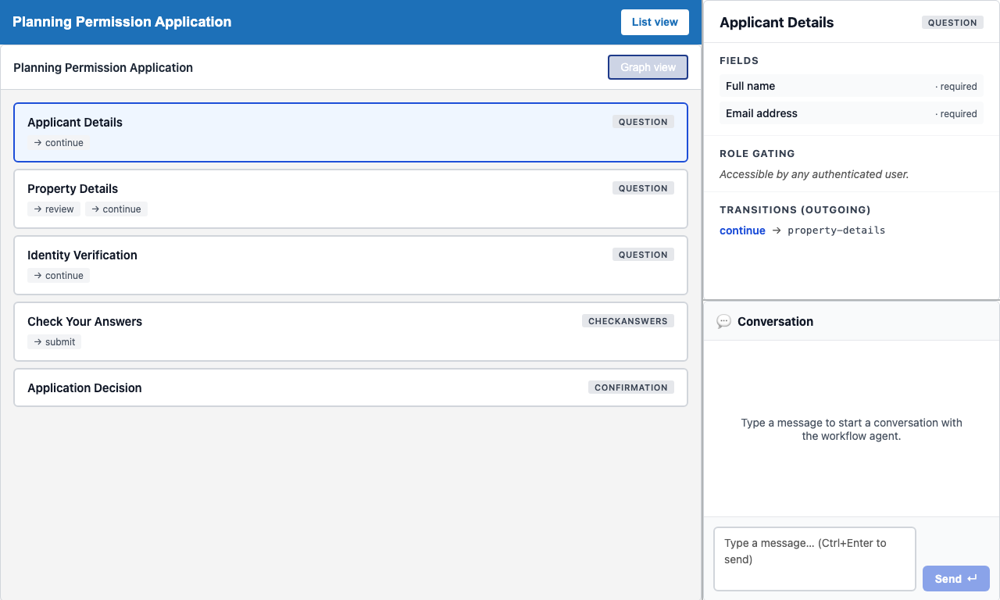

# Walkthrough — Planning Workflow Editor

A developer-facing guide to using the workflow editor to inspect and modify the planning application workflow definition in Umbraco.Prism.

> **Prerequisites:** Stack running via [Codespaces](../../README.md#try-it-now--no-install-required) or [local setup](../../README.md#try-the-demo--local-setup). Familiarity with the [Planning Notification](planning-notification.md) walkthrough is recommended so you understand the citizen-facing journey you are modifying.

---

## Overview

The Prism workflow editor gives developers and operators a browser-based surface for inspecting and iterating on a live workflow definition. The editor now focuses on graph-first workflow authoring, stage inspection, confidence checks, preview, simulation, and keyboard help while agent chat is handled by the external MCP client.

| Who uses this | Use case |
|---|---|
| Developer | Inspect and tune a workflow definition in the browser |
| Operator / caseworker architect | Adjust stage order, add validation steps, or tune role assignments |
| QA engineer | Inspect the current live definition before writing a journey test |

The editor shell is a reference integration hosted in MockBusinessApp. It is composed of:

| Component | Role |
|---|---|
| `<prism-workflow-editor-shell>` | Thin reference host: workflow picker, API base config, integration snippet |
| `<prism-workflow-editor>` | Assembled editor: graph view, outline, step inspector, confidence tabs |
| `<prism-workflow-graph>` | Visualises the workflow as the role-first graph canvas and owns the editor scrolling surface |
| `<prism-step-inspector>` | Sidebar showing the selected stage's fields and component tree |

---

## Step 1 — Load the reference shell

Navigate to `/workflow-editor`. MockBusinessApp redirects this to `/workflow-editor.html?workflow=planning`, serving the thin reference shell (`<prism-workflow-editor-shell>`).


The shell hero displays:
- **Heading:** "Workflow Editor"
- **Intro:** The shell stays focused on authoring — workflow selection, editor mounting, and API wiring. Runtime cases, approvals, and business processing remain in the downstream business app.
- **Launch card:** A workflow picker (pre-selected to `planning`) and an authoring API base URL field pointing at MockBusinessApp's origin.
- **Integration snippet:** The minimal `<prism-workflow-editor>` element and `authoring-api-base` attribute needed to embed the editor in any downstream app.

The editor loads with the workflow graph visible in visual (graph) mode. The `<prism-workflow-graph>` canvas has `role="application"` and is keyboard-accessible.

---

## Step 2 — Graph view shows the planning application stages

`<prism-workflow-graph>` renders the workflow definition as a directed graph. Each stage is a node in the canvas; each permitted transition is an edge.


For the live planning workflow the stages are (from the planning seed):

| Stage key | Kind | Description |
|---|---|---|
| `declaration` | Capture | Applicant identity and site basics |
| `application-form` | Capture | Main planning request details |
| `check-answers` | Review | GDS check-answers summary |
| `submitted` | Terminal | Confirmation that the application was received |

Each node carries `data-prism-stage="{stageKey}"` in shadow DOM — the same selector used by the `workflow-graph-keyboard.spec.ts` accessibility contract tests.

---

## Step 3 — Click a stage to open the step inspector

Clicking any stage node dispatches a `stage-selected` CustomEvent. `<prism-step-inspector>` renders in the right-hand sidebar.


The inspector shows the stage's display name, kind, and any role constraints. The sidebar root carries `data-prism-component="step-inspector"` and `data-prism-stage-detail="{stageKey}"`.

**Source:** [`prism-step-inspector.ts`](../../src/UmbracoPrism.Client/src/workflow-editor/prism-step-inspector.ts)

---

## Step 4 — Step inspector shows stage properties

The inspector lists the polymorphic component tree for the selected stage — sections, fieldsets, form fields, and conditional children. This mirrors the JSON structure in the workflow seed file.



Each operation (field or component in the tree) carries `data-prism-op-index="{n}"`. The tree is read-only in Wave 1; editing individual components is a Wave 2 milestone.

**Source:** [`prism-step-inspector.ts`](../../src/UmbracoPrism.Client/src/workflow-editor/prism-step-inspector.ts), [`types.ts`](../../src/UmbracoPrism.Client/src/workflow-editor/types.ts)

---

## Step 5 — Collapse the side panels and keep the canvas primary

The simplified editor lets authors collapse the outline and properties drawer without leaving the graph canvas. This keeps the graph as the main authoring surface while the surrounding chrome gets out of the way when extra room is needed.



At this step the executable spec proves that:
- The outline and properties drawer expose collapse/expand affordances with `aria-expanded` state.
- Restoring the panels brings both drawers back without losing the canvas.
- No `List view` toggle or `[data-prism-linear-table]` workspace is present.
- The graph viewport (`.graph-viewport`) is the scrollable surface while browser-page scrolling stays at rest.

The graph-first keyboard contract is exercised by [`workflow-graph-keyboard.spec.ts`](../../src/UmbracoPrism.Client/tests/workflow-editor/workflow-graph-keyboard.spec.ts).

**Source:** [`prism-workflow-graph.ts`](../../src/UmbracoPrism.Client/src/workflow-editor/prism-workflow-graph.ts), [`prism-workflow-editor.ts`](../../src/UmbracoPrism.Client/src/workflow-editor/prism-workflow-editor.ts)

---

## Step 6 — Open keyboard help

The editor chrome includes a help affordance for keyboard shortcuts and graph navigation. Authors can open it from the toolbar without leaving the workflow canvas or changing the current stage selection.


The shortcut dialog carries `data-prism-shortcut-dialog`; the help button and close button expose accessible names and stable test hooks for the executable walkthrough.

**Source:** [`prism-help-panel.ts`](../../src/UmbracoPrism.Client/src/workflow-editor/prism-help-panel.ts), [`prism-workflow-editor.ts`](../../src/UmbracoPrism.Client/src/workflow-editor/prism-workflow-editor.ts)

---

## Step 7 — Review validation in the confidence tabs

The Validation tab is the single place for detailed workflow validation feedback. The canvas stays focused on topology while the confidence panel presents any validation issues, save status, and supporting detail.


The validation panel carries `data-prism-confidence-panel="validation"`; the validation rail carries `data-prism-validation-rail`.

---

## Step 8 — Preview the selected stage

The Preview tab shows how the selected stage will read in the downstream journey. Selecting a stage in the graph keeps the preview, outline, and inspector aligned around the same authored node.


The preview surface exposes `data-prism-preview-stage-name` for the currently selected stage.

---

## Step 9 — Simulate the workflow path

The Simulation tab starts from the workflow's initial stage and lets authors inspect the currently modelled path through the planning workflow. This keeps behavioural checks close to the graph without adding chat UI to the editor shell.


---

## Running the screenshots

Regenerate screenshots with:

```bash
cd src/UmbracoPrism.Client
CAPTURE_SCREENSHOTS=1 npx playwright test \
  --config=playwright.localhost-auth.config.ts \
  tests/walkthroughs/01-planning-workflow-editor.walkthrough.spec.ts \
  --reporter=line
```

The spec runs against the full Aspire stack (LiveAppHost) and writes PNGs to `docs/images/walkthroughs/planning-workflow-editor/`. Alternatively, trigger the [`Capture Walkthrough Screenshots`](../../.github/workflows/capture-screenshots.yml) GitHub Actions workflow (manual dispatch) to regenerate all walkthrough screenshots on the branch automatically.

---

## Related

- **Executable spec:** This walkthrough is executed on every PR by [`01-planning-workflow-editor.walkthrough.spec.ts`](../../src/UmbracoPrism.Client/tests/walkthroughs/01-planning-workflow-editor.walkthrough.spec.ts). Screenshots above regenerate via the [`Capture Walkthrough Screenshots`](../../.github/workflows/capture-screenshots.yml) workflow (manual dispatch).
- **Shell component:** [`prism-workflow-editor-shell.ts`](../../src/UmbracoPrism.Client/src/workflow-editor/prism-workflow-editor-shell.ts)
- **Keyboard contract tests:** [`workflow-graph-keyboard.spec.ts`](../../src/UmbracoPrism.Client/tests/workflow-editor/workflow-graph-keyboard.spec.ts)
- **Fixture contract tests:** [`PlanningWorkflowFixtureTests.cs`](../../src/UmbracoPrism.Core.Tests/Workflow/Authoring/PlanningWorkflowFixtureTests.cs)
- **Design doc:** [`01-authoring-ux.md`](../design/workflow-editor-v1/01-authoring-ux.md)
- **Citizen-facing context:** [Planning Notification](planning-notification.md)
