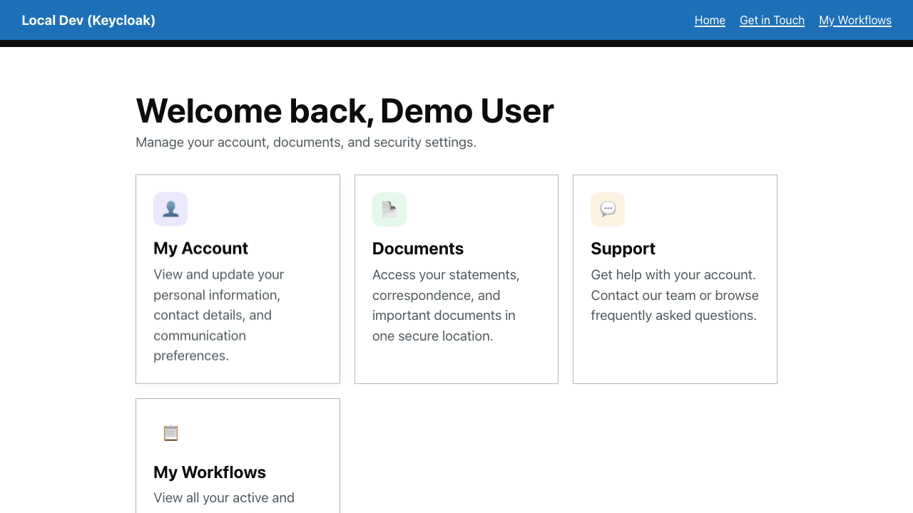
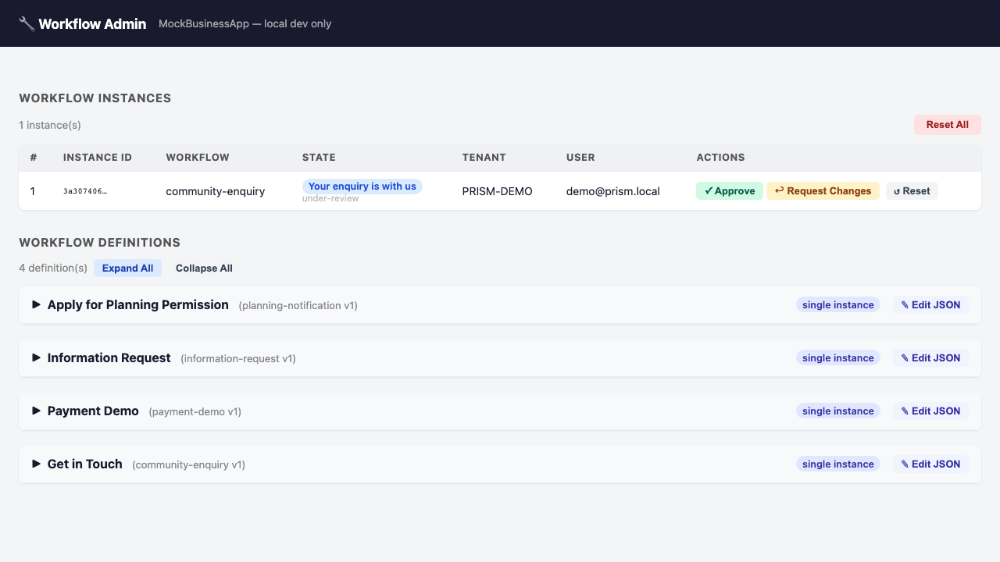

# Walkthrough — Workflow Administration

A guide to using the MockBusinessApp workflow administration panel. This is a development-only tool for inspecting workflow instances and definitions.

> **Important:** This walkthrough describes features of the **development harness**. The workflow admin panel is your tool for **playing the "reviewer" role** during local testing. It is **not available in production**. See [Deployment Security Guide](../DEPLOYMENT_SECURITY.md) for details.
> 
> **For complete workflows:** See [Payment Demo](payment-demo.md), [Community Enquiry](community-enquiry.md), and [Information Request](information-request.md) for full end-to-end stories showing user submission + reviewer approval cycles. This admin panel is how you complete those cycles in the local demo.

> **Prerequisites:** Spin up the stack via [Codespaces](../../README.md#try-it-now--no-install-required) or [local setup](../../README.md#try-the-demo--local-setup). Start at least one workflow instance (e.g., via the [Payment Demo](payment-demo.md) or [Community Enquiry](community-enquiry.md) walkthrough) so you have instances to inspect.

---

## Overview

The workflow administration panel (`/admin/workflow` on the MockBusinessApp) is a **testing and debugging tool** for developers and operators. It allows you to:

- **View all workflow instances** — see the current state of every running workflow
- **View workflow definitions** — see which workflows are available for editing
- **Reset instances** — clear all instances to return to a clean testing state

This panel is **only accessible during development**. In production environments, all admin endpoints return `404 Not Found`.

---

## Part 1: Access the Admin Panel

### Step 1: Navigate to the Member Dashboard

After signing in with `demo@prism.local` / `password`, navigate to the dashboard:

```
https://localhost:44345/dashboard
```

(Or in Codespaces: your forwarded URL + `/dashboard`.)

### Step 2: Locate the "Workflow Admin" Card

On the member dashboard, scroll to the **Admin** section at the bottom. You see a card labeled **Workflow Admin** with the description:

> "Administrative views for inspecting workflow state during development."



<!-- The screenshot shows the full dashboard with the Admin section visible. -->

💡 **What's happening:** The admin link is only shown when:
- The Umbraco backoffice has configured `PrismBusinessApp:WorkflowApiBaseUrl` in the TestSite's `Program.cs`.
- The MockBusinessApp is running (in Aspire, this is automatic).
- The current environment is `Development` (production deployments disable all admin endpoints).

### Step 3: Click "Open Admin"

Click the **Open Admin** button. It opens the MockBusinessApp admin panel in a new browser tab.

> **Security note:** The admin panel has **no authentication** and is **unguarded** by design — it's a development-only tool. Never deploy MockBusinessApp to any network accessible from outside your local machine.

---

## Part 2: Inspect Workflow Instances

### Step 1: View the Instance List

The admin panel's main view is a **Workflow Instances** section. You see a list of all workflow instances across all workflows, users, and tenants.



> Screenshot pending: simplified admin page rendering (Slice D).

Each instance entry shows:

- **Workflow key** (e.g., `community-enquiry`, `payment-demo`) — the definition being run
- **Instance ID** — a unique identifier for this execution
- **User ID** — who owns the instance
- **Tenant ID** — which tenant the instance belongs to
- **Current state** — the workflow step the user is on (e.g., `initial`, `under-review`, `confirmation`)
- **Created at** — when the instance was started

### Step 2: Understand the Instance State

Look at the state field for each instance. The state reflects where the user is in their workflow journey:

| State | Example | Meaning |
|-------|---------|---------|
| `initial` | User just started the workflow | On the first question page |
| `conditional-reveal` | Community Enquiry multi-step | User answered a question that revealed more fields |
| `check-answers` | Any workflow with a check-answers page | User is reviewing their answers before submission |
| `under-review` | After submission | The workflow is waiting for async processing or operator review |
| `confirmation` | Workflow complete | User sees the final confirmation page |

### Step 3: Reset All Instances

At the bottom of the instances section, you find a **Reset All** button. Click it to delete all workflow instances in memory, returning the system to a clean state.

⚠️ **Use case:** After running multiple test workflows, you may want to clear them to start fresh.

---

## Part 3: View Workflow Definitions

Below the instances section, you see the **Workflow Definitions** list. It shows all workflows available in the MockBusinessApp:

- `planning` — Planning application workflow
- `leave-request` — Leave request (demonstrates 5-gateway fan-in pattern)
- `community-enquiry` — Community enquiry form
- `information-request` — Information request form


> Screenshot pending: simplified admin page rendering (Slice D).

Each entry shows:

- **Display name** — human-readable workflow name
- **Edit workflow** link — opens the workflow editor for that workflow

### Step 1: Open the Workflow Editor

Click the **Edit workflow** link next to any workflow. It opens the workflow editor in a new tab.

The editor shows:

- The visual canvas (stages and gateways)
- The inspector panel (stage and gateway properties)
- The validation rail (any issues with the workflow)
- The history panel (undo/redo)
- The simulation panel (test the workflow path)

For a full editor tour, see [Planning Workflow Editor](planning-workflow-editor.md).

---

## Part 4: Complete Approval Workflows

For walkthroughs such as **Community Enquiry**, **Information Request**, and **Payment Demo**, the admin panel is the easiest way to keep the story going after the user reaches a waiting or under-review state.

### Walking Through the Full Handoff

1. **In TestSite:** Submit the workflow as the demo member (e.g., `demo@prism.local`)
2. **In TestSite:** See the confirmation message showing the workflow is waiting for review
3. **Open Workflow Admin** from the dashboard (visible in the **Admin** section)
4. **Find your instance:** Locate the matching workflow instance in the list (search by workflow key or user)
5. **Review the state:** Confirm the instance is in `under-review` or similar waiting state
6. **Use your business logic:** In a real system, a reviewer would process the submission here. In the dev harness, you can manually reset the instance or advance it via the MockBusinessApp runtime engine.
7. **Return to TestSite:** Refresh or navigate back to see the outcome from the user's perspective

This demonstrates the complete "operator-adjacent review flow" — a realistic handoff where the public user interface shows clear waiting states, and the review/approval happens in a separate admin interface (not exposed to users).

### Key Points

- The workflow definition shows which stages and routes require `requiresRole: "reviewer"`, enforcing authorization
- The admin panel is the "reviewer" role in this demo — in production, a real operator portal would replace it
- Instance data (form answers, urgency flags, uploaded files) is visible to the reviewer, enabling informed decisions
- After approval/changes, users see their outcome on next page load or poll

---

## Part 5: Understanding the Architecture

### How Admin Endpoints Are Implemented

The workflow admin panel is powered by unguarded HTTP endpoints on the MockBusinessApp:

```
GET  /admin/workflow                      — List all instances and render the admin page
POST /admin/workflow/reset-all            — Delete all instances
```

All of these are:
- **Unauthenticated** — no login required
- **Unrestricted** — anyone with network access can call them
- **Development-only** — they return `404` in non-Development mode

### Why This Design?

The admin panel is a **developer convenience tool**, not a production feature. It allows:

- **Rapid testing** — inspect and modify workflows without database tools
- **Debugging** — see what state a workflow is in
- **Scenario simulation** — test edge cases that are hard to trigger through normal user flows

In a production system, workflow administration would be:
- Protected by authentication and authorization
- Logged for audit compliance
- Restricted to specific admin roles
- Persistent (database-backed, not in-memory)

---

## Summary — When to Use the Admin Panel

| Task | Use Admin Panel? | Alternative |
|------|:---:|---|
| **View current instances** | ✅ Yes | SQL query to in-memory store (if debugging) |
| **Reset test instances** | ✅ Yes | Restart MockBusinessApp |
| **Edit a workflow definition** | ✅ Yes | Open the workflow editor |
| **Check if a field is being saved** | ❌ No | Browser DevTools → Network tab, inspect API responses |
| **Test a workflow in production** | ❌ No | Admin panel doesn't exist in production — use real end-to-end tests |

---

## Related Resources

- [Deployment Security Guide](../DEPLOYMENT_SECURITY.md) — why admin endpoints must not go to production
- [Authoring a Workflow](authoring-a-workflow.md) — how to write workflow definitions
- [Embedding the Workflow Editor](../guides/embedding-the-workflow-editor.md) — integrator recipe

---

[← Back to Walkthroughs](README.md)

---

**Executable spec:** This walkthrough is executed on every PR by [`workflow-administration.walkthrough.spec.ts`](../../src/UmbracoPrism.Client/tests/walkthroughs/workflow-administration.walkthrough.spec.ts). Screenshots above regenerate via the [`Capture Walkthrough Screenshots`](../../.github/workflows/capture-screenshots.yml) workflow (manual dispatch). See [`walkthroughs-as-executable-specs`](../../.claude/skills/walkthroughs-as-executable-specs/SKILL.md) for the policy.
