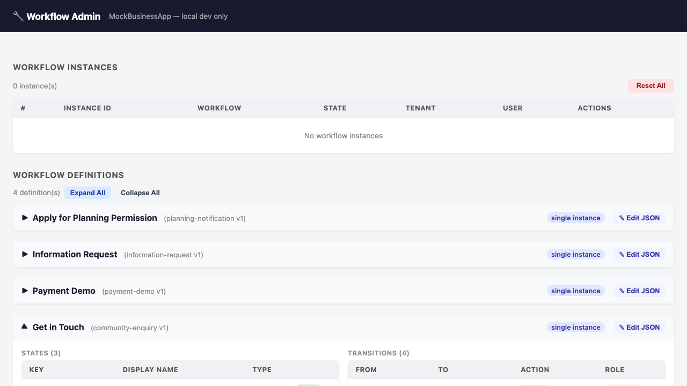

# Walkthrough — Workflow Administration

A guide to using the MockBusinessApp workflow administration panel — a development-only tool for inspecting, editing, and managing workflow instances and definitions during testing and debugging.

> **Important:** This walkthrough describes features of the **development harness**. The workflow admin panel is your tool for **playing the "reviewer" role** during local testing and is **not available in production**. See [Deployment Security Guide](../DEPLOYMENT_SECURITY.md) for details.
> 
> **For complete workflows:** See [Payment Demo](payment-demo.md), [Community Enquiry](community-enquiry.md), and [Information Request](information-request.md) for full end-to-end stories showing user submission + reviewer approval cycles. This admin panel is how you complete those cycles in the local demo.

> **Prerequisites:** Spin up the stack via [Codespaces](../../README.md#try-it-now--no-install-required) or [local setup](../../README.md#try-the-demo--local-setup). Start at least one workflow instance (e.g., via the [Payment Demo](payment-demo.md) or [Community Enquiry](community-enquiry.md) walkthrough) so you have instances to inspect.

---

## Overview

The workflow administration panel (`/admin/workflow` on the MockBusinessApp) is a **testing and debugging tool** exclusively for developers and operators. It allows you to:

- **View all workflow instances** — see the current state of every running workflow across all users and tenants
- **View workflow definitions** — read the JSON schema that defines workflow structure (fields, state transitions, etc.)
- **Edit definitions** — modify workflow JSON live without restarting (development only)
- **Manually advance workflow state** — trigger state transitions for testing edge cases or recovery scenarios
- **Inspect field groups** — view the reusable field component definitions referenced by workflows
- **Reset instances** — clear all instances to return to a clean testing state

This panel is **only accessible during development**. In production environments, all admin endpoints return `404 Not Found`.

---

## Part 1: Access the Admin Panel

### Step 1: Navigate to the Member Dashboard

After signing in with `demo@prism.local` / `password`, navigate to the dashboard:

```
https://localhost:44345/dashboard
```

(Or in Codespaces: your forwarded URL + `/dashboard`.)

### Step 2: Locate the "Workflow Admin" Card

On the member dashboard, scroll to the **Admin** section at the bottom. You see a card labeled **Workflow Admin** with the description:

> "Administrative views for inspecting workflow state during development."


<!-- The screenshot shows the full dashboard with the Admin section visible. -->

💡 **What's happening:** The admin link is only shown when:
- The Umbraco backoffice has configured `PrismBusinessApp:WorkflowApiBaseUrl` in the TestSite's `Program.cs`.
- The MockBusinessApp is running (in Aspire, this is automatic).
- The current environment is `Development` (production deployments disable all admin endpoints).

### Step 3: Click "Open Admin"

Click the **Open Admin** button. It opens the MockBusinessApp admin panel in a new browser tab.

> **Security note:** The admin panel has **no authentication** and is **unguarded** by design — it's a development-only tool. Never deploy MockBusinessApp to any network accessible from outside your local machine.

---

## Part 2: Inspect Workflow Instances

### Step 1: View the Instance List

The admin panel's main view is a **Workflow Instances** section. You see a list of all workflow instances across all workflows, users, and tenants.


Each instance entry shows:

- **Workflow key** (e.g., `community-enquiry`, `payment-demo`) — the definition being run
- **Instance ID** — a unique identifier for this execution
- **User ID** — who owns the instance
- **Tenant ID** — which tenant the instance belongs to
- **Current state** — the workflow step the user is on (e.g., `initial`, `under-review`, `confirmation`)
- **Created at** — when the instance was started
- **Reviewer actions** — development-only **Approve** / **Request Changes** buttons for transitions that require the mock reviewer role

### Step 2: Understand the Instance State

Look at the state field for each instance. The state reflects where the user is in their workflow journey:

| State | Example | Meaning |
|-------|---------|---------|
| `initial` | User just started the workflow | On the first question page |
| `conditional-reveal` | Community Enquiry multi-step | User answered a question that revealed more fields |
| `check-answers` | Any workflow with a check-answers page | User is reviewing their answers before submission |
| `under-review` | After submission | The workflow is waiting for async processing or operator review |
| `confirmation` | Workflow complete | User sees the final confirmation page |

---

## Part 3: Edit Workflow Definitions (Development Only)

### Step 1: View Available Workflow Definitions

On the admin panel, below the instances section, you see the **Workflow Definitions** editor. It lists all seeded workflows:

- `community-enquiry`
- `payment-demo`
- `planning-notification`
- `information-request`



### Step 2: Inspect a Workflow Definition

Click on a workflow name (e.g., `payment-demo`) to expand it and see the full JSON definition.

The definition includes:

- **Metadata:** Name, description, version
- **States:** Each state in the workflow (transitions, entry/exit actions)
- **Field groups:** References to reusable field components (e.g., `project-info`, `timeline-cost`)
- **Validation rules:** Field constraints and conditional logic

Example structure:

```json
{
  "key": "payment-demo",
  "definition": {
    "initialState": "initial",
    "states": [
      {
        "key": "initial",
        "stepType": "question",
        "components": [...]
      }
    ]
  }
}
```

### Step 3: Make a Small Edit (Testing Only)

For testing, you can make live edits to a workflow definition by clicking the **Edit** button in the admin panel. For example:

- Change a field label to test that your frontend renders the update
- Add a required flag to a field to test validation
- Change a state transition to test state machine logic

⚠️ **Important:** Changes are **not persisted** to disk. They persist in memory only for the current MockBusinessApp instance. On restart, seeded definitions reload from `workflow-seeds/`.

---

## Part 4: Manually Manage Workflow Instances

### Step 1: Access Instance Management

Clicking an instance in the list shows its details and management options. You can:

- **View the current state** — see which step the user is on
- **Inspect the data collected so far** — see form field values, uploads, etc.
- **Manually advance the workflow** — trigger a state transition without waiting for user action

### Step 2: Use Case — Testing Edge Cases

**Scenario:** You want to test what happens when a workflow times out or gets stuck in a "processing" state.

1. Start a workflow normally and fill in the first form.
2. Open the admin panel.
3. Find the instance in the list.
4. Manually set its state to `processing` or `waiting`.
5. Return to the TestSite and refresh the user's page — they should see the new state.

This allows you to test state transitions and UI rendering for edge cases without writing special test code.

### Step 2b: Complete Approval Workflows

For walkthroughs such as **Community Enquiry**, **Information Request**, and **Payment Demo**, the admin panel is the easiest way to keep the story going after the user reaches a waiting or under-review state:

#### Walking Through the Full Handoff

1. **In TestSite:** Submit the workflow as the demo member (e.g., `demo@prism.local`)
2. **In TestSite:** See the confirmation message showing the workflow is waiting for review
3. **Open Workflow Admin** from the dashboard (visible in the **Admin** section)
4. **Find your instance:** Locate the matching workflow instance in the list (search by workflow key or user)
5. **Review the state:** Confirm the instance is in `under-review` or similar waiting state
6. **View the workflow definition:** Click on the workflow name to see which transitions are available
7. **Choose your action:**
   - **Approve** – advances the instance to its terminal completion state; user sees confirmation
   - **Request Changes** – sends the instance back to `collecting-details` or similar; user can revise and resubmit
8. **Return to TestSite:** Refresh or navigate back to see the outcome from the user's perspective

This demonstrates the complete "operator-adjacent review flow" — a realistic handoff where the public user interface shows clear waiting states, and the review/approval happens in a separate admin interface (not exposed to users).

#### Key Points

- The workflow definition shows which transitions require `requiresRole: "reviewer"`, enforcing authorization
- The admin panel is the "reviewer" role in this demo — in production, a real operator portal would replace it
- Instance data (form answers, urgency flags, uploaded files) is visible to the reviewer, enabling informed decisions
- After approval/changes, users see their outcome on next page load or poll

### Step 3: Reset All Instances

At the bottom of the admin panel, you find a **Reset All** button. Click it to delete all workflow instances in memory, returning the system to a clean state.

⚠️ **Use case:** After running multiple test workflows, you may want to clear them to start fresh.

---

## Part 5: Understanding the Architecture

### How Admin Endpoints Are Implemented

The workflow admin panel is powered by unguarded HTTP endpoints on the MockBusinessApp:

```
GET  /admin/workflow                      — List all instances and definitions
GET  /admin/workflow/definition/{key}     — Fetch a single workflow definition
PUT  /admin/workflow/definition/{key}     — Update a workflow definition (edit)
POST /admin/workflow/{instanceId}/action/{action}  — Manually advance an instance
POST /admin/workflow/reset-all            — Delete all instances
```

All of these are:
- **Unauthenticated** — no login required
- **Unrestricted** — anyone with network access can call them
- **Development-only** — they return `404` in non-Development mode

### Why This Design?

The admin panel is a **developer convenience tool**, not a production feature. It allows:

- **Rapid testing** — inspect and modify workflows without database tools
- **Debugging** — see what state a workflow is in
- **Scenario simulation** — test edge cases that are hard to trigger through normal user flows

In a production system, workflow administration would be:
- Protected by authentication and authorization
- Logged for audit compliance
- Restricted to specific admin roles
- Persistent (database-backed, not in-memory)

---

## Part 6: Workflow Definitions and Field Groups

### Structure

Every workflow instance references a **workflow definition**, which is a directed graph of states. Each state contains **components** — form fields, panels, buttons, etc. — described in the polymorphic JSON model.

Related concept: **Field groups** are reusable collections of components (e.g., "contact details" with name, email, phone) that can be shared across workflows.

The admin panel shows both:

1. **Workflow definitions** — full state machine for a workflow
2. **Field group definitions** — reusable component templates

### Editing Limitations

The admin panel definition cards expand in-place, and the **Edit JSON** action opens a modal editor for the live in-memory definition. If editing is enabled:

- Changes apply immediately in memory
- No validation is performed (you can break the JSON)
- Changes are **not persisted** to the seeded files
- Changes are lost on MockBusinessApp restart

For production-grade workflow authoring, use the Umbraco backoffice integration (planned for future releases) or edit the seed files directly in the repository.

---

## Summary — When to Use the Admin Panel

| Task | Use Admin Panel? | Alternative |
|------|:---:|---|
| **View current instances** | ✅ Yes | SQL query to in-memory store (if debugging) |
| **Test a state transition manually** | ✅ Yes | Write a test spec that triggers the transition |
| **Check if a field is being saved** | ✅ Yes | Browser DevTools → Network tab, inspect API responses |
| **Make a permanent change to a workflow** | ❌ No | Edit the seed file and restart |
| **Test a workflow in production** | ❌ No | Admin panel doesn't exist in production — use real end-to-end tests |

---

## Related Resources

- [Deployment Security Guide](../DEPLOYMENT_SECURITY.md) — why admin endpoints must not go to production
- [Authoring a Workflow](authoring-a-workflow.md) — how to write workflow definitions in C# or JSON
- [Design System](design-system.md) — understand the polymorphic component model used in workflows

---

[← Back to Walkthroughs](README.md)

---

**Executable spec:** This walkthrough is executed on every PR by [`workflow-administration.walkthrough.spec.ts`](../../src/UmbracoPrism.Client/tests/walkthroughs/workflow-administration.walkthrough.spec.ts). Screenshots above regenerate via the [`Capture Walkthrough Screenshots`](../../.github/workflows/capture-screenshots.yml) workflow (manual dispatch). See [`walkthroughs-as-executable-specs`](../../.squad/skills/walkthroughs-as-executable-specs/SKILL.md) for the policy.
